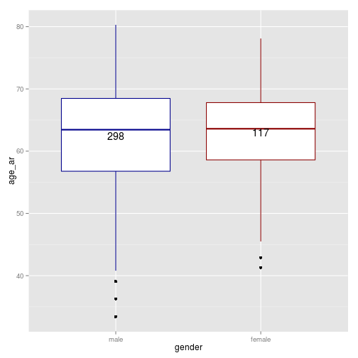
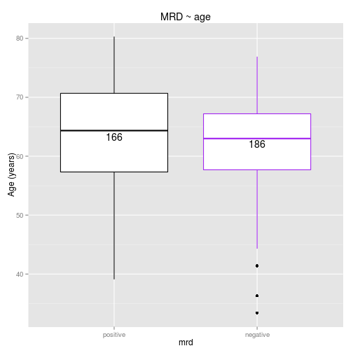
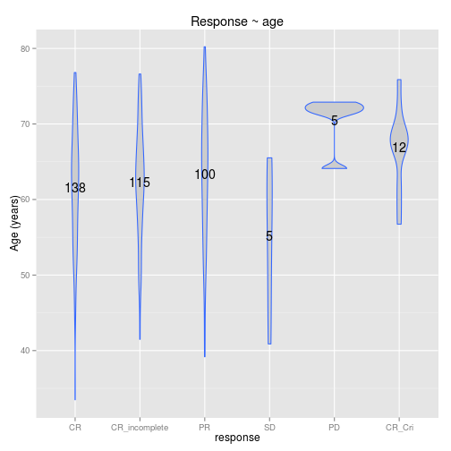

HICF1 CLinical data - descriptive overview
============================================

```r
load("/home/suska/work/HICF1/HICF1_sub1/trunk/clinicaldata.Rda")
library(gplots)
```

```
## KernSmooth 2.23 loaded
## Copyright M. P. Wand 1997-2009
## 
## Attaching package: 'gplots'
## 
## The following object is masked from 'package:stats':
## 
##     lowess
```

```r
library(ggplot2)
```

Is there an age difference between males and females?

```r
# using gplots package here
boxplot2(age_ar ~ gender, data = clinicaldata, main = "Gender ~ age", col = c("blue", 
    "red"), xlab = "gender", ylab = "age", top = TRUE, varwidth = "T")
```

 

```r
# same with ggplot2
g <- ggplot(clinicaldata, aes(gender, age_ar))
give.n <- function(x) {
    return(c(y = mean(x), label = length(x)))
}
g + geom_boxplot(col = c("darkblue", "darkred")) + stat_summary(fun.data = give.n, 
    geom = "text")
```

 

```r
# independent 2-group t-test with unequal variance (Welsh mod)
t.test(age_ar ~ gender, data = clinicaldata)  # where y is numeric and x is a binary factor
```

```
## 
## 	Welch Two Sample t-test
## 
## data:  age_ar by gender
## t = -0.6371, df = 235.2, p-value = 0.5247
## alternative hypothesis: true difference in means is not equal to 0
## 95 percent confidence interval:
##  -2.221  1.136
## sample estimates:
##   mean in group male mean in group female 
##                62.42                62.96
```

Is there an age difference between treatments?

```r
t <- ggplot(clinicaldata, aes(treatment, age_ar))
give.n <- function(x) {
    return(c(y = mean(x), label = length(x)))
}
t + geom_boxplot(col = c("purple", "darkgreen", "yellow")) + stat_summary(fun.data = give.n, 
    geom = "text") + ggtitle("Treatment ~ age") + ylab("Age (years)")
```

 

```r
# independent multi-group Welsh ANOVA
oneway.test(age_ar ~ treatment, data = clinicaldata)  # where y is numeric and x is a binary factor
```

```
## 
## 	One-way analysis of means (not assuming equal variances)
## 
## data:  age_ar and treatment
## F = 0.2384, num df = 2.00, denom df = 55.39, p-value = 0.7887
```

Is there an age difference between MRD outcome?

```r
clinicaldata_mrd <- na.omit(clinicaldata[, c("mrd", "age_ar")])
m <- ggplot(clinicaldata_mrd, aes(mrd, age_ar))
give.n <- function(x) {
    return(c(y = mean(x), label = length(x)))
}
m + geom_boxplot(col = c("black", "purple")) + stat_summary(fun.data = give.n, 
    geom = "text") + ggtitle("MRD ~ age") + ylab("Age (years)")
```

 

```r
# independent multi-group Welsh ANOVA
t.test(age_ar ~ mrd, data = clinicaldata)
```

```
## 
## 	Welch Two Sample t-test
## 
## data:  age_ar by mrd
## t = 1.415, df = 328.2, p-value = 0.1581
## alternative hypothesis: true difference in means is not equal to 0
## 95 percent confidence interval:
##  -0.4943  3.0255
## sample estimates:
## mean in group positive mean in group negative 
##                  63.32                  62.05
```

Is there an age difference between response?
- Note here that there are only few datapoints for SD, PD and CR_CRi seem to be older.
- Unfortunately, those might be also very interesting cases...

```r
clinicaldata_response <- na.omit(clinicaldata[, c("response", "age_ar")])
r <- ggplot(clinicaldata_response, aes(response, age_ar))
give.n <- function(x) {
    return(c(y = mean(x), label = length(x)))
}
r + geom_violin(fill = "grey80", colour = "#3366FF") + stat_summary(fun.data = give.n, 
    geom = "text") + ggtitle("Response ~ age") + ylab("Age (years)")
```

 

```r
# pairwise Wilcoxon Test with plain Bonferroni
pairwise.wilcox.test(clinicaldata$age, clinicaldata$response, p.adjust.method = "bonferroni", 
    paired = FALSE)
```

```
## Warning: cannot compute exact p-value with ties
```

```
## 
## 	Pairwise comparisons using Wilcoxon rank sum test 
## 
## data:  clinicaldata$age and clinicaldata$response 
## 
##               CR   CR_incomplete PR   SD   PD  
## CR_incomplete 1.00 -             -    -    -   
## PR            1.00 1.00          -    -    -   
## SD            1.00 1.00          1.00 -    -   
## PD            0.16 0.19          0.96 0.24 -   
## CR_Cri        0.37 0.47          1.00 0.20 1.00
## 
## P value adjustment method: bonferroni
```

Univariate analysis of chromosome lesions, mrd and response

```r
sum_vhmut_mrd <- table(clinicaldata$vhmut, clinicaldata$mrd)
# colnames(sum_vhmut_mrd) <- c('vhmut', 'mrd', 'freq')
chi_vhmut_mrd <- chisq.test(sum_vhmut_mrd)
```

```
## Warning: Chi-squared approximation may be incorrect
```

- again here, there are only few datapoints for "biclonal" and "equivocal" vhmut...
-> are these the same as the SD, PD and CR_CRi in response?


```r
sub_vhmut_mrd <- subset(clinicaldata, response == "SD" | response == "PD" | 
    response == "CR_CRi")
```


NExt: Put test and test result into table, build model with age as response??
CHi sq test for independence for categorical variables!

