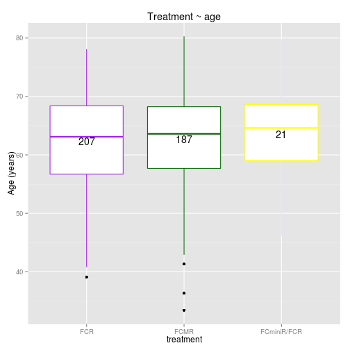

HICF1 CLinical data - descriptive overview
============================================

```r
load("clinicaldata.Rda")
library(gplots)
```

```
## KernSmooth 2.23 loaded
## Copyright M. P. Wand 1997-2009
## 
## Attaching package: 'gplots'
## 
## The following object is masked from 'package:stats':
## 
##     lowess
```

```r
library(ggplot2)
```

Is there an age difference between males and females?

```r
# using gplots package here
boxplot2(age_ar ~ gender, data = clinicaldata, main = "Gender ~ age", col = c("blue", 
    "red"), xlab = "gender", ylab = "age", top = TRUE, varwidth = "T")
```

 

```r
# same with ggplot2
p <- ggplot(clinicaldata, aes(gender, age_ar))
give.n <- function(x) {
    return(c(y = mean(x), label = length(x)))
}
p + geom_boxplot(varwidth = "T", col = c("blue", "red")) + stat_summary(fun.data = give.n, 
    geom = "text")
```

 

```r
# independent 2-group t-test with unequal variance (Welsh mod)
t.test(age_ar ~ gender, data = clinicaldata)  # where y is numeric and x is a binary factor
```

```
## 
## 	Welch Two Sample t-test
## 
## data:  age_ar by gender
## t = -0.6371, df = 235.2, p-value = 0.5247
## alternative hypothesis: true difference in means is not equal to 0
## 95 percent confidence interval:
##  -2.221  1.136
## sample estimates:
##   mean in group male mean in group female 
##                62.42                62.96
```

Is there an age difference between treatments?

```r
boxplot2(age_ar ~ treatment, data = clinicaldata, main = "Treatment ~ age", 
    col = c("purple", "green", "yellow"), xlab = "treatment", ylab = "age", 
    top = TRUE, varwidth = "T")
```

 

```r
# independent multi-group Welsh ANOVA
oneway.test(age_ar ~ treatment, data = clinicaldata)  # where y is numeric and x is a binary factor
```

```
## 
## 	One-way analysis of means (not assuming equal variances)
## 
## data:  age_ar and treatment
## F = 0.2384, num df = 2.00, denom df = 55.39, p-value = 0.7887
```

Is there an age difference between MRD outcome and response?

```r
boxplot2(age_ar ~ mrd, data = clinicaldata, main = "MRD ~ age", col = c("red", 
    "grey", "yellow"), xlab = "MRD", ylab = "age", top = TRUE, varwidth = "T")
```

 

```r
# independent multi-group Welsh ANOVA
oneway.test(age_ar ~ treatment, data = clinicaldata)  # where y is numeric and x is a binary factor
```

```
## 
## 	One-way analysis of means (not assuming equal variances)
## 
## data:  age_ar and treatment
## F = 0.2384, num df = 2.00, denom df = 55.39, p-value = 0.7887
```


- possible confounding factors (age, gender,...)
- treatment groups


