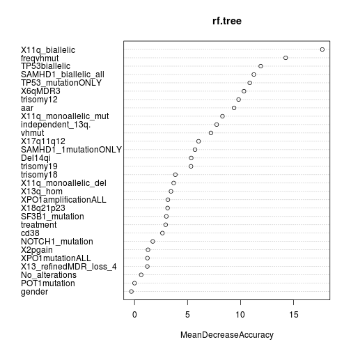
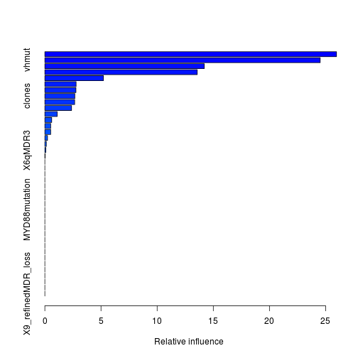
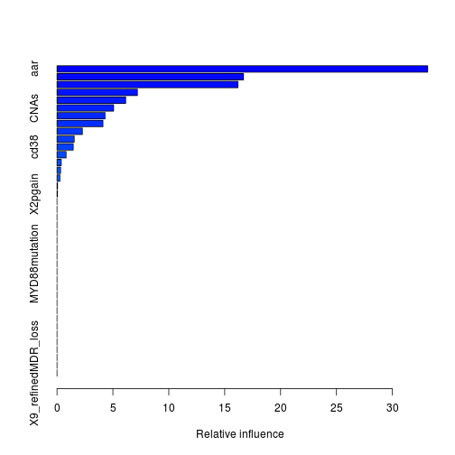

HICF1 - factor modelling - TREES
========================================================

Dr. Susanne Weller 
16/05/2014

Import merged dataframe


```r
setwd("~/work/HICF1/HICF1_sub1/trunk/HICF_predictivemodel/HICF1_trees")
```

```
## Error: cannot change working directory
```

```r
load("genclin.Rda")

# reorder collumns for convenience
genclin <- genclin[c(1, 7, 2:6, 8:45)]
genclin <- genclin[c(1, 2, 8, 5, 3, 7, 10, 11, 9, 4, 6, 12:45)]


# convert integers to factors
genclin[, 9:45] <- lapply(genclin[, 9:45], as.factor)
levels(genclin$MRD) <- c("+MRD", "-MRD")
```


I. SIMPLE CLASSIFICATION TREES
-------------------------------

Only genetic data:


```r
library(tree)
treegenetic <- genclin[c(2, 6, 8:45)]
tree.genetic <- tree(MRD ~ ., treegenetic)
summary(tree.genetic)
```

```
## 
## Classification tree:
## tree(formula = MRD ~ ., data = treegenetic)
## Variables actually used in tree construction:
## [1] "freqvhmut"         "trisomy12"         "TP53biallelic"    
## [4] "TP53_mutationONLY" "X6qMDR3"           "X11q_biallelic"   
## [7] "CNAs"              "XPO1mutationALL"   "cd38"             
## Number of terminal nodes:  10 
## Residual mean deviance:  1.11 = 191 / 172 
## Misclassification error rate: 0.253 = 46 / 182
```

```r

plot(tree.genetic)
text(tree.genetic, pretty = 0)
```

 


Using all available data

```r
treeall <- genclin[c(2, 4:45)]
tree.all <- tree(MRD ~ ., treeall)
summary(tree.all)
```

```
## 
## Classification tree:
## tree(formula = MRD ~ ., data = treeall)
## Variables actually used in tree construction:
##  [1] "freqvhmut"        "aar"              "X13q_hom"        
##  [4] "cd38"             "independent_13q." "trisomy12"       
##  [7] "TP53biallelic"    "X6qMDR3"          "treatment"       
## [10] "clones"           "X11q_biallelic"  
## Number of terminal nodes:  20 
## Residual mean deviance:  0.853 = 138 / 162 
## Misclassification error rate: 0.176 = 32 / 182
```

```r

plot(tree.all)
text(tree.all, pretty = 0)
```

 


II. SIMPLE CROSS VALIDATION
---------------------------


```r

set.seed(5)
train1 <- sample(1:nrow(genclin), 139)
tree.test1 <- genclin[-train1, ]
tree.train1 <- genclin[train1, ]
MRD.test = treeall$MRD[-train1]

tree.train <- tree(MRD ~ ., treeall, subset = train1)
summary(tree.train)
```

```
## 
## Classification tree:
## tree(formula = MRD ~ ., data = treeall, subset = train1)
## Variables actually used in tree construction:
##  [1] "freqvhmut"         "aar"               "cd38"             
##  [4] "independent_13q."  "X13q_het"          "trisomy12"        
##  [7] "NOTCH1_mutation"   "TP53_mutationONLY" "X11q_biallelic"   
## [10] "clones"           
## Number of terminal nodes:  16 
## Residual mean deviance:  0.885 = 94.7 / 107 
## Misclassification error rate: 0.211 = 26 / 123
```

```r
tree.pred = predict(tree.train, tree.test1, type = "class")
table(tree.pred, MRD.test)
```

```
##          MRD.test
## tree.pred +MRD -MRD
##      +MRD   23   26
##      -MRD    8   13
```


III. COST COMPLEXITY PRUNING
----------------------------

Using only the training data set


```r

set.seed(3)
cv.treetrain <- cv.tree(tree.train, FUN = prune.misclass)
cv.treetrain
```

```
## $size
## [1] 16 14  9  5  4  3  2  1
## 
## $dev
## [1] 51 48 47 45 35 45 50 60
## 
## $k
## [1] -Inf  0.0  0.4  0.5  1.0  5.0  7.0 12.0
## 
## $method
## [1] "misclass"
## 
## attr(,"class")
## [1] "prune"         "tree.sequence"
```

```r

par(mfrow = c(1, 2))
plot(cv.treetrain$size, cv.treetrain$dev, type = "b")
plot(cv.treetrain$k, cv.treetrain$dev, type = "b")
```

 

```r

prune.train1 <- prune.misclass(tree.train, best = 4)
plot(prune.train1)
text(prune.train1, pretty = 0)
summary(prune.train1)
```

```
## 
## Classification tree:
## snip.tree(tree = tree.train, nodes = c(7L, 12L, 2L))
## Variables actually used in tree construction:
## [1] "freqvhmut"       "trisomy12"       "NOTCH1_mutation"
## Number of terminal nodes:  4 
## Residual mean deviance:  1.16 = 138 / 119 
## Misclassification error rate: 0.252 = 31 / 123
```

 

Note: This pruning resultet in an improvement of 0.006, possibly due to the fact that the original tree suffered from high variance


Using the whole data set


```r
set.seed(5)
cv.tree.all <- cv.tree(tree.all, FUN = prune.misclass)
cv.tree.all
```

```
## $size
## [1] 20 15 13 11  8  4  2  1
## 
## $dev
## [1] 75 71 72 69 69 64 73 90
## 
## $k
## [1] -Inf  0.0  1.0  1.5  2.0  3.0  5.0 21.0
## 
## $method
## [1] "misclass"
## 
## attr(,"class")
## [1] "prune"         "tree.sequence"
```

```r

par(mfrow = c(1, 2))
plot(cv.tree.all$size, cv.tree.all$dev, type = "b")
plot(cv.tree.all$k, cv.tree.all$dev, type = "b")
```

 

```r

prune.tree.all <- prune.misclass(tree.all, best = 4)
plot(prune.tree.all)
text(prune.tree.all, pretty = 0)
summary(prune.tree.all)
```

```
## 
## Classification tree:
## snip.tree(tree = tree.all, nodes = c(7L, 2L, 12L))
## Variables actually used in tree construction:
## [1] "freqvhmut" "aar"       "trisomy12"
## Number of terminal nodes:  4 
## Residual mean deviance:  1.19 = 212 / 178 
## Misclassification error rate: 0.302 = 55 / 182
```

 


without freqvhmut

```r
wofreq <- genclin[c(2, 4, 5, 7:45)]
tree.freq <- tree(MRD ~ ., wofreq)
summary(tree.freq)
```

```
## 
## Classification tree:
## tree(formula = MRD ~ ., data = wofreq)
## Variables actually used in tree construction:
##  [1] "X11q_biallelic"       "aar"                  "TP53biallelic"       
##  [4] "vhmut"                "cd38"                 "gender"              
##  [7] "CNAs"                 "trisomy12"            "X6qMDR3"             
## [10] "X11q_monoallelic_mut"
## Number of terminal nodes:  18 
## Residual mean deviance:  0.874 = 143 / 164 
## Misclassification error rate: 0.22 = 40 / 182
```

```r

plot(tree.freq)
text(tree.freq, pretty = 0)
```

 

```r

set.seed(5)
cv.tree.freq <- cv.tree(tree.freq, FUN = prune.misclass)
cv.tree.freq
```

```
## $size
## [1] 18 12 10  8  4  2  1
## 
## $dev
## [1] 73 73 70 67 73 75 87
## 
## $k
## [1]  -Inf  0.00  0.50  1.50  3.25  7.00 15.00
## 
## $method
## [1] "misclass"
## 
## attr(,"class")
## [1] "prune"         "tree.sequence"
```

```r

par(mfrow = c(1, 2))
plot(cv.tree.freq$size, cv.tree.freq$dev, type = "b")
plot(cv.tree.freq$k, cv.tree.freq$dev, type = "b")
```

 

```r

prune.tree.freq <- prune.misclass(tree.freq, best = 8)
par(mfrow = c(1, 1))
plot(prune.tree.freq)
text(prune.tree.freq, pretty = 0)
mtext("0.2418%", side = 3)
```

 

```r
summary(prune.tree.freq)
```

```
## 
## Classification tree:
## snip.tree(tree = tree.freq, nodes = c(16L, 35L, 3L, 136L))
## Variables actually used in tree construction:
## [1] "X11q_biallelic"       "aar"                  "TP53biallelic"       
## [4] "vhmut"                "trisomy12"            "X6qMDR3"             
## [7] "X11q_monoallelic_mut"
## Number of terminal nodes:  8 
## Residual mean deviance:  1.07 = 187 / 174 
## Misclassification error rate: 0.242 = 44 / 182
```


III. RANDOM FORESTS
-------------------
!!!This still needs cross validation!

Note: Random forests does not take NAs, so n=182
with all variables

```r
library(randomForest)
```

```
## randomForest 4.6-7
## Type rfNews() to see new features/changes/bug fixes.
```

```r
set.seed(1)
rf.tree <- randomForest(MRD ~ ., treeall, mtry = 5, importance = TRUE, na.action = na.omit, 
    ntree = 1000)
rf.tree
```

```
## 
## Call:
##  randomForest(formula = MRD ~ ., data = treeall, mtry = 5, importance = TRUE,      ntree = 1000, na.action = na.omit) 
##                Type of random forest: classification
##                      Number of trees: 1000
## No. of variables tried at each split: 5
## 
##         OOB estimate of  error rate: 29.67%
## Confusion matrix:
##      +MRD -MRD class.error
## +MRD   73   23      0.2396
## -MRD   31   55      0.3605
```

```r
importance(rf.tree)
```

```
##                           +MRD     -MRD MeanDecreaseAccuracy
## treatment              0.41380  4.00241               2.9339
## aar                    7.10941  6.88537               9.3894
## freqvhmut             13.86054  4.41371              14.2561
## clones                 0.62500 -3.42162              -2.0286
## CNAs                  -2.40303 -3.59476              -4.0217
## cd38                   5.32573 -2.09939               2.6295
## gender                 0.72860 -1.39987              -0.2978
## vhmut                  8.30099 -0.82842               7.2040
## X11q_monoallelic_del   2.88769  2.51495               3.6916
## X11q_monoallelic_mut   4.23588  7.89412               8.2927
## X11q_biallelic        15.96395 11.97861              17.7102
## SAMHD1_1mutationONLY   4.42927  4.61339               5.7042
## SAMHD1_biallelic_all   9.29248  8.93363              11.2512
## TP53_mutationONLY      9.01747  8.17379              10.8669
## TP53biallelic         10.96346  9.63353              11.9030
## SF3B1_mutation         2.14004  2.38297               3.0005
## NOTCH1_mutation        2.15855 -0.21787               1.7183
## trisomy12              5.26919  9.94752               9.8155
## trisomy18              2.14939  3.74430               3.8505
## trisomy19              4.52426  3.46450               5.3272
## XPO1amplificationALL   5.64332 -0.74412               3.1461
## XPO1mutationALL        5.29399 -4.19348               1.2190
## MYD88mutation          0.75368 -3.02171              -1.3573
## MED12mutation         -3.00143 -1.15704              -2.7856
## POT1mutation           0.00000  0.00000               0.0000
## X8q24amplification    -0.03556 -2.21399              -1.5706
## ZFPM2mutation         -1.63515 -1.24371              -1.7179
## Del14qi                3.31065  4.91488               5.3465
## del8p                 -1.20110 -2.90263              -2.8675
## X2pgain                2.56682 -0.63233               1.2700
## del4p                 -2.86080 -1.37704              -2.6548
## X8qgain               -1.50656 -3.79878              -3.3310
## X6qMDR3               11.13869  3.93957              10.3241
## X17q11q12              2.54978  6.29089               6.0385
## X18q21p23              2.10636  3.15339               3.1196
## No_alterations         2.64687 -2.30540               0.6261
## independent_13q.       9.38352  0.14996               7.7466
## X13q_hom               1.80819  3.45781               3.4378
## X13q_het              -0.64720 -1.87532              -1.7370
## X13_refinedMDR_loss_4  4.59394 -2.10278               1.2076
## X3_newMDR_gain        -4.12886 -3.05221              -4.6608
## X9_refinedMDR_loss    -0.76777  0.03147              -0.5968
##                       MeanDecreaseGini
## treatment                       3.1842
## aar                            10.9854
## freqvhmut                       9.2808
## clones                          2.7314
## CNAs                            5.9555
## cd38                            1.9186
## gender                          1.7379
## vhmut                           2.4918
## X11q_monoallelic_del            1.4127
## X11q_monoallelic_mut            1.9406
## X11q_biallelic                  3.7552
## SAMHD1_1mutationONLY            0.5070
## SAMHD1_biallelic_all            1.1709
## TP53_mutationONLY               1.0164
## TP53biallelic                   1.0680
## SF3B1_mutation                  1.5799
## NOTCH1_mutation                 1.6746
## trisomy12                       2.7890
## trisomy18                       0.1921
## trisomy19                       0.2257
## XPO1amplificationALL            0.8462
## XPO1mutationALL                 1.0822
## MYD88mutation                   0.1486
## MED12mutation                   0.3046
## POT1mutation                    0.1001
## X8q24amplification              0.1038
## ZFPM2mutation                   0.3027
## Del14qi                         0.3518
## del8p                           0.7403
## X2pgain                         0.8019
## del4p                           0.3179
## X8qgain                         0.4827
## X6qMDR3                         1.6466
## X17q11q12                       0.6057
## X18q21p23                       0.1933
## No_alterations                  0.7367
## independent_13q.                1.5380
## X13q_hom                        1.6078
## X13q_het                        1.7053
## X13_refinedMDR_loss_4           0.6878
## X3_newMDR_gain                  0.2928
## X9_refinedMDR_loss              0.2768
```

```r
varImpPlot(rf.tree, sort = TRUE, type = 1, scale = TRUE)
```

 

without freqvhmut

```r
set.seed(2)
rf.tree.wofreq <- randomForest(MRD ~ ., wofreq, mtry = 5, importance = TRUE, 
    na.action = na.omit, ntree = 1000)
rf.tree.wofreq
```

```
## 
## Call:
##  randomForest(formula = MRD ~ ., data = wofreq, mtry = 5, importance = TRUE,      ntree = 1000, na.action = na.omit) 
##                Type of random forest: classification
##                      Number of trees: 1000
## No. of variables tried at each split: 5
## 
##         OOB estimate of  error rate: 32.42%
## Confusion matrix:
##      +MRD -MRD class.error
## +MRD   75   21      0.2188
## -MRD   38   48      0.4419
```

```r
importance(rf.tree.wofreq)
```

```
##                          +MRD     -MRD MeanDecreaseAccuracy
## treatment              1.9767  3.69421               3.6345
## aar                    8.2383  7.28773               9.6795
## clones                 1.8941 -4.22056              -1.1468
## CNAs                  -0.2720  0.04536              -0.3075
## cd38                   4.3065 -2.85728               1.3636
## gender                -1.1398 -2.54468              -2.4886
## vhmut                 12.7226  4.16752              12.0904
## X11q_monoallelic_del   3.7765  4.36524               5.3832
## X11q_monoallelic_mut   4.4167  7.59927               7.8339
## X11q_biallelic        18.2635 14.30625              19.8037
## SAMHD1_1mutationONLY   6.1353  3.25536               5.6686
## SAMHD1_biallelic_all   9.6500  9.65508              11.8277
## TP53_mutationONLY     11.4398  8.01416              11.7016
## TP53biallelic         13.5066 12.47381              15.0927
## SF3B1_mutation         3.8113  3.38424               4.8979
## NOTCH1_mutation        1.4087  0.85183               1.6449
## trisomy12              3.6465  8.36900               7.7258
## trisomy18              2.1040  4.78877               4.5071
## trisomy19              4.2718  4.26765               5.6150
## XPO1amplificationALL   4.5682 -0.34996               3.1107
## XPO1mutationALL        4.7840 -2.80668               1.7887
## MYD88mutation         -1.3497 -4.00360              -3.4352
## MED12mutation         -2.7975 -1.06101              -2.5975
## POT1mutation           0.0000  0.00000               0.0000
## X8q24amplification    -2.4704 -1.92703              -3.0098
## ZFPM2mutation         -1.4492 -1.89028              -2.1651
## Del14qi                4.1854  6.32354               6.6894
## del8p                 -2.7607 -2.89030              -4.0033
## X2pgain                2.7129 -0.75207               1.5408
## del4p                 -0.5452 -1.68758              -1.5128
## X8qgain               -1.7095 -2.27358              -2.6404
## X6qMDR3                8.0599  3.58827               8.0733
## X17q11q12              1.9181  5.66064               5.2422
## X18q21p23              2.7362  3.59007               4.0715
## No_alterations         4.8709 -0.12472               3.8342
## independent_13q.      11.2182 -1.72464               8.2061
## X13q_hom               2.3267  2.38298               3.3549
## X13q_het               0.4453 -2.88140              -1.6878
## X13_refinedMDR_loss_4  3.1747 -3.54473              -0.1967
## X3_newMDR_gain        -4.6466 -1.36814              -4.2233
## X9_refinedMDR_loss    -0.4429  0.09764              -0.2949
##                       MeanDecreaseGini
## treatment                      3.26226
## aar                           11.77310
## clones                         2.99430
## CNAs                           6.32240
## cd38                           2.19801
## gender                         1.80132
## vhmut                          3.93829
## X11q_monoallelic_del           1.62164
## X11q_monoallelic_mut           1.95573
## X11q_biallelic                 4.35310
## SAMHD1_1mutationONLY           0.58907
## SAMHD1_biallelic_all           1.24467
## TP53_mutationONLY              1.25424
## TP53biallelic                  1.40332
## SF3B1_mutation                 1.87189
## NOTCH1_mutation                1.58808
## trisomy12                      2.64870
## trisomy18                      0.21246
## trisomy19                      0.24651
## XPO1amplificationALL           0.83033
## XPO1mutationALL                0.91233
## MYD88mutation                  0.19721
## MED12mutation                  0.40787
## POT1mutation                   0.07108
## X8q24amplification             0.12432
## ZFPM2mutation                  0.36161
## Del14qi                        0.48188
## del8p                          0.81518
## X2pgain                        0.75879
## del4p                          0.37019
## X8qgain                        0.56567
## X6qMDR3                        1.52174
## X17q11q12                      0.59403
## X18q21p23                      0.25356
## No_alterations                 0.90004
## independent_13q.               1.78964
## X13q_hom                       1.67936
## X13q_het                       1.72459
## X13_refinedMDR_loss_4          0.71017
## X3_newMDR_gain                 0.32669
## X9_refinedMDR_loss             0.29622
```

```r
varImpPlot(rf.tree.wofreq, sort = TRUE, type = 1, scale = TRUE)
```

 


IV. BOOSTING
------------

!!! This still needs cross validation!
in particular: Cross validation to select n.trees

Interaction depth = 1 puts more emphasis on the first splits!


```r
library(gbm)
```

```
## Loading required package: survival
## Loading required package: splines
## Loading required package: lattice
## Loading required package: parallel
## Loaded gbm 2.1
```

```r
set.seed(4)
facttreeall <- treeall
modelmatrix <- model.matrix(~MRD - 1, data = facttreeall)
facttreeall$MRD <- modelmatrix[, 1]
boost.tree = gbm(MRD ~ ., facttreeall, distribution = "bernoulli", n.trees = 2000, 
    interaction.depth = 1)
par(mfrow = c(1, 1))
summary(boost.tree)
```

 

```
##                                         var  rel.inf
## freqvhmut                         freqvhmut 42.53701
## aar                                     aar 20.87813
## X11q_biallelic               X11q_biallelic 11.44799
## trisomy12                         trisomy12 10.68359
## treatment                         treatment  3.67793
## NOTCH1_mutation             NOTCH1_mutation  2.17502
## CNAs                                   CNAs  1.78914
## X11q_monoallelic_mut   X11q_monoallelic_mut  1.73896
## clones                               clones  1.67472
## cd38                                   cd38  1.05799
## independent_13q.           independent_13q.  0.79781
## X13q_hom                           X13q_hom  0.66049
## gender                               gender  0.26295
## SF3B1_mutation               SF3B1_mutation  0.21393
## X11q_monoallelic_del   X11q_monoallelic_del  0.18299
## X13q_het                           X13q_het  0.13129
## X6qMDR3                             X6qMDR3  0.06496
## X2pgain                             X2pgain  0.02511
## vhmut                                 vhmut  0.00000
## SAMHD1_1mutationONLY   SAMHD1_1mutationONLY  0.00000
## SAMHD1_biallelic_all   SAMHD1_biallelic_all  0.00000
## TP53_mutationONLY         TP53_mutationONLY  0.00000
## TP53biallelic                 TP53biallelic  0.00000
## trisomy18                         trisomy18  0.00000
## trisomy19                         trisomy19  0.00000
## XPO1amplificationALL   XPO1amplificationALL  0.00000
## XPO1mutationALL             XPO1mutationALL  0.00000
## MYD88mutation                 MYD88mutation  0.00000
## MED12mutation                 MED12mutation  0.00000
## POT1mutation                   POT1mutation  0.00000
## X8q24amplification       X8q24amplification  0.00000
## ZFPM2mutation                 ZFPM2mutation  0.00000
## Del14qi                             Del14qi  0.00000
## del8p                                 del8p  0.00000
## del4p                                 del4p  0.00000
## X8qgain                             X8qgain  0.00000
## X17q11q12                         X17q11q12  0.00000
## X18q21p23                         X18q21p23  0.00000
## No_alterations               No_alterations  0.00000
## X13_refinedMDR_loss_4 X13_refinedMDR_loss_4  0.00000
## X3_newMDR_gain               X3_newMDR_gain  0.00000
## X9_refinedMDR_loss       X9_refinedMDR_loss  0.00000
```

```r


par(mfrow = c(2, 3))
plot(boost.tree, i = "freqvhmut")
plot(boost.tree, i = "aar")
plot(boost.tree, i = "CNAs")
plot(boost.tree, i = "cd38")
plot(boost.tree, i = "treatment")
plot(boost.tree, i = "clones")
```

 

leaving out freqvhmut

```r
set.seed(4)
facttreeall.wofreq <- wofreq
facttreeall.wofreq$MRD <- modelmatrix[, 1]
boost.tree.wofreq = gbm(MRD ~ ., facttreeall.wofreq, distribution = "bernoulli", 
    n.trees = 2000, interaction.depth = 1)
par(mfrow = c(1, 1))
summary(boost.tree.wofreq)
```

 

```
##                                         var  rel.inf
## aar                                     aar 25.97294
## vhmut                                 vhmut 24.52095
## X11q_biallelic               X11q_biallelic 14.19755
## trisomy12                         trisomy12 13.57220
## treatment                         treatment  5.21603
## independent_13q.           independent_13q.  2.78550
## CNAs                                   CNAs  2.77058
## clones                               clones  2.67657
## X11q_monoallelic_mut   X11q_monoallelic_mut  2.65621
## NOTCH1_mutation             NOTCH1_mutation  2.37968
## cd38                                   cd38  1.10086
## X13q_hom                           X13q_hom  0.61172
## X11q_monoallelic_del   X11q_monoallelic_del  0.52582
## gender                               gender  0.52510
## SF3B1_mutation               SF3B1_mutation  0.23824
## X13q_het                           X13q_het  0.13404
## X6qMDR3                             X6qMDR3  0.08778
## X2pgain                             X2pgain  0.02825
## SAMHD1_1mutationONLY   SAMHD1_1mutationONLY  0.00000
## SAMHD1_biallelic_all   SAMHD1_biallelic_all  0.00000
## TP53_mutationONLY         TP53_mutationONLY  0.00000
## TP53biallelic                 TP53biallelic  0.00000
## trisomy18                         trisomy18  0.00000
## trisomy19                         trisomy19  0.00000
## XPO1amplificationALL   XPO1amplificationALL  0.00000
## XPO1mutationALL             XPO1mutationALL  0.00000
## MYD88mutation                 MYD88mutation  0.00000
## MED12mutation                 MED12mutation  0.00000
## POT1mutation                   POT1mutation  0.00000
## X8q24amplification       X8q24amplification  0.00000
## ZFPM2mutation                 ZFPM2mutation  0.00000
## Del14qi                             Del14qi  0.00000
## del8p                                 del8p  0.00000
## del4p                                 del4p  0.00000
## X8qgain                             X8qgain  0.00000
## X17q11q12                         X17q11q12  0.00000
## X18q21p23                         X18q21p23  0.00000
## No_alterations               No_alterations  0.00000
## X13_refinedMDR_loss_4 X13_refinedMDR_loss_4  0.00000
## X3_newMDR_gain               X3_newMDR_gain  0.00000
## X9_refinedMDR_loss       X9_refinedMDR_loss  0.00000
```

```r


par(mfrow = c(2, 3))
plot(boost.tree.wofreq, i = "aar")
plot(boost.tree.wofreq, i = "vhmut")
plot(boost.tree.wofreq, i = "X11q_biallelic")
plot(boost.tree.wofreq, i = "trisomy12")
plot(boost.tree.wofreq, i = "treatment")
plot(boost.tree.wofreq, i = "independent_13q.")
```

 

leaving out freqvhmut and vhmut

```r
set.seed(4)
facttreeall.wofreqvhmut <- facttreeall.wofreq[c(1:7, 9:42)]

boost.tree.wofreqvhmut = gbm(MRD ~ ., facttreeall.wofreqvhmut, distribution = "bernoulli", 
    n.trees = 2000, interaction.depth = 1)
par(mfrow = c(1, 1))
summary(boost.tree.wofreqvhmut)
```

 

```
##                                         var  rel.inf
## aar                                     aar 33.16355
## X11q_biallelic               X11q_biallelic 16.68514
## trisomy12                         trisomy12 16.18250
## treatment                         treatment  7.19572
## independent_13q.           independent_13q.  6.14823
## CNAs                                   CNAs  5.06668
## X11q_monoallelic_mut   X11q_monoallelic_mut  4.30139
## clones                               clones  4.11177
## NOTCH1_mutation             NOTCH1_mutation  2.27217
## X11q_monoallelic_del   X11q_monoallelic_del  1.54018
## cd38                                   cd38  1.45304
## gender                               gender  0.81786
## X13q_hom                           X13q_hom  0.38043
## SF3B1_mutation               SF3B1_mutation  0.32262
## X13q_het                           X13q_het  0.26150
## X6qMDR3                             X6qMDR3  0.05164
## X2pgain                             X2pgain  0.04560
## SAMHD1_1mutationONLY   SAMHD1_1mutationONLY  0.00000
## SAMHD1_biallelic_all   SAMHD1_biallelic_all  0.00000
## TP53_mutationONLY         TP53_mutationONLY  0.00000
## TP53biallelic                 TP53biallelic  0.00000
## trisomy18                         trisomy18  0.00000
## trisomy19                         trisomy19  0.00000
## XPO1amplificationALL   XPO1amplificationALL  0.00000
## XPO1mutationALL             XPO1mutationALL  0.00000
## MYD88mutation                 MYD88mutation  0.00000
## MED12mutation                 MED12mutation  0.00000
## POT1mutation                   POT1mutation  0.00000
## X8q24amplification       X8q24amplification  0.00000
## ZFPM2mutation                 ZFPM2mutation  0.00000
## Del14qi                             Del14qi  0.00000
## del8p                                 del8p  0.00000
## del4p                                 del4p  0.00000
## X8qgain                             X8qgain  0.00000
## X17q11q12                         X17q11q12  0.00000
## X18q21p23                         X18q21p23  0.00000
## No_alterations               No_alterations  0.00000
## X13_refinedMDR_loss_4 X13_refinedMDR_loss_4  0.00000
## X3_newMDR_gain               X3_newMDR_gain  0.00000
## X9_refinedMDR_loss       X9_refinedMDR_loss  0.00000
```

```r


par(mfrow = c(2, 3))
plot(boost.tree.wofreqvhmut, i = "aar")
plot(boost.tree.wofreqvhmut, i = "trisomy12")
plot(boost.tree.wofreqvhmut, i = "X11q_biallelic")
plot(boost.tree.wofreqvhmut, i = "treatment")
plot(boost.tree.wofreqvhmut, i = "independent_13q.")
plot(boost.tree.wofreqvhmut, i = "clones")
```

 
