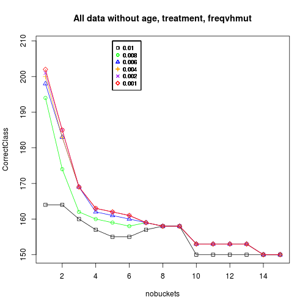
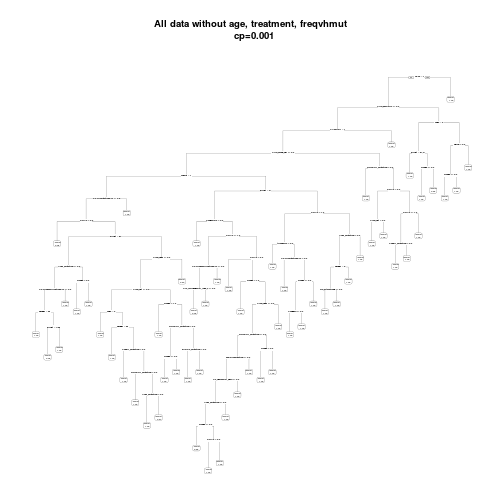
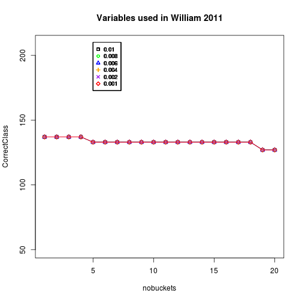
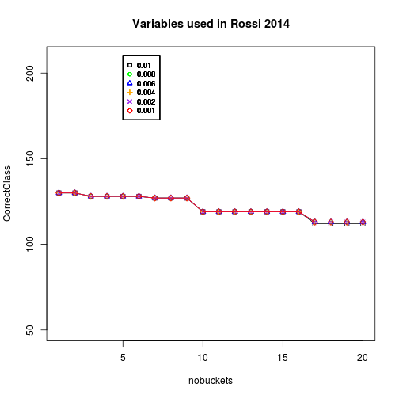
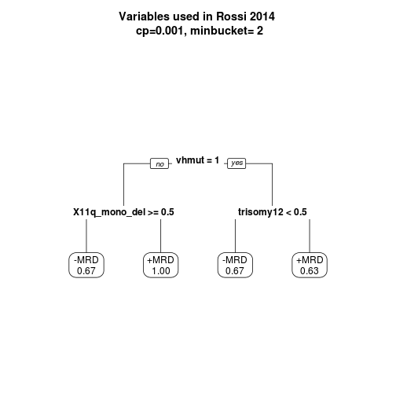
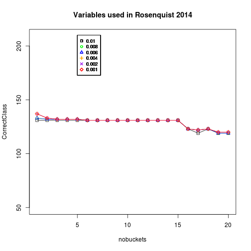
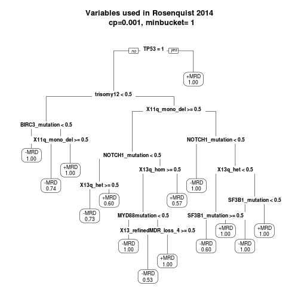
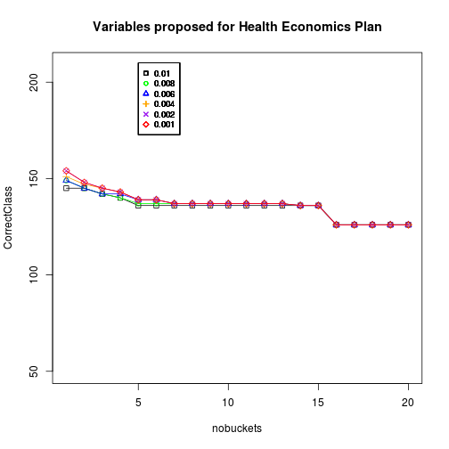

HICF1 - factor modelling - TREES - V2
========================================================

Dr. Susanne Weller 
27/05/2014

Import merged dataframe - v2


```r
setwd("~/work/01_HICF1/HICF1_sub1/trunk/HICF_predictivemodel/HICF1_trees/HICF1_trees_v2")
load("genclinv2.Rda")
library(plyr)

# reorder collumns for convenience
genclinv2 <- genclinv2[c(1, 4, 8, 2, 6, 5, 50, 3, 7, 9:11, 13, 15:49)]
genclinv2$X11q_monoallelic_mut <- NULL
genclinv2 <- rename(genclinv2, c(X11q_monoallelic_del.y = "X11q_mono_del", X11q_biallelic.y = "X11q_biallelic"))


# convert integers to factors

genclinv2$vhmut <- as.factor(genclinv2$vhmut)
levels(genclinv2$MRD) <- c("-MRD", "+MRD")
genclinv2$cd38 <- as.factor(genclinv2$cd38)
genclinv2[, 13:48] <- lapply(genclinv2[, 13:48], as.factor)
```

```
## Error: undefined columns selected
```

```r

# combine genetic factors
genclinv2$SAMHD1 <- factor(ifelse(genclinv2$SAMHD1_1mutationONLY == "1" | genclinv2$SAMHD1_biallelic_all == 
    "1", "1", "0"))
genclinv2$TP53 <- factor(ifelse(genclinv2$TP53_mutationONLY == "1" | genclinv2$TP53biallelic == 
    "1", "1", "0"))
```


SIMPLE CLASSIFICATION TREES
==============================

I. Using Rpart
-------------------------------

*as agreed on 20/05/2014*

Not using age, treatment, freqvhmut


```r
treegenclin <- genclinv2[c(6:49)]

library(rpart)
library(rpart.plot)
# rp.treegenclin <- rpart(treegenclin$MRD~., method='class',
# data=treegenclin, control=rpart.control(minbucket=3, xval=10, cp=0.001))
# par(mfrow=c(1, 1)) prp(rp.treegenclin, extra=8) prp(rp.treegenclin,
# extra=8) prp(rp.treegenclin, extra=8, fallen.leaves=TRUE)

# par(mfrow=c(1, 1)) prp(rp.treegenclin, extra=8, uniform=TRUE, branch=1,
# left=FALSE, varlen=0) prp(rp.treegenclin, extra=2, uniform=FALSE,
# branch=1, left=FALSE, varlen=0)


# library(rattle) par(mfrow=c(1, 1)) fancyRpartPlot(rp.treegenclin,
# uniform=FALSE, branch=1, left=FALSE)
```

Produce different models to find optimal number of patient in buckets and optimal cp
====================================================================================
-> The model already contains 10x CV!

Missclassification error is calculated as "Root node error" x "rel. model error"

(1) produce a number of trees iterating over the number of patients in a bucket
(2) Calculate Missclassification Error rate for those trees

```r
library(rpart)
library(rpart.plot)
source("lastfunction.R")

par(mfrow = c(1, 1))
for (cp in c(0.01, 0.008, 0.006, 0.004, 0.002, 0.001)) {
    missclassbybucket <- NULL
    nobuckets <- NULL
    MissClassErr <- NULL
    CorrectClass <- NULL
    rootnoderr <- NULL
    for (i in 1:15) {
        # built the tree
        rp.treegenclin <- rpart(treegenclin$MRD ~ ., method = "class", data = treegenclin, 
            control = rpart.control(minbucket = i, xval = 10, cp = cp))
        # get the number of buckets
        nobuckets[i] <- i
        # get the root node error
        rootnoderr[i] <- rp.treegenclin$parms$prior[2]
        # Get the rel error for each tree
        rpsum <- printcp(rp.treegenclin)
        relErr <- last(rpsum)
        # Calculate missclassification error
        MissClassErr[i] <- rootnoderr[i] * relErr
        # Calculate correctly classified patients
        CorrectClass[i] <- 209 - MissClassErr[i] * 209
    }
    if (cp == 0.01) {
        plot(nobuckets, CorrectClass, pch = 0, type = "o", ylim = c(150, 209), 
            main = "All data without age, treatment, freqvhmut")
    } else {
        if (cp == 0.008) {
            lines(CorrectClass, type = "o", pch = 1, col = "green")
        } else {
            if (cp == 0.006) {
                lines(CorrectClass, type = "o", pch = 2, col = "blue")
            } else {
                if (cp == 0.004) {
                  lines(CorrectClass, type = "o", pch = 3, col = "orange")
                } else {
                  if (cp == 0.002) {
                    lines(CorrectClass, type = "o", pch = 4, col = "purple")
                  } else {
                    if (cp == 0.001) {
                      lines(CorrectClass, type = "o", pch = 5, col = "red")
                    }
                  }
                }
            }
        }
    }
    legend(5, 210, c("0.01", "0.008", "0.006", "0.004", "0.002", "0.001"), cex = 0.8, 
        col = c("black", "green", "blue", "orange", "purple", "red"), pch = 0:5)
}
```

```
## 
## Classification tree:
## rpart(formula = treegenclin$MRD ~ ., data = treegenclin, method = "class", 
##     control = rpart.control(minbucket = i, xval = 10, cp = cp))
## 
## Variables actually used in tree construction:
##  [1] Binet           CNAs            NOTCH1_mutation SAMHD1         
##  [5] TP53            trisomy12       vhmut           X11q_biallelic 
##  [9] X11q_mono_del   XPO1mutationALL
## 
## Root node error: 102/209 = 0.49
## 
## n= 209 
## 
##      CP nsplit rel error xerror  xstd
## 1 0.147      0      1.00   1.16 0.070
## 2 0.059      2      0.71   0.71 0.067
## 3 0.049      3      0.65   0.74 0.068
## 4 0.034      4      0.60   0.73 0.068
## 5 0.020      6      0.53   0.72 0.068
## 6 0.015      9      0.47   0.73 0.068
## 7 0.010     11      0.44   0.73 0.068
## 
## Classification tree:
## rpart(formula = treegenclin$MRD ~ ., data = treegenclin, method = "class", 
##     control = rpart.control(minbucket = i, xval = 10, cp = cp))
## 
## Variables actually used in tree construction:
##  [1] Binet           CNAs            NOTCH1_mutation SAMHD1         
##  [5] TP53            trisomy12       vhmut           X11q_biallelic 
##  [9] X11q_mono_del   XPO1mutationALL
## 
## Root node error: 102/209 = 0.49
## 
## n= 209 
## 
##      CP nsplit rel error xerror  xstd
## 1 0.147      0      1.00   1.09 0.071
## 2 0.059      2      0.71   0.75 0.068
## 3 0.049      3      0.65   0.75 0.068
## 4 0.034      4      0.60   0.69 0.067
## 5 0.020      6      0.53   0.66 0.066
## 6 0.015      9      0.47   0.68 0.067
## 7 0.010     11      0.44   0.70 0.067
## 
## Classification tree:
## rpart(formula = treegenclin$MRD ~ ., data = treegenclin, method = "class", 
##     control = rpart.control(minbucket = i, xval = 10, cp = cp))
## 
## Variables actually used in tree construction:
## [1] Binet          CNAs           SAMHD1         TP53          
## [5] trisomy12      vhmut          X11q_biallelic X11q_mono_del 
## 
## Root node error: 102/209 = 0.49
## 
## n= 209 
## 
##      CP nsplit rel error xerror  xstd
## 1 0.147      0      1.00   1.00 0.071
## 2 0.059      2      0.71   0.71 0.067
## 3 0.049      3      0.65   0.68 0.067
## 4 0.034      4      0.60   0.66 0.066
## 5 0.020      6      0.53   0.64 0.066
## 6 0.015      7      0.51   0.73 0.068
## 7 0.010      9      0.48   0.75 0.068
## 
## Classification tree:
## rpart(formula = treegenclin$MRD ~ ., data = treegenclin, method = "class", 
##     control = rpart.control(minbucket = i, xval = 10, cp = cp))
## 
## Variables actually used in tree construction:
## [1] Binet          CNAs           SAMHD1         TP53          
## [5] vhmut          X11q_biallelic X11q_mono_del 
## 
## Root node error: 102/209 = 0.49
## 
## n= 209 
## 
##      CP nsplit rel error xerror  xstd
## 1 0.147      0      1.00   1.09 0.071
## 2 0.059      2      0.71   0.71 0.067
## 3 0.049      3      0.65   0.72 0.068
## 4 0.034      4      0.60   0.67 0.066
## 5 0.020      6      0.53   0.66 0.066
## 6 0.010      7      0.51   0.75 0.068
## 
## Classification tree:
## rpart(formula = treegenclin$MRD ~ ., data = treegenclin, method = "class", 
##     control = rpart.control(minbucket = i, xval = 10, cp = cp))
## 
## Variables actually used in tree construction:
## [1] Binet          SAMHD1         TP53           vhmut         
## [5] X11q_biallelic X11q_mono_del 
## 
## Root node error: 102/209 = 0.49
## 
## n= 209 
## 
##      CP nsplit rel error xerror  xstd
## 1 0.147      0      1.00   1.00 0.071
## 2 0.059      2      0.71   0.71 0.067
## 3 0.049      3      0.65   0.71 0.067
## 4 0.034      4      0.60   0.71 0.067
## 5 0.010      6      0.53   0.65 0.066
## 
## Classification tree:
## rpart(formula = treegenclin$MRD ~ ., data = treegenclin, method = "class", 
##     control = rpart.control(minbucket = i, xval = 10, cp = cp))
## 
## Variables actually used in tree construction:
## [1] Binet          SAMHD1         TP53           vhmut         
## [5] X11q_biallelic X11q_mono_del 
## 
## Root node error: 102/209 = 0.49
## 
## n= 209 
## 
##      CP nsplit rel error xerror  xstd
## 1 0.147      0      1.00   1.09 0.071
## 2 0.059      2      0.71   0.71 0.067
## 3 0.049      3      0.65   0.75 0.068
## 4 0.034      4      0.60   0.75 0.068
## 5 0.010      6      0.53   0.72 0.068
## 
## Classification tree:
## rpart(formula = treegenclin$MRD ~ ., data = treegenclin, method = "class", 
##     control = rpart.control(minbucket = i, xval = 10, cp = cp))
## 
## Variables actually used in tree construction:
## [1] Binet          cd38           CNAs           gender        
## [5] TP53           vhmut          X11q_biallelic X6qMDR3       
## 
## Root node error: 102/209 = 0.49
## 
## n= 209 
## 
##      CP nsplit rel error xerror  xstd
## 1 0.147      0      1.00   1.08 0.071
## 2 0.049      2      0.71   0.71 0.067
## 3 0.016      4      0.61   0.68 0.067
## 4 0.012      7      0.56   0.70 0.067
## 5 0.010     11      0.51   0.70 0.067
## 
## Classification tree:
## rpart(formula = treegenclin$MRD ~ ., data = treegenclin, method = "class", 
##     control = rpart.control(minbucket = i, xval = 10, cp = cp))
## 
## Variables actually used in tree construction:
## [1] Binet          cd38           CNAs           gender        
## [5] TP53           trisomy12      vhmut          X11q_biallelic
## 
## Root node error: 102/209 = 0.49
## 
## n= 209 
## 
##      CP nsplit rel error xerror  xstd
## 1 0.147      0      1.00   1.16 0.070
## 2 0.049      2      0.71   0.76 0.069
## 3 0.020      4      0.61   0.73 0.068
## 4 0.012      7      0.55   0.69 0.067
## 5 0.010     11      0.50   0.70 0.067
## 
## Classification tree:
## rpart(formula = treegenclin$MRD ~ ., data = treegenclin, method = "class", 
##     control = rpart.control(minbucket = i, xval = 10, cp = cp))
## 
## Variables actually used in tree construction:
## [1] Binet          cd38           CNAs           gender        
## [5] TP53           trisomy12      vhmut          X11q_biallelic
## 
## Root node error: 102/209 = 0.49
## 
## n= 209 
## 
##      CP nsplit rel error xerror  xstd
## 1 0.147      0      1.00   1.07 0.071
## 2 0.049      2      0.71   0.71 0.067
## 3 0.020      4      0.61   0.65 0.066
## 4 0.012      7      0.55   0.68 0.067
## 5 0.010     11      0.50   0.70 0.067
## 
## Classification tree:
## rpart(formula = treegenclin$MRD ~ ., data = treegenclin, method = "class", 
##     control = rpart.control(minbucket = i, xval = 10, cp = cp))
## 
## Variables actually used in tree construction:
## [1] Binet          CNAs           TP53           vhmut         
## [5] X11q_biallelic
## 
## Root node error: 102/209 = 0.49
## 
## n= 209 
## 
##      CP nsplit rel error xerror  xstd
## 1 0.147      0      1.00   1.13 0.071
## 2 0.049      2      0.71   0.73 0.068
## 3 0.015      4      0.61   0.71 0.067
## 4 0.010      6      0.58   0.76 0.069
## 
## Classification tree:
## rpart(formula = treegenclin$MRD ~ ., data = treegenclin, method = "class", 
##     control = rpart.control(minbucket = i, xval = 10, cp = cp))
## 
## Variables actually used in tree construction:
## [1] Binet          CNAs           TP53           vhmut         
## [5] X11q_biallelic
## 
## Root node error: 102/209 = 0.49
## 
## n= 209 
## 
##      CP nsplit rel error xerror  xstd
## 1 0.147      0      1.00   1.11 0.071
## 2 0.049      2      0.71   0.71 0.067
## 3 0.015      4      0.61   0.62 0.065
## 4 0.010      6      0.58   0.65 0.066
## 
## Classification tree:
## rpart(formula = treegenclin$MRD ~ ., data = treegenclin, method = "class", 
##     control = rpart.control(minbucket = i, xval = 10, cp = cp))
## 
## Variables actually used in tree construction:
## [1] Binet          CNAs           TP53           vhmut         
## [5] X11q_biallelic
## 
## Root node error: 102/209 = 0.49
## 
## n= 209 
## 
##      CP nsplit rel error xerror  xstd
## 1 0.147      0      1.00   1.14 0.070
## 2 0.049      2      0.71   0.73 0.068
## 3 0.015      4      0.61   0.71 0.067
## 4 0.010      6      0.58   0.70 0.067
## 
## Classification tree:
## rpart(formula = treegenclin$MRD ~ ., data = treegenclin, method = "class", 
##     control = rpart.control(minbucket = i, xval = 10, cp = cp))
## 
## Variables actually used in tree construction:
## [1] Binet          CNAs           TP53           vhmut         
## [5] X11q_biallelic
## 
## Root node error: 102/209 = 0.49
## 
## n= 209 
## 
##      CP nsplit rel error xerror  xstd
## 1 0.147      0      1.00   1.00 0.071
## 2 0.049      2      0.71   0.74 0.068
## 3 0.015      4      0.61   0.69 0.067
## 4 0.010      6      0.58   0.74 0.068
## 
## Classification tree:
## rpart(formula = treegenclin$MRD ~ ., data = treegenclin, method = "class", 
##     control = rpart.control(minbucket = i, xval = 10, cp = cp))
## 
## Variables actually used in tree construction:
## [1] Binet          CNAs           TP53           vhmut         
## [5] X11q_biallelic
## 
## Root node error: 102/209 = 0.49
## 
## n= 209 
## 
##      CP nsplit rel error xerror  xstd
## 1 0.147      0      1.00   1.07 0.071
## 2 0.049      2      0.71   0.95 0.071
## 3 0.015      4      0.61   0.92 0.071
## 4 0.010      6      0.58   0.84 0.070
## 
## Classification tree:
## rpart(formula = treegenclin$MRD ~ ., data = treegenclin, method = "class", 
##     control = rpart.control(minbucket = i, xval = 10, cp = cp))
## 
## Variables actually used in tree construction:
## [1] Binet          CNAs           TP53           vhmut         
## [5] X11q_biallelic
## 
## Root node error: 102/209 = 0.49
## 
## n= 209 
## 
##      CP nsplit rel error xerror  xstd
## 1 0.147      0      1.00   1.07 0.071
## 2 0.049      2      0.71   0.90 0.070
## 3 0.015      4      0.61   0.76 0.069
## 4 0.010      6      0.58   0.76 0.069
```

 

```
## 
## Classification tree:
## rpart(formula = treegenclin$MRD ~ ., data = treegenclin, method = "class", 
##     control = rpart.control(minbucket = i, xval = 10, cp = cp))
## 
## Variables actually used in tree construction:
##  [1] ATM_mutation          Binet                 BIRC3_mutation       
##  [4] clones                CNAs                  MED12mutation        
##  [7] NOTCH1_mutation       SAMHD1                TP53                 
## [10] trisomy12             vhmut                 X11q_biallelic       
## [13] X11q_mono_del         X13q_het              X13q_hom             
## [16] X13_refinedMDR_loss_4 X3_newMDR_gain        X6qMDR3              
## [19] X8qgain               XPO1amplificationALL  XPO1mutationALL      
## 
## Root node error: 102/209 = 0.49
## 
## n= 209 
## 
##       CP nsplit rel error xerror  xstd
## 1 0.1471      0      1.00   1.19 0.070
## 2 0.0588      2      0.71   0.71 0.067
## 3 0.0490      3      0.65   0.69 0.067
## 4 0.0343      4      0.60   0.68 0.067
## 5 0.0196      6      0.53   0.65 0.066
## 6 0.0147      9      0.47   0.65 0.066
## 7 0.0098     11      0.44   0.69 0.067
## 8 0.0087     26      0.27   0.74 0.068
## 9 0.0080     40      0.15   0.75 0.068
## 
## Classification tree:
## rpart(formula = treegenclin$MRD ~ ., data = treegenclin, method = "class", 
##     control = rpart.control(minbucket = i, xval = 10, cp = cp))
## 
## Variables actually used in tree construction:
##  [1] ATM_mutation    Binet           clones          CNAs           
##  [5] NOTCH1_mutation SAMHD1          TP53            trisomy12      
##  [9] vhmut           X11q_biallelic  X11q_mono_del   X13q_het       
## [13] X13q_hom        XPO1mutationALL
## 
## Root node error: 102/209 = 0.49
## 
## n= 209 
## 
##       CP nsplit rel error xerror  xstd
## 1 0.1471      0      1.00   1.00 0.071
## 2 0.0588      2      0.71   0.71 0.067
## 3 0.0490      3      0.65   0.73 0.068
## 4 0.0343      4      0.60   0.70 0.067
## 5 0.0196      6      0.53   0.66 0.066
## 6 0.0147      9      0.47   0.69 0.067
## 7 0.0098     11      0.44   0.75 0.068
## 8 0.0080     19      0.34   0.81 0.069
## 
## Classification tree:
## rpart(formula = treegenclin$MRD ~ ., data = treegenclin, method = "class", 
##     control = rpart.control(minbucket = i, xval = 10, cp = cp))
## 
## Variables actually used in tree construction:
## [1] ATM_mutation   Binet          CNAs           SAMHD1        
## [5] TP53           trisomy12      vhmut          X11q_biallelic
## [9] X11q_mono_del 
## 
## Root node error: 102/209 = 0.49
## 
## n= 209 
## 
##       CP nsplit rel error xerror  xstd
## 1 0.1471      0      1.00   1.14 0.070
## 2 0.0588      2      0.71   0.71 0.067
## 3 0.0490      3      0.65   0.72 0.068
## 4 0.0343      4      0.60   0.72 0.068
## 5 0.0196      6      0.53   0.70 0.067
## 6 0.0147      7      0.51   0.74 0.068
## 7 0.0098      9      0.48   0.75 0.068
## 8 0.0080     11      0.46   0.79 0.069
## 
## Classification tree:
## rpart(formula = treegenclin$MRD ~ ., data = treegenclin, method = "class", 
##     control = rpart.control(minbucket = i, xval = 10, cp = cp))
## 
## Variables actually used in tree construction:
## [1] ATM_mutation   Binet          CNAs           SAMHD1        
## [5] TP53           vhmut          X11q_biallelic X11q_mono_del 
## 
## Root node error: 102/209 = 0.49
## 
## n= 209 
## 
##       CP nsplit rel error xerror  xstd
## 1 0.1471      0      1.00   1.07 0.071
## 2 0.0588      2      0.71   0.74 0.068
## 3 0.0490      3      0.65   0.75 0.068
## 4 0.0343      4      0.60   0.74 0.068
## 5 0.0196      6      0.53   0.69 0.067
## 6 0.0098      7      0.51   0.83 0.070
## 7 0.0080     10      0.48   0.89 0.070
## 
## Classification tree:
## rpart(formula = treegenclin$MRD ~ ., data = treegenclin, method = "class", 
##     control = rpart.control(minbucket = i, xval = 10, cp = cp))
## 
## Variables actually used in tree construction:
## [1] ATM_mutation   Binet          CNAs           SAMHD1        
## [5] TP53           vhmut          X11q_biallelic X11q_mono_del 
## 
## Root node error: 102/209 = 0.49
## 
## n= 209 
## 
##       CP nsplit rel error xerror  xstd
## 1 0.1471      0      1.00   1.07 0.071
## 2 0.0588      2      0.71   0.74 0.068
## 3 0.0490      3      0.65   0.70 0.067
## 4 0.0343      4      0.60   0.69 0.067
## 5 0.0098      6      0.53   0.65 0.066
## 6 0.0080     10      0.49   0.71 0.067
## 
## Classification tree:
## rpart(formula = treegenclin$MRD ~ ., data = treegenclin, method = "class", 
##     control = rpart.control(minbucket = i, xval = 10, cp = cp))
## 
## Variables actually used in tree construction:
## [1] ATM_mutation   Binet          CNAs           SAMHD1        
## [5] TP53           vhmut          X11q_biallelic X11q_mono_del 
## 
## Root node error: 102/209 = 0.49
## 
## n= 209 
## 
##       CP nsplit rel error xerror  xstd
## 1 0.1471      0      1.00   1.07 0.071
## 2 0.0588      2      0.71   0.71 0.067
## 3 0.0490      3      0.65   0.74 0.068
## 4 0.0343      4      0.60   0.71 0.067
## 5 0.0098      6      0.53   0.71 0.067
## 6 0.0080      9      0.50   0.70 0.067
## 
## Classification tree:
## rpart(formula = treegenclin$MRD ~ ., data = treegenclin, method = "class", 
##     control = rpart.control(minbucket = i, xval = 10, cp = cp))
## 
## Variables actually used in tree construction:
## [1] Binet          cd38           CNAs           gender        
## [5] TP53           vhmut          X11q_biallelic X6qMDR3       
## 
## Root node error: 102/209 = 0.49
## 
## n= 209 
## 
##       CP nsplit rel error xerror  xstd
## 1 0.1471      0      1.00   1.00 0.071
## 2 0.0490      2      0.71   0.71 0.067
## 3 0.0163      4      0.61   0.64 0.066
## 4 0.0123      7      0.56   0.67 0.066
## 5 0.0098     11      0.51   0.67 0.066
## 6 0.0080     13      0.49   0.68 0.067
## 
## Classification tree:
## rpart(formula = treegenclin$MRD ~ ., data = treegenclin, method = "class", 
##     control = rpart.control(minbucket = i, xval = 10, cp = cp))
## 
## Variables actually used in tree construction:
## [1] Binet          cd38           CNAs           gender        
## [5] TP53           trisomy12      vhmut          X11q_biallelic
## 
## Root node error: 102/209 = 0.49
## 
## n= 209 
## 
##      CP nsplit rel error xerror  xstd
## 1 0.147      0      1.00   1.14 0.070
## 2 0.049      2      0.71   0.71 0.067
## 3 0.020      4      0.61   0.68 0.067
## 4 0.012      7      0.55   0.73 0.068
## 5 0.008     11      0.50   0.73 0.068
## 
## Classification tree:
## rpart(formula = treegenclin$MRD ~ ., data = treegenclin, method = "class", 
##     control = rpart.control(minbucket = i, xval = 10, cp = cp))
## 
## Variables actually used in tree construction:
## [1] Binet          cd38           CNAs           gender        
## [5] TP53           trisomy12      vhmut          X11q_biallelic
## 
## Root node error: 102/209 = 0.49
## 
## n= 209 
## 
##      CP nsplit rel error xerror  xstd
## 1 0.147      0      1.00   1.07 0.071
## 2 0.049      2      0.71   0.71 0.067
## 3 0.020      4      0.61   0.73 0.068
## 4 0.012      7      0.55   0.72 0.068
## 5 0.008     11      0.50   0.75 0.068
## 
## Classification tree:
## rpart(formula = treegenclin$MRD ~ ., data = treegenclin, method = "class", 
##     control = rpart.control(minbucket = i, xval = 10, cp = cp))
## 
## Variables actually used in tree construction:
## [1] Binet          CNAs           gender         TP53          
## [5] vhmut          X11q_biallelic
## 
## Root node error: 102/209 = 0.49
## 
## n= 209 
## 
##       CP nsplit rel error xerror  xstd
## 1 0.1471      0      1.00   1.07 0.071
## 2 0.0490      2      0.71   0.77 0.069
## 3 0.0147      4      0.61   0.75 0.068
## 4 0.0098      6      0.58   0.75 0.068
## 5 0.0080      9      0.55   0.78 0.069
## 
## Classification tree:
## rpart(formula = treegenclin$MRD ~ ., data = treegenclin, method = "class", 
##     control = rpart.control(minbucket = i, xval = 10, cp = cp))
## 
## Variables actually used in tree construction:
## [1] Binet          CNAs           gender         TP53          
## [5] vhmut          X11q_biallelic
## 
## Root node error: 102/209 = 0.49
## 
## n= 209 
## 
##       CP nsplit rel error xerror  xstd
## 1 0.1471      0      1.00   1.09 0.071
## 2 0.0490      2      0.71   0.78 0.069
## 3 0.0147      4      0.61   0.68 0.067
## 4 0.0098      6      0.58   0.75 0.068
## 5 0.0080      9      0.55   0.76 0.069
## 
## Classification tree:
## rpart(formula = treegenclin$MRD ~ ., data = treegenclin, method = "class", 
##     control = rpart.control(minbucket = i, xval = 10, cp = cp))
## 
## Variables actually used in tree construction:
## [1] Binet          CNAs           gender         TP53          
## [5] vhmut          X11q_biallelic
## 
## Root node error: 102/209 = 0.49
## 
## n= 209 
## 
##       CP nsplit rel error xerror  xstd
## 1 0.1471      0      1.00   1.18 0.070
## 2 0.0490      2      0.71   0.85 0.070
## 3 0.0147      4      0.61   0.84 0.070
## 4 0.0098      6      0.58   0.80 0.069
## 5 0.0080      9      0.55   0.75 0.068
## 
## Classification tree:
## rpart(formula = treegenclin$MRD ~ ., data = treegenclin, method = "class", 
##     control = rpart.control(minbucket = i, xval = 10, cp = cp))
## 
## Variables actually used in tree construction:
## [1] Binet          CNAs           gender         TP53          
## [5] vhmut          X11q_biallelic
## 
## Root node error: 102/209 = 0.49
## 
## n= 209 
## 
##       CP nsplit rel error xerror  xstd
## 1 0.1471      0      1.00   1.18 0.070
## 2 0.0490      2      0.71   0.77 0.069
## 3 0.0147      4      0.61   0.70 0.067
## 4 0.0098      6      0.58   0.76 0.069
## 5 0.0080      9      0.55   0.77 0.069
## 
## Classification tree:
## rpart(formula = treegenclin$MRD ~ ., data = treegenclin, method = "class", 
##     control = rpart.control(minbucket = i, xval = 10, cp = cp))
## 
## Variables actually used in tree construction:
## [1] Binet          CNAs           TP53           vhmut         
## [5] X11q_biallelic
## 
## Root node error: 102/209 = 0.49
## 
## n= 209 
## 
##      CP nsplit rel error xerror  xstd
## 1 0.147      0      1.00   1.16 0.070
## 2 0.049      2      0.71   0.78 0.069
## 3 0.015      4      0.61   0.77 0.069
## 4 0.008      6      0.58   0.76 0.069
## 
## Classification tree:
## rpart(formula = treegenclin$MRD ~ ., data = treegenclin, method = "class", 
##     control = rpart.control(minbucket = i, xval = 10, cp = cp))
## 
## Variables actually used in tree construction:
## [1] Binet          CNAs           TP53           vhmut         
## [5] X11q_biallelic
## 
## Root node error: 102/209 = 0.49
## 
## n= 209 
## 
##      CP nsplit rel error xerror  xstd
## 1 0.147      0      1.00   1.07 0.071
## 2 0.049      2      0.71   0.95 0.071
## 3 0.015      4      0.61   0.76 0.069
## 4 0.008      6      0.58   0.74 0.068
## 
## Classification tree:
## rpart(formula = treegenclin$MRD ~ ., data = treegenclin, method = "class", 
##     control = rpart.control(minbucket = i, xval = 10, cp = cp))
## 
## Variables actually used in tree construction:
##  [1] ATM_mutation          Binet                 BIRC3_mutation       
##  [4] cd38                  clones                CNAs                 
##  [7] gender                MED12mutation         No_alterations       
## [10] NOTCH1_mutation       SAMHD1                TP53                 
## [13] trisomy12             vhmut                 X11q_biallelic       
## [16] X11q_mono_del         X13q_het              X13q_hom             
## [19] X13_refinedMDR_loss_4 X3_newMDR_gain        X6qMDR3              
## [22] X8qgain               XPO1amplificationALL  XPO1mutationALL      
## 
## Root node error: 102/209 = 0.49
## 
## n= 209 
## 
##        CP nsplit rel error xerror  xstd
## 1  0.1471      0      1.00   1.07 0.071
## 2  0.0588      2      0.71   0.71 0.067
## 3  0.0490      3      0.65   0.70 0.067
## 4  0.0343      4      0.60   0.68 0.067
## 5  0.0196      6      0.53   0.67 0.066
## 6  0.0147      9      0.47   0.73 0.068
## 7  0.0098     11      0.44   0.77 0.069
## 8  0.0087     26      0.27   0.74 0.068
## 9  0.0065     40      0.15   0.75 0.068
## 10 0.0060     46      0.11   0.79 0.069
## 
## Classification tree:
## rpart(formula = treegenclin$MRD ~ ., data = treegenclin, method = "class", 
##     control = rpart.control(minbucket = i, xval = 10, cp = cp))
## 
## Variables actually used in tree construction:
##  [1] ATM_mutation    Binet           clones          CNAs           
##  [5] gender          NOTCH1_mutation SAMHD1          SF3B1_mutation 
##  [9] TP53            trisomy12       vhmut           X11q_biallelic 
## [13] X11q_mono_del   X13q_het        X13q_hom        X6qMDR3        
## [17] XPO1mutationALL
## 
## Root node error: 102/209 = 0.49
## 
## n= 209 
## 
##       CP nsplit rel error xerror  xstd
## 1 0.1471      0      1.00   1.07 0.071
## 2 0.0588      2      0.71   0.71 0.067
## 3 0.0490      3      0.65   0.73 0.068
## 4 0.0343      4      0.60   0.71 0.067
## 5 0.0196      6      0.53   0.73 0.068
## 6 0.0147      9      0.47   0.74 0.068
## 7 0.0098     11      0.44   0.77 0.069
## 8 0.0078     19      0.34   0.79 0.069
## 9 0.0060     28      0.25   0.85 0.070
## 
## Classification tree:
## rpart(formula = treegenclin$MRD ~ ., data = treegenclin, method = "class", 
##     control = rpart.control(minbucket = i, xval = 10, cp = cp))
## 
## Variables actually used in tree construction:
##  [1] ATM_mutation    Binet           BIRC3_mutation  cd38           
##  [5] CNAs            gender          NOTCH1_mutation SAMHD1         
##  [9] TP53            trisomy12       vhmut           X11q_biallelic 
## [13] X11q_mono_del   X13q_het        X6qMDR3        
## 
## Root node error: 102/209 = 0.49
## 
## n= 209 
## 
##       CP nsplit rel error xerror  xstd
## 1 0.1471      0      1.00   1.09 0.071
## 2 0.0588      2      0.71   0.77 0.069
## 3 0.0490      3      0.65   0.77 0.069
## 4 0.0343      4      0.60   0.77 0.069
## 5 0.0196      6      0.53   0.67 0.066
## 6 0.0147      7      0.51   0.68 0.067
## 7 0.0098      9      0.48   0.75 0.068
## 8 0.0065     11      0.46   0.77 0.069
## 9 0.0060     20      0.39   0.77 0.069
## 
## Classification tree:
## rpart(formula = treegenclin$MRD ~ ., data = treegenclin, method = "class", 
##     control = rpart.control(minbucket = i, xval = 10, cp = cp))
## 
## Variables actually used in tree construction:
##  [1] ATM_mutation   Binet          CNAs           gender        
##  [5] SAMHD1         TP53           vhmut          X11q_biallelic
##  [9] X11q_mono_del  X6qMDR3       
## 
## Root node error: 102/209 = 0.49
## 
## n= 209 
## 
##       CP nsplit rel error xerror  xstd
## 1 0.1471      0      1.00   1.00 0.071
## 2 0.0588      2      0.71   0.71 0.067
## 3 0.0490      3      0.65   0.69 0.067
## 4 0.0343      4      0.60   0.73 0.068
## 5 0.0196      6      0.53   0.71 0.067
## 6 0.0098      7      0.51   0.74 0.068
## 7 0.0065     10      0.48   0.76 0.069
## 8 0.0060     13      0.46   0.75 0.068
## 
## Classification tree:
## rpart(formula = treegenclin$MRD ~ ., data = treegenclin, method = "class", 
##     control = rpart.control(minbucket = i, xval = 10, cp = cp))
## 
## Variables actually used in tree construction:
##  [1] ATM_mutation   Binet          CNAs           gender        
##  [5] SAMHD1         TP53           vhmut          X11q_biallelic
##  [9] X11q_mono_del  X6qMDR3       
## 
## Root node error: 102/209 = 0.49
## 
## n= 209 
## 
##       CP nsplit rel error xerror  xstd
## 1 0.1471      0      1.00   1.07 0.071
## 2 0.0588      2      0.71   0.84 0.070
## 3 0.0490      3      0.65   0.82 0.069
## 4 0.0343      4      0.60   0.81 0.069
## 5 0.0098      6      0.53   0.74 0.068
## 6 0.0065     10      0.49   0.83 0.070
## 7 0.0060     13      0.47   0.86 0.070
## 
## Classification tree:
## rpart(formula = treegenclin$MRD ~ ., data = treegenclin, method = "class", 
##     control = rpart.control(minbucket = i, xval = 10, cp = cp))
## 
## Variables actually used in tree construction:
##  [1] ATM_mutation   Binet          CNAs           gender        
##  [5] SAMHD1         TP53           vhmut          X11q_biallelic
##  [9] X11q_mono_del  X6qMDR3       
## 
## Root node error: 102/209 = 0.49
## 
## n= 209 
## 
##       CP nsplit rel error xerror  xstd
## 1 0.1471      0      1.00   1.16 0.070
## 2 0.0588      2      0.71   0.75 0.068
## 3 0.0490      3      0.65   0.74 0.068
## 4 0.0343      4      0.60   0.72 0.068
## 5 0.0098      6      0.53   0.69 0.067
## 6 0.0065      9      0.50   0.68 0.067
## 7 0.0060     12      0.48   0.68 0.067
## 
## Classification tree:
## rpart(formula = treegenclin$MRD ~ ., data = treegenclin, method = "class", 
##     control = rpart.control(minbucket = i, xval = 10, cp = cp))
## 
## Variables actually used in tree construction:
## [1] Binet          cd38           CNAs           gender        
## [5] TP53           vhmut          X11q_biallelic X6qMDR3       
## 
## Root node error: 102/209 = 0.49
## 
## n= 209 
## 
##       CP nsplit rel error xerror  xstd
## 1 0.1471      0      1.00   1.00 0.071
## 2 0.0490      2      0.71   0.71 0.067
## 3 0.0163      4      0.61   0.69 0.067
## 4 0.0123      7      0.56   0.71 0.067
## 5 0.0098     11      0.51   0.71 0.067
## 6 0.0060     13      0.49   0.73 0.068
## 
## Classification tree:
## rpart(formula = treegenclin$MRD ~ ., data = treegenclin, method = "class", 
##     control = rpart.control(minbucket = i, xval = 10, cp = cp))
## 
## Variables actually used in tree construction:
## [1] Binet          cd38           CNAs           gender        
## [5] TP53           trisomy12      vhmut          X11q_biallelic
## 
## Root node error: 102/209 = 0.49
## 
## n= 209 
## 
##      CP nsplit rel error xerror  xstd
## 1 0.147      0      1.00   1.09 0.071
## 2 0.049      2      0.71   0.71 0.067
## 3 0.020      4      0.61   0.69 0.067
## 4 0.012      7      0.55   0.68 0.067
## 5 0.006     11      0.50   0.71 0.067
## 
## Classification tree:
## rpart(formula = treegenclin$MRD ~ ., data = treegenclin, method = "class", 
##     control = rpart.control(minbucket = i, xval = 10, cp = cp))
## 
## Variables actually used in tree construction:
## [1] Binet          cd38           CNAs           gender        
## [5] TP53           trisomy12      vhmut          X11q_biallelic
## 
## Root node error: 102/209 = 0.49
## 
## n= 209 
## 
##      CP nsplit rel error xerror  xstd
## 1 0.147      0      1.00   1.07 0.071
## 2 0.049      2      0.71   0.71 0.067
## 3 0.020      4      0.61   0.72 0.068
## 4 0.012      7      0.55   0.72 0.068
## 5 0.006     11      0.50   0.71 0.067
## 
## Classification tree:
## rpart(formula = treegenclin$MRD ~ ., data = treegenclin, method = "class", 
##     control = rpart.control(minbucket = i, xval = 10, cp = cp))
## 
## Variables actually used in tree construction:
## [1] Binet          CNAs           gender         TP53          
## [5] vhmut          X11q_biallelic
## 
## Root node error: 102/209 = 0.49
## 
## n= 209 
## 
##       CP nsplit rel error xerror  xstd
## 1 0.1471      0      1.00   1.15 0.070
## 2 0.0490      2      0.71   0.76 0.069
## 3 0.0147      4      0.61   0.69 0.067
## 4 0.0098      6      0.58   0.69 0.067
## 5 0.0060      9      0.55   0.71 0.067
## 
## Classification tree:
## rpart(formula = treegenclin$MRD ~ ., data = treegenclin, method = "class", 
##     control = rpart.control(minbucket = i, xval = 10, cp = cp))
## 
## Variables actually used in tree construction:
## [1] Binet          CNAs           gender         TP53          
## [5] vhmut          X11q_biallelic
## 
## Root node error: 102/209 = 0.49
## 
## n= 209 
## 
##       CP nsplit rel error xerror  xstd
## 1 0.1471      0      1.00   1.06 0.071
## 2 0.0490      2      0.71   0.74 0.068
## 3 0.0147      4      0.61   0.74 0.068
## 4 0.0098      6      0.58   0.72 0.068
## 5 0.0060      9      0.55   0.72 0.068
## 
## Classification tree:
## rpart(formula = treegenclin$MRD ~ ., data = treegenclin, method = "class", 
##     control = rpart.control(minbucket = i, xval = 10, cp = cp))
## 
## Variables actually used in tree construction:
## [1] Binet          CNAs           gender         TP53          
## [5] vhmut          X11q_biallelic
## 
## Root node error: 102/209 = 0.49
## 
## n= 209 
## 
##       CP nsplit rel error xerror  xstd
## 1 0.1471      0      1.00   1.14 0.070
## 2 0.0490      2      0.71   0.73 0.068
## 3 0.0147      4      0.61   0.63 0.065
## 4 0.0098      6      0.58   0.67 0.066
## 5 0.0060      9      0.55   0.69 0.067
## 
## Classification tree:
## rpart(formula = treegenclin$MRD ~ ., data = treegenclin, method = "class", 
##     control = rpart.control(minbucket = i, xval = 10, cp = cp))
## 
## Variables actually used in tree construction:
## [1] Binet          CNAs           gender         TP53          
## [5] vhmut          X11q_biallelic
## 
## Root node error: 102/209 = 0.49
## 
## n= 209 
## 
##       CP nsplit rel error xerror  xstd
## 1 0.1471      0      1.00   1.07 0.071
## 2 0.0490      2      0.71   0.75 0.068
## 3 0.0147      4      0.61   0.71 0.067
## 4 0.0098      6      0.58   0.67 0.066
## 5 0.0060      9      0.55   0.67 0.066
## 
## Classification tree:
## rpart(formula = treegenclin$MRD ~ ., data = treegenclin, method = "class", 
##     control = rpart.control(minbucket = i, xval = 10, cp = cp))
## 
## Variables actually used in tree construction:
## [1] Binet          CNAs           TP53           vhmut         
## [5] X11q_biallelic
## 
## Root node error: 102/209 = 0.49
## 
## n= 209 
## 
##      CP nsplit rel error xerror  xstd
## 1 0.147      0      1.00   1.16 0.070
## 2 0.049      2      0.71   0.84 0.070
## 3 0.015      4      0.61   0.73 0.068
## 4 0.006      6      0.58   0.80 0.069
## 
## Classification tree:
## rpart(formula = treegenclin$MRD ~ ., data = treegenclin, method = "class", 
##     control = rpart.control(minbucket = i, xval = 10, cp = cp))
## 
## Variables actually used in tree construction:
## [1] Binet          CNAs           TP53           vhmut         
## [5] X11q_biallelic
## 
## Root node error: 102/209 = 0.49
## 
## n= 209 
## 
##      CP nsplit rel error xerror  xstd
## 1 0.147      0      1.00   1.16 0.070
## 2 0.049      2      0.71   0.92 0.071
## 3 0.015      4      0.61   0.80 0.069
## 4 0.006      6      0.58   0.73 0.068
## 
## Classification tree:
## rpart(formula = treegenclin$MRD ~ ., data = treegenclin, method = "class", 
##     control = rpart.control(minbucket = i, xval = 10, cp = cp))
## 
## Variables actually used in tree construction:
##  [1] ATM_mutation          Binet                 BIRC3_mutation       
##  [4] cd38                  clones                CNAs                 
##  [7] gender                MED12mutation         No_alterations       
## [10] NOTCH1_mutation       SAMHD1                SF3B1_mutation       
## [13] TP53                  trisomy12             vhmut                
## [16] X11q_biallelic        X11q_mono_del         X13q_het             
## [19] X13q_hom              X13_refinedMDR_loss_4 X3_newMDR_gain       
## [22] X6qMDR3               X8qgain               XPO1amplificationALL 
## [25] XPO1mutationALL      
## 
## Root node error: 102/209 = 0.49
## 
## n= 209 
## 
##        CP nsplit rel error xerror  xstd
## 1  0.1471      0     1.000   1.06 0.071
## 2  0.0588      2     0.706   0.75 0.068
## 3  0.0490      3     0.647   0.67 0.066
## 4  0.0343      4     0.598   0.67 0.066
## 5  0.0196      6     0.529   0.66 0.066
## 6  0.0147      9     0.471   0.66 0.066
## 7  0.0098     11     0.441   0.71 0.067
## 8  0.0087     26     0.275   0.70 0.067
## 9  0.0065     40     0.147   0.74 0.068
## 10 0.0049     46     0.108   0.76 0.069
## 11 0.0040     50     0.088   0.78 0.069
## 
## Classification tree:
## rpart(formula = treegenclin$MRD ~ ., data = treegenclin, method = "class", 
##     control = rpart.control(minbucket = i, xval = 10, cp = cp))
## 
## Variables actually used in tree construction:
##  [1] ATM_mutation    Binet           clones          CNAs           
##  [5] gender          NOTCH1_mutation SAMHD1          SF3B1_mutation 
##  [9] TP53            trisomy12       vhmut           X11q_biallelic 
## [13] X11q_mono_del   X13q_het        X13q_hom        X6qMDR3        
## [17] XPO1mutationALL
## 
## Root node error: 102/209 = 0.49
## 
## n= 209 
## 
##       CP nsplit rel error xerror  xstd
## 1 0.1471      0      1.00   1.14 0.070
## 2 0.0588      2      0.71   0.74 0.068
## 3 0.0490      3      0.65   0.74 0.068
## 4 0.0343      4      0.60   0.73 0.068
## 5 0.0196      6      0.53   0.70 0.067
## 6 0.0147      9      0.47   0.74 0.068
## 7 0.0098     11      0.44   0.79 0.069
## 8 0.0078     19      0.34   0.77 0.069
## 9 0.0040     28      0.25   0.76 0.069
## 
## Classification tree:
## rpart(formula = treegenclin$MRD ~ ., data = treegenclin, method = "class", 
##     control = rpart.control(minbucket = i, xval = 10, cp = cp))
## 
## Variables actually used in tree construction:
##  [1] ATM_mutation    Binet           BIRC3_mutation  cd38           
##  [5] CNAs            gender          NOTCH1_mutation SAMHD1         
##  [9] TP53            trisomy12       vhmut           X11q_biallelic 
## [13] X11q_mono_del   X13q_het        X6qMDR3        
## 
## Root node error: 102/209 = 0.49
## 
## n= 209 
## 
##       CP nsplit rel error xerror  xstd
## 1 0.1471      0      1.00   1.07 0.071
## 2 0.0588      2      0.71   0.71 0.067
## 3 0.0490      3      0.65   0.72 0.068
## 4 0.0343      4      0.60   0.75 0.068
## 5 0.0196      6      0.53   0.77 0.069
## 6 0.0147      7      0.51   0.72 0.068
## 7 0.0098      9      0.48   0.76 0.069
## 8 0.0065     11      0.46   0.83 0.070
## 9 0.0040     20      0.39   0.82 0.069
## 
## Classification tree:
## rpart(formula = treegenclin$MRD ~ ., data = treegenclin, method = "class", 
##     control = rpart.control(minbucket = i, xval = 10, cp = cp))
## 
## Variables actually used in tree construction:
##  [1] ATM_mutation   Binet          CNAs           gender        
##  [5] SAMHD1         TP53           vhmut          X11q_biallelic
##  [9] X11q_mono_del  X13q_het       X6qMDR3       
## 
## Root node error: 102/209 = 0.49
## 
## n= 209 
## 
##       CP nsplit rel error xerror  xstd
## 1 0.1471      0      1.00   1.14 0.070
## 2 0.0588      2      0.71   0.71 0.067
## 3 0.0490      3      0.65   0.70 0.067
## 4 0.0343      4      0.60   0.69 0.067
## 5 0.0196      6      0.53   0.66 0.066
## 6 0.0098      7      0.51   0.77 0.069
## 7 0.0065     10      0.48   0.78 0.069
## 8 0.0049     13      0.46   0.78 0.069
## 9 0.0040     15      0.45   0.80 0.069
## 
## Classification tree:
## rpart(formula = treegenclin$MRD ~ ., data = treegenclin, method = "class", 
##     control = rpart.control(minbucket = i, xval = 10, cp = cp))
## 
## Variables actually used in tree construction:
##  [1] ATM_mutation   Binet          CNAs           gender        
##  [5] SAMHD1         TP53           vhmut          X11q_biallelic
##  [9] X11q_mono_del  X13q_het       X6qMDR3       
## 
## Root node error: 102/209 = 0.49
## 
## n= 209 
## 
##       CP nsplit rel error xerror  xstd
## 1 0.1471      0      1.00   1.06 0.071
## 2 0.0588      2      0.71   0.71 0.067
## 3 0.0490      3      0.65   0.70 0.067
## 4 0.0343      4      0.60   0.73 0.068
## 5 0.0098      6      0.53   0.72 0.068
## 6 0.0065     10      0.49   0.75 0.068
## 7 0.0049     13      0.47   0.75 0.068
## 8 0.0040     15      0.46   0.75 0.068
## 
## Classification tree:
## rpart(formula = treegenclin$MRD ~ ., data = treegenclin, method = "class", 
##     control = rpart.control(minbucket = i, xval = 10, cp = cp))
## 
## Variables actually used in tree construction:
##  [1] ATM_mutation   Binet          CNAs           gender        
##  [5] SAMHD1         TP53           vhmut          X11q_biallelic
##  [9] X11q_mono_del  X13q_het       X6qMDR3       
## 
## Root node error: 102/209 = 0.49
## 
## n= 209 
## 
##       CP nsplit rel error xerror  xstd
## 1 0.1471      0      1.00   1.09 0.071
## 2 0.0588      2      0.71   0.76 0.069
## 3 0.0490      3      0.65   0.81 0.069
## 4 0.0343      4      0.60   0.77 0.069
## 5 0.0098      6      0.53   0.75 0.068
## 6 0.0065      9      0.50   0.76 0.069
## 7 0.0049     12      0.48   0.77 0.069
## 8 0.0040     14      0.47   0.76 0.069
## 
## Classification tree:
## rpart(formula = treegenclin$MRD ~ ., data = treegenclin, method = "class", 
##     control = rpart.control(minbucket = i, xval = 10, cp = cp))
## 
## Variables actually used in tree construction:
## [1] Binet          cd38           CNAs           gender        
## [5] TP53           vhmut          X11q_biallelic X6qMDR3       
## 
## Root node error: 102/209 = 0.49
## 
## n= 209 
## 
##       CP nsplit rel error xerror  xstd
## 1 0.1471      0      1.00   1.09 0.071
## 2 0.0490      2      0.71   0.71 0.067
## 3 0.0163      4      0.61   0.65 0.066
## 4 0.0123      7      0.56   0.75 0.068
## 5 0.0098     11      0.51   0.75 0.068
## 6 0.0040     13      0.49   0.74 0.068
## 
## Classification tree:
## rpart(formula = treegenclin$MRD ~ ., data = treegenclin, method = "class", 
##     control = rpart.control(minbucket = i, xval = 10, cp = cp))
## 
## Variables actually used in tree construction:
## [1] Binet          cd38           CNAs           gender        
## [5] TP53           trisomy12      vhmut          X11q_biallelic
## 
## Root node error: 102/209 = 0.49
## 
## n= 209 
## 
##      CP nsplit rel error xerror  xstd
## 1 0.147      0      1.00   1.00 0.071
## 2 0.049      2      0.71   0.73 0.068
## 3 0.020      4      0.61   0.66 0.066
## 4 0.012      7      0.55   0.70 0.067
## 5 0.004     11      0.50   0.73 0.068
## 
## Classification tree:
## rpart(formula = treegenclin$MRD ~ ., data = treegenclin, method = "class", 
##     control = rpart.control(minbucket = i, xval = 10, cp = cp))
## 
## Variables actually used in tree construction:
## [1] Binet          cd38           CNAs           gender        
## [5] TP53           trisomy12      vhmut          X11q_biallelic
## 
## Root node error: 102/209 = 0.49
## 
## n= 209 
## 
##      CP nsplit rel error xerror  xstd
## 1 0.147      0      1.00   1.00 0.071
## 2 0.049      2      0.71   0.73 0.068
## 3 0.020      4      0.61   0.66 0.066
## 4 0.012      7      0.55   0.68 0.067
## 5 0.004     11      0.50   0.75 0.068
## 
## Classification tree:
## rpart(formula = treegenclin$MRD ~ ., data = treegenclin, method = "class", 
##     control = rpart.control(minbucket = i, xval = 10, cp = cp))
## 
## Variables actually used in tree construction:
## [1] Binet          CNAs           gender         TP53          
## [5] vhmut          X11q_biallelic
## 
## Root node error: 102/209 = 0.49
## 
## n= 209 
## 
##       CP nsplit rel error xerror  xstd
## 1 0.1471      0      1.00   1.10 0.071
## 2 0.0490      2      0.71   0.71 0.067
## 3 0.0147      4      0.61   0.64 0.066
## 4 0.0098      6      0.58   0.66 0.066
## 5 0.0040      9      0.55   0.72 0.068
## 
## Classification tree:
## rpart(formula = treegenclin$MRD ~ ., data = treegenclin, method = "class", 
##     control = rpart.control(minbucket = i, xval = 10, cp = cp))
## 
## Variables actually used in tree construction:
## [1] Binet          CNAs           gender         TP53          
## [5] vhmut          X11q_biallelic
## 
## Root node error: 102/209 = 0.49
## 
## n= 209 
## 
##       CP nsplit rel error xerror  xstd
## 1 0.1471      0      1.00   1.09 0.071
## 2 0.0490      2      0.71   0.73 0.068
## 3 0.0147      4      0.61   0.70 0.067
## 4 0.0098      6      0.58   0.70 0.067
## 5 0.0040      9      0.55   0.71 0.067
## 
## Classification tree:
## rpart(formula = treegenclin$MRD ~ ., data = treegenclin, method = "class", 
##     control = rpart.control(minbucket = i, xval = 10, cp = cp))
## 
## Variables actually used in tree construction:
## [1] Binet          CNAs           gender         TP53          
## [5] vhmut          X11q_biallelic
## 
## Root node error: 102/209 = 0.49
## 
## n= 209 
## 
##       CP nsplit rel error xerror  xstd
## 1 0.1471      0      1.00   1.19 0.070
## 2 0.0490      2      0.71   0.76 0.069
## 3 0.0147      4      0.61   0.70 0.067
## 4 0.0098      6      0.58   0.75 0.068
## 5 0.0040      9      0.55   0.76 0.069
## 
## Classification tree:
## rpart(formula = treegenclin$MRD ~ ., data = treegenclin, method = "class", 
##     control = rpart.control(minbucket = i, xval = 10, cp = cp))
## 
## Variables actually used in tree construction:
## [1] Binet          CNAs           gender         TP53          
## [5] vhmut          X11q_biallelic
## 
## Root node error: 102/209 = 0.49
## 
## n= 209 
## 
##       CP nsplit rel error xerror  xstd
## 1 0.1471      0      1.00   1.16 0.070
## 2 0.0490      2      0.71   0.79 0.069
## 3 0.0147      4      0.61   0.71 0.067
## 4 0.0098      6      0.58   0.67 0.066
## 5 0.0040      9      0.55   0.68 0.067
## 
## Classification tree:
## rpart(formula = treegenclin$MRD ~ ., data = treegenclin, method = "class", 
##     control = rpart.control(minbucket = i, xval = 10, cp = cp))
## 
## Variables actually used in tree construction:
## [1] Binet          CNAs           TP53           vhmut         
## [5] X11q_biallelic
## 
## Root node error: 102/209 = 0.49
## 
## n= 209 
## 
##      CP nsplit rel error xerror  xstd
## 1 0.147      0      1.00   1.11 0.071
## 2 0.049      2      0.71   0.79 0.069
## 3 0.015      4      0.61   0.75 0.068
## 4 0.004      6      0.58   0.75 0.068
## 
## Classification tree:
## rpart(formula = treegenclin$MRD ~ ., data = treegenclin, method = "class", 
##     control = rpart.control(minbucket = i, xval = 10, cp = cp))
## 
## Variables actually used in tree construction:
## [1] Binet          CNAs           TP53           vhmut         
## [5] X11q_biallelic
## 
## Root node error: 102/209 = 0.49
## 
## n= 209 
## 
##      CP nsplit rel error xerror  xstd
## 1 0.147      0      1.00   1.00 0.071
## 2 0.049      2      0.71   0.87 0.070
## 3 0.015      4      0.61   0.80 0.069
## 4 0.004      6      0.58   0.78 0.069
## 
## Classification tree:
## rpart(formula = treegenclin$MRD ~ ., data = treegenclin, method = "class", 
##     control = rpart.control(minbucket = i, xval = 10, cp = cp))
## 
## Variables actually used in tree construction:
##  [1] ATM_mutation          Binet                 BIRC3_mutation       
##  [4] cd38                  clones                CNAs                 
##  [7] del4p                 gender                MED12mutation        
## [10] No_alterations        NOTCH1_mutation       SAMHD1               
## [13] SF3B1_mutation        TP53                  trisomy12            
## [16] vhmut                 X11q_biallelic        X11q_mono_del        
## [19] X13q_het              X13q_hom              X13_refinedMDR_loss_4
## [22] X3_newMDR_gain        X6qMDR3               X8qgain              
## [25] XPO1amplificationALL  XPO1mutationALL      
## 
## Root node error: 102/209 = 0.49
## 
## n= 209 
## 
##        CP nsplit rel error xerror  xstd
## 1  0.1471      0     1.000   1.07 0.071
## 2  0.0588      2     0.706   0.75 0.068
## 3  0.0490      3     0.647   0.76 0.069
## 4  0.0343      4     0.598   0.74 0.068
## 5  0.0196      6     0.529   0.63 0.065
## 6  0.0147      9     0.471   0.67 0.066
## 7  0.0098     11     0.441   0.72 0.068
## 8  0.0087     26     0.275   0.76 0.069
## 9  0.0065     40     0.147   0.75 0.068
## 10 0.0049     46     0.108   0.76 0.069
## 11 0.0020     52     0.078   0.79 0.069
## 
## Classification tree:
## rpart(formula = treegenclin$MRD ~ ., data = treegenclin, method = "class", 
##     control = rpart.control(minbucket = i, xval = 10, cp = cp))
## 
## Variables actually used in tree construction:
##  [1] ATM_mutation    Binet           cd38            clones         
##  [5] CNAs            gender          NOTCH1_mutation SAMHD1         
##  [9] SF3B1_mutation  TP53            trisomy12       vhmut          
## [13] X11q_biallelic  X11q_mono_del   X13q_het        X13q_hom       
## [17] X6qMDR3         XPO1mutationALL
## 
## Root node error: 102/209 = 0.49
## 
## n= 209 
## 
##        CP nsplit rel error xerror  xstd
## 1  0.1471      0      1.00   1.14 0.070
## 2  0.0588      2      0.71   0.71 0.067
## 3  0.0490      3      0.65   0.72 0.068
## 4  0.0343      4      0.60   0.71 0.067
## 5  0.0196      6      0.53   0.75 0.068
## 6  0.0147      9      0.47   0.75 0.068
## 7  0.0098     11      0.44   0.77 0.069
## 8  0.0078     19      0.34   0.82 0.069
## 9  0.0033     28      0.25   0.93 0.071
## 10 0.0020     34      0.24   0.92 0.071
## 
## Classification tree:
## rpart(formula = treegenclin$MRD ~ ., data = treegenclin, method = "class", 
##     control = rpart.control(minbucket = i, xval = 10, cp = cp))
## 
## Variables actually used in tree construction:
##  [1] ATM_mutation    Binet           BIRC3_mutation  cd38           
##  [5] CNAs            gender          NOTCH1_mutation SAMHD1         
##  [9] TP53            trisomy12       vhmut           X11q_biallelic 
## [13] X11q_mono_del   X13q_het        X6qMDR3        
## 
## Root node error: 102/209 = 0.49
## 
## n= 209 
## 
##       CP nsplit rel error xerror  xstd
## 1 0.1471      0      1.00   1.07 0.071
## 2 0.0588      2      0.71   0.71 0.067
## 3 0.0490      3      0.65   0.71 0.067
## 4 0.0343      4      0.60   0.69 0.067
## 5 0.0196      6      0.53   0.65 0.066
## 6 0.0147      7      0.51   0.70 0.067
## 7 0.0098      9      0.48   0.79 0.069
## 8 0.0065     11      0.46   0.81 0.069
## 9 0.0020     20      0.39   0.82 0.069
## 
## Classification tree:
## rpart(formula = treegenclin$MRD ~ ., data = treegenclin, method = "class", 
##     control = rpart.control(minbucket = i, xval = 10, cp = cp))
## 
## Variables actually used in tree construction:
##  [1] ATM_mutation   Binet          CNAs           gender        
##  [5] SAMHD1         TP53           vhmut          X11q_biallelic
##  [9] X11q_mono_del  X13q_het       X6qMDR3       
## 
## Root node error: 102/209 = 0.49
## 
## n= 209 
## 
##       CP nsplit rel error xerror  xstd
## 1 0.1471      0      1.00   1.08 0.071
## 2 0.0588      2      0.71   0.79 0.069
## 3 0.0490      3      0.65   0.77 0.069
## 4 0.0343      4      0.60   0.77 0.069
## 5 0.0196      6      0.53   0.71 0.067
## 6 0.0098      7      0.51   0.77 0.069
## 7 0.0065     10      0.48   0.81 0.069
## 8 0.0049     13      0.46   0.80 0.069
## 9 0.0020     15      0.45   0.77 0.069
## 
## Classification tree:
## rpart(formula = treegenclin$MRD ~ ., data = treegenclin, method = "class", 
##     control = rpart.control(minbucket = i, xval = 10, cp = cp))
## 
## Variables actually used in tree construction:
##  [1] ATM_mutation   Binet          CNAs           gender        
##  [5] SAMHD1         TP53           vhmut          X11q_biallelic
##  [9] X11q_mono_del  X13q_het       X6qMDR3       
## 
## Root node error: 102/209 = 0.49
## 
## n= 209 
## 
##       CP nsplit rel error xerror  xstd
## 1 0.1471      0      1.00   1.07 0.071
## 2 0.0588      2      0.71   0.71 0.067
## 3 0.0490      3      0.65   0.71 0.067
## 4 0.0343      4      0.60   0.70 0.067
## 5 0.0098      6      0.53   0.73 0.068
## 6 0.0065     10      0.49   0.80 0.069
## 7 0.0049     13      0.47   0.81 0.069
## 8 0.0020     15      0.46   0.81 0.069
## 
## Classification tree:
## rpart(formula = treegenclin$MRD ~ ., data = treegenclin, method = "class", 
##     control = rpart.control(minbucket = i, xval = 10, cp = cp))
## 
## Variables actually used in tree construction:
##  [1] ATM_mutation   Binet          CNAs           gender        
##  [5] SAMHD1         TP53           vhmut          X11q_biallelic
##  [9] X11q_mono_del  X13q_het       X6qMDR3       
## 
## Root node error: 102/209 = 0.49
## 
## n= 209 
## 
##       CP nsplit rel error xerror  xstd
## 1 0.1471      0      1.00   1.11 0.071
## 2 0.0588      2      0.71   0.74 0.068
## 3 0.0490      3      0.65   0.75 0.068
## 4 0.0343      4      0.60   0.72 0.068
## 5 0.0098      6      0.53   0.74 0.068
## 6 0.0065      9      0.50   0.73 0.068
## 7 0.0049     12      0.48   0.73 0.068
## 8 0.0020     14      0.47   0.73 0.068
## 
## Classification tree:
## rpart(formula = treegenclin$MRD ~ ., data = treegenclin, method = "class", 
##     control = rpart.control(minbucket = i, xval = 10, cp = cp))
## 
## Variables actually used in tree construction:
## [1] Binet          cd38           CNAs           gender        
## [5] TP53           vhmut          X11q_biallelic X6qMDR3       
## 
## Root node error: 102/209 = 0.49
## 
## n= 209 
## 
##       CP nsplit rel error xerror  xstd
## 1 0.1471      0      1.00   1.00 0.071
## 2 0.0490      2      0.71   0.79 0.069
## 3 0.0163      4      0.61   0.75 0.068
## 4 0.0123      7      0.56   0.78 0.069
## 5 0.0098     11      0.51   0.78 0.069
## 6 0.0020     13      0.49   0.81 0.069
## 
## Classification tree:
## rpart(formula = treegenclin$MRD ~ ., data = treegenclin, method = "class", 
##     control = rpart.control(minbucket = i, xval = 10, cp = cp))
## 
## Variables actually used in tree construction:
## [1] Binet          cd38           CNAs           gender        
## [5] TP53           trisomy12      vhmut          X11q_biallelic
## 
## Root node error: 102/209 = 0.49
## 
## n= 209 
## 
##      CP nsplit rel error xerror  xstd
## 1 0.147      0      1.00   1.16 0.070
## 2 0.049      2      0.71   0.79 0.069
## 3 0.020      4      0.61   0.74 0.068
## 4 0.012      7      0.55   0.71 0.067
## 5 0.002     11      0.50   0.80 0.069
## 
## Classification tree:
## rpart(formula = treegenclin$MRD ~ ., data = treegenclin, method = "class", 
##     control = rpart.control(minbucket = i, xval = 10, cp = cp))
## 
## Variables actually used in tree construction:
## [1] Binet          cd38           CNAs           gender        
## [5] TP53           trisomy12      vhmut          X11q_biallelic
## 
## Root node error: 102/209 = 0.49
## 
## n= 209 
## 
##      CP nsplit rel error xerror  xstd
## 1 0.147      0      1.00   1.00 0.071
## 2 0.049      2      0.71   0.74 0.068
## 3 0.020      4      0.61   0.76 0.069
## 4 0.012      7      0.55   0.70 0.067
## 5 0.002     11      0.50   0.73 0.068
## 
## Classification tree:
## rpart(formula = treegenclin$MRD ~ ., data = treegenclin, method = "class", 
##     control = rpart.control(minbucket = i, xval = 10, cp = cp))
## 
## Variables actually used in tree construction:
## [1] Binet          CNAs           gender         TP53          
## [5] vhmut          X11q_biallelic
## 
## Root node error: 102/209 = 0.49
## 
## n= 209 
## 
##       CP nsplit rel error xerror  xstd
## 1 0.1471      0      1.00   1.14 0.070
## 2 0.0490      2      0.71   0.77 0.069
## 3 0.0147      4      0.61   0.69 0.067
## 4 0.0098      6      0.58   0.71 0.067
## 5 0.0020      9      0.55   0.81 0.069
## 
## Classification tree:
## rpart(formula = treegenclin$MRD ~ ., data = treegenclin, method = "class", 
##     control = rpart.control(minbucket = i, xval = 10, cp = cp))
## 
## Variables actually used in tree construction:
## [1] Binet          CNAs           gender         TP53          
## [5] vhmut          X11q_biallelic
## 
## Root node error: 102/209 = 0.49
## 
## n= 209 
## 
##       CP nsplit rel error xerror  xstd
## 1 0.1471      0      1.00   1.00 0.071
## 2 0.0490      2      0.71   0.73 0.068
## 3 0.0147      4      0.61   0.71 0.067
## 4 0.0098      6      0.58   0.75 0.068
## 5 0.0020      9      0.55   0.77 0.069
## 
## Classification tree:
## rpart(formula = treegenclin$MRD ~ ., data = treegenclin, method = "class", 
##     control = rpart.control(minbucket = i, xval = 10, cp = cp))
## 
## Variables actually used in tree construction:
## [1] Binet          CNAs           gender         TP53          
## [5] vhmut          X11q_biallelic
## 
## Root node error: 102/209 = 0.49
## 
## n= 209 
## 
##       CP nsplit rel error xerror  xstd
## 1 0.1471      0      1.00   1.00 0.071
## 2 0.0490      2      0.71   0.71 0.067
## 3 0.0147      4      0.61   0.62 0.065
## 4 0.0098      6      0.58   0.70 0.067
## 5 0.0020      9      0.55   0.74 0.068
## 
## Classification tree:
## rpart(formula = treegenclin$MRD ~ ., data = treegenclin, method = "class", 
##     control = rpart.control(minbucket = i, xval = 10, cp = cp))
## 
## Variables actually used in tree construction:
## [1] Binet          CNAs           gender         TP53          
## [5] vhmut          X11q_biallelic
## 
## Root node error: 102/209 = 0.49
## 
## n= 209 
## 
##       CP nsplit rel error xerror  xstd
## 1 0.1471      0      1.00   1.09 0.071
## 2 0.0490      2      0.71   0.80 0.069
## 3 0.0147      4      0.61   0.76 0.069
## 4 0.0098      6      0.58   0.71 0.067
## 5 0.0020      9      0.55   0.68 0.067
## 
## Classification tree:
## rpart(formula = treegenclin$MRD ~ ., data = treegenclin, method = "class", 
##     control = rpart.control(minbucket = i, xval = 10, cp = cp))
## 
## Variables actually used in tree construction:
## [1] Binet          CNAs           TP53           vhmut         
## [5] X11q_biallelic
## 
## Root node error: 102/209 = 0.49
## 
## n= 209 
## 
##      CP nsplit rel error xerror  xstd
## 1 0.147      0      1.00   1.11 0.071
## 2 0.049      2      0.71   0.81 0.069
## 3 0.015      4      0.61   0.71 0.067
## 4 0.002      6      0.58   0.70 0.067
## 
## Classification tree:
## rpart(formula = treegenclin$MRD ~ ., data = treegenclin, method = "class", 
##     control = rpart.control(minbucket = i, xval = 10, cp = cp))
## 
## Variables actually used in tree construction:
## [1] Binet          CNAs           TP53           vhmut         
## [5] X11q_biallelic
## 
## Root node error: 102/209 = 0.49
## 
## n= 209 
## 
##      CP nsplit rel error xerror  xstd
## 1 0.147      0      1.00   1.09 0.071
## 2 0.049      2      0.71   0.94 0.071
## 3 0.015      4      0.61   1.01 0.071
## 4 0.002      6      0.58   1.05 0.071
## 
## Classification tree:
## rpart(formula = treegenclin$MRD ~ ., data = treegenclin, method = "class", 
##     control = rpart.control(minbucket = i, xval = 10, cp = cp))
## 
## Variables actually used in tree construction:
##  [1] ATM_mutation          Binet                 BIRC3_mutation       
##  [4] cd38                  clones                CNAs                 
##  [7] del4p                 gender                MED12mutation        
## [10] No_alterations        NOTCH1_mutation       SAMHD1               
## [13] SF3B1_mutation        TP53                  trisomy12            
## [16] vhmut                 X11q_biallelic        X11q_mono_del        
## [19] X13q_het              X13q_hom              X13_refinedMDR_loss_4
## [22] X3_newMDR_gain        X6qMDR3               X8qgain              
## [25] XPO1amplificationALL  XPO1mutationALL      
## 
## Root node error: 102/209 = 0.49
## 
## n= 209 
## 
##        CP nsplit rel error xerror  xstd
## 1  0.1471      0     1.000   1.13 0.071
## 2  0.0588      2     0.706   0.71 0.067
## 3  0.0490      3     0.647   0.68 0.067
## 4  0.0343      4     0.598   0.68 0.067
## 5  0.0196      6     0.529   0.62 0.065
## 6  0.0147      9     0.471   0.67 0.066
## 7  0.0098     11     0.441   0.74 0.068
## 8  0.0087     26     0.275   0.75 0.068
## 9  0.0065     40     0.147   0.75 0.068
## 10 0.0049     46     0.108   0.75 0.068
## 11 0.0020     52     0.078   0.75 0.068
## 12 0.0010     57     0.069   0.75 0.068
## 
## Classification tree:
## rpart(formula = treegenclin$MRD ~ ., data = treegenclin, method = "class", 
##     control = rpart.control(minbucket = i, xval = 10, cp = cp))
## 
## Variables actually used in tree construction:
##  [1] ATM_mutation    Binet           cd38            clones         
##  [5] CNAs            gender          NOTCH1_mutation SAMHD1         
##  [9] SF3B1_mutation  TP53            trisomy12       vhmut          
## [13] X11q_biallelic  X11q_mono_del   X13q_het        X13q_hom       
## [17] X6qMDR3         XPO1mutationALL
## 
## Root node error: 102/209 = 0.49
## 
## n= 209 
## 
##        CP nsplit rel error xerror  xstd
## 1  0.1471      0      1.00   1.11 0.071
## 2  0.0588      2      0.71   0.71 0.067
## 3  0.0490      3      0.65   0.72 0.068
## 4  0.0343      4      0.60   0.66 0.066
## 5  0.0196      6      0.53   0.67 0.066
## 6  0.0147      9      0.47   0.70 0.067
## 7  0.0098     11      0.44   0.77 0.069
## 8  0.0078     19      0.34   0.75 0.068
## 9  0.0033     28      0.25   0.81 0.069
## 10 0.0010     34      0.24   0.82 0.069
## 
## Classification tree:
## rpart(formula = treegenclin$MRD ~ ., data = treegenclin, method = "class", 
##     control = rpart.control(minbucket = i, xval = 10, cp = cp))
## 
## Variables actually used in tree construction:
##  [1] ATM_mutation    Binet           BIRC3_mutation  cd38           
##  [5] CNAs            gender          NOTCH1_mutation SAMHD1         
##  [9] TP53            trisomy12       vhmut           X11q_biallelic 
## [13] X11q_mono_del   X13q_het        X6qMDR3        
## 
## Root node error: 102/209 = 0.49
## 
## n= 209 
## 
##       CP nsplit rel error xerror  xstd
## 1 0.1471      0      1.00   1.07 0.071
## 2 0.0588      2      0.71   0.71 0.067
## 3 0.0490      3      0.65   0.71 0.067
## 4 0.0343      4      0.60   0.69 0.067
## 5 0.0196      6      0.53   0.70 0.067
## 6 0.0147      7      0.51   0.71 0.067
## 7 0.0098      9      0.48   0.74 0.068
## 8 0.0065     11      0.46   0.80 0.069
## 9 0.0010     20      0.39   0.81 0.069
## 
## Classification tree:
## rpart(formula = treegenclin$MRD ~ ., data = treegenclin, method = "class", 
##     control = rpart.control(minbucket = i, xval = 10, cp = cp))
## 
## Variables actually used in tree construction:
##  [1] ATM_mutation   Binet          CNAs           gender        
##  [5] SAMHD1         TP53           vhmut          X11q_biallelic
##  [9] X11q_mono_del  X13q_het       X6qMDR3       
## 
## Root node error: 102/209 = 0.49
## 
## n= 209 
## 
##       CP nsplit rel error xerror  xstd
## 1 0.1471      0      1.00   1.07 0.071
## 2 0.0588      2      0.71   0.75 0.068
## 3 0.0490      3      0.65   0.75 0.068
## 4 0.0343      4      0.60   0.72 0.068
## 5 0.0196      6      0.53   0.66 0.066
## 6 0.0098      7      0.51   0.82 0.069
## 7 0.0065     10      0.48   0.80 0.069
## 8 0.0049     13      0.46   0.80 0.069
## 9 0.0010     15      0.45   0.78 0.069
## 
## Classification tree:
## rpart(formula = treegenclin$MRD ~ ., data = treegenclin, method = "class", 
##     control = rpart.control(minbucket = i, xval = 10, cp = cp))
## 
## Variables actually used in tree construction:
##  [1] ATM_mutation   Binet          CNAs           gender        
##  [5] SAMHD1         TP53           vhmut          X11q_biallelic
##  [9] X11q_mono_del  X13q_het       X6qMDR3       
## 
## Root node error: 102/209 = 0.49
## 
## n= 209 
## 
##       CP nsplit rel error xerror  xstd
## 1 0.1471      0      1.00   1.00 0.071
## 2 0.0588      2      0.71   0.72 0.068
## 3 0.0490      3      0.65   0.69 0.067
## 4 0.0343      4      0.60   0.67 0.066
## 5 0.0098      6      0.53   0.67 0.066
## 6 0.0065     10      0.49   0.71 0.067
## 7 0.0049     13      0.47   0.72 0.068
## 8 0.0010     15      0.46   0.70 0.067
## 
## Classification tree:
## rpart(formula = treegenclin$MRD ~ ., data = treegenclin, method = "class", 
##     control = rpart.control(minbucket = i, xval = 10, cp = cp))
## 
## Variables actually used in tree construction:
##  [1] ATM_mutation   Binet          CNAs           gender        
##  [5] SAMHD1         TP53           vhmut          X11q_biallelic
##  [9] X11q_mono_del  X13q_het       X6qMDR3       
## 
## Root node error: 102/209 = 0.49
## 
## n= 209 
## 
##       CP nsplit rel error xerror  xstd
## 1 0.1471      0      1.00   1.07 0.071
## 2 0.0588      2      0.71   0.71 0.067
## 3 0.0490      3      0.65   0.75 0.068
## 4 0.0343      4      0.60   0.72 0.068
## 5 0.0098      6      0.53   0.67 0.066
## 6 0.0065      9      0.50   0.75 0.068
## 7 0.0049     12      0.48   0.78 0.069
## 8 0.0010     14      0.47   0.81 0.069
## 
## Classification tree:
## rpart(formula = treegenclin$MRD ~ ., data = treegenclin, method = "class", 
##     control = rpart.control(minbucket = i, xval = 10, cp = cp))
## 
## Variables actually used in tree construction:
## [1] Binet          cd38           CNAs           gender        
## [5] TP53           vhmut          X11q_biallelic X6qMDR3       
## 
## Root node error: 102/209 = 0.49
## 
## n= 209 
## 
##       CP nsplit rel error xerror  xstd
## 1 0.1471      0      1.00   1.00 0.071
## 2 0.0490      2      0.71   0.74 0.068
## 3 0.0163      4      0.61   0.69 0.067
## 4 0.0123      7      0.56   0.69 0.067
## 5 0.0098     11      0.51   0.69 0.067
## 6 0.0010     13      0.49   0.71 0.067
## 
## Classification tree:
## rpart(formula = treegenclin$MRD ~ ., data = treegenclin, method = "class", 
##     control = rpart.control(minbucket = i, xval = 10, cp = cp))
## 
## Variables actually used in tree construction:
## [1] Binet          cd38           CNAs           gender        
## [5] TP53           trisomy12      vhmut          X11q_biallelic
## 
## Root node error: 102/209 = 0.49
## 
## n= 209 
## 
##      CP nsplit rel error xerror  xstd
## 1 0.147      0      1.00   1.11 0.071
## 2 0.049      2      0.71   0.73 0.068
## 3 0.020      4      0.61   0.74 0.068
## 4 0.012      7      0.55   0.68 0.067
## 5 0.001     11      0.50   0.72 0.068
## 
## Classification tree:
## rpart(formula = treegenclin$MRD ~ ., data = treegenclin, method = "class", 
##     control = rpart.control(minbucket = i, xval = 10, cp = cp))
## 
## Variables actually used in tree construction:
## [1] Binet          cd38           CNAs           gender        
## [5] TP53           trisomy12      vhmut          X11q_biallelic
## 
## Root node error: 102/209 = 0.49
## 
## n= 209 
## 
##      CP nsplit rel error xerror  xstd
## 1 0.147      0      1.00   1.00 0.071
## 2 0.049      2      0.71   0.75 0.068
## 3 0.020      4      0.61   0.77 0.069
## 4 0.012      7      0.55   0.75 0.068
## 5 0.001     11      0.50   0.80 0.069
## 
## Classification tree:
## rpart(formula = treegenclin$MRD ~ ., data = treegenclin, method = "class", 
##     control = rpart.control(minbucket = i, xval = 10, cp = cp))
## 
## Variables actually used in tree construction:
## [1] Binet          CNAs           gender         TP53          
## [5] vhmut          X11q_biallelic
## 
## Root node error: 102/209 = 0.49
## 
## n= 209 
## 
##       CP nsplit rel error xerror  xstd
## 1 0.1471      0      1.00   1.20 0.070
## 2 0.0490      2      0.71   0.71 0.067
## 3 0.0147      4      0.61   0.70 0.067
## 4 0.0098      6      0.58   0.68 0.067
## 5 0.0010      9      0.55   0.71 0.067
## 
## Classification tree:
## rpart(formula = treegenclin$MRD ~ ., data = treegenclin, method = "class", 
##     control = rpart.control(minbucket = i, xval = 10, cp = cp))
## 
## Variables actually used in tree construction:
## [1] Binet          CNAs           gender         TP53          
## [5] vhmut          X11q_biallelic
## 
## Root node error: 102/209 = 0.49
## 
## n= 209 
## 
##       CP nsplit rel error xerror  xstd
## 1 0.1471      0      1.00   1.09 0.071
## 2 0.0490      2      0.71   0.73 0.068
## 3 0.0147      4      0.61   0.68 0.067
## 4 0.0098      6      0.58   0.76 0.069
## 5 0.0010      9      0.55   0.79 0.069
## 
## Classification tree:
## rpart(formula = treegenclin$MRD ~ ., data = treegenclin, method = "class", 
##     control = rpart.control(minbucket = i, xval = 10, cp = cp))
## 
## Variables actually used in tree construction:
## [1] Binet          CNAs           gender         TP53          
## [5] vhmut          X11q_biallelic
## 
## Root node error: 102/209 = 0.49
## 
## n= 209 
## 
##       CP nsplit rel error xerror  xstd
## 1 0.1471      0      1.00   1.00 0.071
## 2 0.0490      2      0.71   0.71 0.067
## 3 0.0147      4      0.61   0.66 0.066
## 4 0.0098      6      0.58   0.68 0.067
## 5 0.0010      9      0.55   0.73 0.068
## 
## Classification tree:
## rpart(formula = treegenclin$MRD ~ ., data = treegenclin, method = "class", 
##     control = rpart.control(minbucket = i, xval = 10, cp = cp))
## 
## Variables actually used in tree construction:
## [1] Binet          CNAs           gender         TP53          
## [5] vhmut          X11q_biallelic
## 
## Root node error: 102/209 = 0.49
## 
## n= 209 
## 
##       CP nsplit rel error xerror  xstd
## 1 0.1471      0      1.00   1.07 0.071
## 2 0.0490      2      0.71   0.73 0.068
## 3 0.0147      4      0.61   0.73 0.068
## 4 0.0098      6      0.58   0.70 0.067
## 5 0.0010      9      0.55   0.72 0.068
## 
## Classification tree:
## rpart(formula = treegenclin$MRD ~ ., data = treegenclin, method = "class", 
##     control = rpart.control(minbucket = i, xval = 10, cp = cp))
## 
## Variables actually used in tree construction:
## [1] Binet          CNAs           TP53           vhmut         
## [5] X11q_biallelic
## 
## Root node error: 102/209 = 0.49
## 
## n= 209 
## 
##      CP nsplit rel error xerror  xstd
## 1 0.147      0      1.00   1.00 0.071
## 2 0.049      2      0.71   0.75 0.068
## 3 0.015      4      0.61   0.74 0.068
## 4 0.001      6      0.58   0.84 0.070
## 
## Classification tree:
## rpart(formula = treegenclin$MRD ~ ., data = treegenclin, method = "class", 
##     control = rpart.control(minbucket = i, xval = 10, cp = cp))
## 
## Variables actually used in tree construction:
## [1] Binet          CNAs           TP53           vhmut         
## [5] X11q_biallelic
## 
## Root node error: 102/209 = 0.49
## 
## n= 209 
## 
##      CP nsplit rel error xerror  xstd
## 1 0.147      0      1.00   1.13 0.071
## 2 0.049      2      0.71   0.90 0.070
## 3 0.015      4      0.61   0.88 0.070
## 4 0.001      6      0.58   0.93 0.071
```

```r
# plot best tree with these variables
rp.treegenclinbuk1cp001 <- rpart(treegenclin$MRD ~ ., method = "class", data = treegenclin, 
    control = rpart.control(minbucket = 1, xval = 10, cp = 0.001))
prp(rp.treegenclinbuk1cp001, extra = 8, uniform = TRUE, branch = 1, left = FALSE, 
    varlen = 0, main = "All data without age, treatment, freqvhmut \n cp=0.001")
```

 

William 2011 (Clin. Oncol.)
==========================
- 17q del (FISH)
- 11q del (FISH)
- vhmut
- gender
- tri12
- cd38
- 12q del (FISH)


```r
treewilliam <- genclinv2[c(6, 8, 9, 10, 19, 46, 35)]

par(mfrow = c(1, 1))
for (cp in c(0.01, 0.008, 0.006, 0.004, 0.002, 0.001)) {
    missclassbybucket <- NULL
    nobuckets <- NULL
    MissClassErr <- NULL
    CorrectClass <- NULL
    rootnoderr <- NULL
    for (i in 1:20) {
        # built the tree
        rp.treewilliam <- rpart(treewilliam$MRD ~ ., method = "class", data = treewilliam, 
            control = rpart.control(minbucket = i, xval = 10, cp = cp))
        # get the number of buckets
        nobuckets[i] <- i
        # get the root node error
        rootnoderr[i] <- rp.treewilliam$parms$prior[2]
        # Get the rel error for each tree
        rpsum <- printcp(rp.treewilliam)
        relErr <- last(rpsum)
        # Calculate missclassification error
        MissClassErr[i] <- rootnoderr[i] * relErr
        # Calculate correctly classified patients
        CorrectClass[i] <- 209 - MissClassErr[i] * 209
    }
    if (cp == 0.01) {
        plot(nobuckets, CorrectClass, pch = 0, type = "o", ylim = c(50, 209), 
            main = "Variables used in William 2011")
    } else {
        if (cp == 0.008) {
            lines(CorrectClass, type = "o", pch = 1, col = "green")
        } else {
            if (cp == 0.006) {
                lines(CorrectClass, type = "o", pch = 2, col = "blue")
            } else {
                if (cp == 0.004) {
                  lines(CorrectClass, type = "o", pch = 3, col = "orange")
                } else {
                  if (cp == 0.002) {
                    lines(CorrectClass, type = "o", pch = 4, col = "purple")
                  } else {
                    if (cp == 0.001) {
                      lines(CorrectClass, type = "o", pch = 5, col = "red")
                    }
                  }
                }
            }
        }
    }
    legend(5, 210, c("0.01", "0.008", "0.006", "0.004", "0.002", "0.001"), cex = 0.8, 
        col = c("black", "green", "blue", "orange", "purple", "red"), pch = 0:5)
}
```

```
## 
## Classification tree:
## rpart(formula = treewilliam$MRD ~ ., data = treewilliam, method = "class", 
##     control = rpart.control(minbucket = i, xval = 10, cp = cp))
## 
## Variables actually used in tree construction:
## [1] trisomy12     vhmut         X11q_mono_del
## 
## Root node error: 102/209 = 0.49
## 
## n= 209 
## 
##      CP nsplit rel error xerror  xstd
## 1 0.196      0      1.00   1.00 0.071
## 2 0.059      1      0.80   0.81 0.069
## 3 0.039      2      0.75   0.80 0.069
## 4 0.010      3      0.71   0.74 0.068
## 
## Classification tree:
## rpart(formula = treewilliam$MRD ~ ., data = treewilliam, method = "class", 
##     control = rpart.control(minbucket = i, xval = 10, cp = cp))
## 
## Variables actually used in tree construction:
## [1] trisomy12     vhmut         X11q_mono_del
## 
## Root node error: 102/209 = 0.49
## 
## n= 209 
## 
##      CP nsplit rel error xerror  xstd
## 1 0.196      0      1.00   1.06 0.071
## 2 0.059      1      0.80   0.88 0.070
## 3 0.039      2      0.75   0.78 0.069
## 4 0.010      3      0.71   0.74 0.068
## 
## Classification tree:
## rpart(formula = treewilliam$MRD ~ ., data = treewilliam, method = "class", 
##     control = rpart.control(minbucket = i, xval = 10, cp = cp))
## 
## Variables actually used in tree construction:
## [1] trisomy12     vhmut         X11q_mono_del
## 
## Root node error: 102/209 = 0.49
## 
## n= 209 
## 
##      CP nsplit rel error xerror  xstd
## 1 0.196      0      1.00   1.07 0.071
## 2 0.059      1      0.80   0.86 0.070
## 3 0.039      2      0.75   0.81 0.069
## 4 0.010      3      0.71   0.73 0.068
## 
## Classification tree:
## rpart(formula = treewilliam$MRD ~ ., data = treewilliam, method = "class", 
##     control = rpart.control(minbucket = i, xval = 10, cp = cp))
## 
## Variables actually used in tree construction:
## [1] trisomy12     vhmut         X11q_mono_del
## 
## Root node error: 102/209 = 0.49
## 
## n= 209 
## 
##      CP nsplit rel error xerror  xstd
## 1 0.196      0      1.00   1.08 0.071
## 2 0.059      1      0.80   0.83 0.070
## 3 0.039      2      0.75   0.82 0.069
## 4 0.010      3      0.71   0.80 0.069
## 
## Classification tree:
## rpart(formula = treewilliam$MRD ~ ., data = treewilliam, method = "class", 
##     control = rpart.control(minbucket = i, xval = 10, cp = cp))
## 
## Variables actually used in tree construction:
## [1] trisomy12 vhmut    
## 
## Root node error: 102/209 = 0.49
## 
## n= 209 
## 
##      CP nsplit rel error xerror  xstd
## 1 0.196      0      1.00   1.15 0.070
## 2 0.059      1      0.80   0.90 0.070
## 3 0.010      2      0.75   0.75 0.068
## 
## Classification tree:
## rpart(formula = treewilliam$MRD ~ ., data = treewilliam, method = "class", 
##     control = rpart.control(minbucket = i, xval = 10, cp = cp))
## 
## Variables actually used in tree construction:
## [1] trisomy12 vhmut    
## 
## Root node error: 102/209 = 0.49
## 
## n= 209 
## 
##      CP nsplit rel error xerror  xstd
## 1 0.196      0      1.00   1.00 0.071
## 2 0.059      1      0.80   0.81 0.069
## 3 0.010      2      0.75   0.74 0.068
## 
## Classification tree:
## rpart(formula = treewilliam$MRD ~ ., data = treewilliam, method = "class", 
##     control = rpart.control(minbucket = i, xval = 10, cp = cp))
## 
## Variables actually used in tree construction:
## [1] trisomy12 vhmut    
## 
## Root node error: 102/209 = 0.49
## 
## n= 209 
## 
##      CP nsplit rel error xerror  xstd
## 1 0.196      0      1.00   1.18 0.070
## 2 0.059      1      0.80   0.89 0.070
## 3 0.010      2      0.75   0.75 0.068
## 
## Classification tree:
## rpart(formula = treewilliam$MRD ~ ., data = treewilliam, method = "class", 
##     control = rpart.control(minbucket = i, xval = 10, cp = cp))
## 
## Variables actually used in tree construction:
## [1] trisomy12 vhmut    
## 
## Root node error: 102/209 = 0.49
## 
## n= 209 
## 
##      CP nsplit rel error xerror  xstd
## 1 0.196      0      1.00   1.00 0.071
## 2 0.059      1      0.80   0.78 0.069
## 3 0.010      2      0.75   0.75 0.068
## 
## Classification tree:
## rpart(formula = treewilliam$MRD ~ ., data = treewilliam, method = "class", 
##     control = rpart.control(minbucket = i, xval = 10, cp = cp))
## 
## Variables actually used in tree construction:
## [1] trisomy12 vhmut    
## 
## Root node error: 102/209 = 0.49
## 
## n= 209 
## 
##      CP nsplit rel error xerror  xstd
## 1 0.196      0      1.00   1.00 0.071
## 2 0.059      1      0.80   0.97 0.071
## 3 0.010      2      0.75   0.75 0.068
## 
## Classification tree:
## rpart(formula = treewilliam$MRD ~ ., data = treewilliam, method = "class", 
##     control = rpart.control(minbucket = i, xval = 10, cp = cp))
## 
## Variables actually used in tree construction:
## [1] trisomy12 vhmut    
## 
## Root node error: 102/209 = 0.49
## 
## n= 209 
## 
##      CP nsplit rel error xerror  xstd
## 1 0.196      0      1.00   1.25 0.069
## 2 0.059      1      0.80   0.95 0.071
## 3 0.010      2      0.75   0.75 0.068
## 
## Classification tree:
## rpart(formula = treewilliam$MRD ~ ., data = treewilliam, method = "class", 
##     control = rpart.control(minbucket = i, xval = 10, cp = cp))
## 
## Variables actually used in tree construction:
## [1] trisomy12 vhmut    
## 
## Root node error: 102/209 = 0.49
## 
## n= 209 
## 
##      CP nsplit rel error xerror  xstd
## 1 0.196      0      1.00   1.00 0.071
## 2 0.059      1      0.80   0.79 0.069
## 3 0.010      2      0.75   0.75 0.068
## 
## Classification tree:
## rpart(formula = treewilliam$MRD ~ ., data = treewilliam, method = "class", 
##     control = rpart.control(minbucket = i, xval = 10, cp = cp))
## 
## Variables actually used in tree construction:
## [1] trisomy12 vhmut    
## 
## Root node error: 102/209 = 0.49
## 
## n= 209 
## 
##      CP nsplit rel error xerror  xstd
## 1 0.196      0      1.00   1.06 0.071
## 2 0.059      1      0.80   1.02 0.071
## 3 0.010      2      0.75   0.75 0.068
## 
## Classification tree:
## rpart(formula = treewilliam$MRD ~ ., data = treewilliam, method = "class", 
##     control = rpart.control(minbucket = i, xval = 10, cp = cp))
## 
## Variables actually used in tree construction:
## [1] trisomy12 vhmut    
## 
## Root node error: 102/209 = 0.49
## 
## n= 209 
## 
##      CP nsplit rel error xerror  xstd
## 1 0.196      0      1.00   1.07 0.071
## 2 0.059      1      0.80   0.80 0.069
## 3 0.010      2      0.75   0.75 0.068
## 
## Classification tree:
## rpart(formula = treewilliam$MRD ~ ., data = treewilliam, method = "class", 
##     control = rpart.control(minbucket = i, xval = 10, cp = cp))
## 
## Variables actually used in tree construction:
## [1] trisomy12 vhmut    
## 
## Root node error: 102/209 = 0.49
## 
## n= 209 
## 
##      CP nsplit rel error xerror  xstd
## 1 0.196      0      1.00   1.15 0.070
## 2 0.059      1      0.80   0.98 0.071
## 3 0.010      2      0.75   0.77 0.069
## 
## Classification tree:
## rpart(formula = treewilliam$MRD ~ ., data = treewilliam, method = "class", 
##     control = rpart.control(minbucket = i, xval = 10, cp = cp))
## 
## Variables actually used in tree construction:
## [1] trisomy12 vhmut    
## 
## Root node error: 102/209 = 0.49
## 
## n= 209 
## 
##      CP nsplit rel error xerror  xstd
## 1 0.196      0      1.00   1.07 0.071
## 2 0.059      1      0.80   0.87 0.070
## 3 0.010      2      0.75   0.75 0.068
## 
## Classification tree:
## rpart(formula = treewilliam$MRD ~ ., data = treewilliam, method = "class", 
##     control = rpart.control(minbucket = i, xval = 10, cp = cp))
## 
## Variables actually used in tree construction:
## [1] trisomy12 vhmut    
## 
## Root node error: 102/209 = 0.49
## 
## n= 209 
## 
##      CP nsplit rel error xerror  xstd
## 1 0.196      0      1.00   1.07 0.071
## 2 0.059      1      0.80   0.81 0.069
## 3 0.010      2      0.75   0.78 0.069
## 
## Classification tree:
## rpart(formula = treewilliam$MRD ~ ., data = treewilliam, method = "class", 
##     control = rpart.control(minbucket = i, xval = 10, cp = cp))
## 
## Variables actually used in tree construction:
## [1] trisomy12 vhmut    
## 
## Root node error: 102/209 = 0.49
## 
## n= 209 
## 
##      CP nsplit rel error xerror  xstd
## 1 0.196      0      1.00   1.00 0.071
## 2 0.059      1      0.80   0.88 0.070
## 3 0.010      2      0.75   0.82 0.069
## 
## Classification tree:
## rpart(formula = treewilliam$MRD ~ ., data = treewilliam, method = "class", 
##     control = rpart.control(minbucket = i, xval = 10, cp = cp))
## 
## Variables actually used in tree construction:
## [1] trisomy12 vhmut    
## 
## Root node error: 102/209 = 0.49
## 
## n= 209 
## 
##      CP nsplit rel error xerror  xstd
## 1 0.196      0      1.00    1.1 0.071
## 2 0.059      1      0.80    0.8 0.069
## 3 0.010      2      0.75    0.8 0.069
## 
## Classification tree:
## rpart(formula = treewilliam$MRD ~ ., data = treewilliam, method = "class", 
##     control = rpart.control(minbucket = i, xval = 10, cp = cp))
## 
## Variables actually used in tree construction:
## [1] vhmut
## 
## Root node error: 102/209 = 0.49
## 
## n= 209 
## 
##     CP nsplit rel error xerror  xstd
## 1 0.20      0       1.0    1.2 0.070
## 2 0.01      1       0.8    0.8 0.069
## 
## Classification tree:
## rpart(formula = treewilliam$MRD ~ ., data = treewilliam, method = "class", 
##     control = rpart.control(minbucket = i, xval = 10, cp = cp))
## 
## Variables actually used in tree construction:
## [1] vhmut
## 
## Root node error: 102/209 = 0.49
## 
## n= 209 
## 
##     CP nsplit rel error xerror  xstd
## 1 0.20      0       1.0   1.11 0.071
## 2 0.01      1       0.8   0.82 0.069
```

 

```
## 
## Classification tree:
## rpart(formula = treewilliam$MRD ~ ., data = treewilliam, method = "class", 
##     control = rpart.control(minbucket = i, xval = 10, cp = cp))
## 
## Variables actually used in tree construction:
## [1] trisomy12     vhmut         X11q_mono_del
## 
## Root node error: 102/209 = 0.49
## 
## n= 209 
## 
##      CP nsplit rel error xerror  xstd
## 1 0.196      0      1.00   1.00 0.071
## 2 0.059      1      0.80   0.88 0.070
## 3 0.039      2      0.75   0.79 0.069
## 4 0.008      3      0.71   0.72 0.068
## 
## Classification tree:
## rpart(formula = treewilliam$MRD ~ ., data = treewilliam, method = "class", 
##     control = rpart.control(minbucket = i, xval = 10, cp = cp))
## 
## Variables actually used in tree construction:
## [1] trisomy12     vhmut         X11q_mono_del
## 
## Root node error: 102/209 = 0.49
## 
## n= 209 
## 
##      CP nsplit rel error xerror  xstd
## 1 0.196      0      1.00   1.11 0.071
## 2 0.059      1      0.80   0.89 0.070
## 3 0.039      2      0.75   0.79 0.069
## 4 0.008      3      0.71   0.73 0.068
## 
## Classification tree:
## rpart(formula = treewilliam$MRD ~ ., data = treewilliam, method = "class", 
##     control = rpart.control(minbucket = i, xval = 10, cp = cp))
## 
## Variables actually used in tree construction:
## [1] trisomy12     vhmut         X11q_mono_del
## 
## Root node error: 102/209 = 0.49
## 
## n= 209 
## 
##      CP nsplit rel error xerror  xstd
## 1 0.196      0      1.00   1.00 0.071
## 2 0.059      1      0.80   0.94 0.071
## 3 0.039      2      0.75   0.81 0.069
## 4 0.008      3      0.71   0.74 0.068
## 
## Classification tree:
## rpart(formula = treewilliam$MRD ~ ., data = treewilliam, method = "class", 
##     control = rpart.control(minbucket = i, xval = 10, cp = cp))
## 
## Variables actually used in tree construction:
## [1] trisomy12     vhmut         X11q_mono_del
## 
## Root node error: 102/209 = 0.49
## 
## n= 209 
## 
##      CP nsplit rel error xerror  xstd
## 1 0.196      0      1.00   1.08 0.071
## 2 0.059      1      0.80   0.96 0.071
## 3 0.039      2      0.75   0.82 0.069
## 4 0.008      3      0.71   0.76 0.069
## 
## Classification tree:
## rpart(formula = treewilliam$MRD ~ ., data = treewilliam, method = "class", 
##     control = rpart.control(minbucket = i, xval = 10, cp = cp))
## 
## Variables actually used in tree construction:
## [1] trisomy12 vhmut    
## 
## Root node error: 102/209 = 0.49
## 
## n= 209 
## 
##      CP nsplit rel error xerror  xstd
## 1 0.196      0      1.00   1.21 0.070
## 2 0.059      1      0.80   0.90 0.070
## 3 0.008      2      0.75   0.76 0.069
## 
## Classification tree:
## rpart(formula = treewilliam$MRD ~ ., data = treewilliam, method = "class", 
##     control = rpart.control(minbucket = i, xval = 10, cp = cp))
## 
## Variables actually used in tree construction:
## [1] trisomy12 vhmut    
## 
## Root node error: 102/209 = 0.49
## 
## n= 209 
## 
##      CP nsplit rel error xerror  xstd
## 1 0.196      0      1.00   1.07 0.071
## 2 0.059      1      0.80   0.88 0.070
## 3 0.008      2      0.75   0.83 0.070
## 
## Classification tree:
## rpart(formula = treewilliam$MRD ~ ., data = treewilliam, method = "class", 
##     control = rpart.control(minbucket = i, xval = 10, cp = cp))
## 
## Variables actually used in tree construction:
## [1] trisomy12 vhmut    
## 
## Root node error: 102/209 = 0.49
## 
## n= 209 
## 
##      CP nsplit rel error xerror  xstd
## 1 0.196      0      1.00   1.00 0.071
## 2 0.059      1      0.80   0.89 0.070
## 3 0.008      2      0.75   0.75 0.068
## 
## Classification tree:
## rpart(formula = treewilliam$MRD ~ ., data = treewilliam, method = "class", 
##     control = rpart.control(minbucket = i, xval = 10, cp = cp))
## 
## Variables actually used in tree construction:
## [1] trisomy12 vhmut    
## 
## Root node error: 102/209 = 0.49
## 
## n= 209 
## 
##      CP nsplit rel error xerror  xstd
## 1 0.196      0      1.00   1.19 0.070
## 2 0.059      1      0.80   0.81 0.069
## 3 0.008      2      0.75   0.75 0.068
## 
## Classification tree:
## rpart(formula = treewilliam$MRD ~ ., data = treewilliam, method = "class", 
##     control = rpart.control(minbucket = i, xval = 10, cp = cp))
## 
## Variables actually used in tree construction:
## [1] trisomy12 vhmut    
## 
## Root node error: 102/209 = 0.49
## 
## n= 209 
## 
##      CP nsplit rel error xerror  xstd
## 1 0.196      0      1.00   1.07 0.071
## 2 0.059      1      0.80   0.89 0.070
## 3 0.008      2      0.75   0.80 0.069
## 
## Classification tree:
## rpart(formula = treewilliam$MRD ~ ., data = treewilliam, method = "class", 
##     control = rpart.control(minbucket = i, xval = 10, cp = cp))
## 
## Variables actually used in tree construction:
## [1] trisomy12 vhmut    
## 
## Root node error: 102/209 = 0.49
## 
## n= 209 
## 
##      CP nsplit rel error xerror  xstd
## 1 0.196      0      1.00   1.00 0.071
## 2 0.059      1      0.80   0.81 0.069
## 3 0.008      2      0.75   0.75 0.068
## 
## Classification tree:
## rpart(formula = treewilliam$MRD ~ ., data = treewilliam, method = "class", 
##     control = rpart.control(minbucket = i, xval = 10, cp = cp))
## 
## Variables actually used in tree construction:
## [1] trisomy12 vhmut    
## 
## Root node error: 102/209 = 0.49
## 
## n= 209 
## 
##      CP nsplit rel error xerror  xstd
## 1 0.196      0      1.00   1.14 0.070
## 2 0.059      1      0.80   0.81 0.069
## 3 0.008      2      0.75   0.75 0.068
## 
## Classification tree:
## rpart(formula = treewilliam$MRD ~ ., data = treewilliam, method = "class", 
##     control = rpart.control(minbucket = i, xval = 10, cp = cp))
## 
## Variables actually used in tree construction:
## [1] trisomy12 vhmut    
## 
## Root node error: 102/209 = 0.49
## 
## n= 209 
## 
##      CP nsplit rel error xerror  xstd
## 1 0.196      0      1.00   1.09 0.071
## 2 0.059      1      0.80   0.87 0.070
## 3 0.008      2      0.75   0.75 0.068
## 
## Classification tree:
## rpart(formula = treewilliam$MRD ~ ., data = treewilliam, method = "class", 
##     control = rpart.control(minbucket = i, xval = 10, cp = cp))
## 
## Variables actually used in tree construction:
## [1] trisomy12 vhmut    
## 
## Root node error: 102/209 = 0.49
## 
## n= 209 
## 
##      CP nsplit rel error xerror  xstd
## 1 0.196      0      1.00   1.07 0.071
## 2 0.059      1      0.80   0.89 0.070
## 3 0.008      2      0.75   0.75 0.068
## 
## Classification tree:
## rpart(formula = treewilliam$MRD ~ ., data = treewilliam, method = "class", 
##     control = rpart.control(minbucket = i, xval = 10, cp = cp))
## 
## Variables actually used in tree construction:
## [1] trisomy12 vhmut    
## 
## Root node error: 102/209 = 0.49
## 
## n= 209 
## 
##      CP nsplit rel error xerror  xstd
## 1 0.196      0      1.00   1.14 0.070
## 2 0.059      1      0.80   0.85 0.070
## 3 0.008      2      0.75   0.75 0.068
## 
## Classification tree:
## rpart(formula = treewilliam$MRD ~ ., data = treewilliam, method = "class", 
##     control = rpart.control(minbucket = i, xval = 10, cp = cp))
## 
## Variables actually used in tree construction:
## [1] trisomy12 vhmut    
## 
## Root node error: 102/209 = 0.49
## 
## n= 209 
## 
##      CP nsplit rel error xerror  xstd
## 1 0.196      0      1.00   1.09 0.071
## 2 0.059      1      0.80   0.94 0.071
## 3 0.008      2      0.75   0.75 0.068
## 
## Classification tree:
## rpart(formula = treewilliam$MRD ~ ., data = treewilliam, method = "class", 
##     control = rpart.control(minbucket = i, xval = 10, cp = cp))
## 
## Variables actually used in tree construction:
## [1] trisomy12 vhmut    
## 
## Root node error: 102/209 = 0.49
## 
## n= 209 
## 
##      CP nsplit rel error xerror  xstd
## 1 0.196      0      1.00   1.07 0.071
## 2 0.059      1      0.80   0.85 0.070
## 3 0.008      2      0.75   0.75 0.068
## 
## Classification tree:
## rpart(formula = treewilliam$MRD ~ ., data = treewilliam, method = "class", 
##     control = rpart.control(minbucket = i, xval = 10, cp = cp))
## 
## Variables actually used in tree construction:
## [1] trisomy12 vhmut    
## 
## Root node error: 102/209 = 0.49
## 
## n= 209 
## 
##      CP nsplit rel error xerror  xstd
## 1 0.196      0      1.00   1.07 0.071
## 2 0.059      1      0.80   0.83 0.070
## 3 0.008      2      0.75   0.82 0.069
## 
## Classification tree:
## rpart(formula = treewilliam$MRD ~ ., data = treewilliam, method = "class", 
##     control = rpart.control(minbucket = i, xval = 10, cp = cp))
## 
## Variables actually used in tree construction:
## [1] trisomy12 vhmut    
## 
## Root node error: 102/209 = 0.49
## 
## n= 209 
## 
##      CP nsplit rel error xerror  xstd
## 1 0.196      0      1.00   1.11 0.071
## 2 0.059      1      0.80   0.82 0.069
## 3 0.008      2      0.75   0.82 0.069
## 
## Classification tree:
## rpart(formula = treewilliam$MRD ~ ., data = treewilliam, method = "class", 
##     control = rpart.control(minbucket = i, xval = 10, cp = cp))
## 
## Variables actually used in tree construction:
## [1] vhmut
## 
## Root node error: 102/209 = 0.49
## 
## n= 209 
## 
##      CP nsplit rel error xerror  xstd
## 1 0.196      0       1.0   1.07 0.071
## 2 0.008      1       0.8   0.81 0.069
## 
## Classification tree:
## rpart(formula = treewilliam$MRD ~ ., data = treewilliam, method = "class", 
##     control = rpart.control(minbucket = i, xval = 10, cp = cp))
## 
## Variables actually used in tree construction:
## [1] vhmut
## 
## Root node error: 102/209 = 0.49
## 
## n= 209 
## 
##      CP nsplit rel error xerror  xstd
## 1 0.196      0       1.0   1.00 0.071
## 2 0.008      1       0.8   0.83 0.070
## 
## Classification tree:
## rpart(formula = treewilliam$MRD ~ ., data = treewilliam, method = "class", 
##     control = rpart.control(minbucket = i, xval = 10, cp = cp))
## 
## Variables actually used in tree construction:
## [1] trisomy12     vhmut         X11q_mono_del
## 
## Root node error: 102/209 = 0.49
## 
## n= 209 
## 
##      CP nsplit rel error xerror  xstd
## 1 0.196      0      1.00   1.07 0.071
## 2 0.059      1      0.80   0.88 0.070
## 3 0.039      2      0.75   0.80 0.069
## 4 0.006      3      0.71   0.75 0.068
## 
## Classification tree:
## rpart(formula = treewilliam$MRD ~ ., data = treewilliam, method = "class", 
##     control = rpart.control(minbucket = i, xval = 10, cp = cp))
## 
## Variables actually used in tree construction:
## [1] trisomy12     vhmut         X11q_mono_del
## 
## Root node error: 102/209 = 0.49
## 
## n= 209 
## 
##      CP nsplit rel error xerror  xstd
## 1 0.196      0      1.00   1.07 0.071
## 2 0.059      1      0.80   0.96 0.071
## 3 0.039      2      0.75   0.80 0.069
## 4 0.006      3      0.71   0.74 0.068
## 
## Classification tree:
## rpart(formula = treewilliam$MRD ~ ., data = treewilliam, method = "class", 
##     control = rpart.control(minbucket = i, xval = 10, cp = cp))
## 
## Variables actually used in tree construction:
## [1] trisomy12     vhmut         X11q_mono_del
## 
## Root node error: 102/209 = 0.49
## 
## n= 209 
## 
##      CP nsplit rel error xerror  xstd
## 1 0.196      0      1.00   1.00 0.071
## 2 0.059      1      0.80   0.88 0.070
## 3 0.039      2      0.75   0.79 0.069
## 4 0.006      3      0.71   0.71 0.067
## 
## Classification tree:
## rpart(formula = treewilliam$MRD ~ ., data = treewilliam, method = "class", 
##     control = rpart.control(minbucket = i, xval = 10, cp = cp))
## 
## Variables actually used in tree construction:
## [1] trisomy12     vhmut         X11q_mono_del
## 
## Root node error: 102/209 = 0.49
## 
## n= 209 
## 
##      CP nsplit rel error xerror  xstd
## 1 0.196      0      1.00   1.09 0.071
## 2 0.059      1      0.80   1.00 0.071
## 3 0.039      2      0.75   0.80 0.069
## 4 0.006      3      0.71   0.75 0.068
## 
## Classification tree:
## rpart(formula = treewilliam$MRD ~ ., data = treewilliam, method = "class", 
##     control = rpart.control(minbucket = i, xval = 10, cp = cp))
## 
## Variables actually used in tree construction:
## [1] trisomy12 vhmut    
## 
## Root node error: 102/209 = 0.49
## 
## n= 209 
## 
##      CP nsplit rel error xerror  xstd
## 1 0.196      0      1.00   1.14 0.070
## 2 0.059      1      0.80   0.86 0.070
## 3 0.006      2      0.75   0.75 0.068
## 
## Classification tree:
## rpart(formula = treewilliam$MRD ~ ., data = treewilliam, method = "class", 
##     control = rpart.control(minbucket = i, xval = 10, cp = cp))
## 
## Variables actually used in tree construction:
## [1] trisomy12 vhmut    
## 
## Root node error: 102/209 = 0.49
## 
## n= 209 
## 
##      CP nsplit rel error xerror  xstd
## 1 0.196      0      1.00   1.07 0.071
## 2 0.059      1      0.80   0.82 0.069
## 3 0.006      2      0.75   0.75 0.068
## 
## Classification tree:
## rpart(formula = treewilliam$MRD ~ ., data = treewilliam, method = "class", 
##     control = rpart.control(minbucket = i, xval = 10, cp = cp))
## 
## Variables actually used in tree construction:
## [1] trisomy12 vhmut    
## 
## Root node error: 102/209 = 0.49
## 
## n= 209 
## 
##      CP nsplit rel error xerror  xstd
## 1 0.196      0      1.00   1.07 0.071
## 2 0.059      1      0.80   0.88 0.070
## 3 0.006      2      0.75   0.75 0.068
## 
## Classification tree:
## rpart(formula = treewilliam$MRD ~ ., data = treewilliam, method = "class", 
##     control = rpart.control(minbucket = i, xval = 10, cp = cp))
## 
## Variables actually used in tree construction:
## [1] trisomy12 vhmut    
## 
## Root node error: 102/209 = 0.49
## 
## n= 209 
## 
##      CP nsplit rel error xerror  xstd
## 1 0.196      0      1.00   1.20 0.070
## 2 0.059      1      0.80   0.82 0.069
## 3 0.006      2      0.75   0.77 0.069
## 
## Classification tree:
## rpart(formula = treewilliam$MRD ~ ., data = treewilliam, method = "class", 
##     control = rpart.control(minbucket = i, xval = 10, cp = cp))
## 
## Variables actually used in tree construction:
## [1] trisomy12 vhmut    
## 
## Root node error: 102/209 = 0.49
## 
## n= 209 
## 
##      CP nsplit rel error xerror  xstd
## 1 0.196      0      1.00   1.13 0.071
## 2 0.059      1      0.80   0.81 0.069
## 3 0.006      2      0.75   0.75 0.068
## 
## Classification tree:
## rpart(formula = treewilliam$MRD ~ ., data = treewilliam, method = "class", 
##     control = rpart.control(minbucket = i, xval = 10, cp = cp))
## 
## Variables actually used in tree construction:
## [1] trisomy12 vhmut    
## 
## Root node error: 102/209 = 0.49
## 
## n= 209 
## 
##      CP nsplit rel error xerror  xstd
## 1 0.196      0      1.00   1.14 0.070
## 2 0.059      1      0.80   0.90 0.070
## 3 0.006      2      0.75   0.75 0.068
## 
## Classification tree:
## rpart(formula = treewilliam$MRD ~ ., data = treewilliam, method = "class", 
##     control = rpart.control(minbucket = i, xval = 10, cp = cp))
## 
## Variables actually used in tree construction:
## [1] trisomy12 vhmut    
## 
## Root node error: 102/209 = 0.49
## 
## n= 209 
## 
##      CP nsplit rel error xerror  xstd
## 1 0.196      0      1.00   1.07 0.071
## 2 0.059      1      0.80   0.88 0.070
## 3 0.006      2      0.75   0.75 0.068
## 
## Classification tree:
## rpart(formula = treewilliam$MRD ~ ., data = treewilliam, method = "class", 
##     control = rpart.control(minbucket = i, xval = 10, cp = cp))
## 
## Variables actually used in tree construction:
## [1] trisomy12 vhmut    
## 
## Root node error: 102/209 = 0.49
## 
## n= 209 
## 
##      CP nsplit rel error xerror  xstd
## 1 0.196      0      1.00   1.14 0.070
## 2 0.059      1      0.80   0.88 0.070
## 3 0.006      2      0.75   0.75 0.068
## 
## Classification tree:
## rpart(formula = treewilliam$MRD ~ ., data = treewilliam, method = "class", 
##     control = rpart.control(minbucket = i, xval = 10, cp = cp))
## 
## Variables actually used in tree construction:
## [1] trisomy12 vhmut    
## 
## Root node error: 102/209 = 0.49
## 
## n= 209 
## 
##      CP nsplit rel error xerror  xstd
## 1 0.196      0      1.00   1.09 0.071
## 2 0.059      1      0.80   0.89 0.070
## 3 0.006      2      0.75   0.76 0.069
## 
## Classification tree:
## rpart(formula = treewilliam$MRD ~ ., data = treewilliam, method = "class", 
##     control = rpart.control(minbucket = i, xval = 10, cp = cp))
## 
## Variables actually used in tree construction:
## [1] trisomy12 vhmut    
## 
## Root node error: 102/209 = 0.49
## 
## n= 209 
## 
##      CP nsplit rel error xerror  xstd
## 1 0.196      0      1.00   1.00 0.071
## 2 0.059      1      0.80   0.91 0.070
## 3 0.006      2      0.75   0.82 0.069
## 
## Classification tree:
## rpart(formula = treewilliam$MRD ~ ., data = treewilliam, method = "class", 
##     control = rpart.control(minbucket = i, xval = 10, cp = cp))
## 
## Variables actually used in tree construction:
## [1] trisomy12 vhmut    
## 
## Root node error: 102/209 = 0.49
## 
## n= 209 
## 
##      CP nsplit rel error xerror  xstd
## 1 0.196      0      1.00   1.07 0.071
## 2 0.059      1      0.80   0.88 0.070
## 3 0.006      2      0.75   0.82 0.069
## 
## Classification tree:
## rpart(formula = treewilliam$MRD ~ ., data = treewilliam, method = "class", 
##     control = rpart.control(minbucket = i, xval = 10, cp = cp))
## 
## Variables actually used in tree construction:
## [1] trisomy12 vhmut    
## 
## Root node error: 102/209 = 0.49
## 
## n= 209 
## 
##      CP nsplit rel error xerror  xstd
## 1 0.196      0      1.00   1.20 0.070
## 2 0.059      1      0.80   0.84 0.070
## 3 0.006      2      0.75   0.80 0.069
## 
## Classification tree:
## rpart(formula = treewilliam$MRD ~ ., data = treewilliam, method = "class", 
##     control = rpart.control(minbucket = i, xval = 10, cp = cp))
## 
## Variables actually used in tree construction:
## [1] trisomy12 vhmut    
## 
## Root node error: 102/209 = 0.49
## 
## n= 209 
## 
##      CP nsplit rel error xerror  xstd
## 1 0.196      0      1.00   1.07 0.071
## 2 0.059      1      0.80   0.95 0.071
## 3 0.006      2      0.75   0.81 0.069
## 
## Classification tree:
## rpart(formula = treewilliam$MRD ~ ., data = treewilliam, method = "class", 
##     control = rpart.control(minbucket = i, xval = 10, cp = cp))
## 
## Variables actually used in tree construction:
## [1] trisomy12 vhmut    
## 
## Root node error: 102/209 = 0.49
## 
## n= 209 
## 
##      CP nsplit rel error xerror  xstd
## 1 0.196      0      1.00   1.09 0.071
## 2 0.059      1      0.80   0.84 0.070
## 3 0.006      2      0.75   0.79 0.069
## 
## Classification tree:
## rpart(formula = treewilliam$MRD ~ ., data = treewilliam, method = "class", 
##     control = rpart.control(minbucket = i, xval = 10, cp = cp))
## 
## Variables actually used in tree construction:
## [1] vhmut
## 
## Root node error: 102/209 = 0.49
## 
## n= 209 
## 
##      CP nsplit rel error xerror  xstd
## 1 0.196      0       1.0    1.1 0.071
## 2 0.006      1       0.8    0.8 0.069
## 
## Classification tree:
## rpart(formula = treewilliam$MRD ~ ., data = treewilliam, method = "class", 
##     control = rpart.control(minbucket = i, xval = 10, cp = cp))
## 
## Variables actually used in tree construction:
## [1] vhmut
## 
## Root node error: 102/209 = 0.49
## 
## n= 209 
## 
##      CP nsplit rel error xerror  xstd
## 1 0.196      0       1.0    1.1 0.071
## 2 0.006      1       0.8    0.8 0.069
## 
## Classification tree:
## rpart(formula = treewilliam$MRD ~ ., data = treewilliam, method = "class", 
##     control = rpart.control(minbucket = i, xval = 10, cp = cp))
## 
## Variables actually used in tree construction:
## [1] trisomy12     vhmut         X11q_mono_del
## 
## Root node error: 102/209 = 0.49
## 
## n= 209 
## 
##      CP nsplit rel error xerror  xstd
## 1 0.196      0      1.00   1.18 0.070
## 2 0.059      1      0.80   1.02 0.071
## 3 0.039      2      0.75   0.80 0.069
## 4 0.004      3      0.71   0.72 0.068
## 
## Classification tree:
## rpart(formula = treewilliam$MRD ~ ., data = treewilliam, method = "class", 
##     control = rpart.control(minbucket = i, xval = 10, cp = cp))
## 
## Variables actually used in tree construction:
## [1] trisomy12     vhmut         X11q_mono_del
## 
## Root node error: 102/209 = 0.49
## 
## n= 209 
## 
##      CP nsplit rel error xerror  xstd
## 1 0.196      0      1.00   1.00 0.071
## 2 0.059      1      0.80   0.89 0.070
## 3 0.039      2      0.75   0.84 0.070
## 4 0.004      3      0.71   0.74 0.068
## 
## Classification tree:
## rpart(formula = treewilliam$MRD ~ ., data = treewilliam, method = "class", 
##     control = rpart.control(minbucket = i, xval = 10, cp = cp))
## 
## Variables actually used in tree construction:
## [1] trisomy12     vhmut         X11q_mono_del
## 
## Root node error: 102/209 = 0.49
## 
## n= 209 
## 
##      CP nsplit rel error xerror  xstd
## 1 0.196      0      1.00   1.07 0.071
## 2 0.059      1      0.80   0.86 0.070
## 3 0.039      2      0.75   0.82 0.069
## 4 0.004      3      0.71   0.71 0.067
## 
## Classification tree:
## rpart(formula = treewilliam$MRD ~ ., data = treewilliam, method = "class", 
##     control = rpart.control(minbucket = i, xval = 10, cp = cp))
## 
## Variables actually used in tree construction:
## [1] trisomy12     vhmut         X11q_mono_del
## 
## Root node error: 102/209 = 0.49
## 
## n= 209 
## 
##      CP nsplit rel error xerror  xstd
## 1 0.196      0      1.00   1.09 0.071
## 2 0.059      1      0.80   0.95 0.071
## 3 0.039      2      0.75   0.79 0.069
## 4 0.004      3      0.71   0.75 0.068
## 
## Classification tree:
## rpart(formula = treewilliam$MRD ~ ., data = treewilliam, method = "class", 
##     control = rpart.control(minbucket = i, xval = 10, cp = cp))
## 
## Variables actually used in tree construction:
## [1] trisomy12 vhmut    
## 
## Root node error: 102/209 = 0.49
## 
## n= 209 
## 
##      CP nsplit rel error xerror  xstd
## 1 0.196      0      1.00   1.22 0.070
## 2 0.059      1      0.80   0.89 0.070
## 3 0.004      2      0.75   0.75 0.068
## 
## Classification tree:
## rpart(formula = treewilliam$MRD ~ ., data = treewilliam, method = "class", 
##     control = rpart.control(minbucket = i, xval = 10, cp = cp))
## 
## Variables actually used in tree construction:
## [1] trisomy12 vhmut    
## 
## Root node error: 102/209 = 0.49
## 
## n= 209 
## 
##      CP nsplit rel error xerror  xstd
## 1 0.196      0      1.00   1.07 0.071
## 2 0.059      1      0.80   0.81 0.069
## 3 0.004      2      0.75   0.79 0.069
## 
## Classification tree:
## rpart(formula = treewilliam$MRD ~ ., data = treewilliam, method = "class", 
##     control = rpart.control(minbucket = i, xval = 10, cp = cp))
## 
## Variables actually used in tree construction:
## [1] trisomy12 vhmut    
## 
## Root node error: 102/209 = 0.49
## 
## n= 209 
## 
##      CP nsplit rel error xerror  xstd
## 1 0.196      0      1.00   1.16 0.070
## 2 0.059      1      0.80   0.85 0.070
## 3 0.004      2      0.75   0.75 0.068
## 
## Classification tree:
## rpart(formula = treewilliam$MRD ~ ., data = treewilliam, method = "class", 
##     control = rpart.control(minbucket = i, xval = 10, cp = cp))
## 
## Variables actually used in tree construction:
## [1] trisomy12 vhmut    
## 
## Root node error: 102/209 = 0.49
## 
## n= 209 
## 
##      CP nsplit rel error xerror  xstd
## 1 0.196      0      1.00    1.0 0.071
## 2 0.059      1      0.80    0.9 0.070
## 3 0.004      2      0.75    0.8 0.069
## 
## Classification tree:
## rpart(formula = treewilliam$MRD ~ ., data = treewilliam, method = "class", 
##     control = rpart.control(minbucket = i, xval = 10, cp = cp))
## 
## Variables actually used in tree construction:
## [1] trisomy12 vhmut    
## 
## Root node error: 102/209 = 0.49
## 
## n= 209 
## 
##      CP nsplit rel error xerror  xstd
## 1 0.196      0      1.00   1.10 0.071
## 2 0.059      1      0.80   0.83 0.070
## 3 0.004      2      0.75   0.75 0.068
## 
## Classification tree:
## rpart(formula = treewilliam$MRD ~ ., data = treewilliam, method = "class", 
##     control = rpart.control(minbucket = i, xval = 10, cp = cp))
## 
## Variables actually used in tree construction:
## [1] trisomy12 vhmut    
## 
## Root node error: 102/209 = 0.49
## 
## n= 209 
## 
##      CP nsplit rel error xerror  xstd
## 1 0.196      0      1.00   1.00 0.071
## 2 0.059      1      0.80   0.87 0.070
## 3 0.004      2      0.75   0.75 0.068
## 
## Classification tree:
## rpart(formula = treewilliam$MRD ~ ., data = treewilliam, method = "class", 
##     control = rpart.control(minbucket = i, xval = 10, cp = cp))
## 
## Variables actually used in tree construction:
## [1] trisomy12 vhmut    
## 
## Root node error: 102/209 = 0.49
## 
## n= 209 
## 
##      CP nsplit rel error xerror  xstd
## 1 0.196      0      1.00   1.07 0.071
## 2 0.059      1      0.80   0.83 0.070
## 3 0.004      2      0.75   0.75 0.068
## 
## Classification tree:
## rpart(formula = treewilliam$MRD ~ ., data = treewilliam, method = "class", 
##     control = rpart.control(minbucket = i, xval = 10, cp = cp))
## 
## Variables actually used in tree construction:
## [1] trisomy12 vhmut    
## 
## Root node error: 102/209 = 0.49
## 
## n= 209 
## 
##      CP nsplit rel error xerror  xstd
## 1 0.196      0      1.00   1.16 0.070
## 2 0.059      1      0.80   0.84 0.070
## 3 0.004      2      0.75   0.76 0.069
## 
## Classification tree:
## rpart(formula = treewilliam$MRD ~ ., data = treewilliam, method = "class", 
##     control = rpart.control(minbucket = i, xval = 10, cp = cp))
## 
## Variables actually used in tree construction:
## [1] trisomy12 vhmut    
## 
## Root node error: 102/209 = 0.49
## 
## n= 209 
## 
##      CP nsplit rel error xerror  xstd
## 1 0.196      0      1.00   1.00 0.071
## 2 0.059      1      0.80   0.86 0.070
## 3 0.004      2      0.75   0.75 0.068
## 
## Classification tree:
## rpart(formula = treewilliam$MRD ~ ., data = treewilliam, method = "class", 
##     control = rpart.control(minbucket = i, xval = 10, cp = cp))
## 
## Variables actually used in tree construction:
## [1] trisomy12 vhmut    
## 
## Root node error: 102/209 = 0.49
## 
## n= 209 
## 
##      CP nsplit rel error xerror  xstd
## 1 0.196      0      1.00   1.07 0.071
## 2 0.059      1      0.80   0.81 0.069
## 3 0.004      2      0.75   0.75 0.068
## 
## Classification tree:
## rpart(formula = treewilliam$MRD ~ ., data = treewilliam, method = "class", 
##     control = rpart.control(minbucket = i, xval = 10, cp = cp))
## 
## Variables actually used in tree construction:
## [1] trisomy12 vhmut    
## 
## Root node error: 102/209 = 0.49
## 
## n= 209 
## 
##      CP nsplit rel error xerror  xstd
## 1 0.196      0      1.00   1.07 0.071
## 2 0.059      1      0.80   0.88 0.070
## 3 0.004      2      0.75   0.78 0.069
## 
## Classification tree:
## rpart(formula = treewilliam$MRD ~ ., data = treewilliam, method = "class", 
##     control = rpart.control(minbucket = i, xval = 10, cp = cp))
## 
## Variables actually used in tree construction:
## [1] trisomy12 vhmut    
## 
## Root node error: 102/209 = 0.49
## 
## n= 209 
## 
##      CP nsplit rel error xerror  xstd
## 1 0.196      0      1.00   1.00 0.071
## 2 0.059      1      0.80   0.91 0.070
## 3 0.004      2      0.75   0.77 0.069
## 
## Classification tree:
## rpart(formula = treewilliam$MRD ~ ., data = treewilliam, method = "class", 
##     control = rpart.control(minbucket = i, xval = 10, cp = cp))
## 
## Variables actually used in tree construction:
## [1] trisomy12 vhmut    
## 
## Root node error: 102/209 = 0.49
## 
## n= 209 
## 
##      CP nsplit rel error xerror  xstd
## 1 0.196      0      1.00   1.14 0.070
## 2 0.059      1      0.80   0.80 0.069
## 3 0.004      2      0.75   0.77 0.069
## 
## Classification tree:
## rpart(formula = treewilliam$MRD ~ ., data = treewilliam, method = "class", 
##     control = rpart.control(minbucket = i, xval = 10, cp = cp))
## 
## Variables actually used in tree construction:
## [1] trisomy12 vhmut    
## 
## Root node error: 102/209 = 0.49
## 
## n= 209 
## 
##      CP nsplit rel error xerror  xstd
## 1 0.196      0      1.00   1.18 0.070
## 2 0.059      1      0.80   0.87 0.070
## 3 0.004      2      0.75   0.80 0.069
## 
## Classification tree:
## rpart(formula = treewilliam$MRD ~ ., data = treewilliam, method = "class", 
##     control = rpart.control(minbucket = i, xval = 10, cp = cp))
## 
## Variables actually used in tree construction:
## [1] vhmut
## 
## Root node error: 102/209 = 0.49
## 
## n= 209 
## 
##      CP nsplit rel error xerror  xstd
## 1 0.196      0       1.0   1.09 0.071
## 2 0.004      1       0.8   0.83 0.070
## 
## Classification tree:
## rpart(formula = treewilliam$MRD ~ ., data = treewilliam, method = "class", 
##     control = rpart.control(minbucket = i, xval = 10, cp = cp))
## 
## Variables actually used in tree construction:
## [1] vhmut
## 
## Root node error: 102/209 = 0.49
## 
## n= 209 
## 
##      CP nsplit rel error xerror  xstd
## 1 0.196      0       1.0    1.1 0.070
## 2 0.004      1       0.8    0.8 0.069
## 
## Classification tree:
## rpart(formula = treewilliam$MRD ~ ., data = treewilliam, method = "class", 
##     control = rpart.control(minbucket = i, xval = 10, cp = cp))
## 
## Variables actually used in tree construction:
## [1] trisomy12     vhmut         X11q_mono_del
## 
## Root node error: 102/209 = 0.49
## 
## n= 209 
## 
##      CP nsplit rel error xerror  xstd
## 1 0.196      0      1.00   1.00 0.071
## 2 0.059      1      0.80   0.93 0.071
## 3 0.039      2      0.75   0.81 0.069
## 4 0.002      3      0.71   0.76 0.069
## 
## Classification tree:
## rpart(formula = treewilliam$MRD ~ ., data = treewilliam, method = "class", 
##     control = rpart.control(minbucket = i, xval = 10, cp = cp))
## 
## Variables actually used in tree construction:
## [1] trisomy12     vhmut         X11q_mono_del
## 
## Root node error: 102/209 = 0.49
## 
## n= 209 
## 
##      CP nsplit rel error xerror  xstd
## 1 0.196      0      1.00   1.00 0.071
## 2 0.059      1      0.80   0.97 0.071
## 3 0.039      2      0.75   0.78 0.069
## 4 0.002      3      0.71   0.72 0.068
## 
## Classification tree:
## rpart(formula = treewilliam$MRD ~ ., data = treewilliam, method = "class", 
##     control = rpart.control(minbucket = i, xval = 10, cp = cp))
## 
## Variables actually used in tree construction:
## [1] trisomy12     vhmut         X11q_mono_del
## 
## Root node error: 102/209 = 0.49
## 
## n= 209 
## 
##      CP nsplit rel error xerror  xstd
## 1 0.196      0      1.00   1.11 0.071
## 2 0.059      1      0.80   0.88 0.070
## 3 0.039      2      0.75   0.83 0.070
## 4 0.002      3      0.71   0.73 0.068
## 
## Classification tree:
## rpart(formula = treewilliam$MRD ~ ., data = treewilliam, method = "class", 
##     control = rpart.control(minbucket = i, xval = 10, cp = cp))
## 
## Variables actually used in tree construction:
## [1] trisomy12     vhmut         X11q_mono_del
## 
## Root node error: 102/209 = 0.49
## 
## n= 209 
## 
##      CP nsplit rel error xerror  xstd
## 1 0.196      0      1.00   1.13 0.071
## 2 0.059      1      0.80   0.81 0.069
## 3 0.039      2      0.75   0.78 0.069
## 4 0.002      3      0.71   0.75 0.068
## 
## Classification tree:
## rpart(formula = treewilliam$MRD ~ ., data = treewilliam, method = "class", 
##     control = rpart.control(minbucket = i, xval = 10, cp = cp))
## 
## Variables actually used in tree construction:
## [1] trisomy12 vhmut    
## 
## Root node error: 102/209 = 0.49
## 
## n= 209 
## 
##      CP nsplit rel error xerror  xstd
## 1 0.196      0      1.00   1.00 0.071
## 2 0.059      1      0.80   0.87 0.070
## 3 0.002      2      0.75   0.82 0.069
## 
## Classification tree:
## rpart(formula = treewilliam$MRD ~ ., data = treewilliam, method = "class", 
##     control = rpart.control(minbucket = i, xval = 10, cp = cp))
## 
## Variables actually used in tree construction:
## [1] trisomy12 vhmut    
## 
## Root node error: 102/209 = 0.49
## 
## n= 209 
## 
##      CP nsplit rel error xerror  xstd
## 1 0.196      0      1.00   1.09 0.071
## 2 0.059      1      0.80   0.87 0.070
## 3 0.002      2      0.75   0.75 0.068
## 
## Classification tree:
## rpart(formula = treewilliam$MRD ~ ., data = treewilliam, method = "class", 
##     control = rpart.control(minbucket = i, xval = 10, cp = cp))
## 
## Variables actually used in tree construction:
## [1] trisomy12 vhmut    
## 
## Root node error: 102/209 = 0.49
## 
## n= 209 
## 
##      CP nsplit rel error xerror  xstd
## 1 0.196      0      1.00   1.16 0.070
## 2 0.059      1      0.80   0.80 0.069
## 3 0.002      2      0.75   0.75 0.068
## 
## Classification tree:
## rpart(formula = treewilliam$MRD ~ ., data = treewilliam, method = "class", 
##     control = rpart.control(minbucket = i, xval = 10, cp = cp))
## 
## Variables actually used in tree construction:
## [1] trisomy12 vhmut    
## 
## Root node error: 102/209 = 0.49
## 
## n= 209 
## 
##      CP nsplit rel error xerror  xstd
## 1 0.196      0      1.00   1.08 0.071
## 2 0.059      1      0.80   0.82 0.069
## 3 0.002      2      0.75   0.75 0.068
## 
## Classification tree:
## rpart(formula = treewilliam$MRD ~ ., data = treewilliam, method = "class", 
##     control = rpart.control(minbucket = i, xval = 10, cp = cp))
## 
## Variables actually used in tree construction:
## [1] trisomy12 vhmut    
## 
## Root node error: 102/209 = 0.49
## 
## n= 209 
## 
##      CP nsplit rel error xerror  xstd
## 1 0.196      0      1.00   1.18 0.070
## 2 0.059      1      0.80   0.96 0.071
## 3 0.002      2      0.75   0.78 0.069
## 
## Classification tree:
## rpart(formula = treewilliam$MRD ~ ., data = treewilliam, method = "class", 
##     control = rpart.control(minbucket = i, xval = 10, cp = cp))
## 
## Variables actually used in tree construction:
## [1] trisomy12 vhmut    
## 
## Root node error: 102/209 = 0.49
## 
## n= 209 
## 
##      CP nsplit rel error xerror  xstd
## 1 0.196      0      1.00   1.09 0.071
## 2 0.059      1      0.80   0.80 0.069
## 3 0.002      2      0.75   0.75 0.068
## 
## Classification tree:
## rpart(formula = treewilliam$MRD ~ ., data = treewilliam, method = "class", 
##     control = rpart.control(minbucket = i, xval = 10, cp = cp))
## 
## Variables actually used in tree construction:
## [1] trisomy12 vhmut    
## 
## Root node error: 102/209 = 0.49
## 
## n= 209 
## 
##      CP nsplit rel error xerror  xstd
## 1 0.196      0      1.00   1.20 0.070
## 2 0.059      1      0.80   0.87 0.070
## 3 0.002      2      0.75   0.79 0.069
## 
## Classification tree:
## rpart(formula = treewilliam$MRD ~ ., data = treewilliam, method = "class", 
##     control = rpart.control(minbucket = i, xval = 10, cp = cp))
## 
## Variables actually used in tree construction:
## [1] trisomy12 vhmut    
## 
## Root node error: 102/209 = 0.49
## 
## n= 209 
## 
##      CP nsplit rel error xerror  xstd
## 1 0.196      0      1.00   1.00 0.071
## 2 0.059      1      0.80   0.89 0.070
## 3 0.002      2      0.75   0.75 0.068
## 
## Classification tree:
## rpart(formula = treewilliam$MRD ~ ., data = treewilliam, method = "class", 
##     control = rpart.control(minbucket = i, xval = 10, cp = cp))
## 
## Variables actually used in tree construction:
## [1] trisomy12 vhmut    
## 
## Root node error: 102/209 = 0.49
## 
## n= 209 
## 
##      CP nsplit rel error xerror  xstd
## 1 0.196      0      1.00   1.07 0.071
## 2 0.059      1      0.80   0.95 0.071
## 3 0.002      2      0.75   0.74 0.068
## 
## Classification tree:
## rpart(formula = treewilliam$MRD ~ ., data = treewilliam, method = "class", 
##     control = rpart.control(minbucket = i, xval = 10, cp = cp))
## 
## Variables actually used in tree construction:
## [1] trisomy12 vhmut    
## 
## Root node error: 102/209 = 0.49
## 
## n= 209 
## 
##      CP nsplit rel error xerror  xstd
## 1 0.196      0      1.00   1.00 0.071
## 2 0.059      1      0.80   0.88 0.070
## 3 0.002      2      0.75   0.75 0.068
## 
## Classification tree:
## rpart(formula = treewilliam$MRD ~ ., data = treewilliam, method = "class", 
##     control = rpart.control(minbucket = i, xval = 10, cp = cp))
## 
## Variables actually used in tree construction:
## [1] trisomy12 vhmut    
## 
## Root node error: 102/209 = 0.49
## 
## n= 209 
## 
##      CP nsplit rel error xerror  xstd
## 1 0.196      0      1.00   1.07 0.071
## 2 0.059      1      0.80   0.83 0.070
## 3 0.002      2      0.75   0.76 0.069
## 
## Classification tree:
## rpart(formula = treewilliam$MRD ~ ., data = treewilliam, method = "class", 
##     control = rpart.control(minbucket = i, xval = 10, cp = cp))
## 
## Variables actually used in tree construction:
## [1] trisomy12 vhmut    
## 
## Root node error: 102/209 = 0.49
## 
## n= 209 
## 
##      CP nsplit rel error xerror  xstd
## 1 0.196      0      1.00   1.09 0.071
## 2 0.059      1      0.80   0.98 0.071
## 3 0.002      2      0.75   0.75 0.068
## 
## Classification tree:
## rpart(formula = treewilliam$MRD ~ ., data = treewilliam, method = "class", 
##     control = rpart.control(minbucket = i, xval = 10, cp = cp))
## 
## Variables actually used in tree construction:
## [1] trisomy12 vhmut    
## 
## Root node error: 102/209 = 0.49
## 
## n= 209 
## 
##      CP nsplit rel error xerror  xstd
## 1 0.196      0      1.00   1.07 0.071
## 2 0.059      1      0.80   0.77 0.069
## 3 0.002      2      0.75   0.75 0.068
## 
## Classification tree:
## rpart(formula = treewilliam$MRD ~ ., data = treewilliam, method = "class", 
##     control = rpart.control(minbucket = i, xval = 10, cp = cp))
## 
## Variables actually used in tree construction:
## [1] trisomy12 vhmut    
## 
## Root node error: 102/209 = 0.49
## 
## n= 209 
## 
##      CP nsplit rel error xerror  xstd
## 1 0.196      0      1.00   1.07 0.071
## 2 0.059      1      0.80   0.88 0.070
## 3 0.002      2      0.75   0.81 0.069
## 
## Classification tree:
## rpart(formula = treewilliam$MRD ~ ., data = treewilliam, method = "class", 
##     control = rpart.control(minbucket = i, xval = 10, cp = cp))
## 
## Variables actually used in tree construction:
## [1] vhmut
## 
## Root node error: 102/209 = 0.49
## 
## n= 209 
## 
##      CP nsplit rel error xerror  xstd
## 1 0.196      0       1.0   1.00 0.071
## 2 0.002      1       0.8   0.83 0.070
## 
## Classification tree:
## rpart(formula = treewilliam$MRD ~ ., data = treewilliam, method = "class", 
##     control = rpart.control(minbucket = i, xval = 10, cp = cp))
## 
## Variables actually used in tree construction:
## [1] vhmut
## 
## Root node error: 102/209 = 0.49
## 
## n= 209 
## 
##      CP nsplit rel error xerror  xstd
## 1 0.196      0       1.0    1.1 0.071
## 2 0.002      1       0.8    0.8 0.069
## 
## Classification tree:
## rpart(formula = treewilliam$MRD ~ ., data = treewilliam, method = "class", 
##     control = rpart.control(minbucket = i, xval = 10, cp = cp))
## 
## Variables actually used in tree construction:
## [1] trisomy12     vhmut         X11q_mono_del
## 
## Root node error: 102/209 = 0.49
## 
## n= 209 
## 
##      CP nsplit rel error xerror  xstd
## 1 0.196      0      1.00   1.07 0.071
## 2 0.059      1      0.80   0.97 0.071
## 3 0.039      2      0.75   0.77 0.069
## 4 0.001      3      0.71   0.73 0.068
## 
## Classification tree:
## rpart(formula = treewilliam$MRD ~ ., data = treewilliam, method = "class", 
##     control = rpart.control(minbucket = i, xval = 10, cp = cp))
## 
## Variables actually used in tree construction:
## [1] trisomy12     vhmut         X11q_mono_del
## 
## Root node error: 102/209 = 0.49
## 
## n= 209 
## 
##      CP nsplit rel error xerror  xstd
## 1 0.196      0      1.00   1.00 0.071
## 2 0.059      1      0.80   0.83 0.070
## 3 0.039      2      0.75   0.79 0.069
## 4 0.001      3      0.71   0.75 0.068
## 
## Classification tree:
## rpart(formula = treewilliam$MRD ~ ., data = treewilliam, method = "class", 
##     control = rpart.control(minbucket = i, xval = 10, cp = cp))
## 
## Variables actually used in tree construction:
## [1] trisomy12     vhmut         X11q_mono_del
## 
## Root node error: 102/209 = 0.49
## 
## n= 209 
## 
##      CP nsplit rel error xerror  xstd
## 1 0.196      0      1.00   1.07 0.071
## 2 0.059      1      0.80   0.80 0.069
## 3 0.039      2      0.75   0.76 0.069
## 4 0.001      3      0.71   0.75 0.068
## 
## Classification tree:
## rpart(formula = treewilliam$MRD ~ ., data = treewilliam, method = "class", 
##     control = rpart.control(minbucket = i, xval = 10, cp = cp))
## 
## Variables actually used in tree construction:
## [1] trisomy12     vhmut         X11q_mono_del
## 
## Root node error: 102/209 = 0.49
## 
## n= 209 
## 
##      CP nsplit rel error xerror  xstd
## 1 0.196      0      1.00   1.00 0.071
## 2 0.059      1      0.80   0.87 0.070
## 3 0.039      2      0.75   0.81 0.069
## 4 0.001      3      0.71   0.76 0.069
## 
## Classification tree:
## rpart(formula = treewilliam$MRD ~ ., data = treewilliam, method = "class", 
##     control = rpart.control(minbucket = i, xval = 10, cp = cp))
## 
## Variables actually used in tree construction:
## [1] trisomy12 vhmut    
## 
## Root node error: 102/209 = 0.49
## 
## n= 209 
## 
##      CP nsplit rel error xerror  xstd
## 1 0.196      0      1.00   1.07 0.071
## 2 0.059      1      0.80   0.87 0.070
## 3 0.001      2      0.75   0.79 0.069
## 
## Classification tree:
## rpart(formula = treewilliam$MRD ~ ., data = treewilliam, method = "class", 
##     control = rpart.control(minbucket = i, xval = 10, cp = cp))
## 
## Variables actually used in tree construction:
## [1] trisomy12 vhmut    
## 
## Root node error: 102/209 = 0.49
## 
## n= 209 
## 
##      CP nsplit rel error xerror  xstd
## 1 0.196      0      1.00   1.09 0.071
## 2 0.059      1      0.80   0.95 0.071
## 3 0.001      2      0.75   0.75 0.068
## 
## Classification tree:
## rpart(formula = treewilliam$MRD ~ ., data = treewilliam, method = "class", 
##     control = rpart.control(minbucket = i, xval = 10, cp = cp))
## 
## Variables actually used in tree construction:
## [1] trisomy12 vhmut    
## 
## Root node error: 102/209 = 0.49
## 
## n= 209 
## 
##      CP nsplit rel error xerror  xstd
## 1 0.196      0      1.00   1.00 0.071
## 2 0.059      1      0.80   0.94 0.071
## 3 0.001      2      0.75   0.75 0.068
## 
## Classification tree:
## rpart(formula = treewilliam$MRD ~ ., data = treewilliam, method = "class", 
##     control = rpart.control(minbucket = i, xval = 10, cp = cp))
## 
## Variables actually used in tree construction:
## [1] trisomy12 vhmut    
## 
## Root node error: 102/209 = 0.49
## 
## n= 209 
## 
##      CP nsplit rel error xerror  xstd
## 1 0.196      0      1.00   1.11 0.071
## 2 0.059      1      0.80   0.96 0.071
## 3 0.001      2      0.75   0.75 0.068
## 
## Classification tree:
## rpart(formula = treewilliam$MRD ~ ., data = treewilliam, method = "class", 
##     control = rpart.control(minbucket = i, xval = 10, cp = cp))
## 
## Variables actually used in tree construction:
## [1] trisomy12 vhmut    
## 
## Root node error: 102/209 = 0.49
## 
## n= 209 
## 
##      CP nsplit rel error xerror  xstd
## 1 0.196      0      1.00   1.00 0.071
## 2 0.059      1      0.80   0.81 0.069
## 3 0.001      2      0.75   0.79 0.069
## 
## Classification tree:
## rpart(formula = treewilliam$MRD ~ ., data = treewilliam, method = "class", 
##     control = rpart.control(minbucket = i, xval = 10, cp = cp))
## 
## Variables actually used in tree construction:
## [1] trisomy12 vhmut    
## 
## Root node error: 102/209 = 0.49
## 
## n= 209 
## 
##      CP nsplit rel error xerror  xstd
## 1 0.196      0      1.00   1.15 0.070
## 2 0.059      1      0.80   0.92 0.071
## 3 0.001      2      0.75   0.79 0.069
## 
## Classification tree:
## rpart(formula = treewilliam$MRD ~ ., data = treewilliam, method = "class", 
##     control = rpart.control(minbucket = i, xval = 10, cp = cp))
## 
## Variables actually used in tree construction:
## [1] trisomy12 vhmut    
## 
## Root node error: 102/209 = 0.49
## 
## n= 209 
## 
##      CP nsplit rel error xerror  xstd
## 1 0.196      0      1.00   1.23 0.069
## 2 0.059      1      0.80   0.93 0.071
## 3 0.001      2      0.75   0.75 0.068
## 
## Classification tree:
## rpart(formula = treewilliam$MRD ~ ., data = treewilliam, method = "class", 
##     control = rpart.control(minbucket = i, xval = 10, cp = cp))
## 
## Variables actually used in tree construction:
## [1] trisomy12 vhmut    
## 
## Root node error: 102/209 = 0.49
## 
## n= 209 
## 
##      CP nsplit rel error xerror  xstd
## 1 0.196      0      1.00   1.09 0.071
## 2 0.059      1      0.80   0.95 0.071
## 3 0.001      2      0.75   0.73 0.068
## 
## Classification tree:
## rpart(formula = treewilliam$MRD ~ ., data = treewilliam, method = "class", 
##     control = rpart.control(minbucket = i, xval = 10, cp = cp))
## 
## Variables actually used in tree construction:
## [1] trisomy12 vhmut    
## 
## Root node error: 102/209 = 0.49
## 
## n= 209 
## 
##      CP nsplit rel error xerror  xstd
## 1 0.196      0      1.00   1.17 0.070
## 2 0.059      1      0.80   0.81 0.069
## 3 0.001      2      0.75   0.75 0.068
## 
## Classification tree:
## rpart(formula = treewilliam$MRD ~ ., data = treewilliam, method = "class", 
##     control = rpart.control(minbucket = i, xval = 10, cp = cp))
## 
## Variables actually used in tree construction:
## [1] trisomy12 vhmut    
## 
## Root node error: 102/209 = 0.49
## 
## n= 209 
## 
##      CP nsplit rel error xerror  xstd
## 1 0.196      0      1.00   1.11 0.071
## 2 0.059      1      0.80   0.99 0.071
## 3 0.001      2      0.75   0.78 0.069
## 
## Classification tree:
## rpart(formula = treewilliam$MRD ~ ., data = treewilliam, method = "class", 
##     control = rpart.control(minbucket = i, xval = 10, cp = cp))
## 
## Variables actually used in tree construction:
## [1] trisomy12 vhmut    
## 
## Root node error: 102/209 = 0.49
## 
## n= 209 
## 
##      CP nsplit rel error xerror  xstd
## 1 0.196      0      1.00   1.00 0.071
## 2 0.059      1      0.80   0.85 0.070
## 3 0.001      2      0.75   0.78 0.069
## 
## Classification tree:
## rpart(formula = treewilliam$MRD ~ ., data = treewilliam, method = "class", 
##     control = rpart.control(minbucket = i, xval = 10, cp = cp))
## 
## Variables actually used in tree construction:
## [1] trisomy12 vhmut    
## 
## Root node error: 102/209 = 0.49
## 
## n= 209 
## 
##      CP nsplit rel error xerror  xstd
## 1 0.196      0      1.00   1.07 0.071
## 2 0.059      1      0.80   0.86 0.070
## 3 0.001      2      0.75   0.78 0.069
## 
## Classification tree:
## rpart(formula = treewilliam$MRD ~ ., data = treewilliam, method = "class", 
##     control = rpart.control(minbucket = i, xval = 10, cp = cp))
## 
## Variables actually used in tree construction:
## [1] trisomy12 vhmut    
## 
## Root node error: 102/209 = 0.49
## 
## n= 209 
## 
##      CP nsplit rel error xerror  xstd
## 1 0.196      0      1.00   1.07 0.071
## 2 0.059      1      0.80   0.88 0.070
## 3 0.001      2      0.75   0.75 0.068
## 
## Classification tree:
## rpart(formula = treewilliam$MRD ~ ., data = treewilliam, method = "class", 
##     control = rpart.control(minbucket = i, xval = 10, cp = cp))
## 
## Variables actually used in tree construction:
## [1] trisomy12 vhmut    
## 
## Root node error: 102/209 = 0.49
## 
## n= 209 
## 
##      CP nsplit rel error xerror  xstd
## 1 0.196      0      1.00   1.08 0.071
## 2 0.059      1      0.80   0.92 0.071
## 3 0.001      2      0.75   0.84 0.070
## 
## Classification tree:
## rpart(formula = treewilliam$MRD ~ ., data = treewilliam, method = "class", 
##     control = rpart.control(minbucket = i, xval = 10, cp = cp))
## 
## Variables actually used in tree construction:
## [1] vhmut
## 
## Root node error: 102/209 = 0.49
## 
## n= 209 
## 
##      CP nsplit rel error xerror  xstd
## 1 0.196      0       1.0   1.16 0.070
## 2 0.001      1       0.8   0.81 0.069
## 
## Classification tree:
## rpart(formula = treewilliam$MRD ~ ., data = treewilliam, method = "class", 
##     control = rpart.control(minbucket = i, xval = 10, cp = cp))
## 
## Variables actually used in tree construction:
## [1] vhmut
## 
## Root node error: 102/209 = 0.49
## 
## n= 209 
## 
##      CP nsplit rel error xerror  xstd
## 1 0.196      0       1.0   1.09 0.071
## 2 0.001      1       0.8   0.82 0.069
```

```r
# plot best tree with these variables
rp.treewilliam <- rpart(treewilliam$MRD ~ ., method = "class", data = treewilliam, 
    control = rpart.control(minbucket = 4, xval = 10, cp = 0.001))
prp(rp.treewilliam, extra = 8, uniform = TRUE, branch = 1, left = FALSE, varlen = 0, 
    main = "Variables used in William 2011 \n cp=0.001, minbucket=4")
```

 

Rossi 2014 (Blood)
==========================
- TP53 disruption *(TP53_mutationONLY, TP53biallelic, TP53)*
- BIRC3 disruption
- SF3B1 mutation
- NOTCH1 mutation
- 11q del (46)

```r
treerossi <- genclinv2[c(9, 15, 16, 17, 18, 46)]

par(mfrow = c(1, 1))
for (cp in c(0.01, 0.008, 0.006, 0.004, 0.002, 0.001)) {
    missclassbybucket <- NULL
    nobuckets <- NULL
    MissClassErr <- NULL
    CorrectClass <- NULL
    rootnoderr <- NULL
    for (i in 1:20) {
        # built the tree
        rp.treerossi <- rpart(treerossi$MRD ~ ., method = "class", data = treerossi, 
            control = rpart.control(minbucket = i, xval = 10, cp = cp))
        # get the number of buckets
        nobuckets[i] <- i
        # get the root node error
        rootnoderr[i] <- rp.treerossi$parms$prior[2]
        # Get the rel error for each tree
        rpsum <- printcp(rp.treerossi)
        relErr <- last(rpsum)
        # Calculate missclassification error
        MissClassErr[i] <- rootnoderr[i] * relErr
        # Calculate correctly classified patients
        CorrectClass[i] <- 209 - MissClassErr[i] * 209
    }
    if (cp == 0.01) {
        plot(nobuckets, CorrectClass, pch = 0, type = "o", ylim = c(50, 209), 
            main = "Variables used in Rossi 2014")
    } else {
        if (cp == 0.008) {
            lines(CorrectClass, type = "o", pch = 1, col = "green")
        } else {
            if (cp == 0.006) {
                lines(CorrectClass, type = "o", pch = 2, col = "blue")
            } else {
                if (cp == 0.004) {
                  lines(CorrectClass, type = "o", pch = 3, col = "orange")
                } else {
                  if (cp == 0.002) {
                    lines(CorrectClass, type = "o", pch = 4, col = "purple")
                  } else {
                    if (cp == 0.001) {
                      lines(CorrectClass, type = "o", pch = 5, col = "red")
                    }
                  }
                }
            }
        }
    }
    legend(5, 210, c("0.01", "0.008", "0.006", "0.004", "0.002", "0.001"), cex = 0.8, 
        col = c("black", "green", "blue", "orange", "purple", "red"), pch = 0:5)
}
```

```
## 
## Classification tree:
## rpart(formula = treerossi$MRD ~ ., data = treerossi, method = "class", 
##     control = rpart.control(minbucket = i, xval = 10, cp = cp))
## 
## Variables actually used in tree construction:
## [1] NOTCH1_mutation   TP53biallelic     TP53_mutationONLY X11q_mono_del    
## 
## Root node error: 102/209 = 0.49
## 
## n= 209 
## 
##      CP nsplit rel error xerror  xstd
## 1 0.088      0      1.00   1.14 0.070
## 2 0.059      1      0.91   1.07 0.071
## 3 0.020      3      0.79   0.82 0.069
## 4 0.010      4      0.77   0.81 0.069
## 
## Classification tree:
## rpart(formula = treerossi$MRD ~ ., data = treerossi, method = "class", 
##     control = rpart.control(minbucket = i, xval = 10, cp = cp))
## 
## Variables actually used in tree construction:
## [1] NOTCH1_mutation   TP53biallelic     TP53_mutationONLY X11q_mono_del    
## 
## Root node error: 102/209 = 0.49
## 
## n= 209 
## 
##      CP nsplit rel error xerror  xstd
## 1 0.088      0      1.00   1.07 0.071
## 2 0.059      1      0.91   0.99 0.071
## 3 0.020      3      0.79   0.85 0.070
## 4 0.010      4      0.77   0.87 0.070
## 
## Classification tree:
## rpart(formula = treerossi$MRD ~ ., data = treerossi, method = "class", 
##     control = rpart.control(minbucket = i, xval = 10, cp = cp))
## 
## Variables actually used in tree construction:
## [1] TP53biallelic     TP53_mutationONLY X11q_mono_del    
## 
## Root node error: 102/209 = 0.49
## 
## n= 209 
## 
##      CP nsplit rel error xerror  xstd
## 1 0.088      0      1.00   1.00 0.071
## 2 0.059      1      0.91   0.97 0.071
## 3 0.010      3      0.79   0.86 0.070
## 
## Classification tree:
## rpart(formula = treerossi$MRD ~ ., data = treerossi, method = "class", 
##     control = rpart.control(minbucket = i, xval = 10, cp = cp))
## 
## Variables actually used in tree construction:
## [1] TP53biallelic     TP53_mutationONLY X11q_mono_del    
## 
## Root node error: 102/209 = 0.49
## 
## n= 209 
## 
##      CP nsplit rel error xerror  xstd
## 1 0.088      0      1.00   1.07 0.071
## 2 0.059      1      0.91   1.00 0.071
## 3 0.010      3      0.79   0.79 0.069
## 
## Classification tree:
## rpart(formula = treerossi$MRD ~ ., data = treerossi, method = "class", 
##     control = rpart.control(minbucket = i, xval = 10, cp = cp))
## 
## Variables actually used in tree construction:
## [1] TP53biallelic     TP53_mutationONLY X11q_mono_del    
## 
## Root node error: 102/209 = 0.49
## 
## n= 209 
## 
##      CP nsplit rel error xerror  xstd
## 1 0.088      0      1.00   1.15 0.070
## 2 0.059      1      0.91   1.11 0.071
## 3 0.010      3      0.79   0.85 0.070
## 
## Classification tree:
## rpart(formula = treerossi$MRD ~ ., data = treerossi, method = "class", 
##     control = rpart.control(minbucket = i, xval = 10, cp = cp))
## 
## Variables actually used in tree construction:
## [1] TP53biallelic     TP53_mutationONLY X11q_mono_del    
## 
## Root node error: 102/209 = 0.49
## 
## n= 209 
## 
##      CP nsplit rel error xerror  xstd
## 1 0.088      0      1.00   1.07 0.071
## 2 0.059      1      0.91   0.97 0.071
## 3 0.010      3      0.79   0.90 0.070
## 
## Classification tree:
## rpart(formula = treerossi$MRD ~ ., data = treerossi, method = "class", 
##     control = rpart.control(minbucket = i, xval = 10, cp = cp))
## 
## Variables actually used in tree construction:
## [1] NOTCH1_mutation SF3B1_mutation  TP53biallelic   X11q_mono_del  
## 
## Root node error: 102/209 = 0.49
## 
## n= 209 
## 
##      CP nsplit rel error xerror  xstd
## 1 0.088      0      1.00   1.15 0.070
## 2 0.039      1      0.91   0.95 0.071
## 3 0.029      3      0.83   0.95 0.071
## 4 0.010      4      0.80   0.93 0.071
## 
## Classification tree:
## rpart(formula = treerossi$MRD ~ ., data = treerossi, method = "class", 
##     control = rpart.control(minbucket = i, xval = 10, cp = cp))
## 
## Variables actually used in tree construction:
## [1] NOTCH1_mutation SF3B1_mutation  TP53biallelic   X11q_mono_del  
## 
## Root node error: 102/209 = 0.49
## 
## n= 209 
## 
##      CP nsplit rel error xerror  xstd
## 1 0.088      0      1.00   1.07 0.071
## 2 0.039      1      0.91   1.02 0.071
## 3 0.029      3      0.83   1.02 0.071
## 4 0.010      4      0.80   0.97 0.071
## 
## Classification tree:
## rpart(formula = treerossi$MRD ~ ., data = treerossi, method = "class", 
##     control = rpart.control(minbucket = i, xval = 10, cp = cp))
## 
## Variables actually used in tree construction:
## [1] NOTCH1_mutation SF3B1_mutation  TP53biallelic   X11q_mono_del  
## 
## Root node error: 102/209 = 0.49
## 
## n= 209 
## 
##      CP nsplit rel error xerror  xstd
## 1 0.088      0      1.00    1.0 0.071
## 2 0.039      1      0.91    1.1 0.071
## 3 0.029      3      0.83    1.1 0.071
## 4 0.010      4      0.80    1.0 0.071
## 
## Classification tree:
## rpart(formula = treerossi$MRD ~ ., data = treerossi, method = "class", 
##     control = rpart.control(minbucket = i, xval = 10, cp = cp))
## 
## Variables actually used in tree construction:
## [1] NOTCH1_mutation SF3B1_mutation  X11q_mono_del  
## 
## Root node error: 102/209 = 0.49
## 
## n= 209 
## 
##      CP nsplit rel error xerror  xstd
## 1 0.049      0      1.00    1.0 0.071
## 2 0.034      1      0.95    1.1 0.070
## 3 0.010      3      0.88    1.1 0.071
## 
## Classification tree:
## rpart(formula = treerossi$MRD ~ ., data = treerossi, method = "class", 
##     control = rpart.control(minbucket = i, xval = 10, cp = cp))
## 
## Variables actually used in tree construction:
## [1] NOTCH1_mutation SF3B1_mutation  X11q_mono_del  
## 
## Root node error: 102/209 = 0.49
## 
## n= 209 
## 
##      CP nsplit rel error xerror  xstd
## 1 0.049      0      1.00   1.00 0.071
## 2 0.034      1      0.95   1.06 0.071
## 3 0.010      3      0.88   0.96 0.071
## 
## Classification tree:
## rpart(formula = treerossi$MRD ~ ., data = treerossi, method = "class", 
##     control = rpart.control(minbucket = i, xval = 10, cp = cp))
## 
## Variables actually used in tree construction:
## [1] NOTCH1_mutation SF3B1_mutation  X11q_mono_del  
## 
## Root node error: 102/209 = 0.49
## 
## n= 209 
## 
##      CP nsplit rel error xerror  xstd
## 1 0.049      0      1.00    1.1 0.071
## 2 0.034      1      0.95    1.2 0.070
## 3 0.010      3      0.88    1.0 0.071
## 
## Classification tree:
## rpart(formula = treerossi$MRD ~ ., data = treerossi, method = "class", 
##     control = rpart.control(minbucket = i, xval = 10, cp = cp))
## 
## Variables actually used in tree construction:
## [1] NOTCH1_mutation SF3B1_mutation  X11q_mono_del  
## 
## Root node error: 102/209 = 0.49
## 
## n= 209 
## 
##      CP nsplit rel error xerror  xstd
## 1 0.049      0      1.00    1.1 0.071
## 2 0.034      1      0.95    1.1 0.071
## 3 0.010      3      0.88    1.1 0.071
## 
## Classification tree:
## rpart(formula = treerossi$MRD ~ ., data = treerossi, method = "class", 
##     control = rpart.control(minbucket = i, xval = 10, cp = cp))
## 
## Variables actually used in tree construction:
## [1] NOTCH1_mutation SF3B1_mutation  X11q_mono_del  
## 
## Root node error: 102/209 = 0.49
## 
## n= 209 
## 
##      CP nsplit rel error xerror xstd
## 1 0.049      0      1.00    1.1 0.07
## 2 0.034      1      0.95    1.1 0.07
## 3 0.010      3      0.88    1.1 0.07
## 
## Classification tree:
## rpart(formula = treerossi$MRD ~ ., data = treerossi, method = "class", 
##     control = rpart.control(minbucket = i, xval = 10, cp = cp))
## 
## Variables actually used in tree construction:
## [1] NOTCH1_mutation SF3B1_mutation  X11q_mono_del  
## 
## Root node error: 102/209 = 0.49
## 
## n= 209 
## 
##      CP nsplit rel error xerror  xstd
## 1 0.049      0      1.00    1.0 0.071
## 2 0.034      1      0.95    1.1 0.071
## 3 0.010      3      0.88    1.0 0.071
## 
## Classification tree:
## rpart(formula = treerossi$MRD ~ ., data = treerossi, method = "class", 
##     control = rpart.control(minbucket = i, xval = 10, cp = cp))
## 
## Variables actually used in tree construction:
## [1] NOTCH1_mutation SF3B1_mutation  X11q_mono_del  
## 
## Root node error: 102/209 = 0.49
## 
## n= 209 
## 
##      CP nsplit rel error xerror  xstd
## 1 0.049      0      1.00    1.0 0.071
## 2 0.034      1      0.95    1.1 0.070
## 3 0.010      3      0.88    1.1 0.071
## 
## Classification tree:
## rpart(formula = treerossi$MRD ~ ., data = treerossi, method = "class", 
##     control = rpart.control(minbucket = i, xval = 10, cp = cp))
## 
## Variables actually used in tree construction:
## [1] NOTCH1_mutation
## 
## Root node error: 102/209 = 0.49
## 
## n= 209 
## 
##      CP nsplit rel error xerror  xstd
## 1 0.049      0      1.00      1 0.071
## 2 0.010      1      0.95      1 0.071
## 
## Classification tree:
## rpart(formula = treerossi$MRD ~ ., data = treerossi, method = "class", 
##     control = rpart.control(minbucket = i, xval = 10, cp = cp))
## 
## Variables actually used in tree construction:
## [1] NOTCH1_mutation
## 
## Root node error: 102/209 = 0.49
## 
## n= 209 
## 
##      CP nsplit rel error xerror xstd
## 1 0.049      0      1.00    1.2 0.07
## 2 0.010      1      0.95    1.2 0.07
## 
## Classification tree:
## rpart(formula = treerossi$MRD ~ ., data = treerossi, method = "class", 
##     control = rpart.control(minbucket = i, xval = 10, cp = cp))
## 
## Variables actually used in tree construction:
## [1] NOTCH1_mutation
## 
## Root node error: 102/209 = 0.49
## 
## n= 209 
## 
##      CP nsplit rel error xerror xstd
## 1 0.049      0      1.00    1.1 0.07
## 2 0.010      1      0.95    1.1 0.07
## 
## Classification tree:
## rpart(formula = treerossi$MRD ~ ., data = treerossi, method = "class", 
##     control = rpart.control(minbucket = i, xval = 10, cp = cp))
## 
## Variables actually used in tree construction:
## [1] NOTCH1_mutation
## 
## Root node error: 102/209 = 0.49
## 
## n= 209 
## 
##      CP nsplit rel error xerror  xstd
## 1 0.049      0      1.00    1.1 0.071
## 2 0.010      1      0.95    1.2 0.070
```

 

```
## 
## Classification tree:
## rpart(formula = treerossi$MRD ~ ., data = treerossi, method = "class", 
##     control = rpart.control(minbucket = i, xval = 10, cp = cp))
## 
## Variables actually used in tree construction:
## [1] NOTCH1_mutation   TP53biallelic     TP53_mutationONLY X11q_mono_del    
## 
## Root node error: 102/209 = 0.49
## 
## n= 209 
## 
##      CP nsplit rel error xerror  xstd
## 1 0.088      0      1.00   1.00 0.071
## 2 0.059      1      0.91   0.91 0.070
## 3 0.020      3      0.79   0.86 0.070
## 4 0.008      4      0.77   0.81 0.069
## 
## Classification tree:
## rpart(formula = treerossi$MRD ~ ., data = treerossi, method = "class", 
##     control = rpart.control(minbucket = i, xval = 10, cp = cp))
## 
## Variables actually used in tree construction:
## [1] NOTCH1_mutation   TP53biallelic     TP53_mutationONLY X11q_mono_del    
## 
## Root node error: 102/209 = 0.49
## 
## n= 209 
## 
##      CP nsplit rel error xerror  xstd
## 1 0.088      0      1.00   1.16 0.070
## 2 0.059      1      0.91   1.01 0.071
## 3 0.020      3      0.79   0.83 0.070
## 4 0.008      4      0.77   0.82 0.069
## 
## Classification tree:
## rpart(formula = treerossi$MRD ~ ., data = treerossi, method = "class", 
##     control = rpart.control(minbucket = i, xval = 10, cp = cp))
## 
## Variables actually used in tree construction:
## [1] TP53biallelic     TP53_mutationONLY X11q_mono_del    
## 
## Root node error: 102/209 = 0.49
## 
## n= 209 
## 
##      CP nsplit rel error xerror  xstd
## 1 0.088      0      1.00   1.00 0.071
## 2 0.059      1      0.91   0.94 0.071
## 3 0.008      3      0.79   0.83 0.070
## 
## Classification tree:
## rpart(formula = treerossi$MRD ~ ., data = treerossi, method = "class", 
##     control = rpart.control(minbucket = i, xval = 10, cp = cp))
## 
## Variables actually used in tree construction:
## [1] TP53biallelic     TP53_mutationONLY X11q_mono_del    
## 
## Root node error: 102/209 = 0.49
## 
## n= 209 
## 
##      CP nsplit rel error xerror  xstd
## 1 0.088      0      1.00   1.14 0.070
## 2 0.059      1      0.91   1.00 0.071
## 3 0.008      3      0.79   0.81 0.069
## 
## Classification tree:
## rpart(formula = treerossi$MRD ~ ., data = treerossi, method = "class", 
##     control = rpart.control(minbucket = i, xval = 10, cp = cp))
## 
## Variables actually used in tree construction:
## [1] TP53biallelic     TP53_mutationONLY X11q_mono_del    
## 
## Root node error: 102/209 = 0.49
## 
## n= 209 
## 
##      CP nsplit rel error xerror  xstd
## 1 0.088      0      1.00   1.16 0.070
## 2 0.059      1      0.91   1.04 0.071
## 3 0.008      3      0.79   0.83 0.070
## 
## Classification tree:
## rpart(formula = treerossi$MRD ~ ., data = treerossi, method = "class", 
##     control = rpart.control(minbucket = i, xval = 10, cp = cp))
## 
## Variables actually used in tree construction:
## [1] TP53biallelic     TP53_mutationONLY X11q_mono_del    
## 
## Root node error: 102/209 = 0.49
## 
## n= 209 
## 
##      CP nsplit rel error xerror  xstd
## 1 0.088      0      1.00   1.18 0.070
## 2 0.059      1      0.91   1.13 0.071
## 3 0.008      3      0.79   0.87 0.070
## 
## Classification tree:
## rpart(formula = treerossi$MRD ~ ., data = treerossi, method = "class", 
##     control = rpart.control(minbucket = i, xval = 10, cp = cp))
## 
## Variables actually used in tree construction:
## [1] NOTCH1_mutation SF3B1_mutation  TP53biallelic   X11q_mono_del  
## 
## Root node error: 102/209 = 0.49
## 
## n= 209 
## 
##      CP nsplit rel error xerror  xstd
## 1 0.088      0      1.00   1.07 0.071
## 2 0.039      1      0.91   0.98 0.071
## 3 0.029      3      0.83   1.01 0.071
## 4 0.008      4      0.80   0.92 0.071
## 
## Classification tree:
## rpart(formula = treerossi$MRD ~ ., data = treerossi, method = "class", 
##     control = rpart.control(minbucket = i, xval = 10, cp = cp))
## 
## Variables actually used in tree construction:
## [1] NOTCH1_mutation SF3B1_mutation  TP53biallelic   X11q_mono_del  
## 
## Root node error: 102/209 = 0.49
## 
## n= 209 
## 
##      CP nsplit rel error xerror  xstd
## 1 0.088      0      1.00   1.14 0.070
## 2 0.039      1      0.91   0.97 0.071
## 3 0.029      3      0.83   0.97 0.071
## 4 0.008      4      0.80   0.92 0.071
## 
## Classification tree:
## rpart(formula = treerossi$MRD ~ ., data = treerossi, method = "class", 
##     control = rpart.control(minbucket = i, xval = 10, cp = cp))
## 
## Variables actually used in tree construction:
## [1] NOTCH1_mutation SF3B1_mutation  TP53biallelic   X11q_mono_del  
## 
## Root node error: 102/209 = 0.49
## 
## n= 209 
## 
##      CP nsplit rel error xerror  xstd
## 1 0.088      0      1.00   1.07 0.071
## 2 0.039      1      0.91   1.05 0.071
## 3 0.029      3      0.83   1.05 0.071
## 4 0.008      4      0.80   0.98 0.071
## 
## Classification tree:
## rpart(formula = treerossi$MRD ~ ., data = treerossi, method = "class", 
##     control = rpart.control(minbucket = i, xval = 10, cp = cp))
## 
## Variables actually used in tree construction:
## [1] NOTCH1_mutation SF3B1_mutation  X11q_mono_del  
## 
## Root node error: 102/209 = 0.49
## 
## n= 209 
## 
##      CP nsplit rel error xerror  xstd
## 1 0.049      0      1.00   1.00 0.071
## 2 0.034      1      0.95   1.01 0.071
## 3 0.008      3      0.88   0.92 0.071
## 
## Classification tree:
## rpart(formula = treerossi$MRD ~ ., data = treerossi, method = "class", 
##     control = rpart.control(minbucket = i, xval = 10, cp = cp))
## 
## Variables actually used in tree construction:
## [1] NOTCH1_mutation SF3B1_mutation  X11q_mono_del  
## 
## Root node error: 102/209 = 0.49
## 
## n= 209 
## 
##      CP nsplit rel error xerror  xstd
## 1 0.049      0      1.00    1.1 0.071
## 2 0.034      1      0.95    1.1 0.071
## 3 0.008      3      0.88    1.1 0.071
## 
## Classification tree:
## rpart(formula = treerossi$MRD ~ ., data = treerossi, method = "class", 
##     control = rpart.control(minbucket = i, xval = 10, cp = cp))
## 
## Variables actually used in tree construction:
## [1] NOTCH1_mutation SF3B1_mutation  X11q_mono_del  
## 
## Root node error: 102/209 = 0.49
## 
## n= 209 
## 
##      CP nsplit rel error xerror  xstd
## 1 0.049      0      1.00    1.1 0.071
## 2 0.034      1      0.95    1.1 0.070
## 3 0.008      3      0.88    1.0 0.071
## 
## Classification tree:
## rpart(formula = treerossi$MRD ~ ., data = treerossi, method = "class", 
##     control = rpart.control(minbucket = i, xval = 10, cp = cp))
## 
## Variables actually used in tree construction:
## [1] NOTCH1_mutation SF3B1_mutation  X11q_mono_del  
## 
## Root node error: 102/209 = 0.49
## 
## n= 209 
## 
##      CP nsplit rel error xerror  xstd
## 1 0.049      0      1.00    1.1 0.071
## 2 0.034      1      0.95    1.1 0.071
## 3 0.008      3      0.88    1.0 0.071
## 
## Classification tree:
## rpart(formula = treerossi$MRD ~ ., data = treerossi, method = "class", 
##     control = rpart.control(minbucket = i, xval = 10, cp = cp))
## 
## Variables actually used in tree construction:
## [1] NOTCH1_mutation SF3B1_mutation  X11q_mono_del  
## 
## Root node error: 102/209 = 0.49
## 
## n= 209 
## 
##      CP nsplit rel error xerror  xstd
## 1 0.049      0      1.00    1.1 0.071
## 2 0.034      1      0.95    1.0 0.071
## 3 0.008      3      0.88    1.0 0.071
## 
## Classification tree:
## rpart(formula = treerossi$MRD ~ ., data = treerossi, method = "class", 
##     control = rpart.control(minbucket = i, xval = 10, cp = cp))
## 
## Variables actually used in tree construction:
## [1] NOTCH1_mutation SF3B1_mutation  X11q_mono_del  
## 
## Root node error: 102/209 = 0.49
## 
## n= 209 
## 
##      CP nsplit rel error xerror  xstd
## 1 0.049      0      1.00    1.0 0.071
## 2 0.034      1      0.95    1.1 0.071
## 3 0.008      3      0.88    1.1 0.071
## 
## Classification tree:
## rpart(formula = treerossi$MRD ~ ., data = treerossi, method = "class", 
##     control = rpart.control(minbucket = i, xval = 10, cp = cp))
## 
## Variables actually used in tree construction:
## [1] NOTCH1_mutation SF3B1_mutation  X11q_mono_del  
## 
## Root node error: 102/209 = 0.49
## 
## n= 209 
## 
##      CP nsplit rel error xerror  xstd
## 1 0.049      0      1.00    1.0 0.071
## 2 0.034      1      0.95    1.2 0.070
## 3 0.008      3      0.88    1.2 0.070
## 
## Classification tree:
## rpart(formula = treerossi$MRD ~ ., data = treerossi, method = "class", 
##     control = rpart.control(minbucket = i, xval = 10, cp = cp))
## 
## Variables actually used in tree construction:
## [1] NOTCH1_mutation SF3B1_mutation 
## 
## Root node error: 102/209 = 0.49
## 
## n= 209 
## 
##       CP nsplit rel error xerror  xstd
## 1 0.0490      0      1.00    1.1 0.071
## 2 0.0098      1      0.95    1.1 0.071
## 3 0.0080      2      0.94    1.1 0.071
## 
## Classification tree:
## rpart(formula = treerossi$MRD ~ ., data = treerossi, method = "class", 
##     control = rpart.control(minbucket = i, xval = 10, cp = cp))
## 
## Variables actually used in tree construction:
## [1] NOTCH1_mutation SF3B1_mutation 
## 
## Root node error: 102/209 = 0.49
## 
## n= 209 
## 
##       CP nsplit rel error xerror  xstd
## 1 0.0490      0      1.00    1.1 0.071
## 2 0.0098      1      0.95    1.1 0.071
## 3 0.0080      2      0.94    1.0 0.071
## 
## Classification tree:
## rpart(formula = treerossi$MRD ~ ., data = treerossi, method = "class", 
##     control = rpart.control(minbucket = i, xval = 10, cp = cp))
## 
## Variables actually used in tree construction:
## [1] NOTCH1_mutation SF3B1_mutation 
## 
## Root node error: 102/209 = 0.49
## 
## n= 209 
## 
##       CP nsplit rel error xerror  xstd
## 1 0.0490      0      1.00    1.0 0.071
## 2 0.0098      1      0.95    1.1 0.071
## 3 0.0080      2      0.94    1.1 0.071
## 
## Classification tree:
## rpart(formula = treerossi$MRD ~ ., data = treerossi, method = "class", 
##     control = rpart.control(minbucket = i, xval = 10, cp = cp))
## 
## Variables actually used in tree construction:
## [1] NOTCH1_mutation SF3B1_mutation 
## 
## Root node error: 102/209 = 0.49
## 
## n= 209 
## 
##       CP nsplit rel error xerror  xstd
## 1 0.0490      0      1.00    1.0 0.071
## 2 0.0098      1      0.95    1.1 0.071
## 3 0.0080      2      0.94    1.1 0.071
## 
## Classification tree:
## rpart(formula = treerossi$MRD ~ ., data = treerossi, method = "class", 
##     control = rpart.control(minbucket = i, xval = 10, cp = cp))
## 
## Variables actually used in tree construction:
## [1] NOTCH1_mutation   TP53biallelic     TP53_mutationONLY X11q_mono_del    
## 
## Root node error: 102/209 = 0.49
## 
## n= 209 
## 
##      CP nsplit rel error xerror  xstd
## 1 0.088      0      1.00   1.16 0.070
## 2 0.059      1      0.91   1.06 0.071
## 3 0.020      3      0.79   0.83 0.070
## 4 0.006      4      0.77   0.82 0.069
## 
## Classification tree:
## rpart(formula = treerossi$MRD ~ ., data = treerossi, method = "class", 
##     control = rpart.control(minbucket = i, xval = 10, cp = cp))
## 
## Variables actually used in tree construction:
## [1] NOTCH1_mutation   TP53biallelic     TP53_mutationONLY X11q_mono_del    
## 
## Root node error: 102/209 = 0.49
## 
## n= 209 
## 
##      CP nsplit rel error xerror  xstd
## 1 0.088      0      1.00   1.16 0.070
## 2 0.059      1      0.91   1.07 0.071
## 3 0.020      3      0.79   0.85 0.070
## 4 0.006      4      0.77   0.86 0.070
## 
## Classification tree:
## rpart(formula = treerossi$MRD ~ ., data = treerossi, method = "class", 
##     control = rpart.control(minbucket = i, xval = 10, cp = cp))
## 
## Variables actually used in tree construction:
## [1] TP53biallelic     TP53_mutationONLY X11q_mono_del    
## 
## Root node error: 102/209 = 0.49
## 
## n= 209 
## 
##      CP nsplit rel error xerror  xstd
## 1 0.088      0      1.00   1.07 0.071
## 2 0.059      1      0.91   0.91 0.070
## 3 0.006      3      0.79   0.81 0.069
## 
## Classification tree:
## rpart(formula = treerossi$MRD ~ ., data = treerossi, method = "class", 
##     control = rpart.control(minbucket = i, xval = 10, cp = cp))
## 
## Variables actually used in tree construction:
## [1] TP53biallelic     TP53_mutationONLY X11q_mono_del    
## 
## Root node error: 102/209 = 0.49
## 
## n= 209 
## 
##      CP nsplit rel error xerror  xstd
## 1 0.088      0      1.00   1.09 0.071
## 2 0.059      1      0.91   1.03 0.071
## 3 0.006      3      0.79   0.81 0.069
## 
## Classification tree:
## rpart(formula = treerossi$MRD ~ ., data = treerossi, method = "class", 
##     control = rpart.control(minbucket = i, xval = 10, cp = cp))
## 
## Variables actually used in tree construction:
## [1] TP53biallelic     TP53_mutationONLY X11q_mono_del    
## 
## Root node error: 102/209 = 0.49
## 
## n= 209 
## 
##      CP nsplit rel error xerror  xstd
## 1 0.088      0      1.00   1.11 0.071
## 2 0.059      1      0.91   1.10 0.071
## 3 0.006      3      0.79   0.89 0.070
## 
## Classification tree:
## rpart(formula = treerossi$MRD ~ ., data = treerossi, method = "class", 
##     control = rpart.control(minbucket = i, xval = 10, cp = cp))
## 
## Variables actually used in tree construction:
## [1] TP53biallelic     TP53_mutationONLY X11q_mono_del    
## 
## Root node error: 102/209 = 0.49
## 
## n= 209 
## 
##      CP nsplit rel error xerror  xstd
## 1 0.088      0      1.00   1.07 0.071
## 2 0.059      1      0.91   0.94 0.071
## 3 0.006      3      0.79   0.91 0.070
## 
## Classification tree:
## rpart(formula = treerossi$MRD ~ ., data = treerossi, method = "class", 
##     control = rpart.control(minbucket = i, xval = 10, cp = cp))
## 
## Variables actually used in tree construction:
## [1] NOTCH1_mutation SF3B1_mutation  TP53biallelic   X11q_mono_del  
## 
## Root node error: 102/209 = 0.49
## 
## n= 209 
## 
##      CP nsplit rel error xerror  xstd
## 1 0.088      0      1.00   1.07 0.071
## 2 0.039      1      0.91   0.93 0.071
## 3 0.029      3      0.83   1.01 0.071
## 4 0.006      4      0.80   0.90 0.070
## 
## Classification tree:
## rpart(formula = treerossi$MRD ~ ., data = treerossi, method = "class", 
##     control = rpart.control(minbucket = i, xval = 10, cp = cp))
## 
## Variables actually used in tree construction:
## [1] NOTCH1_mutation SF3B1_mutation  TP53biallelic   X11q_mono_del  
## 
## Root node error: 102/209 = 0.49
## 
## n= 209 
## 
##      CP nsplit rel error xerror  xstd
## 1 0.088      0      1.00   1.16 0.070
## 2 0.039      1      0.91   0.97 0.071
## 3 0.029      3      0.83   0.99 0.071
## 4 0.006      4      0.80   0.95 0.071
## 
## Classification tree:
## rpart(formula = treerossi$MRD ~ ., data = treerossi, method = "class", 
##     control = rpart.control(minbucket = i, xval = 10, cp = cp))
## 
## Variables actually used in tree construction:
## [1] NOTCH1_mutation SF3B1_mutation  TP53biallelic   X11q_mono_del  
## 
## Root node error: 102/209 = 0.49
## 
## n= 209 
## 
##      CP nsplit rel error xerror  xstd
## 1 0.088      0      1.00    1.1 0.071
## 2 0.039      1      0.91    1.1 0.071
## 3 0.029      3      0.83    1.1 0.071
## 4 0.006      4      0.80    1.0 0.071
## 
## Classification tree:
## rpart(formula = treerossi$MRD ~ ., data = treerossi, method = "class", 
##     control = rpart.control(minbucket = i, xval = 10, cp = cp))
## 
## Variables actually used in tree construction:
## [1] NOTCH1_mutation SF3B1_mutation  X11q_mono_del  
## 
## Root node error: 102/209 = 0.49
## 
## n= 209 
## 
##      CP nsplit rel error xerror  xstd
## 1 0.049      0      1.00    1.1 0.070
## 2 0.034      1      0.95    1.2 0.070
## 3 0.006      3      0.88    1.1 0.071
## 
## Classification tree:
## rpart(formula = treerossi$MRD ~ ., data = treerossi, method = "class", 
##     control = rpart.control(minbucket = i, xval = 10, cp = cp))
## 
## Variables actually used in tree construction:
## [1] NOTCH1_mutation SF3B1_mutation  X11q_mono_del  
## 
## Root node error: 102/209 = 0.49
## 
## n= 209 
## 
##      CP nsplit rel error xerror  xstd
## 1 0.049      0      1.00   1.06 0.071
## 2 0.034      1      0.95   1.13 0.071
## 3 0.006      3      0.88   0.91 0.070
## 
## Classification tree:
## rpart(formula = treerossi$MRD ~ ., data = treerossi, method = "class", 
##     control = rpart.control(minbucket = i, xval = 10, cp = cp))
## 
## Variables actually used in tree construction:
## [1] NOTCH1_mutation SF3B1_mutation  X11q_mono_del  
## 
## Root node error: 102/209 = 0.49
## 
## n= 209 
## 
##      CP nsplit rel error xerror  xstd
## 1 0.049      0      1.00    1.1 0.071
## 2 0.034      1      0.95    1.2 0.070
## 3 0.006      3      0.88    1.1 0.071
## 
## Classification tree:
## rpart(formula = treerossi$MRD ~ ., data = treerossi, method = "class", 
##     control = rpart.control(minbucket = i, xval = 10, cp = cp))
## 
## Variables actually used in tree construction:
## [1] NOTCH1_mutation SF3B1_mutation  X11q_mono_del  
## 
## Root node error: 102/209 = 0.49
## 
## n= 209 
## 
##      CP nsplit rel error xerror  xstd
## 1 0.049      0      1.00    1.1 0.071
## 2 0.034      1      0.95    1.1 0.071
## 3 0.006      3      0.88    1.0 0.071
## 
## Classification tree:
## rpart(formula = treerossi$MRD ~ ., data = treerossi, method = "class", 
##     control = rpart.control(minbucket = i, xval = 10, cp = cp))
## 
## Variables actually used in tree construction:
## [1] NOTCH1_mutation SF3B1_mutation  X11q_mono_del  
## 
## Root node error: 102/209 = 0.49
## 
## n= 209 
## 
##      CP nsplit rel error xerror  xstd
## 1 0.049      0      1.00   1.13 0.071
## 2 0.034      1      0.95   1.06 0.071
## 3 0.006      3      0.88   0.97 0.071
## 
## Classification tree:
## rpart(formula = treerossi$MRD ~ ., data = treerossi, method = "class", 
##     control = rpart.control(minbucket = i, xval = 10, cp = cp))
## 
## Variables actually used in tree construction:
## [1] NOTCH1_mutation SF3B1_mutation  X11q_mono_del  
## 
## Root node error: 102/209 = 0.49
## 
## n= 209 
## 
##      CP nsplit rel error xerror  xstd
## 1 0.049      0      1.00   1.11 0.071
## 2 0.034      1      0.95   1.17 0.070
## 3 0.006      3      0.88   0.99 0.071
## 
## Classification tree:
## rpart(formula = treerossi$MRD ~ ., data = treerossi, method = "class", 
##     control = rpart.control(minbucket = i, xval = 10, cp = cp))
## 
## Variables actually used in tree construction:
## [1] NOTCH1_mutation SF3B1_mutation  X11q_mono_del  
## 
## Root node error: 102/209 = 0.49
## 
## n= 209 
## 
##      CP nsplit rel error xerror  xstd
## 1 0.049      0      1.00   1.00 0.071
## 2 0.034      1      0.95   0.99 0.071
## 3 0.006      3      0.88   1.04 0.071
## 
## Classification tree:
## rpart(formula = treerossi$MRD ~ ., data = treerossi, method = "class", 
##     control = rpart.control(minbucket = i, xval = 10, cp = cp))
## 
## Variables actually used in tree construction:
## [1] NOTCH1_mutation SF3B1_mutation 
## 
## Root node error: 102/209 = 0.49
## 
## n= 209 
## 
##       CP nsplit rel error xerror  xstd
## 1 0.0490      0      1.00    1.0 0.071
## 2 0.0098      1      0.95    1.1 0.071
## 3 0.0060      2      0.94    1.0 0.071
## 
## Classification tree:
## rpart(formula = treerossi$MRD ~ ., data = treerossi, method = "class", 
##     control = rpart.control(minbucket = i, xval = 10, cp = cp))
## 
## Variables actually used in tree construction:
## [1] NOTCH1_mutation SF3B1_mutation 
## 
## Root node error: 102/209 = 0.49
## 
## n= 209 
## 
##       CP nsplit rel error xerror  xstd
## 1 0.0490      0      1.00    1.0 0.071
## 2 0.0098      1      0.95    1.1 0.070
## 3 0.0060      2      0.94    1.1 0.071
## 
## Classification tree:
## rpart(formula = treerossi$MRD ~ ., data = treerossi, method = "class", 
##     control = rpart.control(minbucket = i, xval = 10, cp = cp))
## 
## Variables actually used in tree construction:
## [1] NOTCH1_mutation SF3B1_mutation 
## 
## Root node error: 102/209 = 0.49
## 
## n= 209 
## 
##       CP nsplit rel error xerror  xstd
## 1 0.0490      0      1.00    1.0 0.071
## 2 0.0098      1      0.95    1.1 0.071
## 3 0.0060      2      0.94    1.1 0.071
## 
## Classification tree:
## rpart(formula = treerossi$MRD ~ ., data = treerossi, method = "class", 
##     control = rpart.control(minbucket = i, xval = 10, cp = cp))
## 
## Variables actually used in tree construction:
## [1] NOTCH1_mutation SF3B1_mutation 
## 
## Root node error: 102/209 = 0.49
## 
## n= 209 
## 
##       CP nsplit rel error xerror  xstd
## 1 0.0490      0      1.00    1.1 0.071
## 2 0.0098      1      0.95    1.1 0.070
## 3 0.0060      2      0.94    1.1 0.071
## 
## Classification tree:
## rpart(formula = treerossi$MRD ~ ., data = treerossi, method = "class", 
##     control = rpart.control(minbucket = i, xval = 10, cp = cp))
## 
## Variables actually used in tree construction:
## [1] NOTCH1_mutation   TP53biallelic     TP53_mutationONLY X11q_mono_del    
## 
## Root node error: 102/209 = 0.49
## 
## n= 209 
## 
##      CP nsplit rel error xerror  xstd
## 1 0.088      0      1.00   1.00 0.071
## 2 0.059      1      0.91   0.99 0.071
## 3 0.020      3      0.79   0.82 0.069
## 4 0.004      4      0.77   0.82 0.069
## 
## Classification tree:
## rpart(formula = treerossi$MRD ~ ., data = treerossi, method = "class", 
##     control = rpart.control(minbucket = i, xval = 10, cp = cp))
## 
## Variables actually used in tree construction:
## [1] NOTCH1_mutation   TP53biallelic     TP53_mutationONLY X11q_mono_del    
## 
## Root node error: 102/209 = 0.49
## 
## n= 209 
## 
##      CP nsplit rel error xerror  xstd
## 1 0.088      0      1.00   1.06 0.071
## 2 0.059      1      0.91   1.02 0.071
## 3 0.020      3      0.79   0.86 0.070
## 4 0.004      4      0.77   0.88 0.070
## 
## Classification tree:
## rpart(formula = treerossi$MRD ~ ., data = treerossi, method = "class", 
##     control = rpart.control(minbucket = i, xval = 10, cp = cp))
## 
## Variables actually used in tree construction:
## [1] TP53biallelic     TP53_mutationONLY X11q_mono_del    
## 
## Root node error: 102/209 = 0.49
## 
## n= 209 
## 
##      CP nsplit rel error xerror  xstd
## 1 0.088      0      1.00   1.25 0.069
## 2 0.059      1      0.91   1.20 0.070
## 3 0.004      3      0.79   0.81 0.069
## 
## Classification tree:
## rpart(formula = treerossi$MRD ~ ., data = treerossi, method = "class", 
##     control = rpart.control(minbucket = i, xval = 10, cp = cp))
## 
## Variables actually used in tree construction:
## [1] TP53biallelic     TP53_mutationONLY X11q_mono_del    
## 
## Root node error: 102/209 = 0.49
## 
## n= 209 
## 
##      CP nsplit rel error xerror  xstd
## 1 0.088      0      1.00   1.07 0.071
## 2 0.059      1      0.91   0.94 0.071
## 3 0.004      3      0.79   0.84 0.070
## 
## Classification tree:
## rpart(formula = treerossi$MRD ~ ., data = treerossi, method = "class", 
##     control = rpart.control(minbucket = i, xval = 10, cp = cp))
## 
## Variables actually used in tree construction:
## [1] TP53biallelic     TP53_mutationONLY X11q_mono_del    
## 
## Root node error: 102/209 = 0.49
## 
## n= 209 
## 
##      CP nsplit rel error xerror  xstd
## 1 0.088      0      1.00   1.00 0.071
## 2 0.059      1      0.91   0.93 0.071
## 3 0.004      3      0.79   0.82 0.069
## 
## Classification tree:
## rpart(formula = treerossi$MRD ~ ., data = treerossi, method = "class", 
##     control = rpart.control(minbucket = i, xval = 10, cp = cp))
## 
## Variables actually used in tree construction:
## [1] TP53biallelic     TP53_mutationONLY X11q_mono_del    
## 
## Root node error: 102/209 = 0.49
## 
## n= 209 
## 
##      CP nsplit rel error xerror xstd
## 1 0.088      0      1.00   1.18 0.07
## 2 0.059      1      0.91   1.14 0.07
## 3 0.004      3      0.79   0.87 0.07
## 
## Classification tree:
## rpart(formula = treerossi$MRD ~ ., data = treerossi, method = "class", 
##     control = rpart.control(minbucket = i, xval = 10, cp = cp))
## 
## Variables actually used in tree construction:
## [1] NOTCH1_mutation SF3B1_mutation  TP53biallelic   X11q_mono_del  
## 
## Root node error: 102/209 = 0.49
## 
## n= 209 
## 
##      CP nsplit rel error xerror  xstd
## 1 0.088      0      1.00   1.16 0.070
## 2 0.039      1      0.91   0.92 0.071
## 3 0.029      3      0.83   0.90 0.070
## 4 0.004      4      0.80   0.90 0.070
## 
## Classification tree:
## rpart(formula = treerossi$MRD ~ ., data = treerossi, method = "class", 
##     control = rpart.control(minbucket = i, xval = 10, cp = cp))
## 
## Variables actually used in tree construction:
## [1] NOTCH1_mutation SF3B1_mutation  TP53biallelic   X11q_mono_del  
## 
## Root node error: 102/209 = 0.49
## 
## n= 209 
## 
##      CP nsplit rel error xerror  xstd
## 1 0.088      0      1.00   1.00 0.071
## 2 0.039      1      0.91   1.07 0.071
## 3 0.029      3      0.83   1.13 0.071
## 4 0.004      4      0.80   0.98 0.071
## 
## Classification tree:
## rpart(formula = treerossi$MRD ~ ., data = treerossi, method = "class", 
##     control = rpart.control(minbucket = i, xval = 10, cp = cp))
## 
## Variables actually used in tree construction:
## [1] NOTCH1_mutation SF3B1_mutation  TP53biallelic   X11q_mono_del  
## 
## Root node error: 102/209 = 0.49
## 
## n= 209 
## 
##      CP nsplit rel error xerror  xstd
## 1 0.088      0      1.00   1.00 0.071
## 2 0.039      1      0.91   1.01 0.071
## 3 0.029      3      0.83   1.04 0.071
## 4 0.004      4      0.80   0.96 0.071
## 
## Classification tree:
## rpart(formula = treerossi$MRD ~ ., data = treerossi, method = "class", 
##     control = rpart.control(minbucket = i, xval = 10, cp = cp))
## 
## Variables actually used in tree construction:
## [1] NOTCH1_mutation SF3B1_mutation  X11q_mono_del  
## 
## Root node error: 102/209 = 0.49
## 
## n= 209 
## 
##      CP nsplit rel error xerror  xstd
## 1 0.049      0      1.00   1.07 0.071
## 2 0.034      1      0.95   1.05 0.071
## 3 0.004      3      0.88   0.93 0.071
## 
## Classification tree:
## rpart(formula = treerossi$MRD ~ ., data = treerossi, method = "class", 
##     control = rpart.control(minbucket = i, xval = 10, cp = cp))
## 
## Variables actually used in tree construction:
## [1] NOTCH1_mutation SF3B1_mutation  X11q_mono_del  
## 
## Root node error: 102/209 = 0.49
## 
## n= 209 
## 
##      CP nsplit rel error xerror  xstd
## 1 0.049      0      1.00    1.1 0.071
## 2 0.034      1      0.95    1.1 0.070
## 3 0.004      3      0.88    1.0 0.071
## 
## Classification tree:
## rpart(formula = treerossi$MRD ~ ., data = treerossi, method = "class", 
##     control = rpart.control(minbucket = i, xval = 10, cp = cp))
## 
## Variables actually used in tree construction:
## [1] NOTCH1_mutation SF3B1_mutation  X11q_mono_del  
## 
## Root node error: 102/209 = 0.49
## 
## n= 209 
## 
##      CP nsplit rel error xerror  xstd
## 1 0.049      0      1.00    1.1 0.071
## 2 0.034      1      0.95    1.2 0.070
## 3 0.004      3      0.88    1.0 0.071
## 
## Classification tree:
## rpart(formula = treerossi$MRD ~ ., data = treerossi, method = "class", 
##     control = rpart.control(minbucket = i, xval = 10, cp = cp))
## 
## Variables actually used in tree construction:
## [1] NOTCH1_mutation SF3B1_mutation  X11q_mono_del  
## 
## Root node error: 102/209 = 0.49
## 
## n= 209 
## 
##      CP nsplit rel error xerror  xstd
## 1 0.049      0      1.00    1.2 0.070
## 2 0.034      1      0.95    1.1 0.071
## 3 0.004      3      0.88    1.1 0.071
## 
## Classification tree:
## rpart(formula = treerossi$MRD ~ ., data = treerossi, method = "class", 
##     control = rpart.control(minbucket = i, xval = 10, cp = cp))
## 
## Variables actually used in tree construction:
## [1] NOTCH1_mutation SF3B1_mutation  X11q_mono_del  
## 
## Root node error: 102/209 = 0.49
## 
## n= 209 
## 
##      CP nsplit rel error xerror  xstd
## 1 0.049      0      1.00    1.1 0.071
## 2 0.034      1      0.95    1.1 0.071
## 3 0.004      3      0.88    1.0 0.071
## 
## Classification tree:
## rpart(formula = treerossi$MRD ~ ., data = treerossi, method = "class", 
##     control = rpart.control(minbucket = i, xval = 10, cp = cp))
## 
## Variables actually used in tree construction:
## [1] NOTCH1_mutation SF3B1_mutation  X11q_mono_del  
## 
## Root node error: 102/209 = 0.49
## 
## n= 209 
## 
##      CP nsplit rel error xerror  xstd
## 1 0.049      0      1.00    1.2 0.070
## 2 0.034      1      0.95    1.1 0.071
## 3 0.004      3      0.88    1.0 0.071
## 
## Classification tree:
## rpart(formula = treerossi$MRD ~ ., data = treerossi, method = "class", 
##     control = rpart.control(minbucket = i, xval = 10, cp = cp))
## 
## Variables actually used in tree construction:
## [1] NOTCH1_mutation SF3B1_mutation  X11q_mono_del  
## 
## Root node error: 102/209 = 0.49
## 
## n= 209 
## 
##      CP nsplit rel error xerror  xstd
## 1 0.049      0      1.00    1.0 0.071
## 2 0.034      1      0.95    1.2 0.070
## 3 0.004      3      0.88    1.2 0.070
## 
## Classification tree:
## rpart(formula = treerossi$MRD ~ ., data = treerossi, method = "class", 
##     control = rpart.control(minbucket = i, xval = 10, cp = cp))
## 
## Variables actually used in tree construction:
## [1] NOTCH1_mutation SF3B1_mutation 
## 
## Root node error: 102/209 = 0.49
## 
## n= 209 
## 
##       CP nsplit rel error xerror  xstd
## 1 0.0490      0      1.00    1.1 0.071
## 2 0.0098      1      0.95    1.1 0.071
## 3 0.0040      2      0.94    1.1 0.071
## 
## Classification tree:
## rpart(formula = treerossi$MRD ~ ., data = treerossi, method = "class", 
##     control = rpart.control(minbucket = i, xval = 10, cp = cp))
## 
## Variables actually used in tree construction:
## [1] NOTCH1_mutation SF3B1_mutation 
## 
## Root node error: 102/209 = 0.49
## 
## n= 209 
## 
##       CP nsplit rel error xerror  xstd
## 1 0.0490      0      1.00    1.2 0.069
## 2 0.0098      1      0.95    1.3 0.069
## 3 0.0040      2      0.94    1.2 0.069
## 
## Classification tree:
## rpart(formula = treerossi$MRD ~ ., data = treerossi, method = "class", 
##     control = rpart.control(minbucket = i, xval = 10, cp = cp))
## 
## Variables actually used in tree construction:
## [1] NOTCH1_mutation SF3B1_mutation 
## 
## Root node error: 102/209 = 0.49
## 
## n= 209 
## 
##       CP nsplit rel error xerror  xstd
## 1 0.0490      0      1.00    1.1 0.070
## 2 0.0098      1      0.95    1.1 0.070
## 3 0.0040      2      0.94    1.1 0.071
## 
## Classification tree:
## rpart(formula = treerossi$MRD ~ ., data = treerossi, method = "class", 
##     control = rpart.control(minbucket = i, xval = 10, cp = cp))
## 
## Variables actually used in tree construction:
## [1] NOTCH1_mutation SF3B1_mutation 
## 
## Root node error: 102/209 = 0.49
## 
## n= 209 
## 
##       CP nsplit rel error xerror  xstd
## 1 0.0490      0      1.00    1.1 0.071
## 2 0.0098      1      0.95    1.1 0.071
## 3 0.0040      2      0.94    1.1 0.071
## 
## Classification tree:
## rpart(formula = treerossi$MRD ~ ., data = treerossi, method = "class", 
##     control = rpart.control(minbucket = i, xval = 10, cp = cp))
## 
## Variables actually used in tree construction:
## [1] NOTCH1_mutation   TP53biallelic     TP53_mutationONLY X11q_mono_del    
## 
## Root node error: 102/209 = 0.49
## 
## n= 209 
## 
##      CP nsplit rel error xerror  xstd
## 1 0.088      0      1.00   1.11 0.071
## 2 0.059      1      0.91   1.03 0.071
## 3 0.020      3      0.79   0.82 0.069
## 4 0.002      4      0.77   0.84 0.070
## 
## Classification tree:
## rpart(formula = treerossi$MRD ~ ., data = treerossi, method = "class", 
##     control = rpart.control(minbucket = i, xval = 10, cp = cp))
## 
## Variables actually used in tree construction:
## [1] NOTCH1_mutation   TP53biallelic     TP53_mutationONLY X11q_mono_del    
## 
## Root node error: 102/209 = 0.49
## 
## n= 209 
## 
##      CP nsplit rel error xerror  xstd
## 1 0.088      0      1.00   1.00 0.071
## 2 0.059      1      0.91   0.94 0.071
## 3 0.020      3      0.79   0.83 0.070
## 4 0.002      4      0.77   0.87 0.070
## 
## Classification tree:
## rpart(formula = treerossi$MRD ~ ., data = treerossi, method = "class", 
##     control = rpart.control(minbucket = i, xval = 10, cp = cp))
## 
## Variables actually used in tree construction:
## [1] TP53biallelic     TP53_mutationONLY X11q_mono_del    
## 
## Root node error: 102/209 = 0.49
## 
## n= 209 
## 
##      CP nsplit rel error xerror  xstd
## 1 0.088      0      1.00   1.00 0.071
## 2 0.059      1      0.91   0.91 0.070
## 3 0.002      3      0.79   0.81 0.069
## 
## Classification tree:
## rpart(formula = treerossi$MRD ~ ., data = treerossi, method = "class", 
##     control = rpart.control(minbucket = i, xval = 10, cp = cp))
## 
## Variables actually used in tree construction:
## [1] TP53biallelic     TP53_mutationONLY X11q_mono_del    
## 
## Root node error: 102/209 = 0.49
## 
## n= 209 
## 
##      CP nsplit rel error xerror  xstd
## 1 0.088      0      1.00   1.00 0.071
## 2 0.059      1      0.91   0.91 0.070
## 3 0.002      3      0.79   0.86 0.070
## 
## Classification tree:
## rpart(formula = treerossi$MRD ~ ., data = treerossi, method = "class", 
##     control = rpart.control(minbucket = i, xval = 10, cp = cp))
## 
## Variables actually used in tree construction:
## [1] TP53biallelic     TP53_mutationONLY X11q_mono_del    
## 
## Root node error: 102/209 = 0.49
## 
## n= 209 
## 
##      CP nsplit rel error xerror  xstd
## 1 0.088      0      1.00   1.07 0.071
## 2 0.059      1      0.91   1.05 0.071
## 3 0.002      3      0.79   0.89 0.070
## 
## Classification tree:
## rpart(formula = treerossi$MRD ~ ., data = treerossi, method = "class", 
##     control = rpart.control(minbucket = i, xval = 10, cp = cp))
## 
## Variables actually used in tree construction:
## [1] TP53biallelic     TP53_mutationONLY X11q_mono_del    
## 
## Root node error: 102/209 = 0.49
## 
## n= 209 
## 
##      CP nsplit rel error xerror  xstd
## 1 0.088      0      1.00   1.06 0.071
## 2 0.059      1      0.91   0.95 0.071
## 3 0.002      3      0.79   0.88 0.070
## 
## Classification tree:
## rpart(formula = treerossi$MRD ~ ., data = treerossi, method = "class", 
##     control = rpart.control(minbucket = i, xval = 10, cp = cp))
## 
## Variables actually used in tree construction:
## [1] NOTCH1_mutation SF3B1_mutation  TP53biallelic   X11q_mono_del  
## 
## Root node error: 102/209 = 0.49
## 
## n= 209 
## 
##      CP nsplit rel error xerror  xstd
## 1 0.088      0      1.00   1.00 0.071
## 2 0.039      1      0.91   0.96 0.071
## 3 0.029      3      0.83   0.97 0.071
## 4 0.002      4      0.80   0.88 0.070
## 
## Classification tree:
## rpart(formula = treerossi$MRD ~ ., data = treerossi, method = "class", 
##     control = rpart.control(minbucket = i, xval = 10, cp = cp))
## 
## Variables actually used in tree construction:
## [1] NOTCH1_mutation SF3B1_mutation  TP53biallelic   X11q_mono_del  
## 
## Root node error: 102/209 = 0.49
## 
## n= 209 
## 
##      CP nsplit rel error xerror  xstd
## 1 0.088      0      1.00   1.00 0.071
## 2 0.039      1      0.91   0.99 0.071
## 3 0.029      3      0.83   1.03 0.071
## 4 0.002      4      0.80   0.94 0.071
## 
## Classification tree:
## rpart(formula = treerossi$MRD ~ ., data = treerossi, method = "class", 
##     control = rpart.control(minbucket = i, xval = 10, cp = cp))
## 
## Variables actually used in tree construction:
## [1] NOTCH1_mutation SF3B1_mutation  TP53biallelic   X11q_mono_del  
## 
## Root node error: 102/209 = 0.49
## 
## n= 209 
## 
##      CP nsplit rel error xerror  xstd
## 1 0.088      0      1.00   1.07 0.071
## 2 0.039      1      0.91   1.02 0.071
## 3 0.029      3      0.83   1.00 0.071
## 4 0.002      4      0.80   0.93 0.071
## 
## Classification tree:
## rpart(formula = treerossi$MRD ~ ., data = treerossi, method = "class", 
##     control = rpart.control(minbucket = i, xval = 10, cp = cp))
## 
## Variables actually used in tree construction:
## [1] NOTCH1_mutation SF3B1_mutation  X11q_mono_del  
## 
## Root node error: 102/209 = 0.49
## 
## n= 209 
## 
##      CP nsplit rel error xerror  xstd
## 1 0.049      0      1.00   1.09 0.071
## 2 0.034      1      0.95   1.04 0.071
## 3 0.002      3      0.88   0.93 0.071
## 
## Classification tree:
## rpart(formula = treerossi$MRD ~ ., data = treerossi, method = "class", 
##     control = rpart.control(minbucket = i, xval = 10, cp = cp))
## 
## Variables actually used in tree construction:
## [1] NOTCH1_mutation SF3B1_mutation  X11q_mono_del  
## 
## Root node error: 102/209 = 0.49
## 
## n= 209 
## 
##      CP nsplit rel error xerror  xstd
## 1 0.049      0      1.00   1.09 0.071
## 2 0.034      1      0.95   1.10 0.071
## 3 0.002      3      0.88   0.94 0.071
## 
## Classification tree:
## rpart(formula = treerossi$MRD ~ ., data = treerossi, method = "class", 
##     control = rpart.control(minbucket = i, xval = 10, cp = cp))
## 
## Variables actually used in tree construction:
## [1] NOTCH1_mutation SF3B1_mutation  X11q_mono_del  
## 
## Root node error: 102/209 = 0.49
## 
## n= 209 
## 
##      CP nsplit rel error xerror  xstd
## 1 0.049      0      1.00    1.2 0.070
## 2 0.034      1      0.95    1.2 0.070
## 3 0.002      3      0.88    1.1 0.071
## 
## Classification tree:
## rpart(formula = treerossi$MRD ~ ., data = treerossi, method = "class", 
##     control = rpart.control(minbucket = i, xval = 10, cp = cp))
## 
## Variables actually used in tree construction:
## [1] NOTCH1_mutation SF3B1_mutation  X11q_mono_del  
## 
## Root node error: 102/209 = 0.49
## 
## n= 209 
## 
##      CP nsplit rel error xerror  xstd
## 1 0.049      0      1.00    1.3 0.069
## 2 0.034      1      0.95    1.2 0.069
## 3 0.002      3      0.88    1.1 0.070
## 
## Classification tree:
## rpart(formula = treerossi$MRD ~ ., data = treerossi, method = "class", 
##     control = rpart.control(minbucket = i, xval = 10, cp = cp))
## 
## Variables actually used in tree construction:
## [1] NOTCH1_mutation SF3B1_mutation  X11q_mono_del  
## 
## Root node error: 102/209 = 0.49
## 
## n= 209 
## 
##      CP nsplit rel error xerror  xstd
## 1 0.049      0      1.00    1.1 0.071
## 2 0.034      1      0.95    1.2 0.070
## 3 0.002      3      0.88    1.1 0.071
## 
## Classification tree:
## rpart(formula = treerossi$MRD ~ ., data = treerossi, method = "class", 
##     control = rpart.control(minbucket = i, xval = 10, cp = cp))
## 
## Variables actually used in tree construction:
## [1] NOTCH1_mutation SF3B1_mutation  X11q_mono_del  
## 
## Root node error: 102/209 = 0.49
## 
## n= 209 
## 
##      CP nsplit rel error xerror  xstd
## 1 0.049      0      1.00    1.1 0.071
## 2 0.034      1      0.95    1.1 0.071
## 3 0.002      3      0.88    1.0 0.071
## 
## Classification tree:
## rpart(formula = treerossi$MRD ~ ., data = treerossi, method = "class", 
##     control = rpart.control(minbucket = i, xval = 10, cp = cp))
## 
## Variables actually used in tree construction:
## [1] NOTCH1_mutation SF3B1_mutation  X11q_mono_del  
## 
## Root node error: 102/209 = 0.49
## 
## n= 209 
## 
##      CP nsplit rel error xerror  xstd
## 1 0.049      0      1.00    1.1 0.071
## 2 0.034      1      0.95    1.1 0.071
## 3 0.002      3      0.88    1.0 0.071
## 
## Classification tree:
## rpart(formula = treerossi$MRD ~ ., data = treerossi, method = "class", 
##     control = rpart.control(minbucket = i, xval = 10, cp = cp))
## 
## Variables actually used in tree construction:
## [1] NOTCH1_mutation SF3B1_mutation 
## 
## Root node error: 102/209 = 0.49
## 
## n= 209 
## 
##       CP nsplit rel error xerror  xstd
## 1 0.0490      0      1.00    1.0 0.071
## 2 0.0098      1      0.95    1.1 0.071
## 3 0.0020      2      0.94    1.0 0.071
## 
## Classification tree:
## rpart(formula = treerossi$MRD ~ ., data = treerossi, method = "class", 
##     control = rpart.control(minbucket = i, xval = 10, cp = cp))
## 
## Variables actually used in tree construction:
## [1] NOTCH1_mutation SF3B1_mutation 
## 
## Root node error: 102/209 = 0.49
## 
## n= 209 
## 
##       CP nsplit rel error xerror  xstd
## 1 0.0490      0      1.00    1.1 0.071
## 2 0.0098      1      0.95    1.1 0.071
## 3 0.0020      2      0.94    1.1 0.071
## 
## Classification tree:
## rpart(formula = treerossi$MRD ~ ., data = treerossi, method = "class", 
##     control = rpart.control(minbucket = i, xval = 10, cp = cp))
## 
## Variables actually used in tree construction:
## [1] NOTCH1_mutation SF3B1_mutation 
## 
## Root node error: 102/209 = 0.49
## 
## n= 209 
## 
##       CP nsplit rel error xerror  xstd
## 1 0.0490      0      1.00    1.1 0.071
## 2 0.0098      1      0.95    1.1 0.071
## 3 0.0020      2      0.94    1.0 0.071
## 
## Classification tree:
## rpart(formula = treerossi$MRD ~ ., data = treerossi, method = "class", 
##     control = rpart.control(minbucket = i, xval = 10, cp = cp))
## 
## Variables actually used in tree construction:
## [1] NOTCH1_mutation SF3B1_mutation 
## 
## Root node error: 102/209 = 0.49
## 
## n= 209 
## 
##       CP nsplit rel error xerror xstd
## 1 0.0490      0      1.00    1.1 0.07
## 2 0.0098      1      0.95    1.2 0.07
## 3 0.0020      2      0.94    1.2 0.07
## 
## Classification tree:
## rpart(formula = treerossi$MRD ~ ., data = treerossi, method = "class", 
##     control = rpart.control(minbucket = i, xval = 10, cp = cp))
## 
## Variables actually used in tree construction:
## [1] NOTCH1_mutation   TP53biallelic     TP53_mutationONLY X11q_mono_del    
## 
## Root node error: 102/209 = 0.49
## 
## n= 209 
## 
##      CP nsplit rel error xerror  xstd
## 1 0.088      0      1.00   1.09 0.071
## 2 0.059      1      0.91   1.05 0.071
## 3 0.020      3      0.79   0.84 0.070
## 4 0.001      4      0.77   0.83 0.070
## 
## Classification tree:
## rpart(formula = treerossi$MRD ~ ., data = treerossi, method = "class", 
##     control = rpart.control(minbucket = i, xval = 10, cp = cp))
## 
## Variables actually used in tree construction:
## [1] NOTCH1_mutation   TP53biallelic     TP53_mutationONLY X11q_mono_del    
## 
## Root node error: 102/209 = 0.49
## 
## n= 209 
## 
##      CP nsplit rel error xerror  xstd
## 1 0.088      0      1.00   1.13 0.071
## 2 0.059      1      0.91   0.97 0.071
## 3 0.020      3      0.79   0.83 0.070
## 4 0.001      4      0.77   0.87 0.070
## 
## Classification tree:
## rpart(formula = treerossi$MRD ~ ., data = treerossi, method = "class", 
##     control = rpart.control(minbucket = i, xval = 10, cp = cp))
## 
## Variables actually used in tree construction:
## [1] TP53biallelic     TP53_mutationONLY X11q_mono_del    
## 
## Root node error: 102/209 = 0.49
## 
## n= 209 
## 
##      CP nsplit rel error xerror  xstd
## 1 0.088      0      1.00   1.07 0.071
## 2 0.059      1      0.91   0.96 0.071
## 3 0.001      3      0.79   0.84 0.070
## 
## Classification tree:
## rpart(formula = treerossi$MRD ~ ., data = treerossi, method = "class", 
##     control = rpart.control(minbucket = i, xval = 10, cp = cp))
## 
## Variables actually used in tree construction:
## [1] TP53biallelic     TP53_mutationONLY X11q_mono_del    
## 
## Root node error: 102/209 = 0.49
## 
## n= 209 
## 
##      CP nsplit rel error xerror  xstd
## 1 0.088      0      1.00   1.07 0.071
## 2 0.059      1      0.91   1.00 0.071
## 3 0.001      3      0.79   0.85 0.070
## 
## Classification tree:
## rpart(formula = treerossi$MRD ~ ., data = treerossi, method = "class", 
##     control = rpart.control(minbucket = i, xval = 10, cp = cp))
## 
## Variables actually used in tree construction:
## [1] TP53biallelic     TP53_mutationONLY X11q_mono_del    
## 
## Root node error: 102/209 = 0.49
## 
## n= 209 
## 
##      CP nsplit rel error xerror  xstd
## 1 0.088      0      1.00   1.00 0.071
## 2 0.059      1      0.91   0.94 0.071
## 3 0.001      3      0.79   0.84 0.070
## 
## Classification tree:
## rpart(formula = treerossi$MRD ~ ., data = treerossi, method = "class", 
##     control = rpart.control(minbucket = i, xval = 10, cp = cp))
## 
## Variables actually used in tree construction:
## [1] TP53biallelic     TP53_mutationONLY X11q_mono_del    
## 
## Root node error: 102/209 = 0.49
## 
## n= 209 
## 
##      CP nsplit rel error xerror  xstd
## 1 0.088      0      1.00   1.20 0.070
## 2 0.059      1      0.91   1.15 0.070
## 3 0.001      3      0.79   0.92 0.071
## 
## Classification tree:
## rpart(formula = treerossi$MRD ~ ., data = treerossi, method = "class", 
##     control = rpart.control(minbucket = i, xval = 10, cp = cp))
## 
## Variables actually used in tree construction:
## [1] NOTCH1_mutation SF3B1_mutation  TP53biallelic   X11q_mono_del  
## 
## Root node error: 102/209 = 0.49
## 
## n= 209 
## 
##      CP nsplit rel error xerror  xstd
## 1 0.088      0      1.00   1.00 0.071
## 2 0.039      1      0.91   0.93 0.071
## 3 0.029      3      0.83   0.94 0.071
## 4 0.001      4      0.80   0.86 0.070
## 
## Classification tree:
## rpart(formula = treerossi$MRD ~ ., data = treerossi, method = "class", 
##     control = rpart.control(minbucket = i, xval = 10, cp = cp))
## 
## Variables actually used in tree construction:
## [1] NOTCH1_mutation SF3B1_mutation  TP53biallelic   X11q_mono_del  
## 
## Root node error: 102/209 = 0.49
## 
## n= 209 
## 
##      CP nsplit rel error xerror  xstd
## 1 0.088      0      1.00   1.07 0.071
## 2 0.039      1      0.91   0.98 0.071
## 3 0.029      3      0.83   0.96 0.071
## 4 0.001      4      0.80   0.90 0.070
## 
## Classification tree:
## rpart(formula = treerossi$MRD ~ ., data = treerossi, method = "class", 
##     control = rpart.control(minbucket = i, xval = 10, cp = cp))
## 
## Variables actually used in tree construction:
## [1] NOTCH1_mutation SF3B1_mutation  TP53biallelic   X11q_mono_del  
## 
## Root node error: 102/209 = 0.49
## 
## n= 209 
## 
##      CP nsplit rel error xerror  xstd
## 1 0.088      0      1.00   1.11 0.071
## 2 0.039      1      0.91   1.16 0.070
## 3 0.029      3      0.83   1.11 0.071
## 4 0.001      4      0.80   0.97 0.071
## 
## Classification tree:
## rpart(formula = treerossi$MRD ~ ., data = treerossi, method = "class", 
##     control = rpart.control(minbucket = i, xval = 10, cp = cp))
## 
## Variables actually used in tree construction:
## [1] NOTCH1_mutation SF3B1_mutation  X11q_mono_del  
## 
## Root node error: 102/209 = 0.49
## 
## n= 209 
## 
##      CP nsplit rel error xerror  xstd
## 1 0.049      0      1.00   1.22 0.070
## 2 0.034      1      0.95   1.13 0.071
## 3 0.001      3      0.88   0.97 0.071
## 
## Classification tree:
## rpart(formula = treerossi$MRD ~ ., data = treerossi, method = "class", 
##     control = rpart.control(minbucket = i, xval = 10, cp = cp))
## 
## Variables actually used in tree construction:
## [1] NOTCH1_mutation SF3B1_mutation  X11q_mono_del  
## 
## Root node error: 102/209 = 0.49
## 
## n= 209 
## 
##      CP nsplit rel error xerror  xstd
## 1 0.049      0      1.00   1.09 0.071
## 2 0.034      1      0.95   1.14 0.070
## 3 0.001      3      0.88   0.89 0.070
## 
## Classification tree:
## rpart(formula = treerossi$MRD ~ ., data = treerossi, method = "class", 
##     control = rpart.control(minbucket = i, xval = 10, cp = cp))
## 
## Variables actually used in tree construction:
## [1] NOTCH1_mutation SF3B1_mutation  X11q_mono_del  
## 
## Root node error: 102/209 = 0.49
## 
## n= 209 
## 
##      CP nsplit rel error xerror  xstd
## 1 0.049      0      1.00    1.1 0.070
## 2 0.034      1      0.95    1.1 0.071
## 3 0.001      3      0.88    1.1 0.071
## 
## Classification tree:
## rpart(formula = treerossi$MRD ~ ., data = treerossi, method = "class", 
##     control = rpart.control(minbucket = i, xval = 10, cp = cp))
## 
## Variables actually used in tree construction:
## [1] NOTCH1_mutation SF3B1_mutation  X11q_mono_del  
## 
## Root node error: 102/209 = 0.49
## 
## n= 209 
## 
##      CP nsplit rel error xerror  xstd
## 1 0.049      0      1.00   1.11 0.071
## 2 0.034      1      0.95   1.12 0.071
## 3 0.001      3      0.88   0.97 0.071
## 
## Classification tree:
## rpart(formula = treerossi$MRD ~ ., data = treerossi, method = "class", 
##     control = rpart.control(minbucket = i, xval = 10, cp = cp))
## 
## Variables actually used in tree construction:
## [1] NOTCH1_mutation SF3B1_mutation  X11q_mono_del  
## 
## Root node error: 102/209 = 0.49
## 
## n= 209 
## 
##      CP nsplit rel error xerror  xstd
## 1 0.049      0      1.00   1.00 0.071
## 2 0.034      1      0.95   1.04 0.071
## 3 0.001      3      0.88   0.97 0.071
## 
## Classification tree:
## rpart(formula = treerossi$MRD ~ ., data = treerossi, method = "class", 
##     control = rpart.control(minbucket = i, xval = 10, cp = cp))
## 
## Variables actually used in tree construction:
## [1] NOTCH1_mutation SF3B1_mutation  X11q_mono_del  
## 
## Root node error: 102/209 = 0.49
## 
## n= 209 
## 
##      CP nsplit rel error xerror  xstd
## 1 0.049      0      1.00   1.06 0.071
## 2 0.034      1      0.95   1.05 0.071
## 3 0.001      3      0.88   0.93 0.071
## 
## Classification tree:
## rpart(formula = treerossi$MRD ~ ., data = treerossi, method = "class", 
##     control = rpart.control(minbucket = i, xval = 10, cp = cp))
## 
## Variables actually used in tree construction:
## [1] NOTCH1_mutation SF3B1_mutation  X11q_mono_del  
## 
## Root node error: 102/209 = 0.49
## 
## n= 209 
## 
##      CP nsplit rel error xerror  xstd
## 1 0.049      0      1.00    1.1 0.071
## 2 0.034      1      0.95    1.1 0.071
## 3 0.001      3      0.88    1.1 0.071
## 
## Classification tree:
## rpart(formula = treerossi$MRD ~ ., data = treerossi, method = "class", 
##     control = rpart.control(minbucket = i, xval = 10, cp = cp))
## 
## Variables actually used in tree construction:
## [1] NOTCH1_mutation SF3B1_mutation 
## 
## Root node error: 102/209 = 0.49
## 
## n= 209 
## 
##       CP nsplit rel error xerror  xstd
## 1 0.0490      0      1.00    1.2 0.070
## 2 0.0098      1      0.95    1.2 0.070
## 3 0.0010      2      0.94    1.1 0.071
## 
## Classification tree:
## rpart(formula = treerossi$MRD ~ ., data = treerossi, method = "class", 
##     control = rpart.control(minbucket = i, xval = 10, cp = cp))
## 
## Variables actually used in tree construction:
## [1] NOTCH1_mutation SF3B1_mutation 
## 
## Root node error: 102/209 = 0.49
## 
## n= 209 
## 
##       CP nsplit rel error xerror  xstd
## 1 0.0490      0      1.00    1.1 0.071
## 2 0.0098      1      0.95    1.1 0.071
## 3 0.0010      2      0.94    1.1 0.071
## 
## Classification tree:
## rpart(formula = treerossi$MRD ~ ., data = treerossi, method = "class", 
##     control = rpart.control(minbucket = i, xval = 10, cp = cp))
## 
## Variables actually used in tree construction:
## [1] NOTCH1_mutation SF3B1_mutation 
## 
## Root node error: 102/209 = 0.49
## 
## n= 209 
## 
##       CP nsplit rel error xerror  xstd
## 1 0.0490      0      1.00    1.0 0.071
## 2 0.0098      1      0.95    1.1 0.071
## 3 0.0010      2      0.94    1.1 0.071
## 
## Classification tree:
## rpart(formula = treerossi$MRD ~ ., data = treerossi, method = "class", 
##     control = rpart.control(minbucket = i, xval = 10, cp = cp))
## 
## Variables actually used in tree construction:
## [1] NOTCH1_mutation SF3B1_mutation 
## 
## Root node error: 102/209 = 0.49
## 
## n= 209 
## 
##       CP nsplit rel error xerror  xstd
## 1 0.0490      0      1.00    1.0 0.071
## 2 0.0098      1      0.95    1.1 0.071
## 3 0.0010      2      0.94    1.0 0.071
```

```r
# plot best tree with these variables
rp.treerossi <- rpart(treerossi$MRD ~ ., method = "class", data = treewilliam, 
    control = rpart.control(minbucket = 2, xval = 10, cp = 0.001))
prp(rp.treewilliam, extra = 8, uniform = TRUE, branch = 1, left = FALSE, varlen = 0, 
    main = "Variables used in Rossi 2014 \n cp=0.001, minbucket= 2")
```

 

Rosenquist 2014 (Leukemia)
==========================
- TP53 *(TP53_mutationONLY, TP53biallelic, TP53)*
- BIRC3
- SF3B1
- NOTCH1
- del 17p (35)*(X17q11q12)*
- del 11q (46)
- trisomy 12 (19)
- del 13q (39:41) *(X13q_hom. X13q_het, X13q_redefinedMRD_loss_4)*
- MYD88 (24)

```r
treerosenq <- genclinv2[c(9, 15, 16, 17, 18, 19, 45, 24, 35, 39:41, 46, 49)]

par(mfrow = c(1, 1))
for (cp in c(0.01, 0.008, 0.006, 0.004, 0.002, 0.001)) {
    missclassbybucket <- NULL
    nobuckets <- NULL
    MissClassErr <- NULL
    CorrectClass <- NULL
    rootnoderr <- NULL
    for (i in 1:20) {
        # built the tree
        rp.treerosenq <- rpart(treerosenq$MRD ~ ., method = "class", data = treerosenq, 
            control = rpart.control(minbucket = i, xval = 10, cp = cp))
        # get the number of buckets
        nobuckets[i] <- i
        # get the root node error
        rootnoderr[i] <- rp.treerosenq$parms$prior[2]
        # Get the rel error for each tree
        rpsum <- printcp(rp.treerosenq)
        relErr <- last(rpsum)
        # Calculate missclassification error
        MissClassErr[i] <- rootnoderr[i] * relErr
        # Calculate correctly classified patients
        CorrectClass[i] <- 209 - MissClassErr[i] * 209
    }
    if (cp == 0.01) {
        plot(nobuckets, CorrectClass, pch = 0, type = "o", ylim = c(50, 209), 
            main = "Variables used in Rosenquist 2014")
    } else {
        if (cp == 0.008) {
            lines(CorrectClass, type = "o", pch = 1, col = "green")
        } else {
            if (cp == 0.006) {
                lines(CorrectClass, type = "o", pch = 2, col = "blue")
            } else {
                if (cp == 0.004) {
                  lines(CorrectClass, type = "o", pch = 3, col = "orange")
                } else {
                  if (cp == 0.002) {
                    lines(CorrectClass, type = "o", pch = 4, col = "purple")
                  } else {
                    if (cp == 0.001) {
                      lines(CorrectClass, type = "o", pch = 5, col = "red")
                    }
                  }
                }
            }
        }
    }
    legend(5, 210, c("0.01", "0.008", "0.006", "0.004", "0.002", "0.001"), cex = 0.8, 
        col = c("black", "green", "blue", "orange", "purple", "red"), pch = 0:5)
}
```

```
## 
## Classification tree:
## rpart(formula = treerosenq$MRD ~ ., data = treerosenq, method = "class", 
##     control = rpart.control(minbucket = i, xval = 10, cp = cp))
## 
## Variables actually used in tree construction:
## [1] NOTCH1_mutation TP53            trisomy12       X11q_mono_del  
## [5] X13q_hom       
## 
## Root node error: 102/209 = 0.49
## 
## n= 209 
## 
##      CP nsplit rel error xerror  xstd
## 1 0.147      0      1.00   1.00 0.071
## 2 0.029      1      0.85   0.89 0.070
## 3 0.015      3      0.79   0.93 0.071
## 4 0.010      5      0.76   0.95 0.071
## 
## Classification tree:
## rpart(formula = treerosenq$MRD ~ ., data = treerosenq, method = "class", 
##     control = rpart.control(minbucket = i, xval = 10, cp = cp))
## 
## Variables actually used in tree construction:
## [1] NOTCH1_mutation TP53            trisomy12       X11q_mono_del  
## [5] X13q_hom       
## 
## Root node error: 102/209 = 0.49
## 
## n= 209 
## 
##      CP nsplit rel error xerror  xstd
## 1 0.147      0      1.00   1.09 0.071
## 2 0.029      1      0.85   0.98 0.071
## 3 0.015      3      0.79   0.94 0.071
## 4 0.010      5      0.76   1.02 0.071
## 
## Classification tree:
## rpart(formula = treerosenq$MRD ~ ., data = treerosenq, method = "class", 
##     control = rpart.control(minbucket = i, xval = 10, cp = cp))
## 
## Variables actually used in tree construction:
## [1] NOTCH1_mutation TP53            trisomy12       X11q_mono_del  
## [5] X13q_hom       
## 
## Root node error: 102/209 = 0.49
## 
## n= 209 
## 
##      CP nsplit rel error xerror  xstd
## 1 0.147      0      1.00   1.00 0.071
## 2 0.029      1      0.85   0.87 0.070
## 3 0.015      3      0.79   0.92 0.071
## 4 0.010      5      0.76   0.86 0.070
## 
## Classification tree:
## rpart(formula = treerosenq$MRD ~ ., data = treerosenq, method = "class", 
##     control = rpart.control(minbucket = i, xval = 10, cp = cp))
## 
## Variables actually used in tree construction:
## [1] NOTCH1_mutation TP53            trisomy12       X11q_mono_del  
## [5] X13q_hom       
## 
## Root node error: 102/209 = 0.49
## 
## n= 209 
## 
##      CP nsplit rel error xerror  xstd
## 1 0.147      0      1.00   1.07 0.071
## 2 0.029      1      0.85   0.85 0.070
## 3 0.015      3      0.79   0.92 0.071
## 4 0.010      5      0.76   0.92 0.071
## 
## Classification tree:
## rpart(formula = treerosenq$MRD ~ ., data = treerosenq, method = "class", 
##     control = rpart.control(minbucket = i, xval = 10, cp = cp))
## 
## Variables actually used in tree construction:
## [1] NOTCH1_mutation TP53            trisomy12       X11q_mono_del  
## [5] X13q_hom       
## 
## Root node error: 102/209 = 0.49
## 
## n= 209 
## 
##      CP nsplit rel error xerror  xstd
## 1 0.147      0      1.00   1.00 0.071
## 2 0.029      1      0.85   0.88 0.070
## 3 0.015      3      0.79   0.93 0.071
## 4 0.010      5      0.76   0.94 0.071
## 
## Classification tree:
## rpart(formula = treerosenq$MRD ~ ., data = treerosenq, method = "class", 
##     control = rpart.control(minbucket = i, xval = 10, cp = cp))
## 
## Variables actually used in tree construction:
## [1] NOTCH1_mutation TP53            trisomy12       X11q_mono_del  
## [5] X13q_hom       
## 
## Root node error: 102/209 = 0.49
## 
## n= 209 
## 
##      CP nsplit rel error xerror  xstd
## 1 0.147      0      1.00   1.09 0.071
## 2 0.029      1      0.85   0.96 0.071
## 3 0.015      3      0.79   0.93 0.071
## 4 0.010      5      0.76   0.93 0.071
## 
## Classification tree:
## rpart(formula = treerosenq$MRD ~ ., data = treerosenq, method = "class", 
##     control = rpart.control(minbucket = i, xval = 10, cp = cp))
## 
## Variables actually used in tree construction:
## [1] NOTCH1_mutation TP53            trisomy12       X11q_mono_del  
## [5] X13q_hom       
## 
## Root node error: 102/209 = 0.49
## 
## n= 209 
## 
##      CP nsplit rel error xerror  xstd
## 1 0.147      0      1.00   1.00 0.071
## 2 0.029      1      0.85   0.85 0.070
## 3 0.015      3      0.79   0.83 0.070
## 4 0.010      5      0.76   0.85 0.070
## 
## Classification tree:
## rpart(formula = treerosenq$MRD ~ ., data = treerosenq, method = "class", 
##     control = rpart.control(minbucket = i, xval = 10, cp = cp))
## 
## Variables actually used in tree construction:
## [1] NOTCH1_mutation TP53            trisomy12       X11q_mono_del  
## [5] X13q_hom       
## 
## Root node error: 102/209 = 0.49
## 
## n= 209 
## 
##      CP nsplit rel error xerror  xstd
## 1 0.147      0      1.00   1.07 0.071
## 2 0.029      1      0.85   0.85 0.070
## 3 0.015      3      0.79   0.87 0.070
## 4 0.010      5      0.76   0.87 0.070
## 
## Classification tree:
## rpart(formula = treerosenq$MRD ~ ., data = treerosenq, method = "class", 
##     control = rpart.control(minbucket = i, xval = 10, cp = cp))
## 
## Variables actually used in tree construction:
## [1] NOTCH1_mutation TP53            trisomy12       X11q_mono_del  
## [5] X13q_hom       
## 
## Root node error: 102/209 = 0.49
## 
## n= 209 
## 
##      CP nsplit rel error xerror  xstd
## 1 0.147      0      1.00   1.07 0.071
## 2 0.029      1      0.85   0.85 0.070
## 3 0.015      3      0.79   0.84 0.070
## 4 0.010      5      0.76   0.84 0.070
## 
## Classification tree:
## rpart(formula = treerosenq$MRD ~ ., data = treerosenq, method = "class", 
##     control = rpart.control(minbucket = i, xval = 10, cp = cp))
## 
## Variables actually used in tree construction:
## [1] NOTCH1_mutation TP53            trisomy12       X11q_mono_del  
## [5] X13q_hom       
## 
## Root node error: 102/209 = 0.49
## 
## n= 209 
## 
##      CP nsplit rel error xerror  xstd
## 1 0.147      0      1.00   1.07 0.071
## 2 0.029      1      0.85   0.85 0.070
## 3 0.015      3      0.79   0.90 0.070
## 4 0.010      5      0.76   0.85 0.070
## 
## Classification tree:
## rpart(formula = treerosenq$MRD ~ ., data = treerosenq, method = "class", 
##     control = rpart.control(minbucket = i, xval = 10, cp = cp))
## 
## Variables actually used in tree construction:
## [1] NOTCH1_mutation TP53            trisomy12       X11q_mono_del  
## [5] X13q_hom       
## 
## Root node error: 102/209 = 0.49
## 
## n= 209 
## 
##      CP nsplit rel error xerror  xstd
## 1 0.147      0      1.00   1.00 0.071
## 2 0.029      1      0.85   0.86 0.070
## 3 0.015      3      0.79   0.96 0.071
## 4 0.010      5      0.76   0.86 0.070
## 
## Classification tree:
## rpart(formula = treerosenq$MRD ~ ., data = treerosenq, method = "class", 
##     control = rpart.control(minbucket = i, xval = 10, cp = cp))
## 
## Variables actually used in tree construction:
## [1] NOTCH1_mutation TP53            trisomy12       X11q_mono_del  
## [5] X13q_hom       
## 
## Root node error: 102/209 = 0.49
## 
## n= 209 
## 
##      CP nsplit rel error xerror  xstd
## 1 0.147      0      1.00   1.09 0.071
## 2 0.029      1      0.85   0.91 0.070
## 3 0.015      3      0.79   0.95 0.071
## 4 0.010      5      0.76   0.92 0.071
## 
## Classification tree:
## rpart(formula = treerosenq$MRD ~ ., data = treerosenq, method = "class", 
##     control = rpart.control(minbucket = i, xval = 10, cp = cp))
## 
## Variables actually used in tree construction:
## [1] NOTCH1_mutation TP53            trisomy12       X11q_mono_del  
## [5] X13q_hom       
## 
## Root node error: 102/209 = 0.49
## 
## n= 209 
## 
##      CP nsplit rel error xerror  xstd
## 1 0.147      0      1.00   1.09 0.071
## 2 0.029      1      0.85   0.88 0.070
## 3 0.015      3      0.79   0.99 0.071
## 4 0.010      5      0.76   0.98 0.071
## 
## Classification tree:
## rpart(formula = treerosenq$MRD ~ ., data = treerosenq, method = "class", 
##     control = rpart.control(minbucket = i, xval = 10, cp = cp))
## 
## Variables actually used in tree construction:
## [1] NOTCH1_mutation TP53            trisomy12       X11q_mono_del  
## [5] X13q_hom       
## 
## Root node error: 102/209 = 0.49
## 
## n= 209 
## 
##      CP nsplit rel error xerror  xstd
## 1 0.147      0      1.00   1.11 0.071
## 2 0.029      1      0.85   0.89 0.070
## 3 0.015      3      0.79   0.98 0.071
## 4 0.010      5      0.76   0.98 0.071
## 
## Classification tree:
## rpart(formula = treerosenq$MRD ~ ., data = treerosenq, method = "class", 
##     control = rpart.control(minbucket = i, xval = 10, cp = cp))
## 
## Variables actually used in tree construction:
## [1] NOTCH1_mutation TP53            trisomy12       X11q_mono_del  
## [5] X13q_hom       
## 
## Root node error: 102/209 = 0.49
## 
## n= 209 
## 
##      CP nsplit rel error xerror  xstd
## 1 0.147      0      1.00   1.07 0.071
## 2 0.029      1      0.85   0.98 0.071
## 3 0.015      3      0.79   0.93 0.071
## 4 0.010      5      0.76   1.05 0.071
## 
## Classification tree:
## rpart(formula = treerosenq$MRD ~ ., data = treerosenq, method = "class", 
##     control = rpart.control(minbucket = i, xval = 10, cp = cp))
## 
## Variables actually used in tree construction:
## [1] NOTCH1_mutation trisomy12       X11q_mono_del  
## 
## Root node error: 102/209 = 0.49
## 
## n= 209 
## 
##     CP nsplit rel error xerror  xstd
## 1 0.12      0      1.00   1.09 0.071
## 2 0.02      1      0.88   1.01 0.071
## 3 0.01      3      0.84   0.94 0.071
## 
## Classification tree:
## rpart(formula = treerosenq$MRD ~ ., data = treerosenq, method = "class", 
##     control = rpart.control(minbucket = i, xval = 10, cp = cp))
## 
## Variables actually used in tree construction:
## [1] trisomy12
## 
## Root node error: 102/209 = 0.49
## 
## n= 209 
## 
##     CP nsplit rel error xerror  xstd
## 1 0.12      0      1.00   1.00 0.071
## 2 0.01      1      0.88   0.89 0.070
## 
## Classification tree:
## rpart(formula = treerosenq$MRD ~ ., data = treerosenq, method = "class", 
##     control = rpart.control(minbucket = i, xval = 10, cp = cp))
## 
## Variables actually used in tree construction:
## [1] NOTCH1_mutation trisomy12      
## 
## Root node error: 102/209 = 0.49
## 
## n= 209 
## 
##      CP nsplit rel error xerror  xstd
## 1 0.118      0      1.00   1.09 0.071
## 2 0.039      1      0.88   0.94 0.071
## 3 0.010      2      0.84   0.88 0.070
## 
## Classification tree:
## rpart(formula = treerosenq$MRD ~ ., data = treerosenq, method = "class", 
##     control = rpart.control(minbucket = i, xval = 10, cp = cp))
## 
## Variables actually used in tree construction:
## [1] trisomy12
## 
## Root node error: 102/209 = 0.49
## 
## n= 209 
## 
##     CP nsplit rel error xerror xstd
## 1 0.12      0      1.00   1.16 0.07
## 2 0.01      1      0.88   0.88 0.07
## 
## Classification tree:
## rpart(formula = treerosenq$MRD ~ ., data = treerosenq, method = "class", 
##     control = rpart.control(minbucket = i, xval = 10, cp = cp))
## 
## Variables actually used in tree construction:
## [1] trisomy12
## 
## Root node error: 102/209 = 0.49
## 
## n= 209 
## 
##     CP nsplit rel error xerror  xstd
## 1 0.12      0      1.00   1.09 0.071
## 2 0.01      1      0.88   0.88 0.070
```

 

```
## 
## Classification tree:
## rpart(formula = treerosenq$MRD ~ ., data = treerosenq, method = "class", 
##     control = rpart.control(minbucket = i, xval = 10, cp = cp))
## 
## Variables actually used in tree construction:
## [1] NOTCH1_mutation TP53            trisomy12       X11q_mono_del  
## [5] X13q_het        X13q_hom       
## 
## Root node error: 102/209 = 0.49
## 
## n= 209 
## 
##       CP nsplit rel error xerror  xstd
## 1 0.1471      0      1.00   1.00 0.071
## 2 0.0294      1      0.85   0.85 0.070
## 3 0.0147      3      0.79   0.89 0.070
## 4 0.0098      5      0.76   0.89 0.070
## 5 0.0080      7      0.75   0.89 0.070
## 
## Classification tree:
## rpart(formula = treerosenq$MRD ~ ., data = treerosenq, method = "class", 
##     control = rpart.control(minbucket = i, xval = 10, cp = cp))
## 
## Variables actually used in tree construction:
## [1] NOTCH1_mutation TP53            trisomy12       X11q_mono_del  
## [5] X13q_het        X13q_hom       
## 
## Root node error: 102/209 = 0.49
## 
## n= 209 
## 
##       CP nsplit rel error xerror  xstd
## 1 0.1471      0      1.00   1.22 0.070
## 2 0.0294      1      0.85   0.85 0.070
## 3 0.0147      3      0.79   0.95 0.071
## 4 0.0098      5      0.76   0.94 0.071
## 5 0.0080      6      0.75   1.00 0.071
## 
## Classification tree:
## rpart(formula = treerosenq$MRD ~ ., data = treerosenq, method = "class", 
##     control = rpart.control(minbucket = i, xval = 10, cp = cp))
## 
## Variables actually used in tree construction:
## [1] NOTCH1_mutation TP53            trisomy12       X11q_mono_del  
## [5] X13q_het        X13q_hom       
## 
## Root node error: 102/209 = 0.49
## 
## n= 209 
## 
##       CP nsplit rel error xerror  xstd
## 1 0.1471      0      1.00   1.09 0.071
## 2 0.0294      1      0.85   0.85 0.070
## 3 0.0147      3      0.79   1.00 0.071
## 4 0.0098      5      0.76   0.95 0.071
## 5 0.0080      6      0.75   0.94 0.071
## 
## Classification tree:
## rpart(formula = treerosenq$MRD ~ ., data = treerosenq, method = "class", 
##     control = rpart.control(minbucket = i, xval = 10, cp = cp))
## 
## Variables actually used in tree construction:
## [1] NOTCH1_mutation TP53            trisomy12       X11q_mono_del  
## [5] X13q_het        X13q_hom       
## 
## Root node error: 102/209 = 0.49
## 
## n= 209 
## 
##       CP nsplit rel error xerror  xstd
## 1 0.1471      0      1.00   1.00 0.071
## 2 0.0294      1      0.85   0.85 0.070
## 3 0.0147      3      0.79   0.99 0.071
## 4 0.0098      5      0.76   0.99 0.071
## 5 0.0080      6      0.75   1.00 0.071
## 
## Classification tree:
## rpart(formula = treerosenq$MRD ~ ., data = treerosenq, method = "class", 
##     control = rpart.control(minbucket = i, xval = 10, cp = cp))
## 
## Variables actually used in tree construction:
## [1] NOTCH1_mutation TP53            trisomy12       X11q_mono_del  
## [5] X13q_het        X13q_hom       
## 
## Root node error: 102/209 = 0.49
## 
## n= 209 
## 
##       CP nsplit rel error xerror  xstd
## 1 0.1471      0      1.00   1.11 0.071
## 2 0.0294      1      0.85   0.85 0.070
## 3 0.0147      3      0.79   0.93 0.071
## 4 0.0098      5      0.76   0.94 0.071
## 5 0.0080      6      0.75   0.95 0.071
## 
## Classification tree:
## rpart(formula = treerosenq$MRD ~ ., data = treerosenq, method = "class", 
##     control = rpart.control(minbucket = i, xval = 10, cp = cp))
## 
## Variables actually used in tree construction:
## [1] NOTCH1_mutation TP53            trisomy12       X11q_mono_del  
## [5] X13q_hom       
## 
## Root node error: 102/209 = 0.49
## 
## n= 209 
## 
##      CP nsplit rel error xerror xstd
## 1 0.147      0      1.00   1.14 0.07
## 2 0.029      1      0.85   0.86 0.07
## 3 0.015      3      0.79   0.91 0.07
## 4 0.008      5      0.76   0.91 0.07
## 
## Classification tree:
## rpart(formula = treerosenq$MRD ~ ., data = treerosenq, method = "class", 
##     control = rpart.control(minbucket = i, xval = 10, cp = cp))
## 
## Variables actually used in tree construction:
## [1] NOTCH1_mutation TP53            trisomy12       X11q_mono_del  
## [5] X13q_hom       
## 
## Root node error: 102/209 = 0.49
## 
## n= 209 
## 
##      CP nsplit rel error xerror  xstd
## 1 0.147      0      1.00   1.00 0.071
## 2 0.029      1      0.85   0.87 0.070
## 3 0.015      3      0.79   0.85 0.070
## 4 0.008      5      0.76   0.94 0.071
## 
## Classification tree:
## rpart(formula = treerosenq$MRD ~ ., data = treerosenq, method = "class", 
##     control = rpart.control(minbucket = i, xval = 10, cp = cp))
## 
## Variables actually used in tree construction:
## [1] NOTCH1_mutation TP53            trisomy12       X11q_mono_del  
## [5] X13q_hom       
## 
## Root node error: 102/209 = 0.49
## 
## n= 209 
## 
##      CP nsplit rel error xerror  xstd
## 1 0.147      0      1.00   1.00 0.071
## 2 0.029      1      0.85   0.85 0.070
## 3 0.015      3      0.79   0.89 0.070
## 4 0.008      5      0.76   0.94 0.071
## 
## Classification tree:
## rpart(formula = treerosenq$MRD ~ ., data = treerosenq, method = "class", 
##     control = rpart.control(minbucket = i, xval = 10, cp = cp))
## 
## Variables actually used in tree construction:
## [1] NOTCH1_mutation TP53            trisomy12       X11q_mono_del  
## [5] X13q_hom       
## 
## Root node error: 102/209 = 0.49
## 
## n= 209 
## 
##      CP nsplit rel error xerror  xstd
## 1 0.147      0      1.00   1.00 0.071
## 2 0.029      1      0.85   0.85 0.070
## 3 0.015      3      0.79   0.90 0.070
## 4 0.008      5      0.76   0.86 0.070
## 
## Classification tree:
## rpart(formula = treerosenq$MRD ~ ., data = treerosenq, method = "class", 
##     control = rpart.control(minbucket = i, xval = 10, cp = cp))
## 
## Variables actually used in tree construction:
## [1] NOTCH1_mutation TP53            trisomy12       X11q_mono_del  
## [5] X13q_hom       
## 
## Root node error: 102/209 = 0.49
## 
## n= 209 
## 
##      CP nsplit rel error xerror  xstd
## 1 0.147      0      1.00   1.09 0.071
## 2 0.029      1      0.85   0.88 0.070
## 3 0.015      3      0.79   0.91 0.070
## 4 0.008      5      0.76   0.94 0.071
## 
## Classification tree:
## rpart(formula = treerosenq$MRD ~ ., data = treerosenq, method = "class", 
##     control = rpart.control(minbucket = i, xval = 10, cp = cp))
## 
## Variables actually used in tree construction:
## [1] NOTCH1_mutation TP53            trisomy12       X11q_mono_del  
## [5] X13q_hom       
## 
## Root node error: 102/209 = 0.49
## 
## n= 209 
## 
##      CP nsplit rel error xerror xstd
## 1 0.147      0      1.00   1.18 0.07
## 2 0.029      1      0.85   0.85 0.07
## 3 0.015      3      0.79   0.90 0.07
## 4 0.008      5      0.76   0.89 0.07
## 
## Classification tree:
## rpart(formula = treerosenq$MRD ~ ., data = treerosenq, method = "class", 
##     control = rpart.control(minbucket = i, xval = 10, cp = cp))
## 
## Variables actually used in tree construction:
## [1] NOTCH1_mutation TP53            trisomy12       X11q_mono_del  
## [5] X13q_hom       
## 
## Root node error: 102/209 = 0.49
## 
## n= 209 
## 
##      CP nsplit rel error xerror  xstd
## 1 0.147      0      1.00   1.07 0.071
## 2 0.029      1      0.85   0.87 0.070
## 3 0.015      3      0.79   1.01 0.071
## 4 0.008      5      0.76   0.90 0.070
## 
## Classification tree:
## rpart(formula = treerosenq$MRD ~ ., data = treerosenq, method = "class", 
##     control = rpart.control(minbucket = i, xval = 10, cp = cp))
## 
## Variables actually used in tree construction:
## [1] NOTCH1_mutation TP53            trisomy12       X11q_mono_del  
## [5] X13q_hom       
## 
## Root node error: 102/209 = 0.49
## 
## n= 209 
## 
##      CP nsplit rel error xerror  xstd
## 1 0.147      0      1.00   1.11 0.071
## 2 0.029      1      0.85   0.86 0.070
## 3 0.015      3      0.79   0.95 0.071
## 4 0.008      5      0.76   0.93 0.071
## 
## Classification tree:
## rpart(formula = treerosenq$MRD ~ ., data = treerosenq, method = "class", 
##     control = rpart.control(minbucket = i, xval = 10, cp = cp))
## 
## Variables actually used in tree construction:
## [1] NOTCH1_mutation TP53            trisomy12       X11q_mono_del  
## [5] X13q_hom       
## 
## Root node error: 102/209 = 0.49
## 
## n= 209 
## 
##      CP nsplit rel error xerror  xstd
## 1 0.147      0      1.00   1.07 0.071
## 2 0.029      1      0.85   0.94 0.071
## 3 0.015      3      0.79   0.95 0.071
## 4 0.008      5      0.76   1.01 0.071
## 
## Classification tree:
## rpart(formula = treerosenq$MRD ~ ., data = treerosenq, method = "class", 
##     control = rpart.control(minbucket = i, xval = 10, cp = cp))
## 
## Variables actually used in tree construction:
## [1] NOTCH1_mutation TP53            trisomy12       X11q_mono_del  
## [5] X13q_hom       
## 
## Root node error: 102/209 = 0.49
## 
## n= 209 
## 
##      CP nsplit rel error xerror  xstd
## 1 0.147      0      1.00   1.14 0.070
## 2 0.029      1      0.85   0.95 0.071
## 3 0.015      3      0.79   0.89 0.070
## 4 0.008      5      0.76   0.96 0.071
## 
## Classification tree:
## rpart(formula = treerosenq$MRD ~ ., data = treerosenq, method = "class", 
##     control = rpart.control(minbucket = i, xval = 10, cp = cp))
## 
## Variables actually used in tree construction:
## [1] NOTCH1_mutation trisomy12       X11q_mono_del  
## 
## Root node error: 102/209 = 0.49
## 
## n= 209 
## 
##      CP nsplit rel error xerror  xstd
## 1 0.118      0      1.00   1.09 0.071
## 2 0.020      1      0.88   0.90 0.070
## 3 0.008      3      0.84   0.95 0.071
## 
## Classification tree:
## rpart(formula = treerosenq$MRD ~ ., data = treerosenq, method = "class", 
##     control = rpart.control(minbucket = i, xval = 10, cp = cp))
## 
## Variables actually used in tree construction:
## [1] trisomy12     X11q_mono_del X13q_het      X13q_hom     
## 
## Root node error: 102/209 = 0.49
## 
## n= 209 
## 
##       CP nsplit rel error xerror  xstd
## 1 0.1176      0      1.00    1.2 0.070
## 2 0.0098      1      0.88    0.9 0.070
## 3 0.0080      4      0.85    1.0 0.071
## 
## Classification tree:
## rpart(formula = treerosenq$MRD ~ ., data = treerosenq, method = "class", 
##     control = rpart.control(minbucket = i, xval = 10, cp = cp))
## 
## Variables actually used in tree construction:
## [1] NOTCH1_mutation trisomy12      
## 
## Root node error: 102/209 = 0.49
## 
## n= 209 
## 
##      CP nsplit rel error xerror  xstd
## 1 0.118      0      1.00   1.11 0.071
## 2 0.039      1      0.88   0.98 0.071
## 3 0.008      2      0.84   0.97 0.071
## 
## Classification tree:
## rpart(formula = treerosenq$MRD ~ ., data = treerosenq, method = "class", 
##     control = rpart.control(minbucket = i, xval = 10, cp = cp))
## 
## Variables actually used in tree construction:
## [1] trisomy12
## 
## Root node error: 102/209 = 0.49
## 
## n= 209 
## 
##      CP nsplit rel error xerror  xstd
## 1 0.118      0      1.00    1.1 0.071
## 2 0.008      1      0.88    1.0 0.071
## 
## Classification tree:
## rpart(formula = treerosenq$MRD ~ ., data = treerosenq, method = "class", 
##     control = rpart.control(minbucket = i, xval = 10, cp = cp))
## 
## Variables actually used in tree construction:
## [1] trisomy12
## 
## Root node error: 102/209 = 0.49
## 
## n= 209 
## 
##      CP nsplit rel error xerror  xstd
## 1 0.118      0      1.00   1.09 0.071
## 2 0.008      1      0.88   0.88 0.070
## 
## Classification tree:
## rpart(formula = treerosenq$MRD ~ ., data = treerosenq, method = "class", 
##     control = rpart.control(minbucket = i, xval = 10, cp = cp))
## 
## Variables actually used in tree construction:
## [1] NOTCH1_mutation TP53            trisomy12       X11q_mono_del  
## [5] X13q_het        X13q_hom       
## 
## Root node error: 102/209 = 0.49
## 
## n= 209 
## 
##       CP nsplit rel error xerror  xstd
## 1 0.1471      0      1.00   1.26 0.069
## 2 0.0294      1      0.85   0.86 0.070
## 3 0.0147      3      0.79   0.89 0.070
## 4 0.0098      5      0.76   0.90 0.070
## 5 0.0060      7      0.75   0.98 0.071
## 
## Classification tree:
## rpart(formula = treerosenq$MRD ~ ., data = treerosenq, method = "class", 
##     control = rpart.control(minbucket = i, xval = 10, cp = cp))
## 
## Variables actually used in tree construction:
## [1] NOTCH1_mutation TP53            trisomy12       X11q_mono_del  
## [5] X13q_het        X13q_hom       
## 
## Root node error: 102/209 = 0.49
## 
## n= 209 
## 
##       CP nsplit rel error xerror  xstd
## 1 0.1471      0      1.00   1.18 0.070
## 2 0.0294      1      0.85   0.85 0.070
## 3 0.0147      3      0.79   0.92 0.071
## 4 0.0098      5      0.76   0.91 0.070
## 5 0.0060      6      0.75   0.94 0.071
## 
## Classification tree:
## rpart(formula = treerosenq$MRD ~ ., data = treerosenq, method = "class", 
##     control = rpart.control(minbucket = i, xval = 10, cp = cp))
## 
## Variables actually used in tree construction:
## [1] NOTCH1_mutation TP53            trisomy12       X11q_mono_del  
## [5] X13q_het        X13q_hom       
## 
## Root node error: 102/209 = 0.49
## 
## n= 209 
## 
##       CP nsplit rel error xerror  xstd
## 1 0.1471      0      1.00   1.13 0.071
## 2 0.0294      1      0.85   0.97 0.071
## 3 0.0147      3      0.79   1.02 0.071
## 4 0.0098      5      0.76   1.01 0.071
## 5 0.0060      6      0.75   1.02 0.071
## 
## Classification tree:
## rpart(formula = treerosenq$MRD ~ ., data = treerosenq, method = "class", 
##     control = rpart.control(minbucket = i, xval = 10, cp = cp))
## 
## Variables actually used in tree construction:
## [1] NOTCH1_mutation TP53            trisomy12       X11q_mono_del  
## [5] X13q_het        X13q_hom       
## 
## Root node error: 102/209 = 0.49
## 
## n= 209 
## 
##       CP nsplit rel error xerror  xstd
## 1 0.1471      0      1.00   1.14 0.070
## 2 0.0294      1      0.85   0.87 0.070
## 3 0.0147      3      0.79   0.90 0.070
## 4 0.0098      5      0.76   0.87 0.070
## 5 0.0060      6      0.75   0.92 0.071
## 
## Classification tree:
## rpart(formula = treerosenq$MRD ~ ., data = treerosenq, method = "class", 
##     control = rpart.control(minbucket = i, xval = 10, cp = cp))
## 
## Variables actually used in tree construction:
## [1] NOTCH1_mutation TP53            trisomy12       X11q_mono_del  
## [5] X13q_het        X13q_hom       
## 
## Root node error: 102/209 = 0.49
## 
## n= 209 
## 
##       CP nsplit rel error xerror  xstd
## 1 0.1471      0      1.00   1.00 0.071
## 2 0.0294      1      0.85   0.85 0.070
## 3 0.0147      3      0.79   0.88 0.070
## 4 0.0098      5      0.76   0.92 0.071
## 5 0.0060      6      0.75   0.91 0.070
## 
## Classification tree:
## rpart(formula = treerosenq$MRD ~ ., data = treerosenq, method = "class", 
##     control = rpart.control(minbucket = i, xval = 10, cp = cp))
## 
## Variables actually used in tree construction:
## [1] NOTCH1_mutation TP53            trisomy12       X11q_mono_del  
## [5] X13q_hom       
## 
## Root node error: 102/209 = 0.49
## 
## n= 209 
## 
##      CP nsplit rel error xerror  xstd
## 1 0.147      0      1.00   1.17 0.070
## 2 0.029      1      0.85   0.85 0.070
## 3 0.015      3      0.79   0.94 0.071
## 4 0.006      5      0.76   0.90 0.070
## 
## Classification tree:
## rpart(formula = treerosenq$MRD ~ ., data = treerosenq, method = "class", 
##     control = rpart.control(minbucket = i, xval = 10, cp = cp))
## 
## Variables actually used in tree construction:
## [1] NOTCH1_mutation TP53            trisomy12       X11q_mono_del  
## [5] X13q_hom       
## 
## Root node error: 102/209 = 0.49
## 
## n= 209 
## 
##      CP nsplit rel error xerror  xstd
## 1 0.147      0      1.00   1.07 0.071
## 2 0.029      1      0.85   0.85 0.070
## 3 0.015      3      0.79   0.92 0.071
## 4 0.006      5      0.76   1.01 0.071
## 
## Classification tree:
## rpart(formula = treerosenq$MRD ~ ., data = treerosenq, method = "class", 
##     control = rpart.control(minbucket = i, xval = 10, cp = cp))
## 
## Variables actually used in tree construction:
## [1] NOTCH1_mutation TP53            trisomy12       X11q_mono_del  
## [5] X13q_hom       
## 
## Root node error: 102/209 = 0.49
## 
## n= 209 
## 
##      CP nsplit rel error xerror  xstd
## 1 0.147      0      1.00   1.09 0.071
## 2 0.029      1      0.85   0.85 0.070
## 3 0.015      3      0.79   0.97 0.071
## 4 0.006      5      0.76   0.93 0.071
## 
## Classification tree:
## rpart(formula = treerosenq$MRD ~ ., data = treerosenq, method = "class", 
##     control = rpart.control(minbucket = i, xval = 10, cp = cp))
## 
## Variables actually used in tree construction:
## [1] NOTCH1_mutation TP53            trisomy12       X11q_mono_del  
## [5] X13q_hom       
## 
## Root node error: 102/209 = 0.49
## 
## n= 209 
## 
##      CP nsplit rel error xerror  xstd
## 1 0.147      0      1.00   1.13 0.071
## 2 0.029      1      0.85   0.99 0.071
## 3 0.015      3      0.79   0.96 0.071
## 4 0.006      5      0.76   0.95 0.071
## 
## Classification tree:
## rpart(formula = treerosenq$MRD ~ ., data = treerosenq, method = "class", 
##     control = rpart.control(minbucket = i, xval = 10, cp = cp))
## 
## Variables actually used in tree construction:
## [1] NOTCH1_mutation TP53            trisomy12       X11q_mono_del  
## [5] X13q_hom       
## 
## Root node error: 102/209 = 0.49
## 
## n= 209 
## 
##      CP nsplit rel error xerror  xstd
## 1 0.147      0      1.00   1.19 0.070
## 2 0.029      1      0.85   0.85 0.070
## 3 0.015      3      0.79   0.94 0.071
## 4 0.006      5      0.76   0.91 0.070
## 
## Classification tree:
## rpart(formula = treerosenq$MRD ~ ., data = treerosenq, method = "class", 
##     control = rpart.control(minbucket = i, xval = 10, cp = cp))
## 
## Variables actually used in tree construction:
## [1] NOTCH1_mutation TP53            trisomy12       X11q_mono_del  
## [5] X13q_hom       
## 
## Root node error: 102/209 = 0.49
## 
## n= 209 
## 
##      CP nsplit rel error xerror  xstd
## 1 0.147      0      1.00   1.09 0.071
## 2 0.029      1      0.85   0.88 0.070
## 3 0.015      3      0.79   0.92 0.071
## 4 0.006      5      0.76   0.95 0.071
## 
## Classification tree:
## rpart(formula = treerosenq$MRD ~ ., data = treerosenq, method = "class", 
##     control = rpart.control(minbucket = i, xval = 10, cp = cp))
## 
## Variables actually used in tree construction:
## [1] NOTCH1_mutation TP53            trisomy12       X11q_mono_del  
## [5] X13q_hom       
## 
## Root node error: 102/209 = 0.49
## 
## n= 209 
## 
##      CP nsplit rel error xerror  xstd
## 1 0.147      0      1.00   1.07 0.071
## 2 0.029      1      0.85   0.90 0.070
## 3 0.015      3      0.79   0.96 0.071
## 4 0.006      5      0.76   0.89 0.070
## 
## Classification tree:
## rpart(formula = treerosenq$MRD ~ ., data = treerosenq, method = "class", 
##     control = rpart.control(minbucket = i, xval = 10, cp = cp))
## 
## Variables actually used in tree construction:
## [1] NOTCH1_mutation TP53            trisomy12       X11q_mono_del  
## [5] X13q_hom       
## 
## Root node error: 102/209 = 0.49
## 
## n= 209 
## 
##      CP nsplit rel error xerror  xstd
## 1 0.147      0      1.00   1.09 0.071
## 2 0.029      1      0.85   0.89 0.070
## 3 0.015      3      0.79   0.89 0.070
## 4 0.006      5      0.76   0.97 0.071
## 
## Classification tree:
## rpart(formula = treerosenq$MRD ~ ., data = treerosenq, method = "class", 
##     control = rpart.control(minbucket = i, xval = 10, cp = cp))
## 
## Variables actually used in tree construction:
## [1] NOTCH1_mutation TP53            trisomy12       X11q_mono_del  
## [5] X13q_hom       
## 
## Root node error: 102/209 = 0.49
## 
## n= 209 
## 
##      CP nsplit rel error xerror  xstd
## 1 0.147      0      1.00   1.16 0.070
## 2 0.029      1      0.85   0.98 0.071
## 3 0.015      3      0.79   1.05 0.071
## 4 0.006      5      0.76   1.04 0.071
## 
## Classification tree:
## rpart(formula = treerosenq$MRD ~ ., data = treerosenq, method = "class", 
##     control = rpart.control(minbucket = i, xval = 10, cp = cp))
## 
## Variables actually used in tree construction:
## [1] NOTCH1_mutation TP53            trisomy12       X11q_mono_del  
## [5] X13q_hom       
## 
## Root node error: 102/209 = 0.49
## 
## n= 209 
## 
##      CP nsplit rel error xerror  xstd
## 1 0.147      0      1.00   1.18 0.070
## 2 0.029      1      0.85   0.96 0.071
## 3 0.015      3      0.79   0.95 0.071
## 4 0.006      5      0.76   0.93 0.071
## 
## Classification tree:
## rpart(formula = treerosenq$MRD ~ ., data = treerosenq, method = "class", 
##     control = rpart.control(minbucket = i, xval = 10, cp = cp))
## 
## Variables actually used in tree construction:
## [1] NOTCH1_mutation trisomy12       X11q_mono_del  
## 
## Root node error: 102/209 = 0.49
## 
## n= 209 
## 
##      CP nsplit rel error xerror  xstd
## 1 0.118      0      1.00   1.18 0.070
## 2 0.020      1      0.88   0.99 0.071
## 3 0.006      3      0.84   1.04 0.071
## 
## Classification tree:
## rpart(formula = treerosenq$MRD ~ ., data = treerosenq, method = "class", 
##     control = rpart.control(minbucket = i, xval = 10, cp = cp))
## 
## Variables actually used in tree construction:
## [1] trisomy12     X11q_mono_del X13q_het      X13q_hom     
## 
## Root node error: 102/209 = 0.49
## 
## n= 209 
## 
##       CP nsplit rel error xerror  xstd
## 1 0.1176      0      1.00   1.00 0.071
## 2 0.0098      1      0.88   0.89 0.070
## 3 0.0060      4      0.85   0.94 0.071
## 
## Classification tree:
## rpart(formula = treerosenq$MRD ~ ., data = treerosenq, method = "class", 
##     control = rpart.control(minbucket = i, xval = 10, cp = cp))
## 
## Variables actually used in tree construction:
## [1] NOTCH1_mutation trisomy12      
## 
## Root node error: 102/209 = 0.49
## 
## n= 209 
## 
##      CP nsplit rel error xerror  xstd
## 1 0.118      0      1.00   1.00 0.071
## 2 0.039      1      0.88   0.97 0.071
## 3 0.006      2      0.84   0.88 0.070
## 
## Classification tree:
## rpart(formula = treerosenq$MRD ~ ., data = treerosenq, method = "class", 
##     control = rpart.control(minbucket = i, xval = 10, cp = cp))
## 
## Variables actually used in tree construction:
## [1] trisomy12
## 
## Root node error: 102/209 = 0.49
## 
## n= 209 
## 
##      CP nsplit rel error xerror  xstd
## 1 0.118      0      1.00   1.00 0.071
## 2 0.006      1      0.88   0.88 0.070
## 
## Classification tree:
## rpart(formula = treerosenq$MRD ~ ., data = treerosenq, method = "class", 
##     control = rpart.control(minbucket = i, xval = 10, cp = cp))
## 
## Variables actually used in tree construction:
## [1] trisomy12
## 
## Root node error: 102/209 = 0.49
## 
## n= 209 
## 
##      CP nsplit rel error xerror  xstd
## 1 0.118      0      1.00   1.00 0.071
## 2 0.006      1      0.88   0.88 0.070
## 
## Classification tree:
## rpart(formula = treerosenq$MRD ~ ., data = treerosenq, method = "class", 
##     control = rpart.control(minbucket = i, xval = 10, cp = cp))
## 
## Variables actually used in tree construction:
##  [1] BIRC3_mutation        MYD88mutation         NOTCH1_mutation      
##  [4] SF3B1_mutation        TP53                  trisomy12            
##  [7] X11q_mono_del         X13q_het              X13q_hom             
## [10] X13_refinedMDR_loss_4
## 
## Root node error: 102/209 = 0.49
## 
## n= 209 
## 
##       CP nsplit rel error xerror  xstd
## 1 0.1471      0      1.00   1.13 0.071
## 2 0.0294      1      0.85   0.86 0.070
## 3 0.0147      3      0.79   0.93 0.071
## 4 0.0098      5      0.76   0.94 0.071
## 5 0.0065      7      0.75   0.88 0.070
## 6 0.0049     10      0.73   0.93 0.071
## 7 0.0040     14      0.71   0.97 0.071
## 
## Classification tree:
## rpart(formula = treerosenq$MRD ~ ., data = treerosenq, method = "class", 
##     control = rpart.control(minbucket = i, xval = 10, cp = cp))
## 
## Variables actually used in tree construction:
## [1] NOTCH1_mutation SF3B1_mutation  TP53            trisomy12      
## [5] X11q_mono_del   X13q_het        X13q_hom       
## 
## Root node error: 102/209 = 0.49
## 
## n= 209 
## 
##       CP nsplit rel error xerror  xstd
## 1 0.1471      0      1.00   1.07 0.071
## 2 0.0294      1      0.85   0.86 0.070
## 3 0.0147      3      0.79   0.97 0.071
## 4 0.0098      5      0.76   0.95 0.071
## 5 0.0049      6      0.75   0.99 0.071
## 6 0.0040      8      0.75   0.98 0.071
## 
## Classification tree:
## rpart(formula = treerosenq$MRD ~ ., data = treerosenq, method = "class", 
##     control = rpart.control(minbucket = i, xval = 10, cp = cp))
## 
## Variables actually used in tree construction:
## [1] NOTCH1_mutation TP53            trisomy12       X11q_mono_del  
## [5] X13q_het        X13q_hom       
## 
## Root node error: 102/209 = 0.49
## 
## n= 209 
## 
##       CP nsplit rel error xerror  xstd
## 1 0.1471      0      1.00   1.00 0.071
## 2 0.0294      1      0.85   0.87 0.070
## 3 0.0147      3      0.79   0.93 0.071
## 4 0.0098      5      0.76   0.91 0.070
## 5 0.0040      6      0.75   0.98 0.071
## 
## Classification tree:
## rpart(formula = treerosenq$MRD ~ ., data = treerosenq, method = "class", 
##     control = rpart.control(minbucket = i, xval = 10, cp = cp))
## 
## Variables actually used in tree construction:
## [1] NOTCH1_mutation TP53            trisomy12       X11q_mono_del  
## [5] X13q_het        X13q_hom       
## 
## Root node error: 102/209 = 0.49
## 
## n= 209 
## 
##       CP nsplit rel error xerror xstd
## 1 0.1471      0      1.00   1.16 0.07
## 2 0.0294      1      0.85   0.85 0.07
## 3 0.0147      3      0.79   0.90 0.07
## 4 0.0098      5      0.76   0.83 0.07
## 5 0.0040      6      0.75   0.84 0.07
## 
## Classification tree:
## rpart(formula = treerosenq$MRD ~ ., data = treerosenq, method = "class", 
##     control = rpart.control(minbucket = i, xval = 10, cp = cp))
## 
## Variables actually used in tree construction:
## [1] NOTCH1_mutation TP53            trisomy12       X11q_mono_del  
## [5] X13q_het        X13q_hom       
## 
## Root node error: 102/209 = 0.49
## 
## n= 209 
## 
##       CP nsplit rel error xerror  xstd
## 1 0.1471      0      1.00   1.09 0.071
## 2 0.0294      1      0.85   0.98 0.071
## 3 0.0147      3      0.79   0.91 0.070
## 4 0.0098      5      0.76   0.91 0.070
## 5 0.0040      6      0.75   0.93 0.071
## 
## Classification tree:
## rpart(formula = treerosenq$MRD ~ ., data = treerosenq, method = "class", 
##     control = rpart.control(minbucket = i, xval = 10, cp = cp))
## 
## Variables actually used in tree construction:
## [1] NOTCH1_mutation TP53            trisomy12       X11q_mono_del  
## [5] X13q_hom       
## 
## Root node error: 102/209 = 0.49
## 
## n= 209 
## 
##      CP nsplit rel error xerror  xstd
## 1 0.147      0      1.00   1.00 0.071
## 2 0.029      1      0.85   0.85 0.070
## 3 0.015      3      0.79   0.84 0.070
## 4 0.004      5      0.76   0.84 0.070
## 
## Classification tree:
## rpart(formula = treerosenq$MRD ~ ., data = treerosenq, method = "class", 
##     control = rpart.control(minbucket = i, xval = 10, cp = cp))
## 
## Variables actually used in tree construction:
## [1] NOTCH1_mutation TP53            trisomy12       X11q_mono_del  
## [5] X13q_hom       
## 
## Root node error: 102/209 = 0.49
## 
## n= 209 
## 
##      CP nsplit rel error xerror  xstd
## 1 0.147      0      1.00   1.07 0.071
## 2 0.029      1      0.85   0.85 0.070
## 3 0.015      3      0.79   0.84 0.070
## 4 0.004      5      0.76   0.83 0.070
## 
## Classification tree:
## rpart(formula = treerosenq$MRD ~ ., data = treerosenq, method = "class", 
##     control = rpart.control(minbucket = i, xval = 10, cp = cp))
## 
## Variables actually used in tree construction:
## [1] NOTCH1_mutation TP53            trisomy12       X11q_mono_del  
## [5] X13q_hom       
## 
## Root node error: 102/209 = 0.49
## 
## n= 209 
## 
##      CP nsplit rel error xerror  xstd
## 1 0.147      0      1.00   1.00 0.071
## 2 0.029      1      0.85   0.86 0.070
## 3 0.015      3      0.79   0.94 0.071
## 4 0.004      5      0.76   0.96 0.071
## 
## Classification tree:
## rpart(formula = treerosenq$MRD ~ ., data = treerosenq, method = "class", 
##     control = rpart.control(minbucket = i, xval = 10, cp = cp))
## 
## Variables actually used in tree construction:
## [1] NOTCH1_mutation TP53            trisomy12       X11q_mono_del  
## [5] X13q_hom       
## 
## Root node error: 102/209 = 0.49
## 
## n= 209 
## 
##      CP nsplit rel error xerror  xstd
## 1 0.147      0      1.00   1.15 0.070
## 2 0.029      1      0.85   0.85 0.070
## 3 0.015      3      0.79   1.03 0.071
## 4 0.004      5      0.76   0.96 0.071
## 
## Classification tree:
## rpart(formula = treerosenq$MRD ~ ., data = treerosenq, method = "class", 
##     control = rpart.control(minbucket = i, xval = 10, cp = cp))
## 
## Variables actually used in tree construction:
## [1] NOTCH1_mutation TP53            trisomy12       X11q_mono_del  
## [5] X13q_hom       
## 
## Root node error: 102/209 = 0.49
## 
## n= 209 
## 
##      CP nsplit rel error xerror  xstd
## 1 0.147      0      1.00   1.00 0.071
## 2 0.029      1      0.85   0.85 0.070
## 3 0.015      3      0.79   0.88 0.070
## 4 0.004      5      0.76   0.92 0.071
## 
## Classification tree:
## rpart(formula = treerosenq$MRD ~ ., data = treerosenq, method = "class", 
##     control = rpart.control(minbucket = i, xval = 10, cp = cp))
## 
## Variables actually used in tree construction:
## [1] NOTCH1_mutation TP53            trisomy12       X11q_mono_del  
## [5] X13q_hom       
## 
## Root node error: 102/209 = 0.49
## 
## n= 209 
## 
##      CP nsplit rel error xerror  xstd
## 1 0.147      0      1.00   1.16 0.070
## 2 0.029      1      0.85   0.85 0.070
## 3 0.015      3      0.79   1.02 0.071
## 4 0.004      5      0.76   0.97 0.071
## 
## Classification tree:
## rpart(formula = treerosenq$MRD ~ ., data = treerosenq, method = "class", 
##     control = rpart.control(minbucket = i, xval = 10, cp = cp))
## 
## Variables actually used in tree construction:
## [1] NOTCH1_mutation TP53            trisomy12       X11q_mono_del  
## [5] X13q_hom       
## 
## Root node error: 102/209 = 0.49
## 
## n= 209 
## 
##      CP nsplit rel error xerror  xstd
## 1 0.147      0      1.00   1.07 0.071
## 2 0.029      1      0.85   0.85 0.070
## 3 0.015      3      0.79   0.86 0.070
## 4 0.004      5      0.76   0.97 0.071
## 
## Classification tree:
## rpart(formula = treerosenq$MRD ~ ., data = treerosenq, method = "class", 
##     control = rpart.control(minbucket = i, xval = 10, cp = cp))
## 
## Variables actually used in tree construction:
## [1] NOTCH1_mutation TP53            trisomy12       X11q_mono_del  
## [5] X13q_hom       
## 
## Root node error: 102/209 = 0.49
## 
## n= 209 
## 
##      CP nsplit rel error xerror  xstd
## 1 0.147      0      1.00   1.00 0.071
## 2 0.029      1      0.85   0.91 0.070
## 3 0.015      3      0.79   1.02 0.071
## 4 0.004      5      0.76   0.92 0.071
## 
## Classification tree:
## rpart(formula = treerosenq$MRD ~ ., data = treerosenq, method = "class", 
##     control = rpart.control(minbucket = i, xval = 10, cp = cp))
## 
## Variables actually used in tree construction:
## [1] NOTCH1_mutation TP53            trisomy12       X11q_mono_del  
## [5] X13q_hom       
## 
## Root node error: 102/209 = 0.49
## 
## n= 209 
## 
##      CP nsplit rel error xerror  xstd
## 1 0.147      0      1.00   1.07 0.071
## 2 0.029      1      0.85   0.88 0.070
## 3 0.015      3      0.79   0.92 0.071
## 4 0.004      5      0.76   0.94 0.071
## 
## Classification tree:
## rpart(formula = treerosenq$MRD ~ ., data = treerosenq, method = "class", 
##     control = rpart.control(minbucket = i, xval = 10, cp = cp))
## 
## Variables actually used in tree construction:
## [1] NOTCH1_mutation TP53            trisomy12       X11q_mono_del  
## [5] X13q_hom       
## 
## Root node error: 102/209 = 0.49
## 
## n= 209 
## 
##      CP nsplit rel error xerror  xstd
## 1 0.147      0      1.00    1.1 0.071
## 2 0.029      1      0.85    1.1 0.071
## 3 0.015      3      0.79    1.1 0.070
## 4 0.004      5      0.76    1.1 0.071
## 
## Classification tree:
## rpart(formula = treerosenq$MRD ~ ., data = treerosenq, method = "class", 
##     control = rpart.control(minbucket = i, xval = 10, cp = cp))
## 
## Variables actually used in tree construction:
## [1] NOTCH1_mutation trisomy12       X11q_mono_del  
## 
## Root node error: 102/209 = 0.49
## 
## n= 209 
## 
##      CP nsplit rel error xerror  xstd
## 1 0.118      0      1.00   1.07 0.071
## 2 0.020      1      0.88   0.89 0.070
## 3 0.004      3      0.84   0.95 0.071
## 
## Classification tree:
## rpart(formula = treerosenq$MRD ~ ., data = treerosenq, method = "class", 
##     control = rpart.control(minbucket = i, xval = 10, cp = cp))
## 
## Variables actually used in tree construction:
## [1] trisomy12     X11q_mono_del X13q_het      X13q_hom     
## 
## Root node error: 102/209 = 0.49
## 
## n= 209 
## 
##       CP nsplit rel error xerror  xstd
## 1 0.1176      0      1.00   1.06 0.071
## 2 0.0098      1      0.88   0.89 0.070
## 3 0.0040      4      0.85   0.94 0.071
## 
## Classification tree:
## rpart(formula = treerosenq$MRD ~ ., data = treerosenq, method = "class", 
##     control = rpart.control(minbucket = i, xval = 10, cp = cp))
## 
## Variables actually used in tree construction:
## [1] NOTCH1_mutation trisomy12      
## 
## Root node error: 102/209 = 0.49
## 
## n= 209 
## 
##      CP nsplit rel error xerror  xstd
## 1 0.118      0      1.00   1.07 0.071
## 2 0.039      1      0.88   0.95 0.071
## 3 0.004      2      0.84   0.98 0.071
## 
## Classification tree:
## rpart(formula = treerosenq$MRD ~ ., data = treerosenq, method = "class", 
##     control = rpart.control(minbucket = i, xval = 10, cp = cp))
## 
## Variables actually used in tree construction:
## [1] SF3B1_mutation trisomy12      X13q_het      
## 
## Root node error: 102/209 = 0.49
## 
## n= 209 
## 
##       CP nsplit rel error xerror  xstd
## 1 0.1176      0      1.00   1.07 0.071
## 2 0.0049      1      0.88   0.88 0.070
## 3 0.0040      3      0.87   1.01 0.071
## 
## Classification tree:
## rpart(formula = treerosenq$MRD ~ ., data = treerosenq, method = "class", 
##     control = rpart.control(minbucket = i, xval = 10, cp = cp))
## 
## Variables actually used in tree construction:
## [1] SF3B1_mutation trisomy12      X13q_het      
## 
## Root node error: 102/209 = 0.49
## 
## n= 209 
## 
##       CP nsplit rel error xerror  xstd
## 1 0.1176      0      1.00   1.00 0.071
## 2 0.0049      1      0.88   0.88 0.070
## 3 0.0040      3      0.87   0.97 0.071
## 
## Classification tree:
## rpart(formula = treerosenq$MRD ~ ., data = treerosenq, method = "class", 
##     control = rpart.control(minbucket = i, xval = 10, cp = cp))
## 
## Variables actually used in tree construction:
##  [1] BIRC3_mutation        MYD88mutation         NOTCH1_mutation      
##  [4] SF3B1_mutation        TP53                  trisomy12            
##  [7] X11q_mono_del         X13q_het              X13q_hom             
## [10] X13_refinedMDR_loss_4
## 
## Root node error: 102/209 = 0.49
## 
## n= 209 
## 
##       CP nsplit rel error xerror  xstd
## 1 0.1471      0      1.00   1.07 0.071
## 2 0.0294      1      0.85   0.85 0.070
## 3 0.0147      3      0.79   0.99 0.071
## 4 0.0098      5      0.76   0.96 0.071
## 5 0.0065      7      0.75   1.02 0.071
## 6 0.0049     10      0.73   1.05 0.071
## 7 0.0020     14      0.71   1.07 0.071
## 
## Classification tree:
## rpart(formula = treerosenq$MRD ~ ., data = treerosenq, method = "class", 
##     control = rpart.control(minbucket = i, xval = 10, cp = cp))
## 
## Variables actually used in tree construction:
## [1] NOTCH1_mutation SF3B1_mutation  TP53            trisomy12      
## [5] X11q_mono_del   X13q_het        X13q_hom       
## 
## Root node error: 102/209 = 0.49
## 
## n= 209 
## 
##       CP nsplit rel error xerror  xstd
## 1 0.1471      0      1.00   1.18 0.070
## 2 0.0294      1      0.85   0.85 0.070
## 3 0.0147      3      0.79   0.97 0.071
## 4 0.0098      5      0.76   0.91 0.070
## 5 0.0049      6      0.75   0.92 0.071
## 6 0.0020      8      0.75   0.96 0.071
## 
## Classification tree:
## rpart(formula = treerosenq$MRD ~ ., data = treerosenq, method = "class", 
##     control = rpart.control(minbucket = i, xval = 10, cp = cp))
## 
## Variables actually used in tree construction:
## [1] NOTCH1_mutation TP53            trisomy12       X11q_mono_del  
## [5] X13q_het        X13q_hom       
## 
## Root node error: 102/209 = 0.49
## 
## n= 209 
## 
##       CP nsplit rel error xerror  xstd
## 1 0.1471      0      1.00   1.06 0.071
## 2 0.0294      1      0.85   0.85 0.070
## 3 0.0147      3      0.79   0.89 0.070
## 4 0.0098      5      0.76   0.85 0.070
## 5 0.0020      6      0.75   0.89 0.070
## 
## Classification tree:
## rpart(formula = treerosenq$MRD ~ ., data = treerosenq, method = "class", 
##     control = rpart.control(minbucket = i, xval = 10, cp = cp))
## 
## Variables actually used in tree construction:
## [1] NOTCH1_mutation TP53            trisomy12       X11q_mono_del  
## [5] X13q_het        X13q_hom       
## 
## Root node error: 102/209 = 0.49
## 
## n= 209 
## 
##       CP nsplit rel error xerror  xstd
## 1 0.1471      0      1.00   1.13 0.071
## 2 0.0294      1      0.85   0.96 0.071
## 3 0.0147      3      0.79   0.97 0.071
## 4 0.0098      5      0.76   0.88 0.070
## 5 0.0020      6      0.75   0.92 0.071
## 
## Classification tree:
## rpart(formula = treerosenq$MRD ~ ., data = treerosenq, method = "class", 
##     control = rpart.control(minbucket = i, xval = 10, cp = cp))
## 
## Variables actually used in tree construction:
## [1] NOTCH1_mutation TP53            trisomy12       X11q_mono_del  
## [5] X13q_het        X13q_hom       
## 
## Root node error: 102/209 = 0.49
## 
## n= 209 
## 
##       CP nsplit rel error xerror  xstd
## 1 0.1471      0      1.00   1.11 0.071
## 2 0.0294      1      0.85   0.87 0.070
## 3 0.0147      3      0.79   0.96 0.071
## 4 0.0098      5      0.76   0.92 0.071
## 5 0.0020      6      0.75   0.87 0.070
## 
## Classification tree:
## rpart(formula = treerosenq$MRD ~ ., data = treerosenq, method = "class", 
##     control = rpart.control(minbucket = i, xval = 10, cp = cp))
## 
## Variables actually used in tree construction:
## [1] NOTCH1_mutation TP53            trisomy12       X11q_mono_del  
## [5] X13q_hom       
## 
## Root node error: 102/209 = 0.49
## 
## n= 209 
## 
##      CP nsplit rel error xerror  xstd
## 1 0.147      0      1.00   1.00 0.071
## 2 0.029      1      0.85   0.85 0.070
## 3 0.015      3      0.79   0.90 0.070
## 4 0.002      5      0.76   0.96 0.071
## 
## Classification tree:
## rpart(formula = treerosenq$MRD ~ ., data = treerosenq, method = "class", 
##     control = rpart.control(minbucket = i, xval = 10, cp = cp))
## 
## Variables actually used in tree construction:
## [1] NOTCH1_mutation TP53            trisomy12       X11q_mono_del  
## [5] X13q_hom       
## 
## Root node error: 102/209 = 0.49
## 
## n= 209 
## 
##      CP nsplit rel error xerror  xstd
## 1 0.147      0      1.00   1.07 0.071
## 2 0.029      1      0.85   0.86 0.070
## 3 0.015      3      0.79   0.87 0.070
## 4 0.002      5      0.76   0.95 0.071
## 
## Classification tree:
## rpart(formula = treerosenq$MRD ~ ., data = treerosenq, method = "class", 
##     control = rpart.control(minbucket = i, xval = 10, cp = cp))
## 
## Variables actually used in tree construction:
## [1] NOTCH1_mutation TP53            trisomy12       X11q_mono_del  
## [5] X13q_hom       
## 
## Root node error: 102/209 = 0.49
## 
## n= 209 
## 
##      CP nsplit rel error xerror  xstd
## 1 0.147      0      1.00   1.00 0.071
## 2 0.029      1      0.85   0.87 0.070
## 3 0.015      3      0.79   0.93 0.071
## 4 0.002      5      0.76   0.96 0.071
## 
## Classification tree:
## rpart(formula = treerosenq$MRD ~ ., data = treerosenq, method = "class", 
##     control = rpart.control(minbucket = i, xval = 10, cp = cp))
## 
## Variables actually used in tree construction:
## [1] NOTCH1_mutation TP53            trisomy12       X11q_mono_del  
## [5] X13q_hom       
## 
## Root node error: 102/209 = 0.49
## 
## n= 209 
## 
##      CP nsplit rel error xerror  xstd
## 1 0.147      0      1.00   1.07 0.071
## 2 0.029      1      0.85   0.85 0.070
## 3 0.015      3      0.79   0.91 0.070
## 4 0.002      5      0.76   0.88 0.070
## 
## Classification tree:
## rpart(formula = treerosenq$MRD ~ ., data = treerosenq, method = "class", 
##     control = rpart.control(minbucket = i, xval = 10, cp = cp))
## 
## Variables actually used in tree construction:
## [1] NOTCH1_mutation TP53            trisomy12       X11q_mono_del  
## [5] X13q_hom       
## 
## Root node error: 102/209 = 0.49
## 
## n= 209 
## 
##      CP nsplit rel error xerror  xstd
## 1 0.147      0      1.00   1.07 0.071
## 2 0.029      1      0.85   0.85 0.070
## 3 0.015      3      0.79   0.99 0.071
## 4 0.002      5      0.76   0.97 0.071
## 
## Classification tree:
## rpart(formula = treerosenq$MRD ~ ., data = treerosenq, method = "class", 
##     control = rpart.control(minbucket = i, xval = 10, cp = cp))
## 
## Variables actually used in tree construction:
## [1] NOTCH1_mutation TP53            trisomy12       X11q_mono_del  
## [5] X13q_hom       
## 
## Root node error: 102/209 = 0.49
## 
## n= 209 
## 
##      CP nsplit rel error xerror xstd
## 1 0.147      0      1.00   1.16 0.07
## 2 0.029      1      0.85   0.86 0.07
## 3 0.015      3      0.79   0.85 0.07
## 4 0.002      5      0.76   0.83 0.07
## 
## Classification tree:
## rpart(formula = treerosenq$MRD ~ ., data = treerosenq, method = "class", 
##     control = rpart.control(minbucket = i, xval = 10, cp = cp))
## 
## Variables actually used in tree construction:
## [1] NOTCH1_mutation TP53            trisomy12       X11q_mono_del  
## [5] X13q_hom       
## 
## Root node error: 102/209 = 0.49
## 
## n= 209 
## 
##      CP nsplit rel error xerror  xstd
## 1 0.147      0      1.00   1.15 0.070
## 2 0.029      1      0.85   0.90 0.070
## 3 0.015      3      0.79   0.90 0.070
## 4 0.002      5      0.76   0.97 0.071
## 
## Classification tree:
## rpart(formula = treerosenq$MRD ~ ., data = treerosenq, method = "class", 
##     control = rpart.control(minbucket = i, xval = 10, cp = cp))
## 
## Variables actually used in tree construction:
## [1] NOTCH1_mutation TP53            trisomy12       X11q_mono_del  
## [5] X13q_hom       
## 
## Root node error: 102/209 = 0.49
## 
## n= 209 
## 
##      CP nsplit rel error xerror  xstd
## 1 0.147      0      1.00   1.14 0.070
## 2 0.029      1      0.85   0.89 0.070
## 3 0.015      3      0.79   0.95 0.071
## 4 0.002      5      0.76   1.00 0.071
## 
## Classification tree:
## rpart(formula = treerosenq$MRD ~ ., data = treerosenq, method = "class", 
##     control = rpart.control(minbucket = i, xval = 10, cp = cp))
## 
## Variables actually used in tree construction:
## [1] NOTCH1_mutation TP53            trisomy12       X11q_mono_del  
## [5] X13q_hom       
## 
## Root node error: 102/209 = 0.49
## 
## n= 209 
## 
##      CP nsplit rel error xerror  xstd
## 1 0.147      0      1.00   1.19 0.070
## 2 0.029      1      0.85   0.98 0.071
## 3 0.015      3      0.79   1.15 0.070
## 4 0.002      5      0.76   1.06 0.071
## 
## Classification tree:
## rpart(formula = treerosenq$MRD ~ ., data = treerosenq, method = "class", 
##     control = rpart.control(minbucket = i, xval = 10, cp = cp))
## 
## Variables actually used in tree construction:
## [1] NOTCH1_mutation TP53            trisomy12       X11q_mono_del  
## [5] X13q_hom       
## 
## Root node error: 102/209 = 0.49
## 
## n= 209 
## 
##      CP nsplit rel error xerror  xstd
## 1 0.147      0      1.00   1.07 0.071
## 2 0.029      1      0.85   0.97 0.071
## 3 0.015      3      0.79   0.96 0.071
## 4 0.002      5      0.76   1.01 0.071
## 
## Classification tree:
## rpart(formula = treerosenq$MRD ~ ., data = treerosenq, method = "class", 
##     control = rpart.control(minbucket = i, xval = 10, cp = cp))
## 
## Variables actually used in tree construction:
## [1] NOTCH1_mutation trisomy12       X11q_mono_del  
## 
## Root node error: 102/209 = 0.49
## 
## n= 209 
## 
##      CP nsplit rel error xerror  xstd
## 1 0.118      0      1.00   1.07 0.071
## 2 0.020      1      0.88   0.98 0.071
## 3 0.002      3      0.84   1.02 0.071
## 
## Classification tree:
## rpart(formula = treerosenq$MRD ~ ., data = treerosenq, method = "class", 
##     control = rpart.control(minbucket = i, xval = 10, cp = cp))
## 
## Variables actually used in tree construction:
## [1] trisomy12     X11q_mono_del X13q_het      X13q_hom     
## 
## Root node error: 102/209 = 0.49
## 
## n= 209 
## 
##       CP nsplit rel error xerror  xstd
## 1 0.1176      0      1.00   1.07 0.071
## 2 0.0098      1      0.88   0.88 0.070
## 3 0.0020      4      0.85   1.01 0.071
## 
## Classification tree:
## rpart(formula = treerosenq$MRD ~ ., data = treerosenq, method = "class", 
##     control = rpart.control(minbucket = i, xval = 10, cp = cp))
## 
## Variables actually used in tree construction:
## [1] NOTCH1_mutation trisomy12      
## 
## Root node error: 102/209 = 0.49
## 
## n= 209 
## 
##      CP nsplit rel error xerror  xstd
## 1 0.118      0      1.00   1.00 0.071
## 2 0.039      1      0.88   0.88 0.070
## 3 0.002      2      0.84   0.96 0.071
## 
## Classification tree:
## rpart(formula = treerosenq$MRD ~ ., data = treerosenq, method = "class", 
##     control = rpart.control(minbucket = i, xval = 10, cp = cp))
## 
## Variables actually used in tree construction:
## [1] SF3B1_mutation trisomy12      X13q_het      
## 
## Root node error: 102/209 = 0.49
## 
## n= 209 
## 
##       CP nsplit rel error xerror  xstd
## 1 0.1176      0      1.00   1.00 0.071
## 2 0.0049      1      0.88   0.88 0.070
## 3 0.0020      3      0.87   0.93 0.071
## 
## Classification tree:
## rpart(formula = treerosenq$MRD ~ ., data = treerosenq, method = "class", 
##     control = rpart.control(minbucket = i, xval = 10, cp = cp))
## 
## Variables actually used in tree construction:
## [1] SF3B1_mutation trisomy12      X13q_het      
## 
## Root node error: 102/209 = 0.49
## 
## n= 209 
## 
##       CP nsplit rel error xerror  xstd
## 1 0.1176      0      1.00    1.2 0.070
## 2 0.0049      1      0.88    1.1 0.071
## 3 0.0020      3      0.87    1.1 0.071
## 
## Classification tree:
## rpart(formula = treerosenq$MRD ~ ., data = treerosenq, method = "class", 
##     control = rpart.control(minbucket = i, xval = 10, cp = cp))
## 
## Variables actually used in tree construction:
##  [1] BIRC3_mutation        MYD88mutation         NOTCH1_mutation      
##  [4] SF3B1_mutation        TP53                  trisomy12            
##  [7] X11q_mono_del         X13q_het              X13q_hom             
## [10] X13_refinedMDR_loss_4
## 
## Root node error: 102/209 = 0.49
## 
## n= 209 
## 
##       CP nsplit rel error xerror  xstd
## 1 0.1471      0      1.00   1.07 0.071
## 2 0.0294      1      0.85   0.85 0.070
## 3 0.0147      3      0.79   0.88 0.070
## 4 0.0098      5      0.76   0.85 0.070
## 5 0.0065      7      0.75   0.98 0.071
## 6 0.0049     10      0.73   1.00 0.071
## 7 0.0010     14      0.71   0.97 0.071
## 
## Classification tree:
## rpart(formula = treerosenq$MRD ~ ., data = treerosenq, method = "class", 
##     control = rpart.control(minbucket = i, xval = 10, cp = cp))
## 
## Variables actually used in tree construction:
## [1] NOTCH1_mutation SF3B1_mutation  TP53            trisomy12      
## [5] X11q_mono_del   X13q_het        X13q_hom       
## 
## Root node error: 102/209 = 0.49
## 
## n= 209 
## 
##       CP nsplit rel error xerror  xstd
## 1 0.1471      0      1.00   1.00 0.071
## 2 0.0294      1      0.85   0.87 0.070
## 3 0.0147      3      0.79   0.94 0.071
## 4 0.0098      5      0.76   0.91 0.070
## 5 0.0049      6      0.75   1.08 0.071
## 6 0.0010      8      0.75   1.15 0.070
## 
## Classification tree:
## rpart(formula = treerosenq$MRD ~ ., data = treerosenq, method = "class", 
##     control = rpart.control(minbucket = i, xval = 10, cp = cp))
## 
## Variables actually used in tree construction:
## [1] NOTCH1_mutation TP53            trisomy12       X11q_mono_del  
## [5] X13q_het        X13q_hom       
## 
## Root node error: 102/209 = 0.49
## 
## n= 209 
## 
##       CP nsplit rel error xerror  xstd
## 1 0.1471      0      1.00   1.07 0.071
## 2 0.0294      1      0.85   0.85 0.070
## 3 0.0147      3      0.79   0.84 0.070
## 4 0.0098      5      0.76   0.84 0.070
## 5 0.0010      6      0.75   0.98 0.071
## 
## Classification tree:
## rpart(formula = treerosenq$MRD ~ ., data = treerosenq, method = "class", 
##     control = rpart.control(minbucket = i, xval = 10, cp = cp))
## 
## Variables actually used in tree construction:
## [1] NOTCH1_mutation TP53            trisomy12       X11q_mono_del  
## [5] X13q_het        X13q_hom       
## 
## Root node error: 102/209 = 0.49
## 
## n= 209 
## 
##       CP nsplit rel error xerror  xstd
## 1 0.1471      0      1.00   1.14 0.070
## 2 0.0294      1      0.85   0.87 0.070
## 3 0.0147      3      0.79   0.88 0.070
## 4 0.0098      5      0.76   0.93 0.071
## 5 0.0010      6      0.75   0.96 0.071
## 
## Classification tree:
## rpart(formula = treerosenq$MRD ~ ., data = treerosenq, method = "class", 
##     control = rpart.control(minbucket = i, xval = 10, cp = cp))
## 
## Variables actually used in tree construction:
## [1] NOTCH1_mutation TP53            trisomy12       X11q_mono_del  
## [5] X13q_het        X13q_hom       
## 
## Root node error: 102/209 = 0.49
## 
## n= 209 
## 
##       CP nsplit rel error xerror  xstd
## 1 0.1471      0      1.00   1.07 0.071
## 2 0.0294      1      0.85   0.86 0.070
## 3 0.0147      3      0.79   0.95 0.071
## 4 0.0098      5      0.76   0.92 0.071
## 5 0.0010      6      0.75   0.90 0.070
## 
## Classification tree:
## rpart(formula = treerosenq$MRD ~ ., data = treerosenq, method = "class", 
##     control = rpart.control(minbucket = i, xval = 10, cp = cp))
## 
## Variables actually used in tree construction:
## [1] NOTCH1_mutation TP53            trisomy12       X11q_mono_del  
## [5] X13q_hom       
## 
## Root node error: 102/209 = 0.49
## 
## n= 209 
## 
##      CP nsplit rel error xerror  xstd
## 1 0.147      0      1.00   1.00 0.071
## 2 0.029      1      0.85   0.85 0.070
## 3 0.015      3      0.79   0.85 0.070
## 4 0.001      5      0.76   0.92 0.071
## 
## Classification tree:
## rpart(formula = treerosenq$MRD ~ ., data = treerosenq, method = "class", 
##     control = rpart.control(minbucket = i, xval = 10, cp = cp))
## 
## Variables actually used in tree construction:
## [1] NOTCH1_mutation TP53            trisomy12       X11q_mono_del  
## [5] X13q_hom       
## 
## Root node error: 102/209 = 0.49
## 
## n= 209 
## 
##      CP nsplit rel error xerror  xstd
## 1 0.147      0      1.00   1.13 0.071
## 2 0.029      1      0.85   0.88 0.070
## 3 0.015      3      0.79   0.84 0.070
## 4 0.001      5      0.76   0.93 0.071
## 
## Classification tree:
## rpart(formula = treerosenq$MRD ~ ., data = treerosenq, method = "class", 
##     control = rpart.control(minbucket = i, xval = 10, cp = cp))
## 
## Variables actually used in tree construction:
## [1] NOTCH1_mutation TP53            trisomy12       X11q_mono_del  
## [5] X13q_hom       
## 
## Root node error: 102/209 = 0.49
## 
## n= 209 
## 
##      CP nsplit rel error xerror  xstd
## 1 0.147      0      1.00   1.11 0.071
## 2 0.029      1      0.85   0.97 0.071
## 3 0.015      3      0.79   1.00 0.071
## 4 0.001      5      0.76   0.93 0.071
## 
## Classification tree:
## rpart(formula = treerosenq$MRD ~ ., data = treerosenq, method = "class", 
##     control = rpart.control(minbucket = i, xval = 10, cp = cp))
## 
## Variables actually used in tree construction:
## [1] NOTCH1_mutation TP53            trisomy12       X11q_mono_del  
## [5] X13q_hom       
## 
## Root node error: 102/209 = 0.49
## 
## n= 209 
## 
##      CP nsplit rel error xerror  xstd
## 1 0.147      0      1.00   1.09 0.071
## 2 0.029      1      0.85   0.85 0.070
## 3 0.015      3      0.79   0.94 0.071
## 4 0.001      5      0.76   0.89 0.070
## 
## Classification tree:
## rpart(formula = treerosenq$MRD ~ ., data = treerosenq, method = "class", 
##     control = rpart.control(minbucket = i, xval = 10, cp = cp))
## 
## Variables actually used in tree construction:
## [1] NOTCH1_mutation TP53            trisomy12       X11q_mono_del  
## [5] X13q_hom       
## 
## Root node error: 102/209 = 0.49
## 
## n= 209 
## 
##      CP nsplit rel error xerror  xstd
## 1 0.147      0      1.00   1.07 0.071
## 2 0.029      1      0.85   0.85 0.070
## 3 0.015      3      0.79   0.99 0.071
## 4 0.001      5      0.76   0.94 0.071
## 
## Classification tree:
## rpart(formula = treerosenq$MRD ~ ., data = treerosenq, method = "class", 
##     control = rpart.control(minbucket = i, xval = 10, cp = cp))
## 
## Variables actually used in tree construction:
## [1] NOTCH1_mutation TP53            trisomy12       X11q_mono_del  
## [5] X13q_hom       
## 
## Root node error: 102/209 = 0.49
## 
## n= 209 
## 
##      CP nsplit rel error xerror  xstd
## 1 0.147      0      1.00   1.00 0.071
## 2 0.029      1      0.85   0.85 0.070
## 3 0.015      3      0.79   0.92 0.071
## 4 0.001      5      0.76   0.93 0.071
## 
## Classification tree:
## rpart(formula = treerosenq$MRD ~ ., data = treerosenq, method = "class", 
##     control = rpart.control(minbucket = i, xval = 10, cp = cp))
## 
## Variables actually used in tree construction:
## [1] NOTCH1_mutation TP53            trisomy12       X11q_mono_del  
## [5] X13q_hom       
## 
## Root node error: 102/209 = 0.49
## 
## n= 209 
## 
##      CP nsplit rel error xerror  xstd
## 1 0.147      0      1.00   1.06 0.071
## 2 0.029      1      0.85   0.88 0.070
## 3 0.015      3      0.79   0.89 0.070
## 4 0.001      5      0.76   0.88 0.070
## 
## Classification tree:
## rpart(formula = treerosenq$MRD ~ ., data = treerosenq, method = "class", 
##     control = rpart.control(minbucket = i, xval = 10, cp = cp))
## 
## Variables actually used in tree construction:
## [1] NOTCH1_mutation TP53            trisomy12       X11q_mono_del  
## [5] X13q_hom       
## 
## Root node error: 102/209 = 0.49
## 
## n= 209 
## 
##      CP nsplit rel error xerror  xstd
## 1 0.147      0      1.00   1.07 0.071
## 2 0.029      1      0.85   0.89 0.070
## 3 0.015      3      0.79   0.97 0.071
## 4 0.001      5      0.76   0.98 0.071
## 
## Classification tree:
## rpart(formula = treerosenq$MRD ~ ., data = treerosenq, method = "class", 
##     control = rpart.control(minbucket = i, xval = 10, cp = cp))
## 
## Variables actually used in tree construction:
## [1] NOTCH1_mutation TP53            trisomy12       X11q_mono_del  
## [5] X13q_hom       
## 
## Root node error: 102/209 = 0.49
## 
## n= 209 
## 
##      CP nsplit rel error xerror  xstd
## 1 0.147      0      1.00   1.00 0.071
## 2 0.029      1      0.85   0.91 0.070
## 3 0.015      3      0.79   0.87 0.070
## 4 0.001      5      0.76   0.94 0.071
## 
## Classification tree:
## rpart(formula = treerosenq$MRD ~ ., data = treerosenq, method = "class", 
##     control = rpart.control(minbucket = i, xval = 10, cp = cp))
## 
## Variables actually used in tree construction:
## [1] NOTCH1_mutation TP53            trisomy12       X11q_mono_del  
## [5] X13q_hom       
## 
## Root node error: 102/209 = 0.49
## 
## n= 209 
## 
##      CP nsplit rel error xerror  xstd
## 1 0.147      0      1.00   1.07 0.071
## 2 0.029      1      0.85   0.94 0.071
## 3 0.015      3      0.79   0.93 0.071
## 4 0.001      5      0.76   1.04 0.071
## 
## Classification tree:
## rpart(formula = treerosenq$MRD ~ ., data = treerosenq, method = "class", 
##     control = rpart.control(minbucket = i, xval = 10, cp = cp))
## 
## Variables actually used in tree construction:
## [1] NOTCH1_mutation trisomy12       X11q_mono_del  
## 
## Root node error: 102/209 = 0.49
## 
## n= 209 
## 
##      CP nsplit rel error xerror  xstd
## 1 0.118      0      1.00   1.07 0.071
## 2 0.020      1      0.88   0.98 0.071
## 3 0.001      3      0.84   1.04 0.071
## 
## Classification tree:
## rpart(formula = treerosenq$MRD ~ ., data = treerosenq, method = "class", 
##     control = rpart.control(minbucket = i, xval = 10, cp = cp))
## 
## Variables actually used in tree construction:
## [1] trisomy12     X11q_mono_del X13q_het      X13q_hom     
## 
## Root node error: 102/209 = 0.49
## 
## n= 209 
## 
##       CP nsplit rel error xerror  xstd
## 1 0.1176      0      1.00   1.00 0.071
## 2 0.0098      1      0.88   0.88 0.070
## 3 0.0010      4      0.85   1.06 0.071
## 
## Classification tree:
## rpart(formula = treerosenq$MRD ~ ., data = treerosenq, method = "class", 
##     control = rpart.control(minbucket = i, xval = 10, cp = cp))
## 
## Variables actually used in tree construction:
## [1] NOTCH1_mutation trisomy12      
## 
## Root node error: 102/209 = 0.49
## 
## n= 209 
## 
##      CP nsplit rel error xerror  xstd
## 1 0.118      0      1.00   1.16 0.070
## 2 0.039      1      0.88   0.94 0.071
## 3 0.001      2      0.84   0.93 0.071
## 
## Classification tree:
## rpart(formula = treerosenq$MRD ~ ., data = treerosenq, method = "class", 
##     control = rpart.control(minbucket = i, xval = 10, cp = cp))
## 
## Variables actually used in tree construction:
## [1] SF3B1_mutation trisomy12      X13q_het      
## 
## Root node error: 102/209 = 0.49
## 
## n= 209 
## 
##       CP nsplit rel error xerror  xstd
## 1 0.1176      0      1.00   1.16 0.070
## 2 0.0049      1      0.88   0.94 0.071
## 3 0.0010      3      0.87   1.06 0.071
## 
## Classification tree:
## rpart(formula = treerosenq$MRD ~ ., data = treerosenq, method = "class", 
##     control = rpart.control(minbucket = i, xval = 10, cp = cp))
## 
## Variables actually used in tree construction:
## [1] SF3B1_mutation trisomy12      X13q_het      
## 
## Root node error: 102/209 = 0.49
## 
## n= 209 
## 
##       CP nsplit rel error xerror  xstd
## 1 0.1176      0      1.00   1.00 0.071
## 2 0.0049      1      0.88   0.88 0.070
## 3 0.0010      3      0.87   1.06 0.071
```

```r
# plot best tree with these variables
rp.treerosenq <- rpart(treerosenq$MRD ~ ., method = "class", data = treerosenq, 
    control = rpart.control(minbucket = 1, xval = 10, cp = 0.001))
prp(rp.treerosenq, extra = 8, uniform = TRUE, branch = 1, left = FALSE, varlen = 0, 
    main = "Variables used in Rosenquist 2014 \n cp=0.001, minbucket= 1")
```

 

Health Economic Plan (HEP)
==========================
- TP53 *(TP53_mutationONLY, TP53biallelic, TP53)*
- Isolated del_13q (39:41)  *(X13q_hom. X13q_het, X13q_redefinedMRD_loss_4)*
- Isolated trisomy 12 (19)
- NOTCH1 (18)
- del_11q (46)
- SF3B1 (17)
- BIRC3 del *(BIRC3_mutation)*
- subclones (11)
- SAMHD1 (13, 14)
- MED12

- TP53 
- BIRC3
- SF3B1 (17)
- NOTCH1 (18)
- del 17p (35)*(X17q11q12)*
- del 11q (46)
- trisomy 12 (19)
- del 13q 
- MYD88 (24)


```r
treehep <- genclinv2[c(9, 15, 16, 49, 39:41, 19, 18, 46, 17, 11, 13, 14, 25)]

par(mfrow = c(1, 1))
for (cp in c(0.01, 0.008, 0.006, 0.004, 0.002, 0.001)) {
    missclassbybucket <- NULL
    nobuckets <- NULL
    MissClassErr <- NULL
    CorrectClass <- NULL
    rootnoderr <- NULL
    for (i in 1:20) {
        # built the tree
        rp.treehep <- rpart(treehep$MRD ~ ., method = "class", data = treehep, 
            control = rpart.control(minbucket = i, xval = 10, cp = cp))
        # get the number of buckets
        nobuckets[i] <- i
        # get the root node error
        rootnoderr[i] <- rp.treehep$parms$prior[2]
        # Get the rel error for each tree
        rpsum <- printcp(rp.treehep)
        relErr <- last(rpsum)
        # Calculate missclassification error
        MissClassErr[i] <- rootnoderr[i] * relErr
        # Calculate correctly classified patients
        CorrectClass[i] <- 209 - MissClassErr[i] * 209
    }
    if (cp == 0.01) {
        plot(nobuckets, CorrectClass, pch = 0, type = "o", ylim = c(50, 209), 
            main = "Variables proposed for Health Economics Plan")
    } else {
        if (cp == 0.008) {
            lines(CorrectClass, type = "o", pch = 1, col = "green")
        } else {
            if (cp == 0.006) {
                lines(CorrectClass, type = "o", pch = 2, col = "blue")
            } else {
                if (cp == 0.004) {
                  lines(CorrectClass, type = "o", pch = 3, col = "orange")
                } else {
                  if (cp == 0.002) {
                    lines(CorrectClass, type = "o", pch = 4, col = "purple")
                  } else {
                    if (cp == 0.001) {
                      lines(CorrectClass, type = "o", pch = 5, col = "red")
                    }
                  }
                }
            }
        }
    }
    legend(5, 210, c("0.01", "0.008", "0.006", "0.004", "0.002", "0.001"), cex = 0.8, 
        col = c("black", "green", "blue", "orange", "purple", "red"), pch = 0:5)
}
```

```
## 
## Classification tree:
## rpart(formula = treehep$MRD ~ ., data = treehep, method = "class", 
##     control = rpart.control(minbucket = i, xval = 10, cp = cp))
## 
## Variables actually used in tree construction:
## [1] clones                MED12mutation         SAMHD1_1mutationONLY 
## [4] SAMHD1_biallelic_all  SF3B1_mutation        TP53                 
## [7] trisomy12             X11q_mono_del         X13_refinedMDR_loss_4
## 
## Root node error: 102/209 = 0.49
## 
## n= 209 
## 
##      CP nsplit rel error xerror  xstd
## 1 0.147      0      1.00   1.00 0.071
## 2 0.029      1      0.85   0.85 0.070
## 3 0.020      8      0.65   0.85 0.070
## 4 0.010      9      0.63   0.76 0.069
## 
## Classification tree:
## rpart(formula = treehep$MRD ~ ., data = treehep, method = "class", 
##     control = rpart.control(minbucket = i, xval = 10, cp = cp))
## 
## Variables actually used in tree construction:
## [1] clones                MED12mutation         SAMHD1_1mutationONLY 
## [4] SAMHD1_biallelic_all  SF3B1_mutation        TP53                 
## [7] trisomy12             X11q_mono_del         X13_refinedMDR_loss_4
## 
## Root node error: 102/209 = 0.49
## 
## n= 209 
## 
##      CP nsplit rel error xerror  xstd
## 1 0.147      0      1.00   1.07 0.071
## 2 0.029      1      0.85   0.85 0.070
## 3 0.020      8      0.65   0.84 0.070
## 4 0.010      9      0.63   0.75 0.068
## 
## Classification tree:
## rpart(formula = treehep$MRD ~ ., data = treehep, method = "class", 
##     control = rpart.control(minbucket = i, xval = 10, cp = cp))
## 
## Variables actually used in tree construction:
## [1] clones               SAMHD1_1mutationONLY SAMHD1_biallelic_all
## [4] SF3B1_mutation       TP53                 trisomy12           
## [7] X11q_mono_del       
## 
## Root node error: 102/209 = 0.49
## 
## n= 209 
## 
##      CP nsplit rel error xerror  xstd
## 1 0.147      0      1.00   1.00 0.071
## 2 0.029      1      0.85   0.85 0.070
## 3 0.010      7      0.66   0.82 0.069
## 
## Classification tree:
## rpart(formula = treehep$MRD ~ ., data = treehep, method = "class", 
##     control = rpart.control(minbucket = i, xval = 10, cp = cp))
## 
## Variables actually used in tree construction:
## [1] clones               SAMHD1_1mutationONLY SF3B1_mutation      
## [4] TP53                 trisomy12            X11q_mono_del       
## 
## Root node error: 102/209 = 0.49
## 
## n= 209 
## 
##      CP nsplit rel error xerror  xstd
## 1 0.147      0      1.00   1.00 0.071
## 2 0.033      1      0.85   0.85 0.070
## 3 0.010      6      0.68   0.87 0.070
## 
## Classification tree:
## rpart(formula = treehep$MRD ~ ., data = treehep, method = "class", 
##     control = rpart.control(minbucket = i, xval = 10, cp = cp))
## 
## Variables actually used in tree construction:
## [1] clones         SF3B1_mutation TP53           trisomy12     
## [5] X11q_mono_del 
## 
## Root node error: 102/209 = 0.49
## 
## n= 209 
## 
##      CP nsplit rel error xerror  xstd
## 1 0.147      0      1.00   1.10 0.071
## 2 0.029      1      0.85   0.85 0.070
## 3 0.010      5      0.72   0.83 0.070
## 
## Classification tree:
## rpart(formula = treehep$MRD ~ ., data = treehep, method = "class", 
##     control = rpart.control(minbucket = i, xval = 10, cp = cp))
## 
## Variables actually used in tree construction:
## [1] clones         SF3B1_mutation TP53           trisomy12     
## [5] X11q_mono_del 
## 
## Root node error: 102/209 = 0.49
## 
## n= 209 
## 
##      CP nsplit rel error xerror  xstd
## 1 0.147      0      1.00   1.17 0.070
## 2 0.029      1      0.85   0.87 0.070
## 3 0.010      5      0.72   0.99 0.071
## 
## Classification tree:
## rpart(formula = treehep$MRD ~ ., data = treehep, method = "class", 
##     control = rpart.control(minbucket = i, xval = 10, cp = cp))
## 
## Variables actually used in tree construction:
## [1] clones         SF3B1_mutation TP53           trisomy12     
## [5] X11q_mono_del 
## 
## Root node error: 102/209 = 0.49
## 
## n= 209 
## 
##      CP nsplit rel error xerror  xstd
## 1 0.147      0      1.00   1.07 0.071
## 2 0.029      1      0.85   0.85 0.070
## 3 0.010      5      0.72   0.92 0.071
## 
## Classification tree:
## rpart(formula = treehep$MRD ~ ., data = treehep, method = "class", 
##     control = rpart.control(minbucket = i, xval = 10, cp = cp))
## 
## Variables actually used in tree construction:
## [1] clones         SF3B1_mutation TP53           trisomy12     
## [5] X11q_mono_del 
## 
## Root node error: 102/209 = 0.49
## 
## n= 209 
## 
##      CP nsplit rel error xerror  xstd
## 1 0.147      0      1.00   1.07 0.071
## 2 0.029      1      0.85   0.88 0.070
## 3 0.010      5      0.72   0.86 0.070
## 
## Classification tree:
## rpart(formula = treehep$MRD ~ ., data = treehep, method = "class", 
##     control = rpart.control(minbucket = i, xval = 10, cp = cp))
## 
## Variables actually used in tree construction:
## [1] clones         SF3B1_mutation TP53           trisomy12     
## [5] X11q_mono_del 
## 
## Root node error: 102/209 = 0.49
## 
## n= 209 
## 
##      CP nsplit rel error xerror  xstd
## 1 0.147      0      1.00   1.00 0.071
## 2 0.029      1      0.85   0.86 0.070
## 3 0.010      5      0.72   0.83 0.070
## 
## Classification tree:
## rpart(formula = treehep$MRD ~ ., data = treehep, method = "class", 
##     control = rpart.control(minbucket = i, xval = 10, cp = cp))
## 
## Variables actually used in tree construction:
## [1] clones         SF3B1_mutation TP53           trisomy12     
## [5] X11q_mono_del 
## 
## Root node error: 102/209 = 0.49
## 
## n= 209 
## 
##      CP nsplit rel error xerror  xstd
## 1 0.147      0      1.00   1.00 0.071
## 2 0.029      1      0.85   0.87 0.070
## 3 0.010      5      0.72   0.81 0.069
## 
## Classification tree:
## rpart(formula = treehep$MRD ~ ., data = treehep, method = "class", 
##     control = rpart.control(minbucket = i, xval = 10, cp = cp))
## 
## Variables actually used in tree construction:
## [1] clones         SF3B1_mutation TP53           trisomy12     
## [5] X11q_mono_del 
## 
## Root node error: 102/209 = 0.49
## 
## n= 209 
## 
##      CP nsplit rel error xerror  xstd
## 1 0.147      0      1.00   1.08 0.071
## 2 0.029      1      0.85   0.92 0.071
## 3 0.010      5      0.72   0.82 0.069
## 
## Classification tree:
## rpart(formula = treehep$MRD ~ ., data = treehep, method = "class", 
##     control = rpart.control(minbucket = i, xval = 10, cp = cp))
## 
## Variables actually used in tree construction:
## [1] clones         SF3B1_mutation TP53           trisomy12     
## [5] X11q_mono_del 
## 
## Root node error: 102/209 = 0.49
## 
## n= 209 
## 
##      CP nsplit rel error xerror  xstd
## 1 0.147      0      1.00   1.20 0.070
## 2 0.029      1      0.85   1.00 0.071
## 3 0.010      5      0.72   0.94 0.071
## 
## Classification tree:
## rpart(formula = treehep$MRD ~ ., data = treehep, method = "class", 
##     control = rpart.control(minbucket = i, xval = 10, cp = cp))
## 
## Variables actually used in tree construction:
## [1] clones         SF3B1_mutation TP53           trisomy12     
## [5] X11q_mono_del 
## 
## Root node error: 102/209 = 0.49
## 
## n= 209 
## 
##      CP nsplit rel error xerror  xstd
## 1 0.147      0      1.00   1.06 0.071
## 2 0.029      1      0.85   0.92 0.071
## 3 0.010      5      0.72   1.00 0.071
## 
## Classification tree:
## rpart(formula = treehep$MRD ~ ., data = treehep, method = "class", 
##     control = rpart.control(minbucket = i, xval = 10, cp = cp))
## 
## Variables actually used in tree construction:
## [1] clones         SF3B1_mutation TP53           trisomy12     
## [5] X11q_mono_del 
## 
## Root node error: 102/209 = 0.49
## 
## n= 209 
## 
##      CP nsplit rel error xerror  xstd
## 1 0.147      0      1.00    1.0 0.071
## 2 0.029      1      0.85    0.9 0.070
## 3 0.010      5      0.72    1.0 0.071
## 
## Classification tree:
## rpart(formula = treehep$MRD ~ ., data = treehep, method = "class", 
##     control = rpart.control(minbucket = i, xval = 10, cp = cp))
## 
## Variables actually used in tree construction:
## [1] clones         SF3B1_mutation TP53           trisomy12     
## [5] X11q_mono_del 
## 
## Root node error: 102/209 = 0.49
## 
## n= 209 
## 
##      CP nsplit rel error xerror  xstd
## 1 0.147      0      1.00   1.00 0.071
## 2 0.029      1      0.85   0.96 0.071
## 3 0.010      5      0.72   0.97 0.071
## 
## Classification tree:
## rpart(formula = treehep$MRD ~ ., data = treehep, method = "class", 
##     control = rpart.control(minbucket = i, xval = 10, cp = cp))
## 
## Variables actually used in tree construction:
## [1] clones         SF3B1_mutation trisomy12     
## 
## Root node error: 102/209 = 0.49
## 
## n= 209 
## 
##      CP nsplit rel error xerror  xstd
## 1 0.118      0      1.00    1.1 0.071
## 2 0.039      1      0.88    1.1 0.071
## 3 0.029      2      0.84    1.0 0.071
## 4 0.010      3      0.81    1.0 0.071
## 
## Classification tree:
## rpart(formula = treehep$MRD ~ ., data = treehep, method = "class", 
##     control = rpart.control(minbucket = i, xval = 10, cp = cp))
## 
## Variables actually used in tree construction:
## [1] clones         SF3B1_mutation trisomy12     
## 
## Root node error: 102/209 = 0.49
## 
## n= 209 
## 
##      CP nsplit rel error xerror  xstd
## 1 0.118      0      1.00   1.00 0.071
## 2 0.039      1      0.88   0.95 0.071
## 3 0.029      2      0.84   0.95 0.071
## 4 0.010      3      0.81   0.94 0.071
## 
## Classification tree:
## rpart(formula = treehep$MRD ~ ., data = treehep, method = "class", 
##     control = rpart.control(minbucket = i, xval = 10, cp = cp))
## 
## Variables actually used in tree construction:
## [1] clones         SF3B1_mutation trisomy12     
## 
## Root node error: 102/209 = 0.49
## 
## n= 209 
## 
##      CP nsplit rel error xerror  xstd
## 1 0.118      0      1.00    1.0 0.071
## 2 0.039      1      0.88    1.1 0.071
## 3 0.029      2      0.84    1.0 0.071
## 4 0.010      3      0.81    1.1 0.071
## 
## Classification tree:
## rpart(formula = treehep$MRD ~ ., data = treehep, method = "class", 
##     control = rpart.control(minbucket = i, xval = 10, cp = cp))
## 
## Variables actually used in tree construction:
## [1] clones         SF3B1_mutation trisomy12     
## 
## Root node error: 102/209 = 0.49
## 
## n= 209 
## 
##      CP nsplit rel error xerror  xstd
## 1 0.118      0      1.00   1.06 0.071
## 2 0.039      1      0.88   0.99 0.071
## 3 0.029      2      0.84   0.98 0.071
## 4 0.010      3      0.81   0.94 0.071
## 
## Classification tree:
## rpart(formula = treehep$MRD ~ ., data = treehep, method = "class", 
##     control = rpart.control(minbucket = i, xval = 10, cp = cp))
## 
## Variables actually used in tree construction:
## [1] clones         SF3B1_mutation trisomy12     
## 
## Root node error: 102/209 = 0.49
## 
## n= 209 
## 
##      CP nsplit rel error xerror  xstd
## 1 0.118      0      1.00   1.07 0.071
## 2 0.039      1      0.88   1.05 0.071
## 3 0.029      2      0.84   1.00 0.071
## 4 0.010      3      0.81   0.93 0.071
```

 

```
## 
## Classification tree:
## rpart(formula = treehep$MRD ~ ., data = treehep, method = "class", 
##     control = rpart.control(minbucket = i, xval = 10, cp = cp))
## 
## Variables actually used in tree construction:
##  [1] clones                MED12mutation         NOTCH1_mutation      
##  [4] SAMHD1_1mutationONLY  SAMHD1_biallelic_all  SF3B1_mutation       
##  [7] TP53                  trisomy12             X11q_mono_del        
## [10] X13_refinedMDR_loss_4
## 
## Root node error: 102/209 = 0.49
## 
## n= 209 
## 
##       CP nsplit rel error xerror  xstd
## 1 0.1471      0      1.00   1.00 0.071
## 2 0.0294      1      0.85   0.85 0.070
## 3 0.0196      8      0.65   0.87 0.070
## 4 0.0098      9      0.63   0.75 0.068
## 5 0.0080     13      0.59   0.79 0.069
## 
## Classification tree:
## rpart(formula = treehep$MRD ~ ., data = treehep, method = "class", 
##     control = rpart.control(minbucket = i, xval = 10, cp = cp))
## 
## Variables actually used in tree construction:
## [1] clones                MED12mutation         SAMHD1_1mutationONLY 
## [4] SAMHD1_biallelic_all  SF3B1_mutation        TP53                 
## [7] trisomy12             X11q_mono_del         X13_refinedMDR_loss_4
## 
## Root node error: 102/209 = 0.49
## 
## n= 209 
## 
##      CP nsplit rel error xerror  xstd
## 1 0.147      0      1.00   1.06 0.071
## 2 0.029      1      0.85   0.85 0.070
## 3 0.020      8      0.65   0.88 0.070
## 4 0.008      9      0.63   0.79 0.069
## 
## Classification tree:
## rpart(formula = treehep$MRD ~ ., data = treehep, method = "class", 
##     control = rpart.control(minbucket = i, xval = 10, cp = cp))
## 
## Variables actually used in tree construction:
## [1] clones               SAMHD1_1mutationONLY SAMHD1_biallelic_all
## [4] SF3B1_mutation       TP53                 trisomy12           
## [7] X11q_mono_del       
## 
## Root node error: 102/209 = 0.49
## 
## n= 209 
## 
##      CP nsplit rel error xerror  xstd
## 1 0.147      0      1.00   1.00 0.071
## 2 0.029      1      0.85   0.86 0.070
## 3 0.008      7      0.66   0.78 0.069
## 
## Classification tree:
## rpart(formula = treehep$MRD ~ ., data = treehep, method = "class", 
##     control = rpart.control(minbucket = i, xval = 10, cp = cp))
## 
## Variables actually used in tree construction:
## [1] clones               SAMHD1_1mutationONLY SF3B1_mutation      
## [4] TP53                 trisomy12            X11q_mono_del       
## 
## Root node error: 102/209 = 0.49
## 
## n= 209 
## 
##      CP nsplit rel error xerror  xstd
## 1 0.147      0      1.00   1.20 0.070
## 2 0.033      1      0.85   0.98 0.071
## 3 0.008      6      0.68   0.85 0.070
## 
## Classification tree:
## rpart(formula = treehep$MRD ~ ., data = treehep, method = "class", 
##     control = rpart.control(minbucket = i, xval = 10, cp = cp))
## 
## Variables actually used in tree construction:
## [1] clones         SF3B1_mutation TP53           trisomy12     
## [5] X11q_mono_del 
## 
## Root node error: 102/209 = 0.49
## 
## n= 209 
## 
##       CP nsplit rel error xerror  xstd
## 1 0.1471      0      1.00   1.00 0.071
## 2 0.0294      1      0.85   0.87 0.070
## 3 0.0098      5      0.72   0.81 0.069
## 4 0.0080      6      0.71   0.91 0.070
## 
## Classification tree:
## rpart(formula = treehep$MRD ~ ., data = treehep, method = "class", 
##     control = rpart.control(minbucket = i, xval = 10, cp = cp))
## 
## Variables actually used in tree construction:
## [1] clones         SF3B1_mutation TP53           trisomy12     
## [5] X11q_mono_del 
## 
## Root node error: 102/209 = 0.49
## 
## n= 209 
## 
##       CP nsplit rel error xerror  xstd
## 1 0.1471      0      1.00   1.07 0.071
## 2 0.0294      1      0.85   0.86 0.070
## 3 0.0098      5      0.72   0.86 0.070
## 4 0.0080      6      0.71   0.88 0.070
## 
## Classification tree:
## rpart(formula = treehep$MRD ~ ., data = treehep, method = "class", 
##     control = rpart.control(minbucket = i, xval = 10, cp = cp))
## 
## Variables actually used in tree construction:
## [1] clones         SF3B1_mutation TP53           trisomy12     
## [5] X11q_mono_del 
## 
## Root node error: 102/209 = 0.49
## 
## n= 209 
## 
##       CP nsplit rel error xerror  xstd
## 1 0.1471      0      1.00   1.00 0.071
## 2 0.0294      1      0.85   0.86 0.070
## 3 0.0098      5      0.72   0.84 0.070
## 4 0.0080      6      0.71   0.85 0.070
## 
## Classification tree:
## rpart(formula = treehep$MRD ~ ., data = treehep, method = "class", 
##     control = rpart.control(minbucket = i, xval = 10, cp = cp))
## 
## Variables actually used in tree construction:
## [1] clones         SF3B1_mutation TP53           trisomy12     
## [5] X11q_mono_del 
## 
## Root node error: 102/209 = 0.49
## 
## n= 209 
## 
##       CP nsplit rel error xerror  xstd
## 1 0.1471      0      1.00   1.07 0.071
## 2 0.0294      1      0.85   0.87 0.070
## 3 0.0098      5      0.72   0.87 0.070
## 4 0.0080      6      0.71   0.89 0.070
## 
## Classification tree:
## rpart(formula = treehep$MRD ~ ., data = treehep, method = "class", 
##     control = rpart.control(minbucket = i, xval = 10, cp = cp))
## 
## Variables actually used in tree construction:
## [1] clones         SF3B1_mutation TP53           trisomy12     
## [5] X11q_mono_del 
## 
## Root node error: 102/209 = 0.49
## 
## n= 209 
## 
##       CP nsplit rel error xerror  xstd
## 1 0.1471      0      1.00   1.18 0.070
## 2 0.0294      1      0.85   0.85 0.070
## 3 0.0098      5      0.72   0.99 0.071
## 4 0.0080      6      0.71   0.89 0.070
## 
## Classification tree:
## rpart(formula = treehep$MRD ~ ., data = treehep, method = "class", 
##     control = rpart.control(minbucket = i, xval = 10, cp = cp))
## 
## Variables actually used in tree construction:
## [1] clones         SF3B1_mutation TP53           trisomy12     
## [5] X11q_mono_del 
## 
## Root node error: 102/209 = 0.49
## 
## n= 209 
## 
##       CP nsplit rel error xerror  xstd
## 1 0.1471      0      1.00   1.16 0.070
## 2 0.0294      1      0.85   1.00 0.071
## 3 0.0098      5      0.72   0.90 0.070
## 4 0.0080      6      0.71   0.88 0.070
## 
## Classification tree:
## rpart(formula = treehep$MRD ~ ., data = treehep, method = "class", 
##     control = rpart.control(minbucket = i, xval = 10, cp = cp))
## 
## Variables actually used in tree construction:
## [1] clones         SF3B1_mutation TP53           trisomy12     
## [5] X11q_mono_del 
## 
## Root node error: 102/209 = 0.49
## 
## n= 209 
## 
##       CP nsplit rel error xerror  xstd
## 1 0.1471      0      1.00   1.07 0.071
## 2 0.0294      1      0.85   0.85 0.070
## 3 0.0098      5      0.72   0.83 0.070
## 4 0.0080      6      0.71   0.89 0.070
## 
## Classification tree:
## rpart(formula = treehep$MRD ~ ., data = treehep, method = "class", 
##     control = rpart.control(minbucket = i, xval = 10, cp = cp))
## 
## Variables actually used in tree construction:
## [1] clones         SF3B1_mutation TP53           trisomy12     
## [5] X11q_mono_del 
## 
## Root node error: 102/209 = 0.49
## 
## n= 209 
## 
##       CP nsplit rel error xerror  xstd
## 1 0.1471      0      1.00   1.09 0.071
## 2 0.0294      1      0.85   0.85 0.070
## 3 0.0098      5      0.72   0.89 0.070
## 4 0.0080      6      0.71   0.90 0.070
## 
## Classification tree:
## rpart(formula = treehep$MRD ~ ., data = treehep, method = "class", 
##     control = rpart.control(minbucket = i, xval = 10, cp = cp))
## 
## Variables actually used in tree construction:
## [1] clones         SF3B1_mutation TP53           trisomy12     
## [5] X11q_mono_del 
## 
## Root node error: 102/209 = 0.49
## 
## n= 209 
## 
##       CP nsplit rel error xerror  xstd
## 1 0.1471      0      1.00   1.09 0.071
## 2 0.0294      1      0.85   0.93 0.071
## 3 0.0098      5      0.72   0.98 0.071
## 4 0.0080      6      0.71   0.98 0.071
## 
## Classification tree:
## rpart(formula = treehep$MRD ~ ., data = treehep, method = "class", 
##     control = rpart.control(minbucket = i, xval = 10, cp = cp))
## 
## Variables actually used in tree construction:
## [1] clones         SF3B1_mutation TP53           trisomy12     
## [5] X11q_mono_del 
## 
## Root node error: 102/209 = 0.49
## 
## n= 209 
## 
##      CP nsplit rel error xerror  xstd
## 1 0.147      0      1.00   1.06 0.071
## 2 0.029      1      0.85   0.96 0.071
## 3 0.008      5      0.72   1.07 0.071
## 
## Classification tree:
## rpart(formula = treehep$MRD ~ ., data = treehep, method = "class", 
##     control = rpart.control(minbucket = i, xval = 10, cp = cp))
## 
## Variables actually used in tree construction:
## [1] clones         SF3B1_mutation TP53           trisomy12     
## [5] X11q_mono_del 
## 
## Root node error: 102/209 = 0.49
## 
## n= 209 
## 
##      CP nsplit rel error xerror  xstd
## 1 0.147      0      1.00   1.00 0.071
## 2 0.029      1      0.85   1.05 0.071
## 3 0.008      5      0.72   0.97 0.071
## 
## Classification tree:
## rpart(formula = treehep$MRD ~ ., data = treehep, method = "class", 
##     control = rpart.control(minbucket = i, xval = 10, cp = cp))
## 
## Variables actually used in tree construction:
## [1] clones         SF3B1_mutation trisomy12     
## 
## Root node error: 102/209 = 0.49
## 
## n= 209 
## 
##      CP nsplit rel error xerror  xstd
## 1 0.118      0      1.00   1.00 0.071
## 2 0.039      1      0.88   1.00 0.071
## 3 0.029      2      0.84   0.93 0.071
## 4 0.008      3      0.81   0.99 0.071
## 
## Classification tree:
## rpart(formula = treehep$MRD ~ ., data = treehep, method = "class", 
##     control = rpart.control(minbucket = i, xval = 10, cp = cp))
## 
## Variables actually used in tree construction:
## [1] clones         SF3B1_mutation trisomy12     
## 
## Root node error: 102/209 = 0.49
## 
## n= 209 
## 
##      CP nsplit rel error xerror  xstd
## 1 0.118      0      1.00   1.07 0.071
## 2 0.039      1      0.88   1.01 0.071
## 3 0.029      2      0.84   0.99 0.071
## 4 0.008      3      0.81   0.99 0.071
## 
## Classification tree:
## rpart(formula = treehep$MRD ~ ., data = treehep, method = "class", 
##     control = rpart.control(minbucket = i, xval = 10, cp = cp))
## 
## Variables actually used in tree construction:
## [1] clones         SF3B1_mutation trisomy12     
## 
## Root node error: 102/209 = 0.49
## 
## n= 209 
## 
##      CP nsplit rel error xerror  xstd
## 1 0.118      0      1.00   1.07 0.071
## 2 0.039      1      0.88   0.91 0.070
## 3 0.029      2      0.84   0.95 0.071
## 4 0.008      3      0.81   0.94 0.071
## 
## Classification tree:
## rpart(formula = treehep$MRD ~ ., data = treehep, method = "class", 
##     control = rpart.control(minbucket = i, xval = 10, cp = cp))
## 
## Variables actually used in tree construction:
## [1] clones         SF3B1_mutation trisomy12     
## 
## Root node error: 102/209 = 0.49
## 
## n= 209 
## 
##      CP nsplit rel error xerror  xstd
## 1 0.118      0      1.00   1.07 0.071
## 2 0.039      1      0.88   0.98 0.071
## 3 0.029      2      0.84   0.99 0.071
## 4 0.008      3      0.81   0.92 0.071
## 
## Classification tree:
## rpart(formula = treehep$MRD ~ ., data = treehep, method = "class", 
##     control = rpart.control(minbucket = i, xval = 10, cp = cp))
## 
## Variables actually used in tree construction:
## [1] clones         SF3B1_mutation trisomy12     
## 
## Root node error: 102/209 = 0.49
## 
## n= 209 
## 
##      CP nsplit rel error xerror  xstd
## 1 0.118      0      1.00   1.06 0.071
## 2 0.039      1      0.88   0.94 0.071
## 3 0.029      2      0.84   0.98 0.071
## 4 0.008      3      0.81   0.94 0.071
## 
## Classification tree:
## rpart(formula = treehep$MRD ~ ., data = treehep, method = "class", 
##     control = rpart.control(minbucket = i, xval = 10, cp = cp))
## 
## Variables actually used in tree construction:
##  [1] clones                MED12mutation         NOTCH1_mutation      
##  [4] SAMHD1_1mutationONLY  SAMHD1_biallelic_all  SF3B1_mutation       
##  [7] TP53                  trisomy12             X11q_mono_del        
## [10] X13_refinedMDR_loss_4
## 
## Root node error: 102/209 = 0.49
## 
## n= 209 
## 
##       CP nsplit rel error xerror  xstd
## 1 0.1471      0      1.00   1.24 0.069
## 2 0.0294      1      0.85   0.87 0.070
## 3 0.0196      8      0.65   0.94 0.071
## 4 0.0098      9      0.63   0.81 0.069
## 5 0.0060     13      0.59   0.83 0.070
## 
## Classification tree:
## rpart(formula = treehep$MRD ~ ., data = treehep, method = "class", 
##     control = rpart.control(minbucket = i, xval = 10, cp = cp))
## 
## Variables actually used in tree construction:
## [1] clones                MED12mutation         SAMHD1_1mutationONLY 
## [4] SAMHD1_biallelic_all  SF3B1_mutation        TP53                 
## [7] trisomy12             X11q_mono_del         X13_refinedMDR_loss_4
## 
## Root node error: 102/209 = 0.49
## 
## n= 209 
## 
##      CP nsplit rel error xerror  xstd
## 1 0.147      0      1.00   1.07 0.071
## 2 0.029      1      0.85   0.86 0.070
## 3 0.020      8      0.65   0.88 0.070
## 4 0.006      9      0.63   0.82 0.069
## 
## Classification tree:
## rpart(formula = treehep$MRD ~ ., data = treehep, method = "class", 
##     control = rpart.control(minbucket = i, xval = 10, cp = cp))
## 
## Variables actually used in tree construction:
## [1] clones               SAMHD1_1mutationONLY SAMHD1_biallelic_all
## [4] SF3B1_mutation       TP53                 trisomy12           
## [7] X11q_mono_del       
## 
## Root node error: 102/209 = 0.49
## 
## n= 209 
## 
##      CP nsplit rel error xerror  xstd
## 1 0.147      0      1.00   1.09 0.071
## 2 0.029      1      0.85   0.86 0.070
## 3 0.006      7      0.66   0.83 0.070
## 
## Classification tree:
## rpart(formula = treehep$MRD ~ ., data = treehep, method = "class", 
##     control = rpart.control(minbucket = i, xval = 10, cp = cp))
## 
## Variables actually used in tree construction:
## [1] clones               NOTCH1_mutation      SAMHD1_1mutationONLY
## [4] SF3B1_mutation       TP53                 trisomy12           
## [7] X11q_mono_del        X13q_hom            
## 
## Root node error: 102/209 = 0.49
## 
## n= 209 
## 
##       CP nsplit rel error xerror  xstd
## 1 0.1471      0      1.00   1.14 0.070
## 2 0.0327      1      0.85   0.85 0.070
## 3 0.0065      6      0.68   0.87 0.070
## 4 0.0060      9      0.66   0.82 0.069
## 
## Classification tree:
## rpart(formula = treehep$MRD ~ ., data = treehep, method = "class", 
##     control = rpart.control(minbucket = i, xval = 10, cp = cp))
## 
## Variables actually used in tree construction:
## [1] clones          NOTCH1_mutation SF3B1_mutation  TP53           
## [5] trisomy12       X11q_mono_del   X13q_hom       
## 
## Root node error: 102/209 = 0.49
## 
## n= 209 
## 
##       CP nsplit rel error xerror  xstd
## 1 0.1471      0      1.00   1.07 0.071
## 2 0.0294      1      0.85   0.94 0.071
## 3 0.0098      5      0.72   0.97 0.071
## 4 0.0065      6      0.71   0.94 0.071
## 5 0.0060      9      0.69   0.94 0.071
## 
## Classification tree:
## rpart(formula = treehep$MRD ~ ., data = treehep, method = "class", 
##     control = rpart.control(minbucket = i, xval = 10, cp = cp))
## 
## Variables actually used in tree construction:
## [1] clones          NOTCH1_mutation SF3B1_mutation  TP53           
## [5] trisomy12       X11q_mono_del   X13q_hom       
## 
## Root node error: 102/209 = 0.49
## 
## n= 209 
## 
##       CP nsplit rel error xerror  xstd
## 1 0.1471      0      1.00   1.15 0.070
## 2 0.0294      1      0.85   0.85 0.070
## 3 0.0098      5      0.72   0.89 0.070
## 4 0.0065      6      0.71   0.92 0.071
## 5 0.0060      9      0.69   0.93 0.071
## 
## Classification tree:
## rpart(formula = treehep$MRD ~ ., data = treehep, method = "class", 
##     control = rpart.control(minbucket = i, xval = 10, cp = cp))
## 
## Variables actually used in tree construction:
## [1] clones         SF3B1_mutation TP53           trisomy12     
## [5] X11q_mono_del 
## 
## Root node error: 102/209 = 0.49
## 
## n= 209 
## 
##       CP nsplit rel error xerror xstd
## 1 0.1471      0      1.00   1.18 0.07
## 2 0.0294      1      0.85   0.86 0.07
## 3 0.0098      5      0.72   0.90 0.07
## 4 0.0060      6      0.71   0.88 0.07
## 
## Classification tree:
## rpart(formula = treehep$MRD ~ ., data = treehep, method = "class", 
##     control = rpart.control(minbucket = i, xval = 10, cp = cp))
## 
## Variables actually used in tree construction:
## [1] clones         SF3B1_mutation TP53           trisomy12     
## [5] X11q_mono_del 
## 
## Root node error: 102/209 = 0.49
## 
## n= 209 
## 
##       CP nsplit rel error xerror  xstd
## 1 0.1471      0      1.00   1.09 0.071
## 2 0.0294      1      0.85   0.85 0.070
## 3 0.0098      5      0.72   0.88 0.070
## 4 0.0060      6      0.71   0.91 0.070
## 
## Classification tree:
## rpart(formula = treehep$MRD ~ ., data = treehep, method = "class", 
##     control = rpart.control(minbucket = i, xval = 10, cp = cp))
## 
## Variables actually used in tree construction:
## [1] clones         SF3B1_mutation TP53           trisomy12     
## [5] X11q_mono_del 
## 
## Root node error: 102/209 = 0.49
## 
## n= 209 
## 
##       CP nsplit rel error xerror  xstd
## 1 0.1471      0      1.00   1.10 0.071
## 2 0.0294      1      0.85   0.86 0.070
## 3 0.0098      5      0.72   0.92 0.071
## 4 0.0060      6      0.71   0.91 0.070
## 
## Classification tree:
## rpart(formula = treehep$MRD ~ ., data = treehep, method = "class", 
##     control = rpart.control(minbucket = i, xval = 10, cp = cp))
## 
## Variables actually used in tree construction:
## [1] clones         SF3B1_mutation TP53           trisomy12     
## [5] X11q_mono_del 
## 
## Root node error: 102/209 = 0.49
## 
## n= 209 
## 
##       CP nsplit rel error xerror  xstd
## 1 0.1471      0      1.00   1.07 0.071
## 2 0.0294      1      0.85   0.85 0.070
## 3 0.0098      5      0.72   0.80 0.069
## 4 0.0060      6      0.71   0.81 0.069
## 
## Classification tree:
## rpart(formula = treehep$MRD ~ ., data = treehep, method = "class", 
##     control = rpart.control(minbucket = i, xval = 10, cp = cp))
## 
## Variables actually used in tree construction:
## [1] clones         SF3B1_mutation TP53           trisomy12     
## [5] X11q_mono_del 
## 
## Root node error: 102/209 = 0.49
## 
## n= 209 
## 
##       CP nsplit rel error xerror  xstd
## 1 0.1471      0      1.00   1.09 0.071
## 2 0.0294      1      0.85   0.86 0.070
## 3 0.0098      5      0.72   0.81 0.069
## 4 0.0060      6      0.71   0.84 0.070
## 
## Classification tree:
## rpart(formula = treehep$MRD ~ ., data = treehep, method = "class", 
##     control = rpart.control(minbucket = i, xval = 10, cp = cp))
## 
## Variables actually used in tree construction:
## [1] clones         SF3B1_mutation TP53           trisomy12     
## [5] X11q_mono_del 
## 
## Root node error: 102/209 = 0.49
## 
## n= 209 
## 
##       CP nsplit rel error xerror  xstd
## 1 0.1471      0      1.00   1.07 0.071
## 2 0.0294      1      0.85   0.93 0.071
## 3 0.0098      5      0.72   1.01 0.071
## 4 0.0060      6      0.71   0.93 0.071
## 
## Classification tree:
## rpart(formula = treehep$MRD ~ ., data = treehep, method = "class", 
##     control = rpart.control(minbucket = i, xval = 10, cp = cp))
## 
## Variables actually used in tree construction:
## [1] clones         SF3B1_mutation TP53           trisomy12     
## [5] X11q_mono_del 
## 
## Root node error: 102/209 = 0.49
## 
## n= 209 
## 
##       CP nsplit rel error xerror  xstd
## 1 0.1471      0      1.00   1.18 0.070
## 2 0.0294      1      0.85   0.96 0.071
## 3 0.0098      5      0.72   0.93 0.071
## 4 0.0060      6      0.71   0.98 0.071
## 
## Classification tree:
## rpart(formula = treehep$MRD ~ ., data = treehep, method = "class", 
##     control = rpart.control(minbucket = i, xval = 10, cp = cp))
## 
## Variables actually used in tree construction:
## [1] clones         SF3B1_mutation TP53           trisomy12     
## [5] X11q_mono_del 
## 
## Root node error: 102/209 = 0.49
## 
## n= 209 
## 
##      CP nsplit rel error xerror  xstd
## 1 0.147      0      1.00   1.00 0.071
## 2 0.029      1      0.85   0.93 0.071
## 3 0.006      5      0.72   1.06 0.071
## 
## Classification tree:
## rpart(formula = treehep$MRD ~ ., data = treehep, method = "class", 
##     control = rpart.control(minbucket = i, xval = 10, cp = cp))
## 
## Variables actually used in tree construction:
## [1] clones         SF3B1_mutation TP53           trisomy12     
## [5] X11q_mono_del 
## 
## Root node error: 102/209 = 0.49
## 
## n= 209 
## 
##      CP nsplit rel error xerror  xstd
## 1 0.147      0      1.00   1.07 0.071
## 2 0.029      1      0.85   0.99 0.071
## 3 0.006      5      0.72   1.03 0.071
## 
## Classification tree:
## rpart(formula = treehep$MRD ~ ., data = treehep, method = "class", 
##     control = rpart.control(minbucket = i, xval = 10, cp = cp))
## 
## Variables actually used in tree construction:
## [1] clones         SF3B1_mutation trisomy12     
## 
## Root node error: 102/209 = 0.49
## 
## n= 209 
## 
##      CP nsplit rel error xerror  xstd
## 1 0.118      0      1.00   1.00 0.071
## 2 0.039      1      0.88   0.92 0.071
## 3 0.029      2      0.84   1.04 0.071
## 4 0.006      3      0.81   1.03 0.071
## 
## Classification tree:
## rpart(formula = treehep$MRD ~ ., data = treehep, method = "class", 
##     control = rpart.control(minbucket = i, xval = 10, cp = cp))
## 
## Variables actually used in tree construction:
## [1] clones         SF3B1_mutation trisomy12     
## 
## Root node error: 102/209 = 0.49
## 
## n= 209 
## 
##      CP nsplit rel error xerror  xstd
## 1 0.118      0      1.00    1.0 0.071
## 2 0.039      1      0.88    1.0 0.071
## 3 0.029      2      0.84    1.1 0.071
## 4 0.006      3      0.81    1.1 0.071
## 
## Classification tree:
## rpart(formula = treehep$MRD ~ ., data = treehep, method = "class", 
##     control = rpart.control(minbucket = i, xval = 10, cp = cp))
## 
## Variables actually used in tree construction:
## [1] clones         SF3B1_mutation trisomy12     
## 
## Root node error: 102/209 = 0.49
## 
## n= 209 
## 
##      CP nsplit rel error xerror  xstd
## 1 0.118      0      1.00   1.09 0.071
## 2 0.039      1      0.88   1.08 0.071
## 3 0.029      2      0.84   0.98 0.071
## 4 0.006      3      0.81   0.94 0.071
## 
## Classification tree:
## rpart(formula = treehep$MRD ~ ., data = treehep, method = "class", 
##     control = rpart.control(minbucket = i, xval = 10, cp = cp))
## 
## Variables actually used in tree construction:
## [1] clones         SF3B1_mutation trisomy12     
## 
## Root node error: 102/209 = 0.49
## 
## n= 209 
## 
##      CP nsplit rel error xerror  xstd
## 1 0.118      0      1.00   1.16 0.070
## 2 0.039      1      0.88   0.97 0.071
## 3 0.029      2      0.84   1.00 0.071
## 4 0.006      3      0.81   0.99 0.071
## 
## Classification tree:
## rpart(formula = treehep$MRD ~ ., data = treehep, method = "class", 
##     control = rpart.control(minbucket = i, xval = 10, cp = cp))
## 
## Variables actually used in tree construction:
## [1] clones         SF3B1_mutation trisomy12     
## 
## Root node error: 102/209 = 0.49
## 
## n= 209 
## 
##      CP nsplit rel error xerror  xstd
## 1 0.118      0      1.00   1.07 0.071
## 2 0.039      1      0.88   1.02 0.071
## 3 0.029      2      0.84   1.05 0.071
## 4 0.006      3      0.81   0.99 0.071
## 
## Classification tree:
## rpart(formula = treehep$MRD ~ ., data = treehep, method = "class", 
##     control = rpart.control(minbucket = i, xval = 10, cp = cp))
## 
## Variables actually used in tree construction:
##  [1] clones                MED12mutation         NOTCH1_mutation      
##  [4] SAMHD1_1mutationONLY  SAMHD1_biallelic_all  SF3B1_mutation       
##  [7] TP53                  trisomy12             X11q_mono_del        
## [10] X13q_het              X13_refinedMDR_loss_4
## 
## Root node error: 102/209 = 0.49
## 
## n= 209 
## 
##       CP nsplit rel error xerror  xstd
## 1 0.1471      0      1.00   1.15 0.070
## 2 0.0294      1      0.85   1.00 0.071
## 3 0.0196      8      0.65   0.87 0.070
## 4 0.0098      9      0.63   0.83 0.070
## 5 0.0049     13      0.59   0.84 0.070
## 6 0.0040     17      0.57   0.85 0.070
## 
## Classification tree:
## rpart(formula = treehep$MRD ~ ., data = treehep, method = "class", 
##     control = rpart.control(minbucket = i, xval = 10, cp = cp))
## 
## Variables actually used in tree construction:
##  [1] clones                MED12mutation         SAMHD1_1mutationONLY 
##  [4] SAMHD1_biallelic_all  SF3B1_mutation        TP53                 
##  [7] trisomy12             X11q_mono_del         X13q_het             
## [10] X13q_hom              X13_refinedMDR_loss_4
## 
## Root node error: 102/209 = 0.49
## 
## n= 209 
## 
##       CP nsplit rel error xerror  xstd
## 1 0.1471      0      1.00   1.14 0.070
## 2 0.0294      1      0.85   0.86 0.070
## 3 0.0196      8      0.65   0.94 0.071
## 4 0.0049      9      0.63   0.83 0.070
## 5 0.0040     13      0.61   0.84 0.070
## 
## Classification tree:
## rpart(formula = treehep$MRD ~ ., data = treehep, method = "class", 
##     control = rpart.control(minbucket = i, xval = 10, cp = cp))
## 
## Variables actually used in tree construction:
## [1] clones               SAMHD1_1mutationONLY SAMHD1_biallelic_all
## [4] SF3B1_mutation       TP53                 trisomy12           
## [7] X11q_mono_del        X13q_het             X13q_hom            
## 
## Root node error: 102/209 = 0.49
## 
## n= 209 
## 
##       CP nsplit rel error xerror  xstd
## 1 0.1471      0      1.00   1.15 0.070
## 2 0.0294      1      0.85   0.85 0.070
## 3 0.0049      7      0.66   0.78 0.069
## 4 0.0040     13      0.63   0.80 0.069
## 
## Classification tree:
## rpart(formula = treehep$MRD ~ ., data = treehep, method = "class", 
##     control = rpart.control(minbucket = i, xval = 10, cp = cp))
## 
## Variables actually used in tree construction:
## [1] clones               NOTCH1_mutation      SAMHD1_1mutationONLY
## [4] SF3B1_mutation       TP53                 trisomy12           
## [7] X11q_mono_del        X13q_hom            
## 
## Root node error: 102/209 = 0.49
## 
## n= 209 
## 
##       CP nsplit rel error xerror  xstd
## 1 0.1471      0      1.00   1.00 0.071
## 2 0.0327      1      0.85   0.85 0.070
## 3 0.0065      6      0.68   0.79 0.069
## 4 0.0049      9      0.66   0.87 0.070
## 5 0.0040     11      0.65   0.85 0.070
## 
## Classification tree:
## rpart(formula = treehep$MRD ~ ., data = treehep, method = "class", 
##     control = rpart.control(minbucket = i, xval = 10, cp = cp))
## 
## Variables actually used in tree construction:
## [1] clones          NOTCH1_mutation SF3B1_mutation  TP53           
## [5] trisomy12       X11q_mono_del   X13q_hom       
## 
## Root node error: 102/209 = 0.49
## 
## n= 209 
## 
##       CP nsplit rel error xerror  xstd
## 1 0.1471      0      1.00   1.10 0.071
## 2 0.0294      1      0.85   0.85 0.070
## 3 0.0098      5      0.72   0.89 0.070
## 4 0.0065      6      0.71   0.87 0.070
## 5 0.0040      9      0.69   0.88 0.070
## 
## Classification tree:
## rpart(formula = treehep$MRD ~ ., data = treehep, method = "class", 
##     control = rpart.control(minbucket = i, xval = 10, cp = cp))
## 
## Variables actually used in tree construction:
## [1] clones          NOTCH1_mutation SF3B1_mutation  TP53           
## [5] trisomy12       X11q_mono_del   X13q_hom       
## 
## Root node error: 102/209 = 0.49
## 
## n= 209 
## 
##       CP nsplit rel error xerror  xstd
## 1 0.1471      0      1.00   1.00 0.071
## 2 0.0294      1      0.85   0.85 0.070
## 3 0.0098      5      0.72   0.91 0.070
## 4 0.0065      6      0.71   0.86 0.070
## 5 0.0040      9      0.69   0.87 0.070
## 
## Classification tree:
## rpart(formula = treehep$MRD ~ ., data = treehep, method = "class", 
##     control = rpart.control(minbucket = i, xval = 10, cp = cp))
## 
## Variables actually used in tree construction:
## [1] clones         SF3B1_mutation TP53           trisomy12     
## [5] X11q_mono_del 
## 
## Root node error: 102/209 = 0.49
## 
## n= 209 
## 
##       CP nsplit rel error xerror  xstd
## 1 0.1471      0      1.00   1.11 0.071
## 2 0.0294      1      0.85   0.96 0.071
## 3 0.0098      5      0.72   0.85 0.070
## 4 0.0040      6      0.71   0.81 0.069
## 
## Classification tree:
## rpart(formula = treehep$MRD ~ ., data = treehep, method = "class", 
##     control = rpart.control(minbucket = i, xval = 10, cp = cp))
## 
## Variables actually used in tree construction:
## [1] clones         SF3B1_mutation TP53           trisomy12     
## [5] X11q_mono_del 
## 
## Root node error: 102/209 = 0.49
## 
## n= 209 
## 
##       CP nsplit rel error xerror  xstd
## 1 0.1471      0      1.00   1.10 0.071
## 2 0.0294      1      0.85   0.85 0.070
## 3 0.0098      5      0.72   0.92 0.071
## 4 0.0040      6      0.71   0.82 0.069
## 
## Classification tree:
## rpart(formula = treehep$MRD ~ ., data = treehep, method = "class", 
##     control = rpart.control(minbucket = i, xval = 10, cp = cp))
## 
## Variables actually used in tree construction:
## [1] clones         SF3B1_mutation TP53           trisomy12     
## [5] X11q_mono_del 
## 
## Root node error: 102/209 = 0.49
## 
## n= 209 
## 
##       CP nsplit rel error xerror  xstd
## 1 0.1471      0      1.00   1.00 0.071
## 2 0.0294      1      0.85   0.85 0.070
## 3 0.0098      5      0.72   0.85 0.070
## 4 0.0040      6      0.71   0.88 0.070
## 
## Classification tree:
## rpart(formula = treehep$MRD ~ ., data = treehep, method = "class", 
##     control = rpart.control(minbucket = i, xval = 10, cp = cp))
## 
## Variables actually used in tree construction:
## [1] clones         SF3B1_mutation TP53           trisomy12     
## [5] X11q_mono_del 
## 
## Root node error: 102/209 = 0.49
## 
## n= 209 
## 
##       CP nsplit rel error xerror  xstd
## 1 0.1471      0      1.00   1.00 0.071
## 2 0.0294      1      0.85   0.86 0.070
## 3 0.0098      5      0.72   0.89 0.070
## 4 0.0040      6      0.71   0.86 0.070
## 
## Classification tree:
## rpart(formula = treehep$MRD ~ ., data = treehep, method = "class", 
##     control = rpart.control(minbucket = i, xval = 10, cp = cp))
## 
## Variables actually used in tree construction:
## [1] clones         SF3B1_mutation TP53           trisomy12     
## [5] X11q_mono_del 
## 
## Root node error: 102/209 = 0.49
## 
## n= 209 
## 
##       CP nsplit rel error xerror  xstd
## 1 0.1471      0      1.00   1.20 0.070
## 2 0.0294      1      0.85   0.97 0.071
## 3 0.0098      5      0.72   0.94 0.071
## 4 0.0040      6      0.71   1.01 0.071
## 
## Classification tree:
## rpart(formula = treehep$MRD ~ ., data = treehep, method = "class", 
##     control = rpart.control(minbucket = i, xval = 10, cp = cp))
## 
## Variables actually used in tree construction:
## [1] clones         SF3B1_mutation TP53           trisomy12     
## [5] X11q_mono_del 
## 
## Root node error: 102/209 = 0.49
## 
## n= 209 
## 
##       CP nsplit rel error xerror  xstd
## 1 0.1471      0      1.00   1.16 0.070
## 2 0.0294      1      0.85   0.85 0.070
## 3 0.0098      5      0.72   0.92 0.071
## 4 0.0040      6      0.71   0.86 0.070
## 
## Classification tree:
## rpart(formula = treehep$MRD ~ ., data = treehep, method = "class", 
##     control = rpart.control(minbucket = i, xval = 10, cp = cp))
## 
## Variables actually used in tree construction:
## [1] clones         SF3B1_mutation TP53           trisomy12     
## [5] X11q_mono_del 
## 
## Root node error: 102/209 = 0.49
## 
## n= 209 
## 
##       CP nsplit rel error xerror  xstd
## 1 0.1471      0      1.00   1.17 0.070
## 2 0.0294      1      0.85   0.96 0.071
## 3 0.0098      5      0.72   1.05 0.071
## 4 0.0040      6      0.71   0.98 0.071
## 
## Classification tree:
## rpart(formula = treehep$MRD ~ ., data = treehep, method = "class", 
##     control = rpart.control(minbucket = i, xval = 10, cp = cp))
## 
## Variables actually used in tree construction:
## [1] clones         SF3B1_mutation TP53           trisomy12     
## [5] X11q_mono_del 
## 
## Root node error: 102/209 = 0.49
## 
## n= 209 
## 
##      CP nsplit rel error xerror  xstd
## 1 0.147      0      1.00   1.00 0.071
## 2 0.029      1      0.85   0.84 0.070
## 3 0.004      5      0.72   1.02 0.071
## 
## Classification tree:
## rpart(formula = treehep$MRD ~ ., data = treehep, method = "class", 
##     control = rpart.control(minbucket = i, xval = 10, cp = cp))
## 
## Variables actually used in tree construction:
## [1] clones         SF3B1_mutation TP53           trisomy12     
## [5] X11q_mono_del 
## 
## Root node error: 102/209 = 0.49
## 
## n= 209 
## 
##      CP nsplit rel error xerror  xstd
## 1 0.147      0      1.00   1.14 0.070
## 2 0.029      1      0.85   0.98 0.071
## 3 0.004      5      0.72   1.01 0.071
## 
## Classification tree:
## rpart(formula = treehep$MRD ~ ., data = treehep, method = "class", 
##     control = rpart.control(minbucket = i, xval = 10, cp = cp))
## 
## Variables actually used in tree construction:
## [1] clones         SF3B1_mutation trisomy12     
## 
## Root node error: 102/209 = 0.49
## 
## n= 209 
## 
##      CP nsplit rel error xerror  xstd
## 1 0.118      0      1.00   1.07 0.071
## 2 0.039      1      0.88   1.03 0.071
## 3 0.029      2      0.84   1.01 0.071
## 4 0.004      3      0.81   0.98 0.071
## 
## Classification tree:
## rpart(formula = treehep$MRD ~ ., data = treehep, method = "class", 
##     control = rpart.control(minbucket = i, xval = 10, cp = cp))
## 
## Variables actually used in tree construction:
## [1] clones         SF3B1_mutation trisomy12     
## 
## Root node error: 102/209 = 0.49
## 
## n= 209 
## 
##      CP nsplit rel error xerror  xstd
## 1 0.118      0      1.00    1.1 0.071
## 2 0.039      1      0.88    1.0 0.071
## 3 0.029      2      0.84    1.0 0.071
## 4 0.004      3      0.81    1.0 0.071
## 
## Classification tree:
## rpart(formula = treehep$MRD ~ ., data = treehep, method = "class", 
##     control = rpart.control(minbucket = i, xval = 10, cp = cp))
## 
## Variables actually used in tree construction:
## [1] clones         SF3B1_mutation trisomy12     
## 
## Root node error: 102/209 = 0.49
## 
## n= 209 
## 
##      CP nsplit rel error xerror  xstd
## 1 0.118      0      1.00   1.06 0.071
## 2 0.039      1      0.88   0.92 0.071
## 3 0.029      2      0.84   0.96 0.071
## 4 0.004      3      0.81   0.98 0.071
## 
## Classification tree:
## rpart(formula = treehep$MRD ~ ., data = treehep, method = "class", 
##     control = rpart.control(minbucket = i, xval = 10, cp = cp))
## 
## Variables actually used in tree construction:
## [1] clones         SF3B1_mutation trisomy12     
## 
## Root node error: 102/209 = 0.49
## 
## n= 209 
## 
##      CP nsplit rel error xerror  xstd
## 1 0.118      0      1.00   1.00 0.071
## 2 0.039      1      0.88   0.98 0.071
## 3 0.029      2      0.84   0.97 0.071
## 4 0.004      3      0.81   0.89 0.070
## 
## Classification tree:
## rpart(formula = treehep$MRD ~ ., data = treehep, method = "class", 
##     control = rpart.control(minbucket = i, xval = 10, cp = cp))
## 
## Variables actually used in tree construction:
## [1] clones         SF3B1_mutation trisomy12     
## 
## Root node error: 102/209 = 0.49
## 
## n= 209 
## 
##      CP nsplit rel error xerror  xstd
## 1 0.118      0      1.00   1.17 0.070
## 2 0.039      1      0.88   0.98 0.071
## 3 0.029      2      0.84   1.04 0.071
## 4 0.004      3      0.81   0.95 0.071
## 
## Classification tree:
## rpart(formula = treehep$MRD ~ ., data = treehep, method = "class", 
##     control = rpart.control(minbucket = i, xval = 10, cp = cp))
## 
## Variables actually used in tree construction:
##  [1] clones                MED12mutation         NOTCH1_mutation      
##  [4] SAMHD1_1mutationONLY  SAMHD1_biallelic_all  SF3B1_mutation       
##  [7] TP53                  trisomy12             X11q_mono_del        
## [10] X13q_het              X13q_hom              X13_refinedMDR_loss_4
## 
## Root node error: 102/209 = 0.49
## 
## n= 209 
## 
##       CP nsplit rel error xerror  xstd
## 1 0.1471      0      1.00   1.00 0.071
## 2 0.0294      1      0.85   0.85 0.070
## 3 0.0196      8      0.65   0.91 0.070
## 4 0.0098      9      0.63   0.80 0.069
## 5 0.0049     13      0.59   0.78 0.069
## 6 0.0033     17      0.57   0.75 0.068
## 7 0.0020     26      0.54   0.75 0.068
## 
## Classification tree:
## rpart(formula = treehep$MRD ~ ., data = treehep, method = "class", 
##     control = rpart.control(minbucket = i, xval = 10, cp = cp))
## 
## Variables actually used in tree construction:
##  [1] clones                MED12mutation         NOTCH1_mutation      
##  [4] SAMHD1_1mutationONLY  SAMHD1_biallelic_all  SF3B1_mutation       
##  [7] TP53                  trisomy12             X11q_mono_del        
## [10] X13q_het              X13q_hom              X13_refinedMDR_loss_4
## 
## Root node error: 102/209 = 0.49
## 
## n= 209 
## 
##       CP nsplit rel error xerror  xstd
## 1 0.1471      0      1.00   1.22 0.070
## 2 0.0294      1      0.85   0.99 0.071
## 3 0.0196      8      0.65   1.01 0.071
## 4 0.0049      9      0.63   0.83 0.070
## 5 0.0033     13      0.61   0.82 0.069
## 6 0.0020     16      0.60   0.83 0.070
## 
## Classification tree:
## rpart(formula = treehep$MRD ~ ., data = treehep, method = "class", 
##     control = rpart.control(minbucket = i, xval = 10, cp = cp))
## 
## Variables actually used in tree construction:
## [1] clones               SAMHD1_1mutationONLY SAMHD1_biallelic_all
## [4] SF3B1_mutation       TP53                 trisomy12           
## [7] X11q_mono_del        X13q_het             X13q_hom            
## 
## Root node error: 102/209 = 0.49
## 
## n= 209 
## 
##       CP nsplit rel error xerror  xstd
## 1 0.1471      0      1.00   1.07 0.071
## 2 0.0294      1      0.85   0.85 0.070
## 3 0.0049      7      0.66   0.75 0.068
## 4 0.0020     13      0.63   0.78 0.069
## 
## Classification tree:
## rpart(formula = treehep$MRD ~ ., data = treehep, method = "class", 
##     control = rpart.control(minbucket = i, xval = 10, cp = cp))
## 
## Variables actually used in tree construction:
## [1] clones               NOTCH1_mutation      SAMHD1_1mutationONLY
## [4] SF3B1_mutation       TP53                 trisomy12           
## [7] X11q_mono_del        X13q_hom            
## 
## Root node error: 102/209 = 0.49
## 
## n= 209 
## 
##       CP nsplit rel error xerror  xstd
## 1 0.1471      0      1.00   1.00 0.071
## 2 0.0327      1      0.85   0.85 0.070
## 3 0.0065      6      0.68   0.76 0.069
## 4 0.0049      9      0.66   0.85 0.070
## 5 0.0020     11      0.65   0.89 0.070
## 
## Classification tree:
## rpart(formula = treehep$MRD ~ ., data = treehep, method = "class", 
##     control = rpart.control(minbucket = i, xval = 10, cp = cp))
## 
## Variables actually used in tree construction:
## [1] clones          NOTCH1_mutation SF3B1_mutation  TP53           
## [5] trisomy12       X11q_mono_del   X13q_hom       
## 
## Root node error: 102/209 = 0.49
## 
## n= 209 
## 
##       CP nsplit rel error xerror  xstd
## 1 0.1471      0      1.00   1.00 0.071
## 2 0.0294      1      0.85   0.85 0.070
## 3 0.0098      5      0.72   0.84 0.070
## 4 0.0065      6      0.71   0.84 0.070
## 5 0.0020      9      0.69   0.86 0.070
## 
## Classification tree:
## rpart(formula = treehep$MRD ~ ., data = treehep, method = "class", 
##     control = rpart.control(minbucket = i, xval = 10, cp = cp))
## 
## Variables actually used in tree construction:
## [1] clones          NOTCH1_mutation SF3B1_mutation  TP53           
## [5] trisomy12       X11q_mono_del   X13q_hom       
## 
## Root node error: 102/209 = 0.49
## 
## n= 209 
## 
##       CP nsplit rel error xerror  xstd
## 1 0.1471      0      1.00   1.00 0.071
## 2 0.0294      1      0.85   0.85 0.070
## 3 0.0098      5      0.72   0.94 0.071
## 4 0.0065      6      0.71   0.96 0.071
## 5 0.0020      9      0.69   0.96 0.071
## 
## Classification tree:
## rpart(formula = treehep$MRD ~ ., data = treehep, method = "class", 
##     control = rpart.control(minbucket = i, xval = 10, cp = cp))
## 
## Variables actually used in tree construction:
## [1] clones         SF3B1_mutation TP53           trisomy12     
## [5] X11q_mono_del 
## 
## Root node error: 102/209 = 0.49
## 
## n= 209 
## 
##       CP nsplit rel error xerror  xstd
## 1 0.1471      0      1.00   1.06 0.071
## 2 0.0294      1      0.85   0.85 0.070
## 3 0.0098      5      0.72   0.90 0.070
## 4 0.0020      6      0.71   0.94 0.071
## 
## Classification tree:
## rpart(formula = treehep$MRD ~ ., data = treehep, method = "class", 
##     control = rpart.control(minbucket = i, xval = 10, cp = cp))
## 
## Variables actually used in tree construction:
## [1] clones         SF3B1_mutation TP53           trisomy12     
## [5] X11q_mono_del 
## 
## Root node error: 102/209 = 0.49
## 
## n= 209 
## 
##       CP nsplit rel error xerror xstd
## 1 0.1471      0      1.00   1.22 0.07
## 2 0.0294      1      0.85   0.86 0.07
## 3 0.0098      5      0.72   0.91 0.07
## 4 0.0020      6      0.71   0.86 0.07
## 
## Classification tree:
## rpart(formula = treehep$MRD ~ ., data = treehep, method = "class", 
##     control = rpart.control(minbucket = i, xval = 10, cp = cp))
## 
## Variables actually used in tree construction:
## [1] clones         SF3B1_mutation TP53           trisomy12     
## [5] X11q_mono_del 
## 
## Root node error: 102/209 = 0.49
## 
## n= 209 
## 
##       CP nsplit rel error xerror  xstd
## 1 0.1471      0      1.00   1.23 0.069
## 2 0.0294      1      0.85   0.98 0.071
## 3 0.0098      5      0.72   0.94 0.071
## 4 0.0020      6      0.71   0.96 0.071
## 
## Classification tree:
## rpart(formula = treehep$MRD ~ ., data = treehep, method = "class", 
##     control = rpart.control(minbucket = i, xval = 10, cp = cp))
## 
## Variables actually used in tree construction:
## [1] clones         SF3B1_mutation TP53           trisomy12     
## [5] X11q_mono_del 
## 
## Root node error: 102/209 = 0.49
## 
## n= 209 
## 
##       CP nsplit rel error xerror  xstd
## 1 0.1471      0      1.00   1.00 0.071
## 2 0.0294      1      0.85   0.86 0.070
## 3 0.0098      5      0.72   0.85 0.070
## 4 0.0020      6      0.71   0.85 0.070
## 
## Classification tree:
## rpart(formula = treehep$MRD ~ ., data = treehep, method = "class", 
##     control = rpart.control(minbucket = i, xval = 10, cp = cp))
## 
## Variables actually used in tree construction:
## [1] clones         SF3B1_mutation TP53           trisomy12     
## [5] X11q_mono_del 
## 
## Root node error: 102/209 = 0.49
## 
## n= 209 
## 
##       CP nsplit rel error xerror xstd
## 1 0.1471      0      1.00   1.14 0.07
## 2 0.0294      1      0.85   0.89 0.07
## 3 0.0098      5      0.72   0.85 0.07
## 4 0.0020      6      0.71   0.86 0.07
## 
## Classification tree:
## rpart(formula = treehep$MRD ~ ., data = treehep, method = "class", 
##     control = rpart.control(minbucket = i, xval = 10, cp = cp))
## 
## Variables actually used in tree construction:
## [1] clones         SF3B1_mutation TP53           trisomy12     
## [5] X11q_mono_del 
## 
## Root node error: 102/209 = 0.49
## 
## n= 209 
## 
##       CP nsplit rel error xerror  xstd
## 1 0.1471      0      1.00   1.07 0.071
## 2 0.0294      1      0.85   0.86 0.070
## 3 0.0098      5      0.72   0.90 0.070
## 4 0.0020      6      0.71   0.88 0.070
## 
## Classification tree:
## rpart(formula = treehep$MRD ~ ., data = treehep, method = "class", 
##     control = rpart.control(minbucket = i, xval = 10, cp = cp))
## 
## Variables actually used in tree construction:
## [1] clones         SF3B1_mutation TP53           trisomy12     
## [5] X11q_mono_del 
## 
## Root node error: 102/209 = 0.49
## 
## n= 209 
## 
##       CP nsplit rel error xerror  xstd
## 1 0.1471      0      1.00   1.00 0.071
## 2 0.0294      1      0.85   0.80 0.069
## 3 0.0098      5      0.72   0.93 0.071
## 4 0.0020      6      0.71   0.98 0.071
## 
## Classification tree:
## rpart(formula = treehep$MRD ~ ., data = treehep, method = "class", 
##     control = rpart.control(minbucket = i, xval = 10, cp = cp))
## 
## Variables actually used in tree construction:
## [1] clones         SF3B1_mutation TP53           trisomy12     
## [5] X11q_mono_del 
## 
## Root node error: 102/209 = 0.49
## 
## n= 209 
## 
##      CP nsplit rel error xerror  xstd
## 1 0.147      0      1.00   1.14 0.070
## 2 0.029      1      0.85   0.93 0.071
## 3 0.002      5      0.72   1.08 0.071
## 
## Classification tree:
## rpart(formula = treehep$MRD ~ ., data = treehep, method = "class", 
##     control = rpart.control(minbucket = i, xval = 10, cp = cp))
## 
## Variables actually used in tree construction:
## [1] clones         SF3B1_mutation TP53           trisomy12     
## [5] X11q_mono_del 
## 
## Root node error: 102/209 = 0.49
## 
## n= 209 
## 
##      CP nsplit rel error xerror  xstd
## 1 0.147      0      1.00   1.21 0.070
## 2 0.029      1      0.85   1.01 0.071
## 3 0.002      5      0.72   0.92 0.071
## 
## Classification tree:
## rpart(formula = treehep$MRD ~ ., data = treehep, method = "class", 
##     control = rpart.control(minbucket = i, xval = 10, cp = cp))
## 
## Variables actually used in tree construction:
## [1] clones         SF3B1_mutation trisomy12     
## 
## Root node error: 102/209 = 0.49
## 
## n= 209 
## 
##      CP nsplit rel error xerror  xstd
## 1 0.118      0      1.00   1.00 0.071
## 2 0.039      1      0.88   0.92 0.071
## 3 0.029      2      0.84   0.95 0.071
## 4 0.002      3      0.81   1.10 0.071
## 
## Classification tree:
## rpart(formula = treehep$MRD ~ ., data = treehep, method = "class", 
##     control = rpart.control(minbucket = i, xval = 10, cp = cp))
## 
## Variables actually used in tree construction:
## [1] clones         SF3B1_mutation trisomy12     
## 
## Root node error: 102/209 = 0.49
## 
## n= 209 
## 
##      CP nsplit rel error xerror  xstd
## 1 0.118      0      1.00   1.27 0.069
## 2 0.039      1      0.88   1.10 0.071
## 3 0.029      2      0.84   1.00 0.071
## 4 0.002      3      0.81   0.98 0.071
## 
## Classification tree:
## rpart(formula = treehep$MRD ~ ., data = treehep, method = "class", 
##     control = rpart.control(minbucket = i, xval = 10, cp = cp))
## 
## Variables actually used in tree construction:
## [1] clones         SF3B1_mutation trisomy12     
## 
## Root node error: 102/209 = 0.49
## 
## n= 209 
## 
##      CP nsplit rel error xerror  xstd
## 1 0.118      0      1.00   1.11 0.071
## 2 0.039      1      0.88   0.96 0.071
## 3 0.029      2      0.84   0.98 0.071
## 4 0.002      3      0.81   0.95 0.071
## 
## Classification tree:
## rpart(formula = treehep$MRD ~ ., data = treehep, method = "class", 
##     control = rpart.control(minbucket = i, xval = 10, cp = cp))
## 
## Variables actually used in tree construction:
## [1] clones         SF3B1_mutation trisomy12     
## 
## Root node error: 102/209 = 0.49
## 
## n= 209 
## 
##      CP nsplit rel error xerror  xstd
## 1 0.118      0      1.00   1.07 0.071
## 2 0.039      1      0.88   1.09 0.071
## 3 0.029      2      0.84   0.99 0.071
## 4 0.002      3      0.81   0.91 0.070
## 
## Classification tree:
## rpart(formula = treehep$MRD ~ ., data = treehep, method = "class", 
##     control = rpart.control(minbucket = i, xval = 10, cp = cp))
## 
## Variables actually used in tree construction:
## [1] clones         SF3B1_mutation trisomy12     
## 
## Root node error: 102/209 = 0.49
## 
## n= 209 
## 
##      CP nsplit rel error xerror  xstd
## 1 0.118      0      1.00   1.00 0.071
## 2 0.039      1      0.88   1.02 0.071
## 3 0.029      2      0.84   1.01 0.071
## 4 0.002      3      0.81   0.93 0.071
## 
## Classification tree:
## rpart(formula = treehep$MRD ~ ., data = treehep, method = "class", 
##     control = rpart.control(minbucket = i, xval = 10, cp = cp))
## 
## Variables actually used in tree construction:
##  [1] clones                MED12mutation         NOTCH1_mutation      
##  [4] SAMHD1_1mutationONLY  SAMHD1_biallelic_all  SF3B1_mutation       
##  [7] TP53                  trisomy12             X11q_mono_del        
## [10] X13q_het              X13q_hom              X13_refinedMDR_loss_4
## 
## Root node error: 102/209 = 0.49
## 
## n= 209 
## 
##       CP nsplit rel error xerror  xstd
## 1 0.1471      0      1.00   1.07 0.071
## 2 0.0294      1      0.85   0.86 0.070
## 3 0.0196      8      0.65   0.86 0.070
## 4 0.0098      9      0.63   0.79 0.069
## 5 0.0049     13      0.59   0.83 0.070
## 6 0.0033     17      0.57   0.81 0.069
## 7 0.0010     26      0.54   0.81 0.069
## 
## Classification tree:
## rpart(formula = treehep$MRD ~ ., data = treehep, method = "class", 
##     control = rpart.control(minbucket = i, xval = 10, cp = cp))
## 
## Variables actually used in tree construction:
##  [1] clones                MED12mutation         NOTCH1_mutation      
##  [4] SAMHD1_1mutationONLY  SAMHD1_biallelic_all  SF3B1_mutation       
##  [7] TP53                  trisomy12             X11q_mono_del        
## [10] X13q_het              X13q_hom              X13_refinedMDR_loss_4
## 
## Root node error: 102/209 = 0.49
## 
## n= 209 
## 
##       CP nsplit rel error xerror  xstd
## 1 0.1471      0      1.00   1.00 0.071
## 2 0.0294      1      0.85   0.85 0.070
## 3 0.0196      8      0.65   0.84 0.070
## 4 0.0049      9      0.63   0.77 0.069
## 5 0.0033     13      0.61   0.85 0.070
## 6 0.0010     16      0.60   0.85 0.070
## 
## Classification tree:
## rpart(formula = treehep$MRD ~ ., data = treehep, method = "class", 
##     control = rpart.control(minbucket = i, xval = 10, cp = cp))
## 
## Variables actually used in tree construction:
## [1] clones               SAMHD1_1mutationONLY SAMHD1_biallelic_all
## [4] SF3B1_mutation       TP53                 trisomy12           
## [7] X11q_mono_del        X13q_het             X13q_hom            
## 
## Root node error: 102/209 = 0.49
## 
## n= 209 
## 
##       CP nsplit rel error xerror  xstd
## 1 0.1471      0      1.00   1.07 0.071
## 2 0.0294      1      0.85   0.85 0.070
## 3 0.0049      7      0.66   0.78 0.069
## 4 0.0010     13      0.63   0.82 0.069
## 
## Classification tree:
## rpart(formula = treehep$MRD ~ ., data = treehep, method = "class", 
##     control = rpart.control(minbucket = i, xval = 10, cp = cp))
## 
## Variables actually used in tree construction:
## [1] clones               NOTCH1_mutation      SAMHD1_1mutationONLY
## [4] SF3B1_mutation       TP53                 trisomy12           
## [7] X11q_mono_del        X13q_hom            
## 
## Root node error: 102/209 = 0.49
## 
## n= 209 
## 
##       CP nsplit rel error xerror  xstd
## 1 0.1471      0      1.00   1.07 0.071
## 2 0.0327      1      0.85   0.85 0.070
## 3 0.0065      6      0.68   0.79 0.069
## 4 0.0049      9      0.66   0.81 0.069
## 5 0.0010     11      0.65   0.86 0.070
## 
## Classification tree:
## rpart(formula = treehep$MRD ~ ., data = treehep, method = "class", 
##     control = rpart.control(minbucket = i, xval = 10, cp = cp))
## 
## Variables actually used in tree construction:
## [1] clones          NOTCH1_mutation SF3B1_mutation  TP53           
## [5] trisomy12       X11q_mono_del   X13q_hom       
## 
## Root node error: 102/209 = 0.49
## 
## n= 209 
## 
##       CP nsplit rel error xerror  xstd
## 1 0.1471      0      1.00   1.07 0.071
## 2 0.0294      1      0.85   0.86 0.070
## 3 0.0098      5      0.72   0.89 0.070
## 4 0.0065      6      0.71   0.90 0.070
## 5 0.0010      9      0.69   0.89 0.070
## 
## Classification tree:
## rpart(formula = treehep$MRD ~ ., data = treehep, method = "class", 
##     control = rpart.control(minbucket = i, xval = 10, cp = cp))
## 
## Variables actually used in tree construction:
## [1] clones          NOTCH1_mutation SF3B1_mutation  TP53           
## [5] trisomy12       X11q_mono_del   X13q_hom       
## 
## Root node error: 102/209 = 0.49
## 
## n= 209 
## 
##       CP nsplit rel error xerror  xstd
## 1 0.1471      0      1.00   1.07 0.071
## 2 0.0294      1      0.85   0.86 0.070
## 3 0.0098      5      0.72   0.94 0.071
## 4 0.0065      6      0.71   0.90 0.070
## 5 0.0010      9      0.69   0.89 0.070
## 
## Classification tree:
## rpart(formula = treehep$MRD ~ ., data = treehep, method = "class", 
##     control = rpart.control(minbucket = i, xval = 10, cp = cp))
## 
## Variables actually used in tree construction:
## [1] clones         SF3B1_mutation TP53           trisomy12     
## [5] X11q_mono_del 
## 
## Root node error: 102/209 = 0.49
## 
## n= 209 
## 
##       CP nsplit rel error xerror  xstd
## 1 0.1471      0      1.00   1.14 0.070
## 2 0.0294      1      0.85   0.87 0.070
## 3 0.0098      5      0.72   0.92 0.071
## 4 0.0010      6      0.71   0.87 0.070
## 
## Classification tree:
## rpart(formula = treehep$MRD ~ ., data = treehep, method = "class", 
##     control = rpart.control(minbucket = i, xval = 10, cp = cp))
## 
## Variables actually used in tree construction:
## [1] clones         SF3B1_mutation TP53           trisomy12     
## [5] X11q_mono_del 
## 
## Root node error: 102/209 = 0.49
## 
## n= 209 
## 
##       CP nsplit rel error xerror  xstd
## 1 0.1471      0      1.00   1.00 0.071
## 2 0.0294      1      0.85   0.85 0.070
## 3 0.0098      5      0.72   0.93 0.071
## 4 0.0010      6      0.71   0.91 0.070
## 
## Classification tree:
## rpart(formula = treehep$MRD ~ ., data = treehep, method = "class", 
##     control = rpart.control(minbucket = i, xval = 10, cp = cp))
## 
## Variables actually used in tree construction:
## [1] clones         SF3B1_mutation TP53           trisomy12     
## [5] X11q_mono_del 
## 
## Root node error: 102/209 = 0.49
## 
## n= 209 
## 
##       CP nsplit rel error xerror  xstd
## 1 0.1471      0      1.00   1.00 0.071
## 2 0.0294      1      0.85   0.86 0.070
## 3 0.0098      5      0.72   0.79 0.069
## 4 0.0010      6      0.71   0.90 0.070
## 
## Classification tree:
## rpart(formula = treehep$MRD ~ ., data = treehep, method = "class", 
##     control = rpart.control(minbucket = i, xval = 10, cp = cp))
## 
## Variables actually used in tree construction:
## [1] clones         SF3B1_mutation TP53           trisomy12     
## [5] X11q_mono_del 
## 
## Root node error: 102/209 = 0.49
## 
## n= 209 
## 
##       CP nsplit rel error xerror  xstd
## 1 0.1471      0      1.00   1.00 0.071
## 2 0.0294      1      0.85   0.86 0.070
## 3 0.0098      5      0.72   0.79 0.069
## 4 0.0010      6      0.71   0.88 0.070
## 
## Classification tree:
## rpart(formula = treehep$MRD ~ ., data = treehep, method = "class", 
##     control = rpart.control(minbucket = i, xval = 10, cp = cp))
## 
## Variables actually used in tree construction:
## [1] clones         SF3B1_mutation TP53           trisomy12     
## [5] X11q_mono_del 
## 
## Root node error: 102/209 = 0.49
## 
## n= 209 
## 
##       CP nsplit rel error xerror  xstd
## 1 0.1471      0      1.00   1.09 0.071
## 2 0.0294      1      0.85   0.85 0.070
## 3 0.0098      5      0.72   0.87 0.070
## 4 0.0010      6      0.71   0.89 0.070
## 
## Classification tree:
## rpart(formula = treehep$MRD ~ ., data = treehep, method = "class", 
##     control = rpart.control(minbucket = i, xval = 10, cp = cp))
## 
## Variables actually used in tree construction:
## [1] clones         SF3B1_mutation TP53           trisomy12     
## [5] X11q_mono_del 
## 
## Root node error: 102/209 = 0.49
## 
## n= 209 
## 
##       CP nsplit rel error xerror xstd
## 1 0.1471      0      1.00   1.17 0.07
## 2 0.0294      1      0.85   0.87 0.07
## 3 0.0098      5      0.72   0.84 0.07
## 4 0.0010      6      0.71   0.86 0.07
## 
## Classification tree:
## rpart(formula = treehep$MRD ~ ., data = treehep, method = "class", 
##     control = rpart.control(minbucket = i, xval = 10, cp = cp))
## 
## Variables actually used in tree construction:
## [1] clones         SF3B1_mutation TP53           trisomy12     
## [5] X11q_mono_del 
## 
## Root node error: 102/209 = 0.49
## 
## n= 209 
## 
##       CP nsplit rel error xerror  xstd
## 1 0.1471      0      1.00   1.00 0.071
## 2 0.0294      1      0.85   0.93 0.071
## 3 0.0098      5      0.72   0.88 0.070
## 4 0.0010      6      0.71   0.95 0.071
## 
## Classification tree:
## rpart(formula = treehep$MRD ~ ., data = treehep, method = "class", 
##     control = rpart.control(minbucket = i, xval = 10, cp = cp))
## 
## Variables actually used in tree construction:
## [1] clones         SF3B1_mutation TP53           trisomy12     
## [5] X11q_mono_del 
## 
## Root node error: 102/209 = 0.49
## 
## n= 209 
## 
##      CP nsplit rel error xerror  xstd
## 1 0.147      0      1.00   1.18 0.070
## 2 0.029      1      0.85   0.98 0.071
## 3 0.001      5      0.72   1.06 0.071
## 
## Classification tree:
## rpart(formula = treehep$MRD ~ ., data = treehep, method = "class", 
##     control = rpart.control(minbucket = i, xval = 10, cp = cp))
## 
## Variables actually used in tree construction:
## [1] clones         SF3B1_mutation TP53           trisomy12     
## [5] X11q_mono_del 
## 
## Root node error: 102/209 = 0.49
## 
## n= 209 
## 
##      CP nsplit rel error xerror  xstd
## 1 0.147      0      1.00   1.07 0.071
## 2 0.029      1      0.85   0.93 0.071
## 3 0.001      5      0.72   1.04 0.071
## 
## Classification tree:
## rpart(formula = treehep$MRD ~ ., data = treehep, method = "class", 
##     control = rpart.control(minbucket = i, xval = 10, cp = cp))
## 
## Variables actually used in tree construction:
## [1] clones         SF3B1_mutation trisomy12     
## 
## Root node error: 102/209 = 0.49
## 
## n= 209 
## 
##      CP nsplit rel error xerror  xstd
## 1 0.118      0      1.00    1.1 0.071
## 2 0.039      1      0.88    1.0 0.071
## 3 0.029      2      0.84    1.0 0.071
## 4 0.001      3      0.81    1.1 0.071
## 
## Classification tree:
## rpart(formula = treehep$MRD ~ ., data = treehep, method = "class", 
##     control = rpart.control(minbucket = i, xval = 10, cp = cp))
## 
## Variables actually used in tree construction:
## [1] clones         SF3B1_mutation trisomy12     
## 
## Root node error: 102/209 = 0.49
## 
## n= 209 
## 
##      CP nsplit rel error xerror  xstd
## 1 0.118      0      1.00    1.2 0.070
## 2 0.039      1      0.88    1.1 0.071
## 3 0.029      2      0.84    1.0 0.071
## 4 0.001      3      0.81    1.1 0.071
## 
## Classification tree:
## rpart(formula = treehep$MRD ~ ., data = treehep, method = "class", 
##     control = rpart.control(minbucket = i, xval = 10, cp = cp))
## 
## Variables actually used in tree construction:
## [1] clones         SF3B1_mutation trisomy12     
## 
## Root node error: 102/209 = 0.49
## 
## n= 209 
## 
##      CP nsplit rel error xerror  xstd
## 1 0.118      0      1.00   1.09 0.071
## 2 0.039      1      0.88   0.97 0.071
## 3 0.029      2      0.84   1.01 0.071
## 4 0.001      3      0.81   1.06 0.071
## 
## Classification tree:
## rpart(formula = treehep$MRD ~ ., data = treehep, method = "class", 
##     control = rpart.control(minbucket = i, xval = 10, cp = cp))
## 
## Variables actually used in tree construction:
## [1] clones         SF3B1_mutation trisomy12     
## 
## Root node error: 102/209 = 0.49
## 
## n= 209 
## 
##      CP nsplit rel error xerror  xstd
## 1 0.118      0      1.00   1.09 0.071
## 2 0.039      1      0.88   0.93 0.071
## 3 0.029      2      0.84   1.00 0.071
## 4 0.001      3      0.81   0.97 0.071
## 
## Classification tree:
## rpart(formula = treehep$MRD ~ ., data = treehep, method = "class", 
##     control = rpart.control(minbucket = i, xval = 10, cp = cp))
## 
## Variables actually used in tree construction:
## [1] clones         SF3B1_mutation trisomy12     
## 
## Root node error: 102/209 = 0.49
## 
## n= 209 
## 
##      CP nsplit rel error xerror  xstd
## 1 0.118      0      1.00   1.00 0.071
## 2 0.039      1      0.88   0.88 0.070
## 3 0.029      2      0.84   1.02 0.071
## 4 0.001      3      0.81   0.92 0.071
```

```r
# plot best tree with these variables
rp.treerosenq <- rpart(treerosenq$MRD ~ ., method = "class", data = treerosenq, 
    control = rpart.control(minbucket = 1, xval = 10, cp = 0.001))
prp(rp.treerosenq, extra = 8, uniform = TRUE, branch = 1, left = FALSE, varlen = 0, 
    main = "Variables proposed for Health Economics Plan \n cp=0.001, minbucket=1")
```

 
